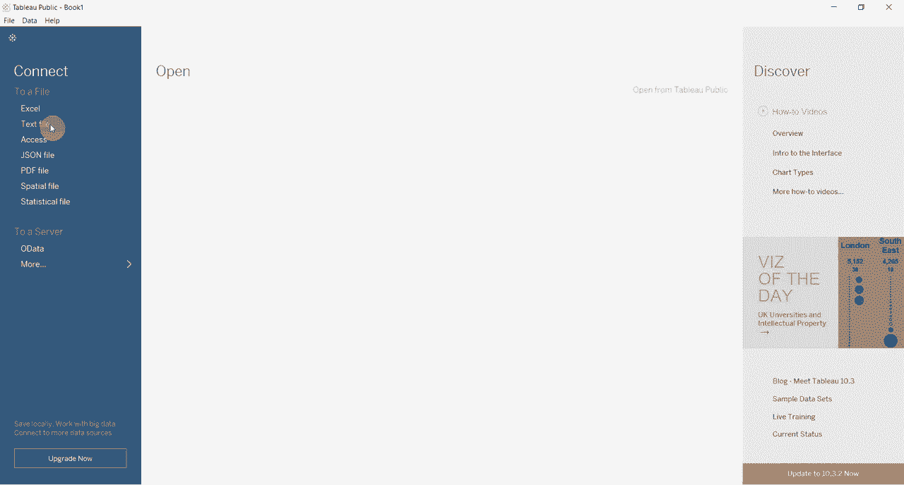

# 【双语字幕+资料下载】Tebleau操作详解，照着实例学做图！数据科学家的必备可视化工具，简单快速做出精美图表！＜实战教程系列＞ - P10：10）表格计算获得同比增长 - ShowMeAI - BV1iq4y1P77U

大家好，欢迎观看另一个关于Tableau的两分钟视频。今天我们将演示如何使用表计算来创建同比变化数字，这真的非常简单，你可以用各种方式布局的数据来做到这一点，但理想情况下，你希望将数据布局为时间序列。现在我们在这个建筑支出数据集中有一些这样的数据，这是美国按细分市场的建筑支出，如你所见，我们按细分市场进行分类，并且覆盖了从2002年到现在的几年，因此我们有足够的年份来计算变化。这些数据不是Tableau软件包的一部分，但你可以从Tableau网站下载，如果你想自己尝试，评论中有链接。

😊。

所以我们要做的第一件事是为我们的仪表板创建布局。第一件事是上面。每个名称，期间名称。那是将给我们年份的部分。我们将按季度拆分。因此你可以看到，我们有2002年至2016年，每个季度都被拆分出来，然后我们将实际上将类别描述放在过滤器中，我们希望只过滤出总建筑支出，在底部有它，我们希望这样做的原因是因为我们不想无意中将太多类别相加，显然我们要确保我们的数据，尽管我们只是玩这个，但我们的数据实际上是正确的，然后我们将把这个值。

😊，我们将把它拖到这个表格中。现在，你可以看到这给我们提供了原始收入数字，这很好。而且由于我们有一个时间序列，Tableau有一个非常不错的选项，你可以点击。😊。按年增长，它会自动计算年增长率。

在过去的版本中，一个不是关键的表格是多么容易。因此，你确实需要手动创建表计算。我实际上会这样做，因为这非常简单。所以，创建第二个值字段，我们会在一秒钟内展示这些是如何匹配的。😊。

我们要在这里点击，快速进行表计算。然后我们将选择百分比差异。当我们点击百分比差异时，它会默认显示与之前值的差异。因此，Q2的支出比Q1大20.99%。Q3比Q2大6.72%，依此类推。现在我们并不想要这个。

我们希望是逐年支出，所以我们将进入这里，使用计算方法。然后我们有几个选项，但我们没有年份或季度。为了做到这一点，我们将进入编辑表计算。😊，在这里你会看到我们可以选择各种计算选项。我们想要做的是选择特定的维度，这将给我们包含或排除各种内容的选项，所以如果你现在看这个，我们正在相对于前一个项目计算，所有内容都被突出显示，所以它是从这个列表中的前一个项目计算的。如果取消选中季度，你会看到在任何年份中都没有数据。

😊，从2002年开始，这是个好兆头。只有第一季度被突出显示。所以这是在计算这组值之间的差异，这正是我们想要的。😊。所以我们本质上又是在计算差异，中间跳过四个内容，但实际上是使用年份进行差异计算的。

我们在这里的值。因此，我们可以关闭这个，然后看两个表之间的值是否匹配，所以无论你怎么做，逐年增长都是相同的。这样做的原因是，这种方式更灵活，因为Tableau会自动添加逐年增长计算。

如果你有日期字段，如果你只有一个代表年份的列和一个代表月份或代表季度的列，那么那个选项将不可用，因此你需要使用这种其他方法来实现。😊，好吧。

感谢您再次加入我们的《Tableau两分钟》节目。如果您想在家试试，数据在评论中。请订阅频道，如果您有任何问题，请在评论中留下，谢谢。

😊。
