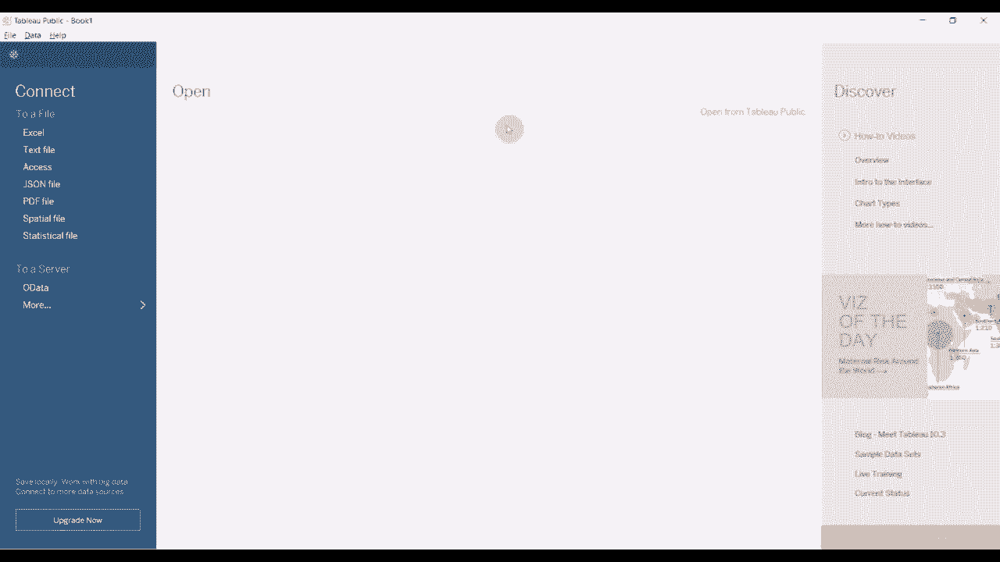
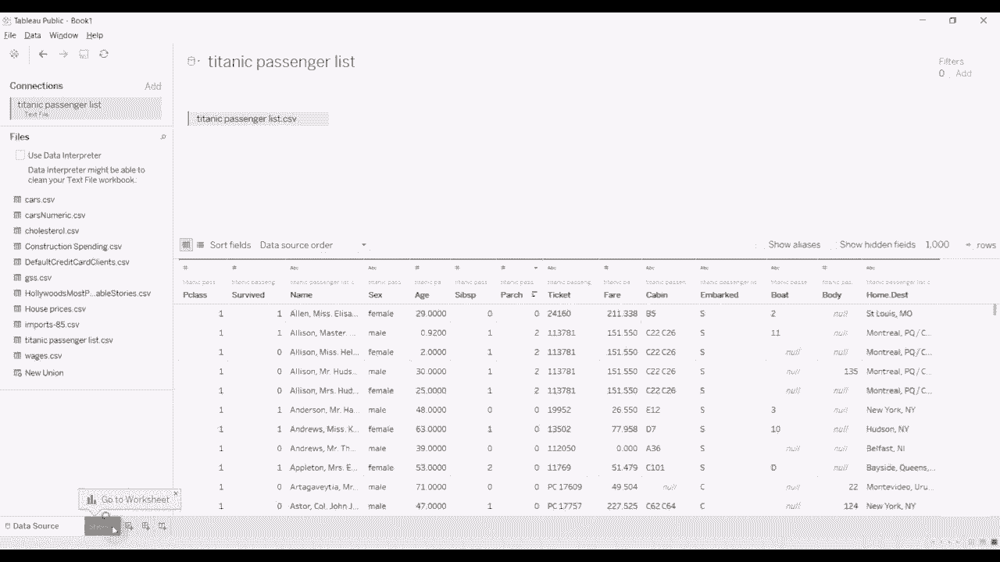
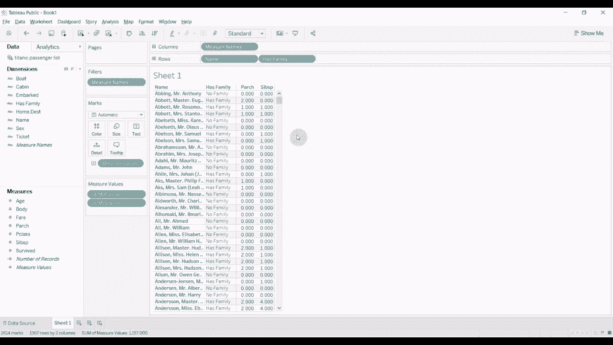

# 【双语字幕+资料下载】Tebleau操作详解，照着实例学做图！数据科学家的必备可视化工具，简单快速做出精美图表！＜实战教程系列＞ - P11：11） If Then 计算 - ShowMeAI - BV1iq4y1P77U

Hi folks， welcome to another episode of Tableau in two minutes Today we're going to be demonstrating if then calculations and to do that we're going to create a single field out of two different fields we're going to use a data about passengers on the Titanic It's a pretty famous data science data you might already have worked with it if you have not already work with it then there is a link in the comments section for you to download this particular data it's also available on Tableau's website that's one of their sampled data sets Now you can see that we have a lot of information about each passenger including whether they survived the name was sex ages etc etc etc What we're interested though are these two fields here so we have sibling spouse。

😊。

And parent child。And what we're gonna do is we're gonna use the two of those to create a composite field called Ha family。 And we're gonna do that using if and then calculations。 So we're gonna go to our sheet here。 We are quickly gonna add name to our row shelf。 It's gonna give us a warning that we have too many members。 We're gonna ignore it and say， add all of them anyway。 Then we're gonna take the parent child field。

 drag that over to the。😊。

Into the Viz right here we're going to add sibling spouse and drag that over into Viz right here and the reason we're going to do that is because when we create our calculated field we want to have a quick way of validating whether it is correct and then we're going to create our FMm field so we're going to click on the down arrow here create calculated field we're going to give it a name like has family that is a good name then we're going to start off by typing if。

😊，Parent child。Is greater than zero then。Whoops， have accidentally pressed therea then has family。Elsif。Note that is all one word in this particular case。 And then we're going to say else。 if sibling spouse is greater than 0， then it also has family。Else。No family。And then we're going to type end one of the things that always trips me up when I write these calculations is that you do have to put an end at the end of each if statement that is not particularly complicated to troubleshoot in this particular case because obviously we only have one set of ifs and elses。

 but if you have a number of nested statements， then it can be tricky to figure out where you've put the end so it's a good。😊，Practice to make sure that as you construct each level， you're putting the full if， Els if， else。 and end in for each item。Although you can skip elses if。 obviously if you don't need a second piece Allright， so this calculation is valid， that's good。

 we're going to click apply， it's going to create that family for us that calculation for us over here。 click okay drag family to our shelf here and then you can see that when we have zero and zero we have no family when we have a number in one of these it has family if not it's no family and that might be a variable that we can use to help predict whether or not somebody survived the Titanic All right that is it for this episode of Tau in two minutes if you have any questions。

 please leave them in the comments again the data is also available in the video description and from our website。😊。