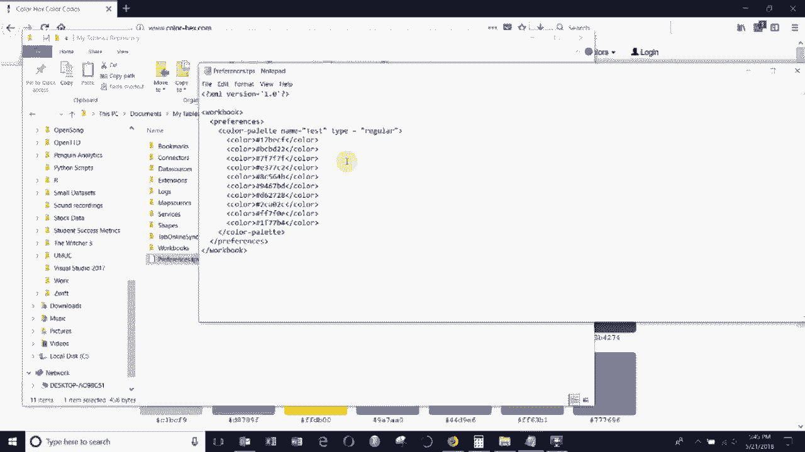
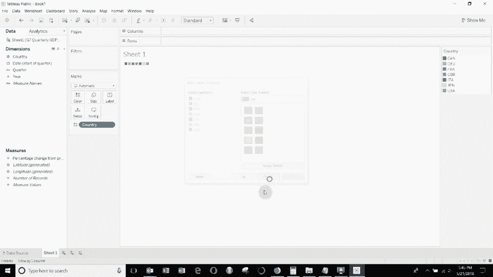
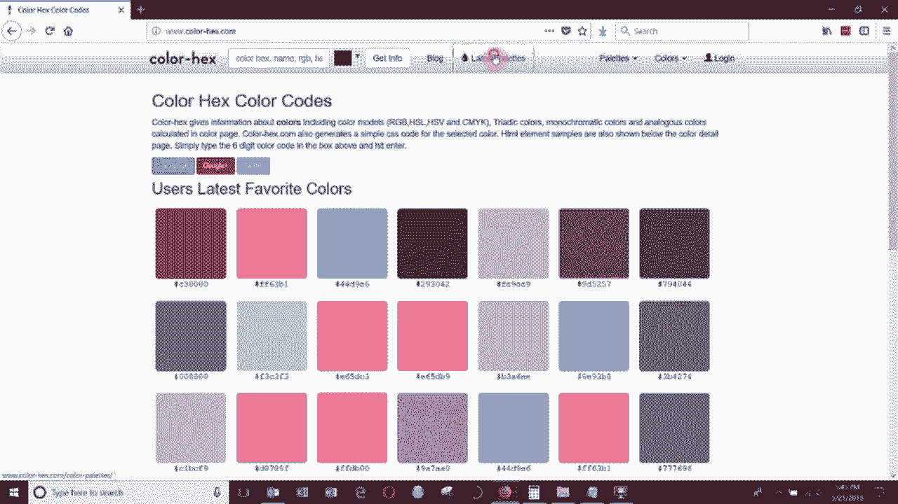
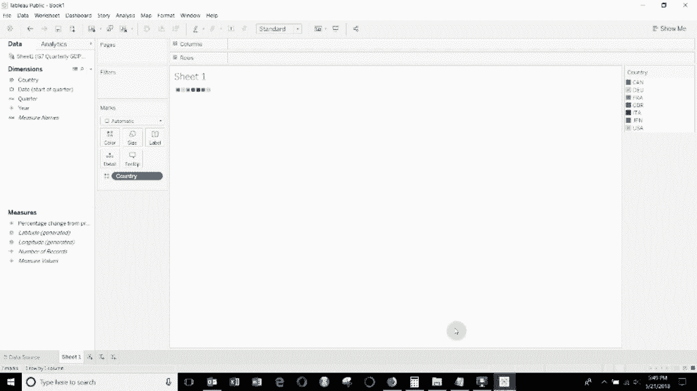

# 【双语字幕+资料下载】Tebleau操作详解，照着实例学做图！数据科学家的必备可视化工具，简单快速做出精美图表！＜实战教程系列＞ - P12：12）添加自定义颜色 - ShowMeAI - BV1iq4y1P77U

Hi， folks today， Welcom to another episode of Tableau in two minutes。 Today。

 we're gonna be showing you how you can add a customer color palette to Tableau。

 So it might be that maybe you have some corporate colors or something like that that you want to add and you can do that but it actually works mostly outside of tableableau。

 So what you have to do is edit a file called Pres do Tps。

 This file is in your My tableableau repository file。 You can see it。 It's right there。😊。

You can open it up in。Notepad。And once you're in notepad。

 you'll probably see a file that looks like this because there's nothing added。

 So what you need to do， it's just a simple XML file if you've ever worked with XML before if you haven't it's very easy to work with everything is contained within a tag like this so we have the start of workbook to the end of the workbook and the first thing we're going to do is we're going to add this preferences line。

😊，And this preferences line right here。And then you can see within here we have a custom color palette that we have called test that's a regular one that means it's going to be individual like blobs of color it's not going to be continuous and here we have what's called the hexadeadeciimmal values for each of the colors you might be familiar from back in the day playing with paint where you would have red。

 green and blue values these are very similar to these they're just the sort of internet language version of the same thing。

😊。

And then once you have this， you can go ahead and open up Tableau。😊。

And when you do that， let's go ahead and connect ourselves to some data there we go。

 this will do doesn't really matter what we connect to in this particular case。

 so say we take country we'll drag it out to the Marx card and then go in here and edit the colours。

 you can see that our colour palette。😊。

Colt。IsRight down here at the bottom。 That's the one that we added in our preferences sheet。

 So let's show you the whole thing from start to finish。

 So what you would do is you would go to an internet browser to get the hexadecimal values for some colors。

 So color hex dot com is a good one。 If you click on latest palettes。

 They have a set of pallets here。 I'm rather fond of this McCo tones palettes。

 So you can see we have five different colors。 They seem complementary to me。

 And then you have's these hexadecimal values for each of the colors。

 And these are the things that we're going to want to put into our tableau file。

 So we're going to open up the preferences Tps。😊。

Drag it over here so you can see everything together。

 And then we're going to go ahead and add a new color palette。

 So you see how everything is contained between two。Of these colour palette。Pieces here。

 just go ahead and add the start。At the end。And then here you can see we named our other one test。

 since this one has a name， let's go ahead and call it Mac tones。It is a regular one。

 it's going to be individual like colors for each item so we would use it with dimensions。

 and then we have five different colors so let's go ahead and copy five of these across。😊。

Just like that All right， so first thing I'm going to do is just delete all the colors or sorry。

 delete all the values we have in there right now。😊，With those deleted。

 I'm going to take these hex values here and I'm just going to copy and paste them。Inter notepad。

All right， now that I've done that， we'll save it。And then we need to go ahead and open up Tableau again。

😊。

。Going to reconnect to the data， make sure that every time you change the colors in a color palette you close and reopen tableau。

 otherwise it's not going to show up in the list，ll just drag country out into our Mars card there and then we can go ahead and edit the colors and down here at the bottom you'll see our new palette。

😊。

Which we can then assign。To our countries。 And that's how you use custom custom colors in tableableau。

 If you have any questions， please leave them in the comments。 If you like what you're hear。

 then please subscribe to our channel。 And there is a link to the data in the video description in the video description this time。

 we've also included a quick link to the X Ml you need to add a color palette。

 If you have any questions as I said， please let me know。 and we will see you next time。😊。

