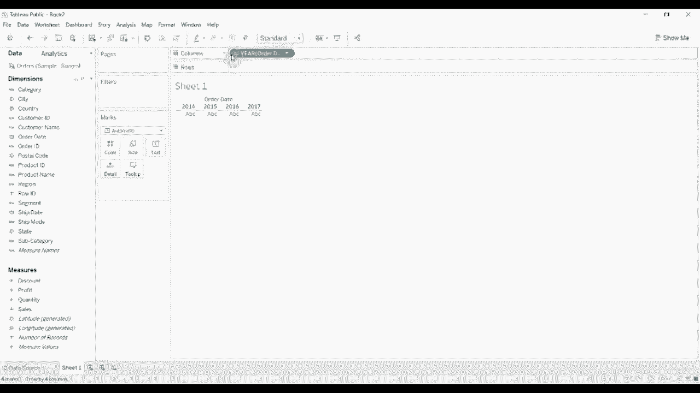
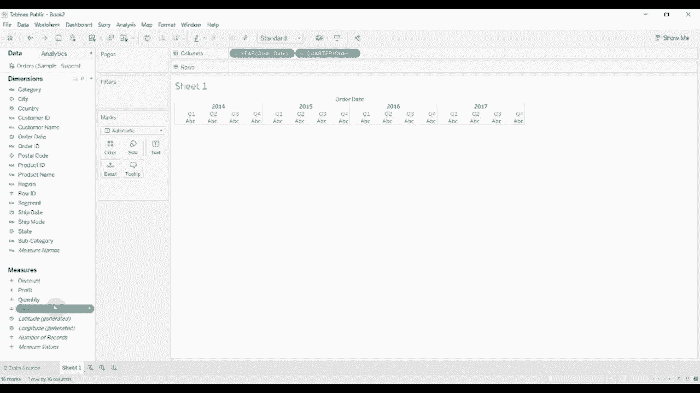
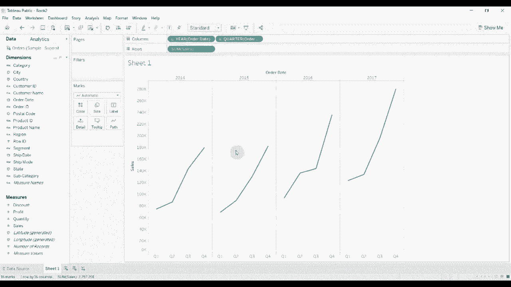
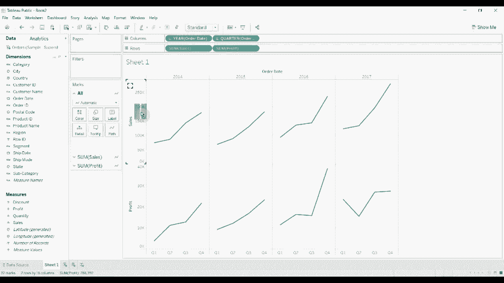
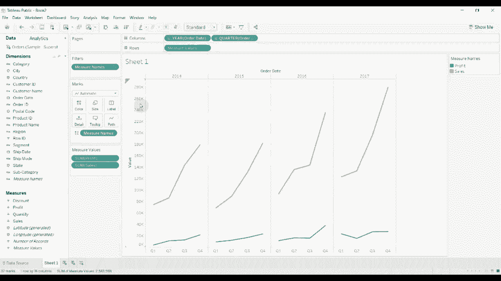
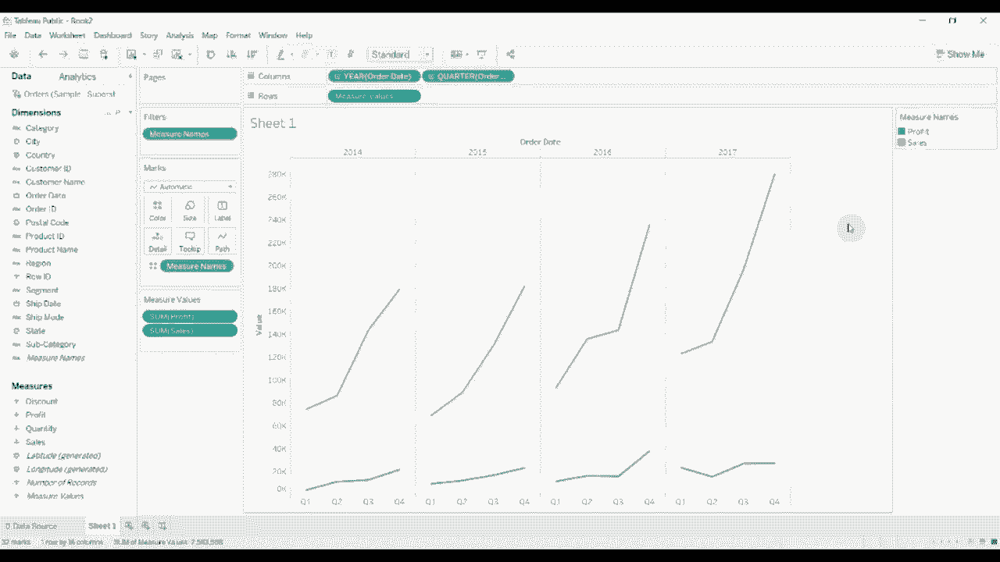
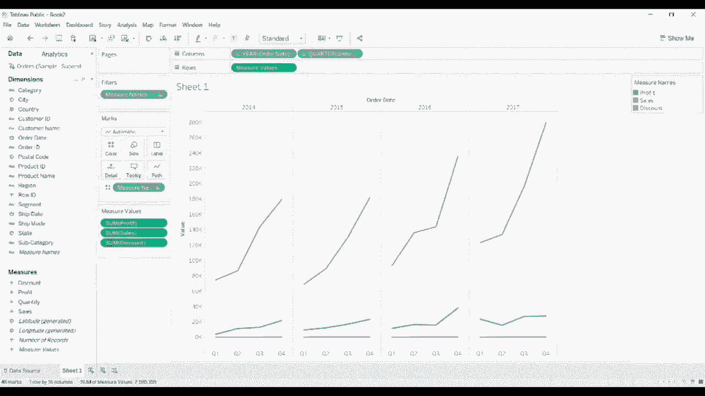
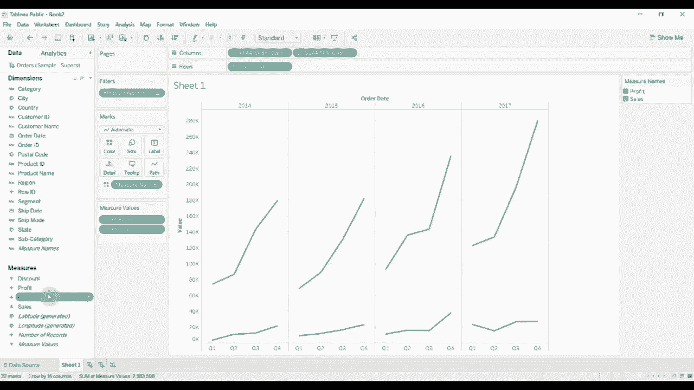
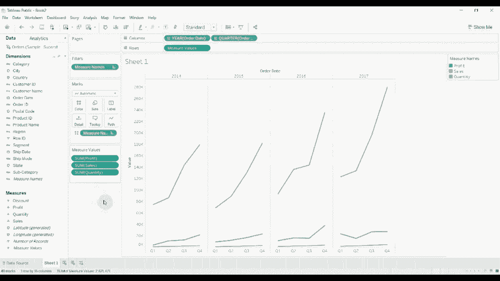

# 【双语字幕+资料下载】Tebleau操作详解，照着实例学做图！数据科学家的必备可视化工具，简单快速做出精美图表！＜实战教程系列＞ - P14：14）创建组合轴图 - ShowMeAI - BV1iq4y1P77U

大家好，欢迎收看《两分钟学会Tableau》的另一集。今天，我们将向您展示如何创建一个组合轴图。这是使用Tableau时需要掌握的基本基础之一。它也是桌面合格助理级别Tableau认证的一部分。

这非常简单。我连接了超级商店的示例数据集。我们要做的是创建一个不错的基线。我将把订单日期拖到这里，设置订单日期。以便我们在季度级别上有一些数据。然后我们要添加销售额。

然后我们要将销售额拖到行架上。😊。

当我们这样做时，你会看到我们为每个季度得到了销售的折线图。

然后我们要添加利润。我们也要将其拖到行架上。现在，你会注意到销售和利润在这里一个叠一个。我们不想这样。我们希望它们在同一轴上组合。所以只需将鼠标悬停在这个小三角形上，拖到销售轴上方。将利润拖到销售轴上。你会看到两个绿色条形图并排显示。

将其拖到这里。这样你就得到了这个双轴图，结合了我们在行架上的度量值。这里的度量值架显示我们所展示的内容。因此，这条橙色线现在是。

这里是销售，蓝线是利润，二者在同一比例尺上。这不是一个双轴图。如果我们有一个双轴图，它们将有独立的比例尺。组合图则使用相同的比例尺，只在一个y轴上，而不是像双轴图那样有两个y轴。

如果我们想要添加更多，可以将折扣拖到这个架上。显然折扣非常小，因此并没有明显显示出来。你也可以将数量拖到这个架上。同样，数量也很小，不太明显。但你可以看到如何在这个度量值架上添加和移除度量。

本集的《两分钟学会Tableau》到此结束，这是一种非常快速简单的创建组合轴图的方法。如果你有任何问题，请在评论中留言。如果你需要，视频描述中有工作簿和数据集的链接。如果你喜欢我们的内容，请给我们点赞并订阅我们的频道，我们下次见。

