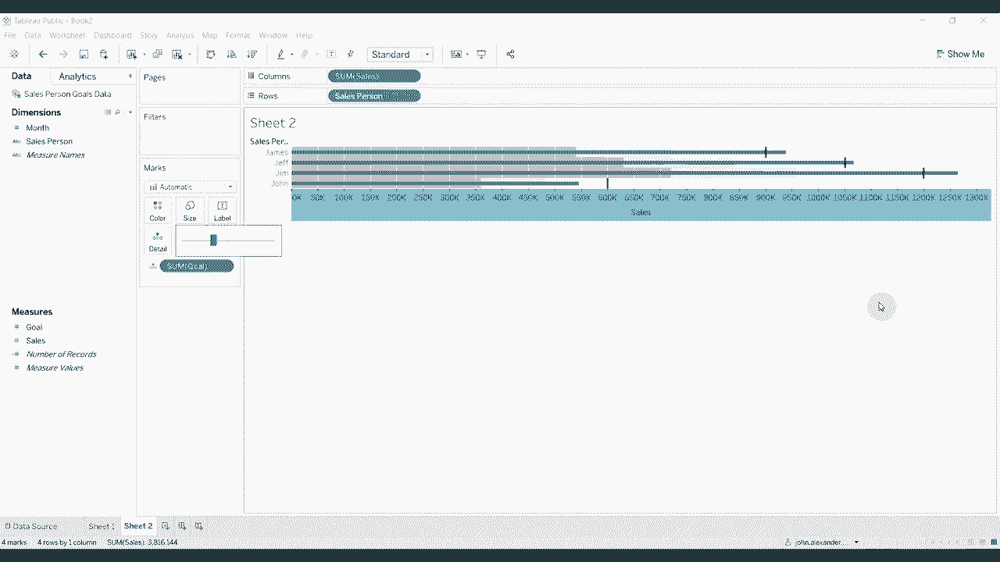

# 【双语字幕+资料下载】Tebleau操作详解，照着实例学做图！数据科学家的必备可视化工具，简单快速做出精美图表！＜实战教程系列＞ - P15：15）创建子弹图 - ShowMeAI - BV1iq4y1P77U

Hi， folks， and welcome to another episode of Tableau in two minutes。 Today。 We're going to show you how to create a bullet graph。 Bullet graphs are a great way of displaying data where you have a goal and then some sort of achievement towards that goal。 So we're going to connect to some data that has some sales goals in it for some imaginary salespeople that I just made up here。

 And so you can see that our salesperson goals， data has data for John， Jim。 James and Jeff are four salespeople by month。 along with their sales and their goal for that particular month。😊。

Now， the easiest way to create one of these is just to drag salespeople over salesperson over to the row shelf。 drag goal and sales to the columns shelf， and then use the showme function to create a bullet graph。 And then you can see that the bar represents the goal。 and the black line represents sales。 That's not really the way round that that makes sense。

 So we can actually swap those quite easily by just clicking swap reference line fields。 Now we have goal。😊，By these represented by these lines。 And then we have the sales this blue bar。 which is representing what they actually sold。 So obviously。 when that's higher than the the black line， then they exceeded their goal。 Now。

 it's all very good to be able to create it with the show me feature。 But I think you get a bit more customization if you're able to to create it yourself。 So what they're going do is drag salesperson over to the row shelf。 We're going to drag sales up to our columns shelf。 And that creates our bars。

 And then we're going to drag gold to the detail shelf。😊，We're gonna add a reference line。This reference line we're going to do per cell。 So there's one per bar。It's going to set that to total。 We're going to set this to the sum of the goal。We're going to make our line a little bit thicker and a little bit darker。

 And then we're going to remove the label so that we just have this bar。 which shows us what the goal was for each of our individual salespeople。 Now。 you'll note that if we look back at this one， there's also some shading under this。 that's easily done。 So again， we're going to add another reference lines at a second reference line。

 But this time， we're going add a distribution。Again， we're going to do it per cell。60% to 80 per of the average is fine， but we want to make sure it's the sum of goal。 not the sum of sales。Click out of that again， remove the label。 and then we're going to use the fill below option。

And that's going to fill up to 60% with this dark gray than up to 80% with a slightly lighter gray。Click， O， again now。We have the shading in there， but you'll notice that the bars are slightly thinner。 so we can do that just remove this size。 Mo that down a little bit。 And you'll see that each of our salespeople now has a darker shading up to 60% of their goal。

 And then this lighter shading up to 80% of their goal。 And then obviously。 a bar at 100% of their goal along with this blue line representing what they actually achieved。 So packing a ton of information about how people are doing relative to a particular goal into a very small space。 that about does it for this episode of tableau in two minutes。 If you have any questions。

 then please leave them in the comments。 If you like what you hear， then subscribe to our channel。 And as always， there is a link to the workbook and to the data set in the video description。 and we will see you next time。😊。