# 【双语字幕+资料下载】Tebleau操作详解，照着实例学做图！数据科学家的必备可视化工具，简单快速做出精美图表！＜实战教程系列＞ - P16：16）突出显示条形图上的最大值和最小值 - ShowMeAI - BV1iq4y1P77U

大家好，欢迎来到另一个《两分钟学Tableau》的节目。今天，我们将讲解如何在条形图中突出显示最小值和最大值。如果你观看了之前的视频，你可能已经看到了我们是如何在折线图中做到这一点的，这有点复杂。我们必须使用一些双轴进行一些奇怪的操作，并创建一个表计算，还有那些有趣的东西。

但使用折线图有些麻烦，幸运的是，使用线形图稍微简单一些。所以我们将继续拖动订单日期。😊。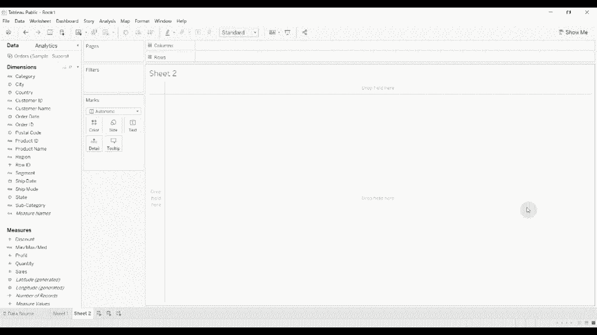

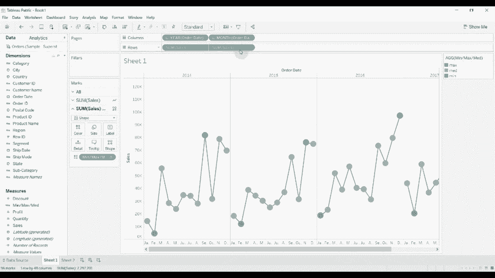

拖到我们的行货架上。哦，抱歉，是我们的列货架。去掉季度。然后我们将销售额拖到行货架上。接着我们将把这设置为条形图，而不是折线图。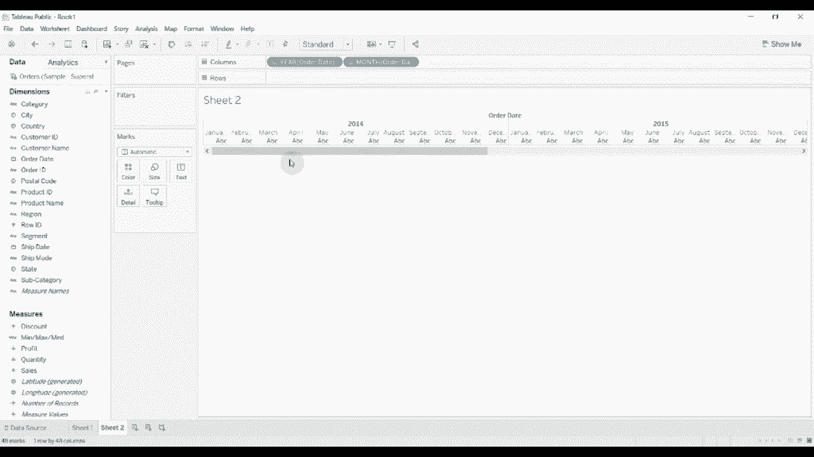

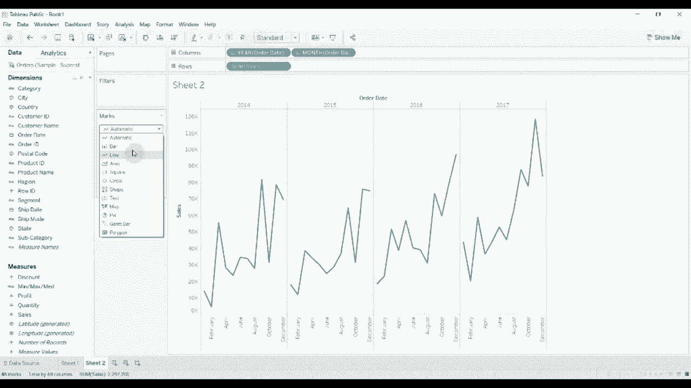

现在，由于我们将其设置为条形图，我们可以取最小值、最大值和中位数。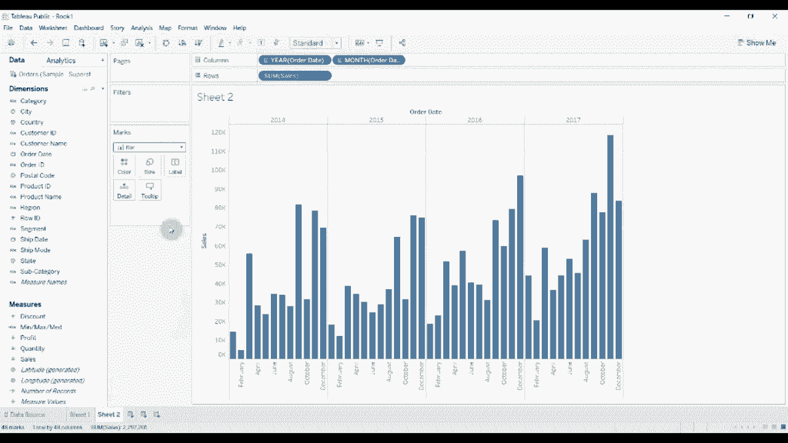

你可以看到，我们已经提前完成了。颜色已经根据最大值和最小值为我们设置好了。但让我们像之前那样编辑一下。我们只是想在每一年内计算这一点。所以我们将设置特定的维度。我们将移除年份。现在你可以看到。

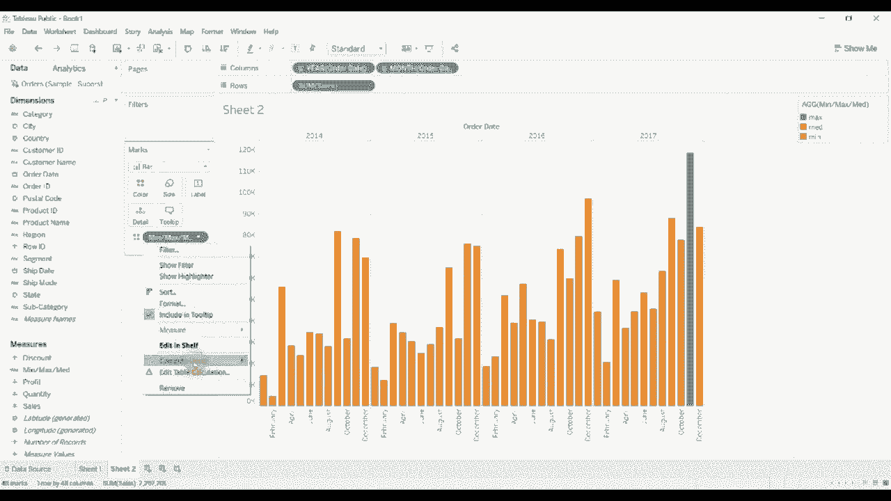

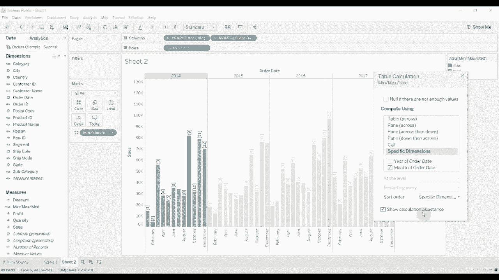

我们已经突出显示了最小年份和最大年份。作为提醒，让我们来看看这个计算。你可以看到。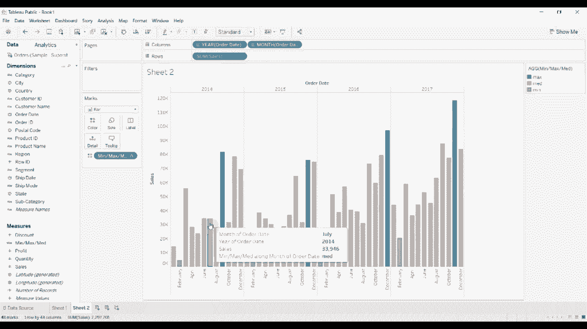

一些销售额。抱歉，我们寻找的是，当某个月的销售总额等于该窗口的最大销售额时的最大值。现在，我们设置窗口为整整一年。所以在这种情况下，整整2014年就是我们的窗口。如果该月份的销售总额等于该窗口内的最大销售额。九月份就是如此。然后我们将其称为最大值。

我们将突出显示蓝色。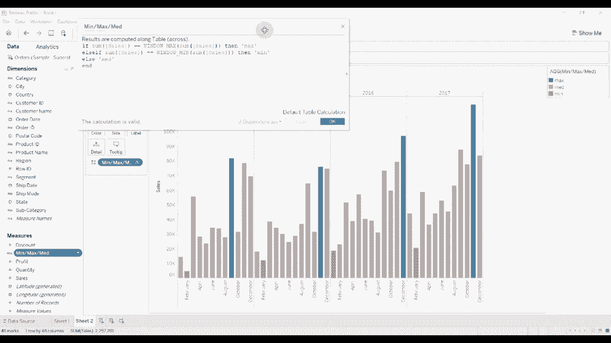

否则，如果销售总额是最低值。在那个窗口内。好的，所以它仍然在2014年。到2月份，这就是在那个时间窗口内的最低值。然后我们将称之为最小值，并将其标记为红色。否则，其他的我们并不特别关心。

我们只想查看最大值和最小值，它们将被标记为灰色。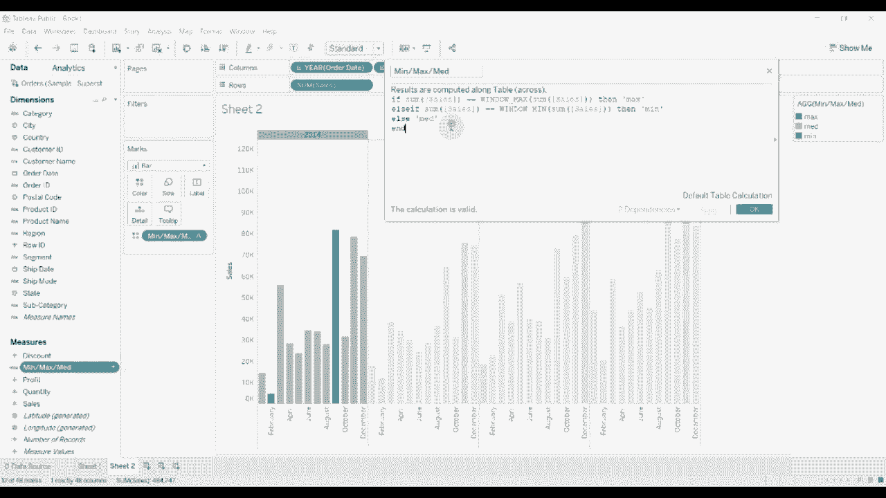

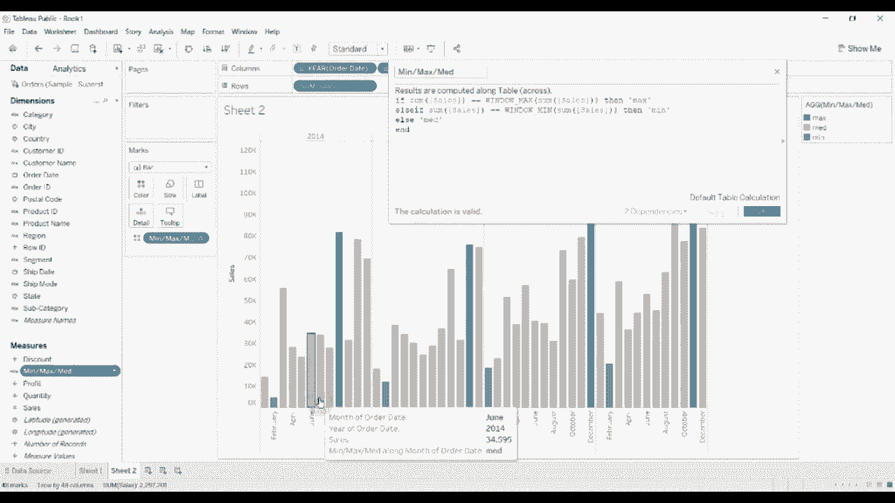

你可以以多种方式使用它来提取特定值。因此，再次强调，突出最大值和最小值的方式非常有帮助。使用颜色为仪表板增添亮点的绝佳方式，并帮助展示某个月份的影响力或缺乏影响力。😊感谢您观看本期的《Tableau in two minutes》。如果您有任何问题，

请在评论中留下。和往常一样，视频描述中有数据集和工作簿的链接。如果你喜欢我们分享的内容，请给我们一个赞并订阅我们的频道，下次见。😊！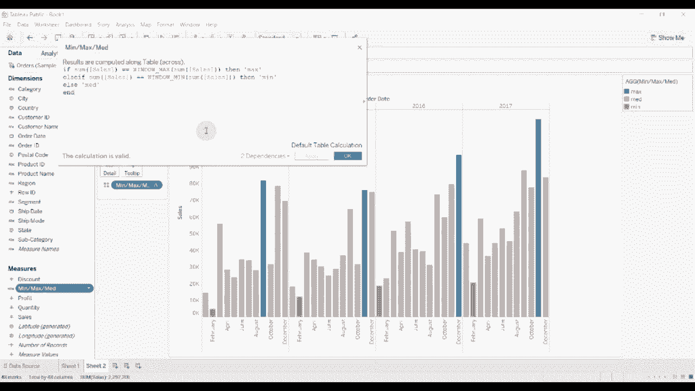
