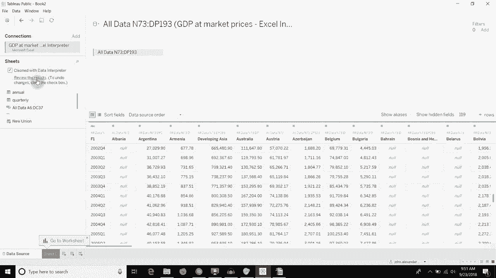
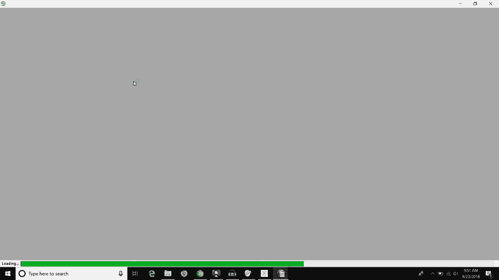
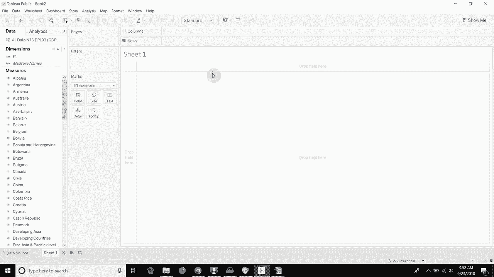

# 【双语字幕+资料下载】Tebleau操作详解，照着实例学做图！数据科学家的必备可视化工具，简单快速做出精美图表！＜实战教程系列＞ - P17：17）数据解释器清理数据 - ShowMeAI - BV1iq4y1P77U

Hi， folks， and welcome to another episode of Tableau in two minutes。 Today。 we're going to be discussing discussing how you can use the Excel data interpreter to clean up some data that you might have in workbooks or in Cvs。 where you don't have a nice clean table format in your data。 What do I mean by that。 Well。 here's a workbook， which I set up to to create this sort of a problem for us。

 you'll see that on this tab， everything's relatively well aligned， Obviously。 with the exception of this additional row in here。😊，On the second tab， it's also quite well aligned。 although we're missing a title and we have an additional row， but on this all data tab。 you'll see there's a gap at the top。And there's this first table。 And then if we scroll across。

 you'll see that misaligned underneath it。 There's actually a second table down here at the bottom。 too。 So if we read this in as a straight data table， right， you would have this column。 which would then be blank at the bottom。 And then once we got across to this column column N。 and you scroll down， you see there will be data in it。

So this is not going to work in a traditional tableau format just by directly connecting to it。 So let me show you how we can how we can fix that。 So this is a Microsoft Excel document。I'm going to jump in here and open it up for us。Now you'll see if we import the first two tabs。😡。This is the to the second tab that looks fine。And the first tab， that looks fine as well。

But if we take this all data tab and pull it in。You'll see that on the surface， it looks okay。 But if we scroll down here， you'll see there's a bunch of knolls。 And if we scroll across with the knolls， you'll see that we have our second table appearing underneath。 Now， tableableau has already taken out all of the lines that were null between the two tables。

 right？ You remember， there were some， there's some lines up here at the top。 Tableau has taken those out， and there were some lines between the tables as well。 So if we go down here and look at those。You can see down here between the tables。 Tableau's already decided that that's not relevant， which is good。But really。

 we want that to be two separate tables。 So one of the things that we can do is we can click on this。Data interpreter tab。 Now， what that's going to do is it's going to look at your workbook and try and figure out where the tables are placed。 So you can see instead of now having just the three tabs in our Excel workbook。 We've actually got two more that have been created。 And these are ranges on the all data tab。

 the all data tab was the one that was a bit of a mess。 So let's take that one out and then let's look at this first All data tab。And you can see this now only has that yearly data that we had at the top of the tab。Let's take that back。And add the other one。This one。

Has the quarterly data that we had down on the bottom right hand side of the tapsis。 it's containing。This bit。Excel sorry， tableau rather also allows you to review the results。 So if we click on this review the results button， this is going open us up a new workbook in Excel。 in my case， it's going to use open Office because that's what I have set as the default。

And it will give you the results of the data interpreter。So you can see that anything red is column headers， green is values。 And there's a couple of other things down here as well。 Really， the first two tabs。 they don't matter significantly。 What is interesting is this。All data tab。So we can see here。😊。

That it's gone ahead and found this first draw as columns。 And then everything else is green。 But really what's interesting is when you look at this all data subtd sub tables tab。 you can see that there's a border around this very first table。And then if we scroll down。 there's a border around this second table。As well。

And it's broken those out onto two new tabs in our workbook。 This first tab is everything that we had in the top。 Im more or less， the top left， starting at E 6。And then this is everything that we had in that bottom right table。And it's broken those out separately so that we can treat them secondly。

 The other thing that it does， which I quite like， is that it turns all of the N's into nulls。 So instead of having an N A text value， you will have a null value instead for that particular field。With that， we can take one of those and we can use it just like a regular data source。To build a visualization。 So if you have any questions， then please leave them in the comments。

 If you like what you hear， then go ahead and subscribe to our channel。 Otherwise。 we will see you next time。