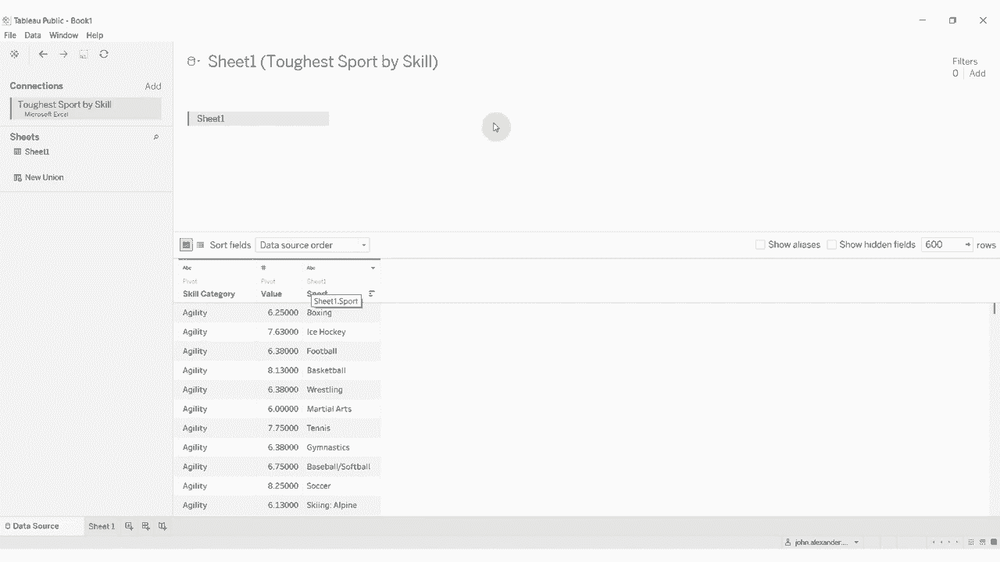
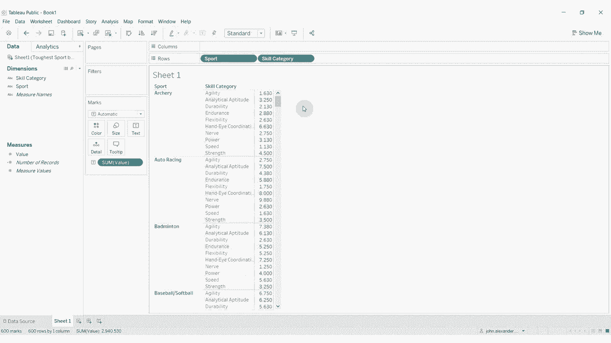

# 【双语字幕+资料下载】Tebleau操作详解，照着实例学做图！数据科学家的必备可视化工具，简单快速做出精美图表！＜实战教程系列＞ - P18：18）透视数据源中的数据 - ShowMeAI - BV1iq4y1P77U

嗨，各位，欢迎来到另一集“在两分钟内了解 Tableau”。今天，我们将讨论如何使用透视功能将按列的数据转换为按行的数据。我说的是什么意思呢？好吧，我已经连接到一个数据源，该数据源提供了不同运动的技能排名。😊，所以你可以看到，我们在左侧有运动项目。

我们有许多不同的技能类别，以及每个技能类别的 10 分制排名，还有一个总数和排名。我认为这是一段很久以前的某个“变革星期一”的数据。但如果我们想将其转换为按行的，而不是按列的，那该怎么办呢。

我们拥有的是按列的数据。所以我们必须将所有内容相加，以获得这个总数，而这些数据都是跨越行的。Tableau 允许我们通过数据透视将这些数据变成一列。😡，所以我们要做的是点击所有这些，哎呀，点击所有这些列。我刚点击了第一个，按住 Shift。

然后点击最后一个，再点击任何列上方的向下箭头，然后点击透视。

这样做是将按列的数据转换为按行的数据。现在我们有一个字段表示技能类别，还有一个字段表示值。让我们重命名这些字段，使它们更有意义。技能类别。就在这里。我们将其重命名为目前的值或评级。

然后我们有了运动、总数和排名。现在这些在运动、总数和排名中的字段都会为这些值重复，对吧。所以拳击的总数会出现很多次。所以我们并不想要总数和排名字段。所以我们可以隐藏这些。现在我们有了。

仅仅是运动、技能类别和价值。在 Tableau 的术语中，这使得数据在处理时变得更加简单，因为它更喜欢按行的数据而不是按列的数据。😡。

让我们进入一个工作表。我们将把运动放在右侧，或者把技能类别放在顶部。你可以看到，如果我们拖动值出来，这几乎是我们之前的数据结构。我们所做的就是把这个技能类别拿出来。

现在我们已经将运动和技能类别以列的形式而非行的形式展示。这就是本期《两分钟学 Tableau》的内容。视频描述中有数据集和工作簿的链接。如果你有任何问题，请在评论中留言。如果你喜欢我们的内容，并希望获取更多 Tableau 的技巧和窍门，

那么请订阅我们的频道，我们下次再见。😊。
