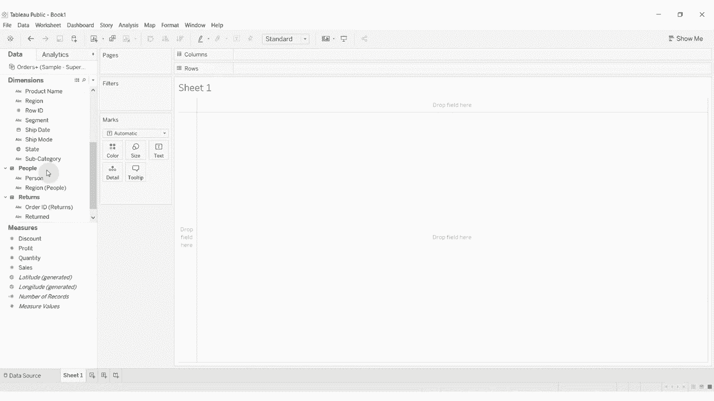
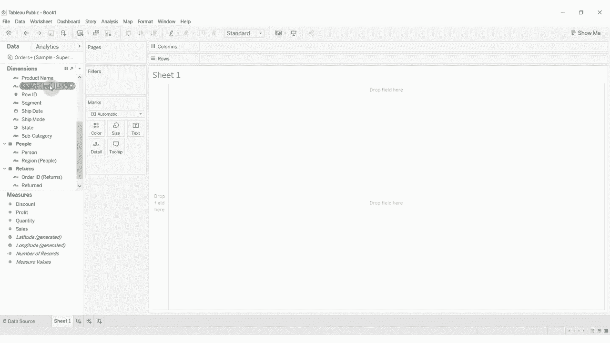
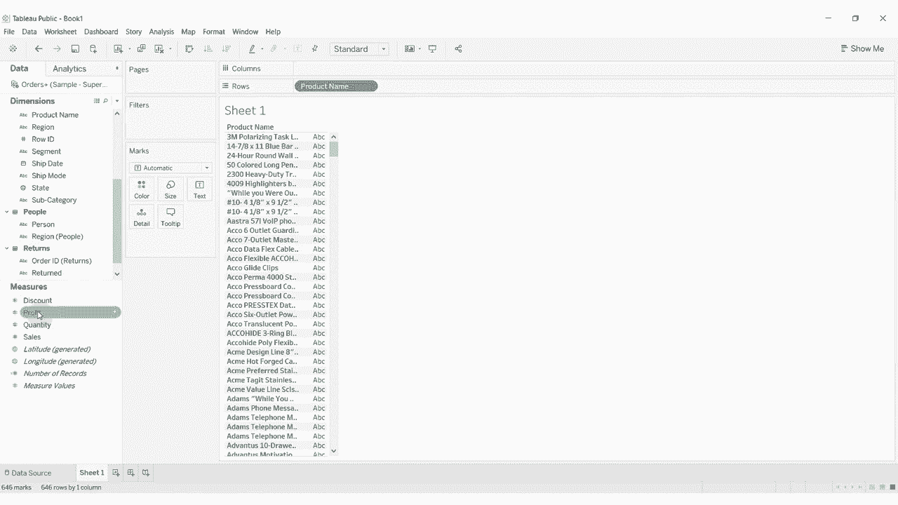
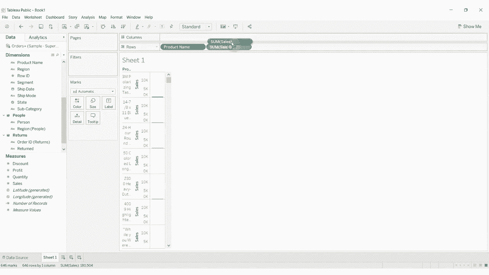
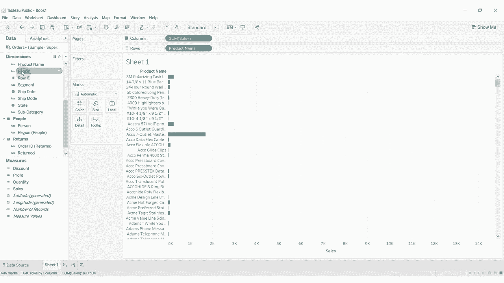
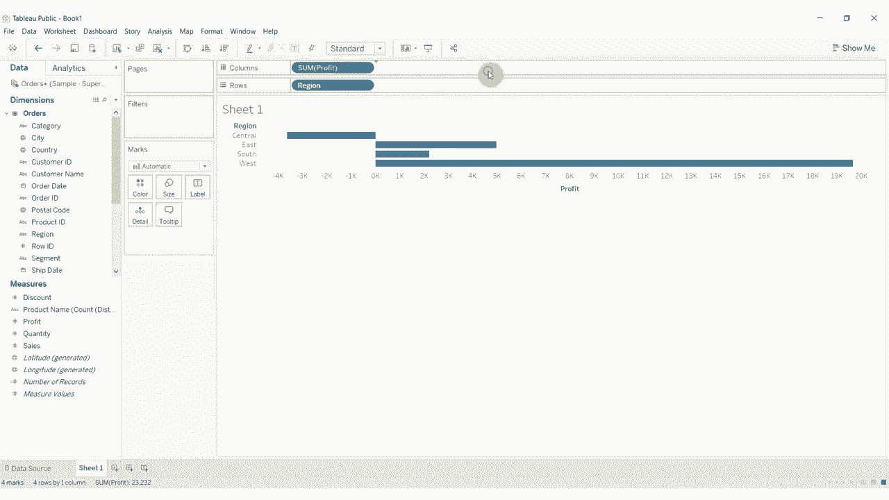
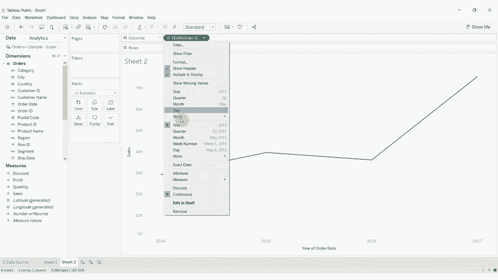
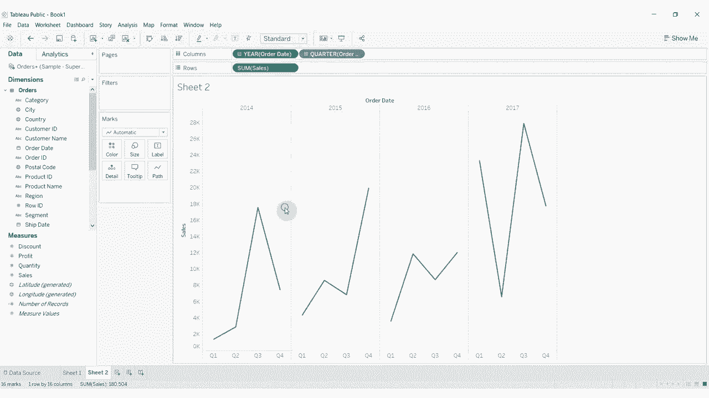
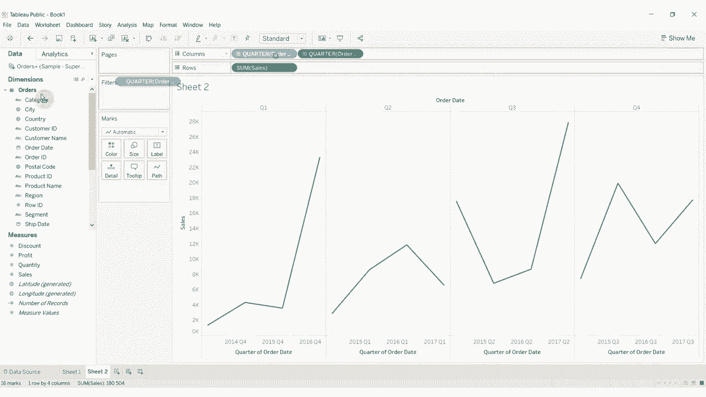
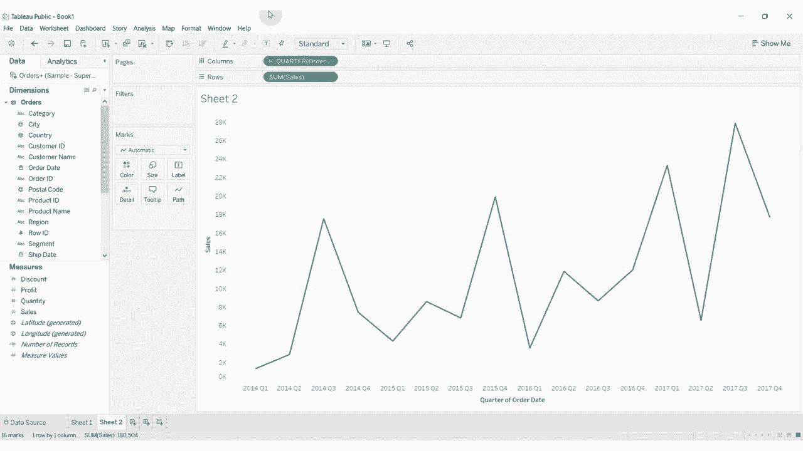

# 【双语字幕+资料下载】Tebleau操作详解，照着实例学做图！数据科学家的必备可视化工具，简单快速做出精美图表！＜实战教程系列＞ - P19：19）维度与度量以及离散与连续 - ShowMeAI - BV1iq4y1P77U

Hi， folks， and welcome to another episode of Tableau in two minutes。 Today。 we're going to be covering the difference between dimensions and measures and the difference between discrete and continuous items within Tableau。😊，So basically， the way these work is that each one of these items is a column in our data set。 So if we look at our data source， you can see each item in the dimensions and measures pane over here represents a column within our data source。

 Now， there are sort of two types of columns。 There are columns by which we want to divide our data。 So we might want to segment something。 and there are things that we want to to measure。

The things that we want to measure are going to be things like sales。 You can see we have sales。 profit， discount， quantity。 Those are all things that we would sum up that we would aggregate that we would average。Basically， numbers。On the dimension side， we have things that we might want to compare。 so we might want to compare what's happening between different products。

 We might want to compare what's happening between different regions。 So these are things that are going to divide our data set。 So let's take a look at how this works in practice。 Let's take a product name。 just drag that out to the row shelf。

And then take sales and drag that out。

Also to the row shelf edges， put on the column shelf， there we go。 So now you can see that we have by product name， we have the sum of sales。

For that particular product。 now， it might be that we don't want to look at sales。 We want to look at region。 And all these are doing。 You see。 is we're just dividing the data differently， And it's telling us how we're going to aggregate sales and how we're going to compare。 That's what our dimensions do。 And then our measures are the things that we sum up。

 So we could do some of sales。 we could look at the sum of profit。

Et cetera， et cetera。 Now， you'll notice that when we drag these out， we have a blue pill for region。 and we have a green pill for profit。Blue pills represent items that are disc。 So that is each。Item is a single item。 We can't sum up central and east， for example。 that that wouldn't make any sense to try and do that。So these are items that are。Individual points。

 nominal， some would call them。 you might call them text fields in other context， strings。That's really what that means， it's not something that we're ever going to aggregate。 it's something that we are going to use to divide our data in different ways。😡。So it's what's called discrete single points。Profit， on the other hand， that is continuous。

 It's also called It would be numeric。 In other cases。 I would sometimes be called an interval variable。And that's something that we can sum up。 that we can average， that we can count， et cetera， et cea， et cea。Two different pieces of our visualization puzzle。Dimenssions are often， but not always discet。

Measures are almost always continuous， but we could turn， for example。 our product name into a measure。And then， it would count。

You see， now we're doing count of the product names。 So instead of just having the product name。 we've turned it into account of all the different product names。 So that sort of makes it a measure。

Let's go ahead and move that back。 There it is。All right。Now。 the way these work within the visualization， as I said。 is that we'll typically use dimensions to partition the data and then we'll use willll aggregate the measures in some way。 or perform some calculation on the measures in some way to give us this piece。

One other thing I want to show you is that you can actually have a dimension that is continuous。 So if we take order date out here， you'll see it defaults。

To a discrete form for the date。 So we have a discrete for year， discreteet for quarter， but。We can。 actually。Using these options down here， see we have year quarter month day。 these are all going to be discrete in this top section， but down in this bottom section。These。Are going to be continuous。 So you now see the pill has turned green because we're looking at a continuous version。

 and the visualization has changed slightly as one。 if we wanted to look at sales。 you can see how now we have a line graph because we're looking at。A continuous date。

Depending what we do up here。We might still have a quarter， but this will segment now， see itll。Split this between the years because we're using discrete years and discrete quarters。Whereas if we go back to using years and quarters。

It's still segmenting a little bit。

Because we have quarter in there that we go。 So now it's looking instead of segmenting each year and having a pain for each year。 we now have a continuous because it's green year and quarter all the way across our data set。So that's a basic introduction to how dimensions and measures function。 as I said dimensions we use to partition our data measures are typically the thing that we want to sum up。

 and dimensions are typically but not always discrete so they contain individual items and measures are almost always continuous because they are numbers。 they're things that we will want to sum up， average， otherwise analyze。So that does it for this episode of Tableau in two minutes if you have any questions。 please leave them in the comments if you like what you hear then go ahead and hit subscribe to our channel and we will see you next time。

