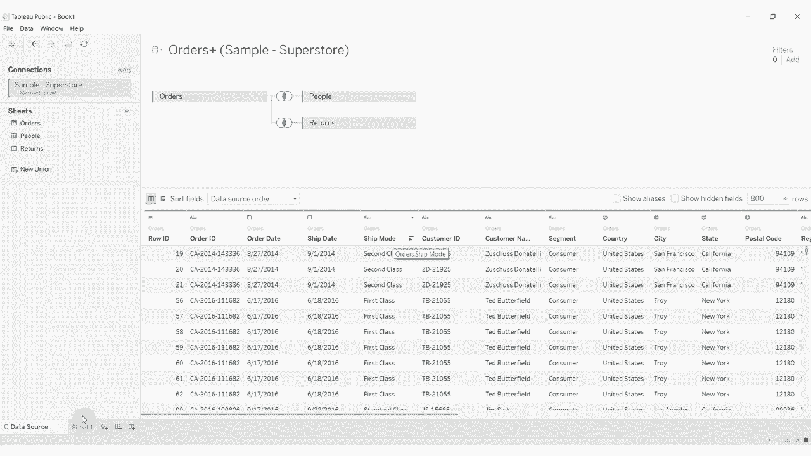
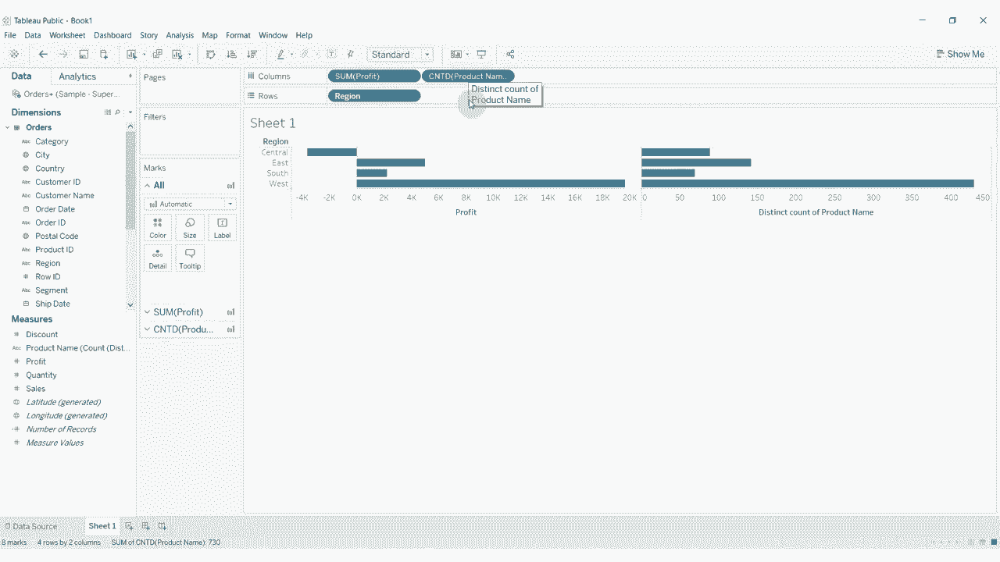
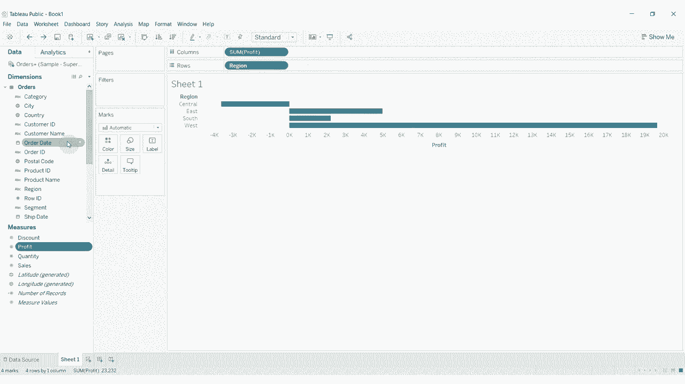

# 【双语字幕+资料下载】Tebleau操作详解，照着实例学做图！数据科学家的必备可视化工具，简单快速做出精美图表！＜实战教程系列＞ - P19：19）维度与度量以及离散与连续 - ShowMeAI - BV1iq4y1P77U

嗨，大家好，欢迎收看又一期《Tableau两分钟》。今天，我们将讨论维度与度量之间的区别，以及Tableau中离散和连续项之间的区别。😊基本上，这些项在我们的数据集中每一项都是一列。如果我们查看数据源，你可以看到维度和度量面板中的每一项都代表数据源中的一列。

现在，有两种类型的列。我们有想要划分数据的列，所以我们可能想要进行某种分段；还有一些我们想要测量的东西。

我们想要测量的东西像销售数据。你可以看到我们有销售、利润、折扣和数量。这些都是我们会进行求和、汇总和平均的东西。基本上，就是数字。在维度这一侧，我们有一些我们可能想要比较的东西，所以我们可能想比较不同产品之间发生的事情。

我们可能想比较不同区域之间发生的事情。这些都是将我们的数据集划分开的东西。让我们看看这在实际中的运作。我们以产品名称为例，将其拖到行架上。

然后拖出销售数据。

另外，把它放到行架边缘，放到列架上，就这样。现在你可以看到，我们按产品名称，有销售总和。

对于该特定产品，现在可能我们不想看销售数据，而是想看区域。这一切在做的就是我们在以不同方式划分数据，并且告诉我们如何汇总销售数据以及如何比较。这就是我们的维度所做的。而我们的度量就是我们汇总的东西。

所以我们可以做一些销售的汇总，也可以查看利润的总和。

依此类推。现在，当我们拖动这些时，你会注意到区域有一个蓝色小药丸，利润有一个绿色小药丸。蓝色小药丸代表离散项。所以每个项都是单个项。比如说，我们不能将中部和东部的结果相加，这样做没有任何意义。所以这些都是单独的点。

有些人称之为名义型，你可以在其他语境中称它们为文本字段或字符串。这其实意味着它不是我们要汇总的东西，而是我们用来以不同方式划分数据的东西。😡这就是所谓的离散单点。而利润则是连续的。

这也被称为数字变量。在其他情况下，我有时会称之为区间变量。这是我们可以求和的，可以取平均的，可以计数的，等等。这是我们可视化拼图中的两个不同部分。维度通常是，但并不总是离散的。

度量几乎总是连续的，但我们可以将，例如，我们的产品名称转变为一个度量。然后，它会计数。

你看到，现在我们在计算产品名称的数量。因此，不仅仅是有产品名称，我们将其转变为所有不同产品名称的计数。所以这算是一种度量。

让我们继续把这个移回去。就是这样。好的。现在，这些在可视化中的工作方式，正如我所说的，是我们通常会使用维度来划分数据，然后以某种方式聚合度量，或者对度量进行某种计算，以给我们这个部分。

我想给你展示的另一件事是，你实际上可以有一个连续的维度。所以如果我们把订单日期拿掉，你会看到它默认。

以离散形式表示日期。因此我们有离散的年份，离散的季度，但我们实际上可以使用下面这些选项，看到我们有年份、季度、月份、日期。这些在顶部部分都是离散的，但在底部部分，这些将是连续的。所以你现在看到药丸变绿，因为我们在查看连续版本。

可视化略有变化。如果我们想查看销售额，你可以看到我们现在有一条线图，因为我们在查看一个连续的日期。

根据我们在这里所做的，我们可能仍然有一个季度，但这现在会分段，看到它会在年份之间分开，因为我们在使用离散的年份和季度。而如果我们回去使用年份和季度。

这仍然有点分段。

因为我们有季度在里面。所以现在它看起来不是对每年进行分段，而是我们现在有一个连续的，因为它是绿色的年份和季度贯穿我们的数据集。所以这就是维度和度量如何运作的基本介绍。正如我所说，维度用于划分我们的数据，而度量通常是我们想要求和的东西。

维度通常是离散的，但不总是如此，因此它们包含单独的项目，而度量几乎总是连续的，因为它们是数字。它们是我们希望进行求和、平均或其他分析的内容。这就是本期《Tableau两分钟》的内容，如果你有任何问题，请在评论中留言。如果你喜欢我们的内容，请点击订阅我们的频道，我们下次再见。

