# 【双语字幕+资料下载】Tebleau操作详解，照着实例学做图！数据科学家的必备可视化工具，简单快速做出精美图表！＜实战教程系列＞ - P20：20）集操作创建动态集 - ShowMeAI - BV1iq4y1P77U

Hi， folks and welcome to another episode of Tableau in two Min。 Today。 we're going to be covering a new feature in Tableau 2018 dot3。 That is the ability to dynamically add and remove items from a set and how you can use this in a visualization。 so。😊，Previously， you had to define a set by。Going to just create a new or sorry。

 right clicking on the field and then creating a new set。 So if we wanted to create a new set out of product subcategory。 this is all part of the the superstore sample data set that you should have in in Tableau。 If we wanted to create a set， we right click on subcategory， we go down here to set。

And then we would be able to add and remove items from a set as we wanted to say we just wanted these top few things in our set。And then we'd have created our set。 However， on 2018 do 3， you can add and remove items dynamically。 So how would you use this in a visualization， The first thing we're going to do is we're going to create two different visualizations。 One is' going to be a time series using the order date。On the columns shelf。

 And then we're gonna drag out sales here。We're going to just expand this so we get a nice monthly piece and then I'm going to turn this into a bar graph and you're going to see why in just a second。 so I've gone ahead and turned that into a nice looking bar graph here for us with this is just the sales over time So the sales by month for 2014 through 2017。

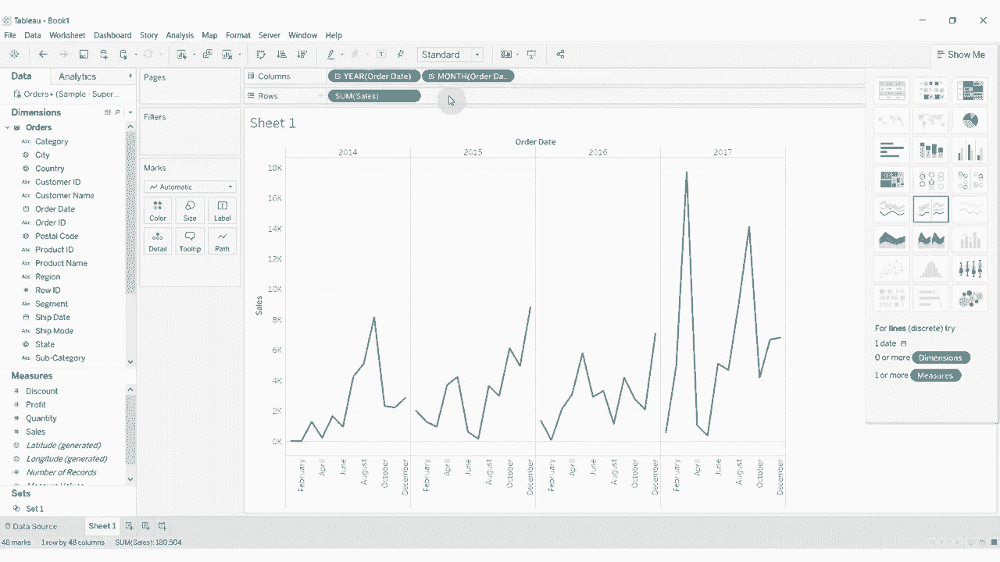

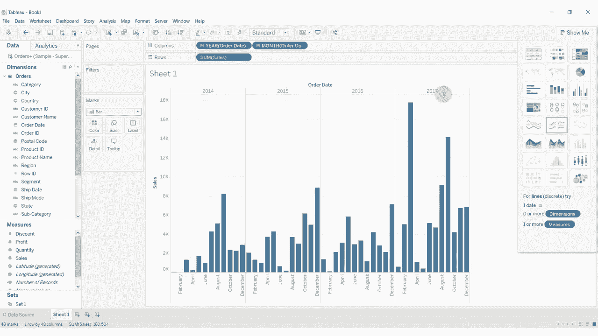

Next thing I'm going to do is I'm going to add a slightly different view of this。 So we're going to take region out to our row shelf with our four regions here。 Then we're going to add quantity。 So this is the total units sold。 We're going to add the sum of quantity to these regions。 And then using region up here。

 We're going to go ahead and create ourselves a set。

We'm going to call this the region set。I'm just going leave it empty。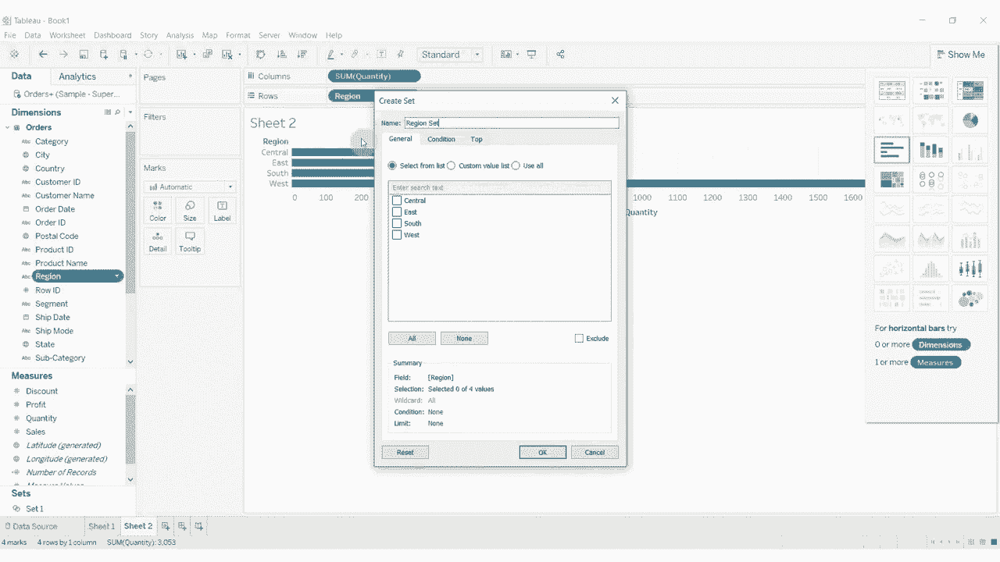

For the moment。Where the real power of this comes in is when we go ahead and create a dashboard and then drag out both of our two sheets here。 so I'm going to take our time series。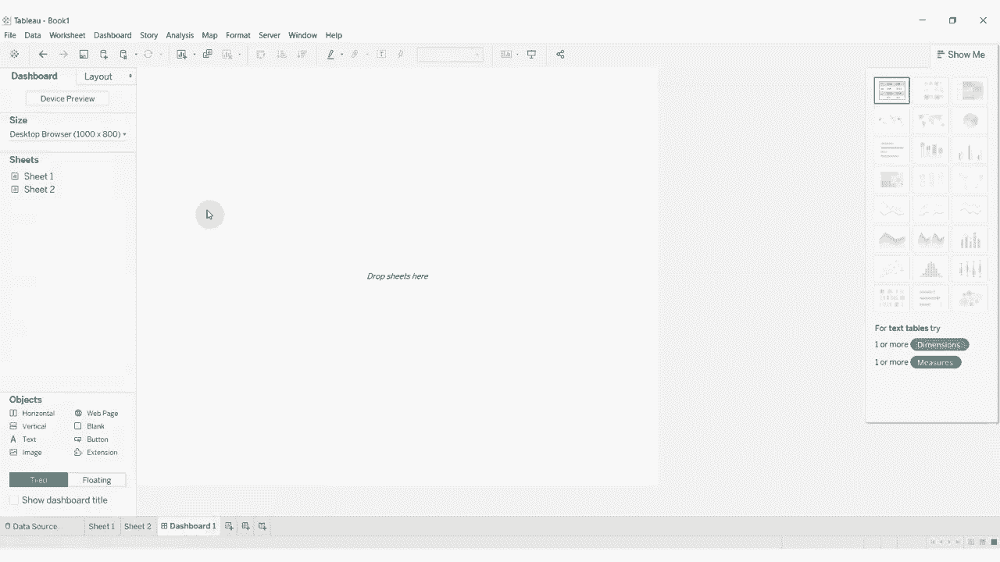

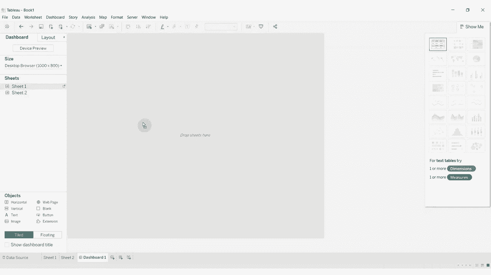

I'm just going to put that。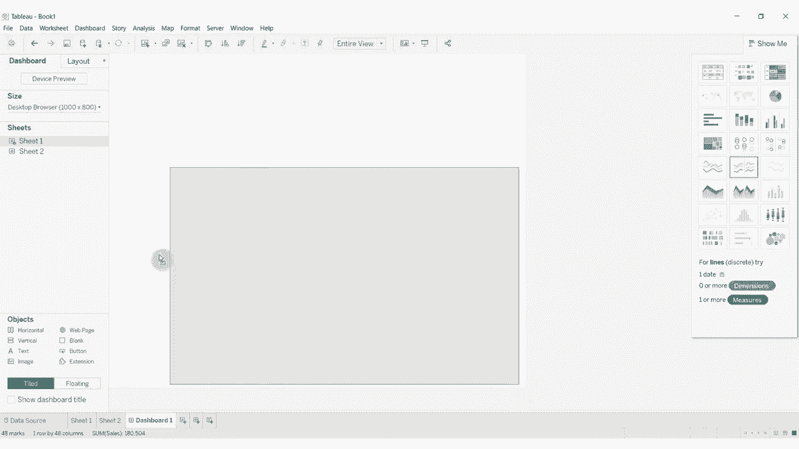

All the way along the bottom here。I'm going to take our region。And I'm going to drag it out here。 and what we're going to do is we're going to use this。Region to change。What is in。This graph at the bottom and show us what proportion each region contributed to the total sales for that particular month。

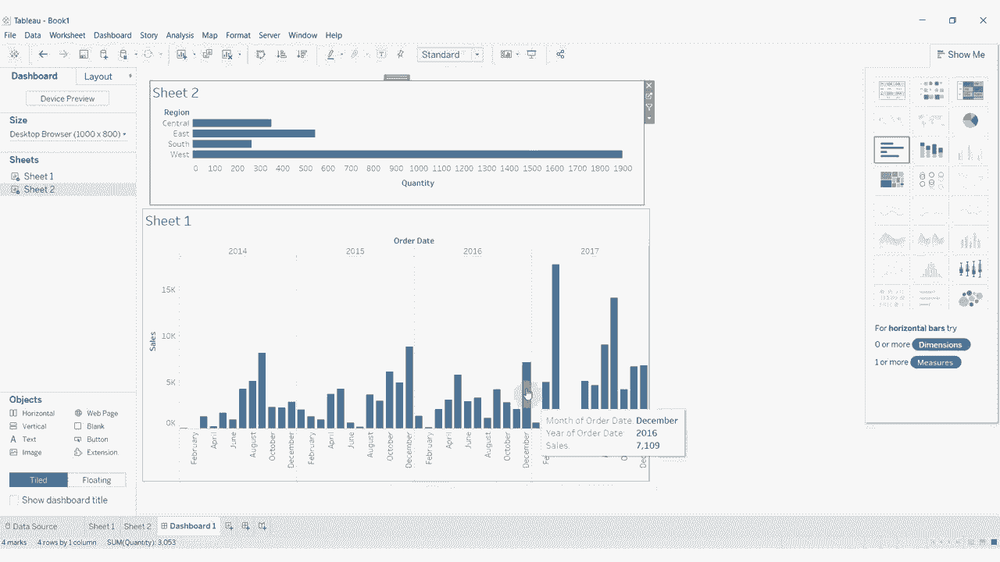

So we're going to have to pop back to our time series graph here。 We're going to take this region set and we're going to drag it out onto color。And you'll see that at the moment， there's nothing in the set。So， everything looks grey。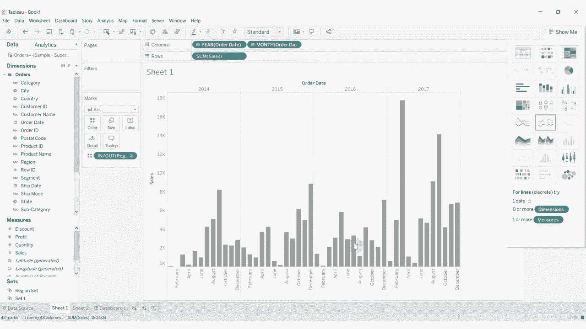

That's okay。What we're going to do to add items to the set is we're going to go up here to dashboard。 We're going to create a new action， and we're going to add change set values。We want this to be driven by sheet，2。We wanted to act on sheet 1。And then we're going to use the region set。 So this tells us which data source， this top box。

 and we're going to pick our orders， and then we want the region set。What we want to do is that when we clear the selection。 we want to remove all of the values from the set。 What this will do is it will mean that when we click on a region。 it will highlight it in the graph below。 When we unclick it， it's going to。

Take it out of the graph below。 So we're going to get go back to our our sort of default grey color。 So having done that。Should be able to see when we click。On an item and then click on set 1。 you can see how it's changing the graph below。 Now。 there's a couple of things I don't particularly like about this。

 The first one is that the default behaviour actually has， as you'll see。We have to click on something within the tool tip to do that。 And I'm not a big fan of that。 So we'll change that in a second。 The second thing that I'm not a big fan of is that whenever we highlight these。 multiple things。Again， they show up at the top。They don't show up at the bottom。

 What I want to see is I want to see my set at the bottom and my set at the top。 So I'm just going to leave these highlighted for a second。 And we're going to go in here。 and all we're going to do to change where the blue appears relative to the gray is we're just going to sort it。

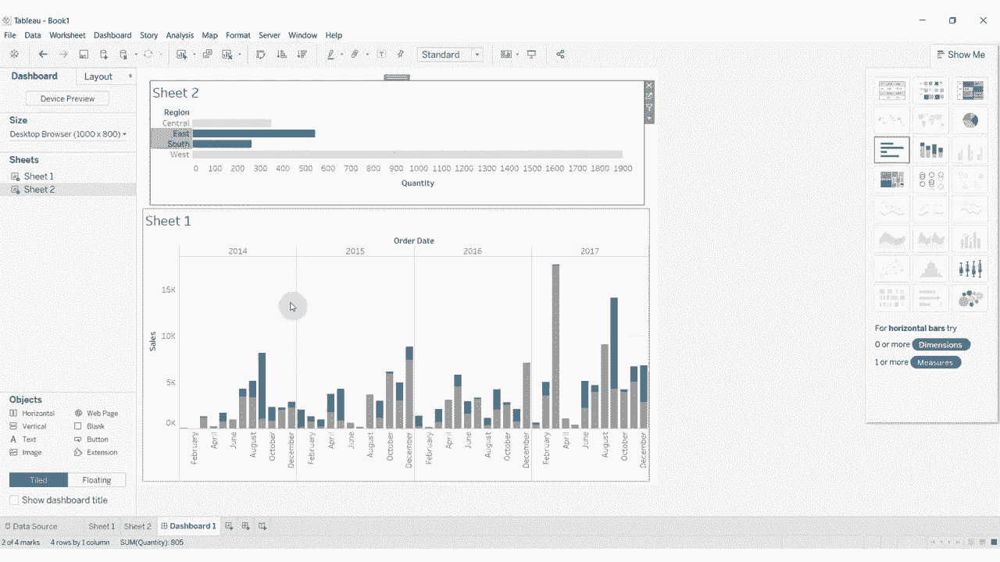

The other way， where should I have to click， it starts off ascending， click descendending。 click ascending。And now you'll see that what is in the set。Which is the blue bar shows up at the bottom and what's out of the set shows up at the top。 I think that's a lot more intuitive。Whilehy we' here。Since we are here， let's go ahead and add。

A label。To sales， there you go， that's just going to tell us what the what the total sales was。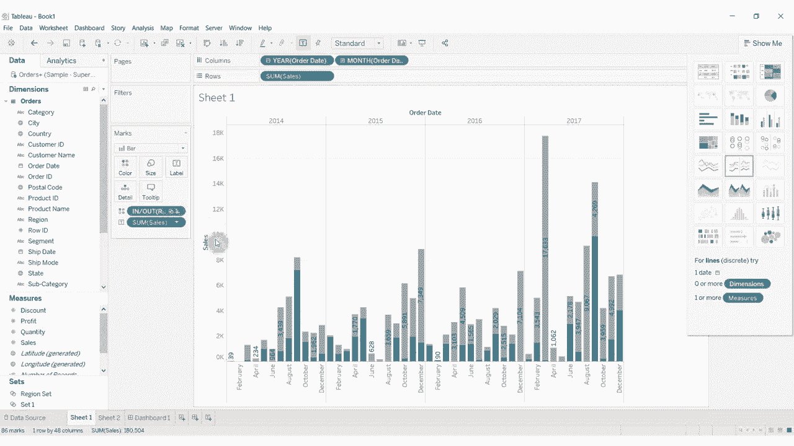

And then we'll jump back over here and to change the way the set action works again。 So we just clicked out and there's nothing highlighted。 We're going to go back to our dashboard in our actions。 I'm going to click edit on this set action here。And then instead of run action on menu。

 we've got to run action on select。I'm going to go back down here and remove all values from the set when we clear the selection。So right now we have an empty set。As we add values to the set， you'll see that the numbers change。So if we wanted all the numbers， there you go， there's all the numbers。If you want to just south and west， you can select just south and west， south and east。

 you can select just south and east， and you can see that the numbers will change dynamically too。 So every time we click on one of these sets， we get a number both for what's in the set and what's left。 what's outside the set。So that's a little introduction into how you can use dynamic sets within your visualizations。 If you have any questions， please leave them in the comments。 If you like what you hear。

 then go ahead and hit subscribe for more tableau tips and tricks。 And as always。 there's a link to the data set and to the workbook in the video description。😊。And we will see you next time。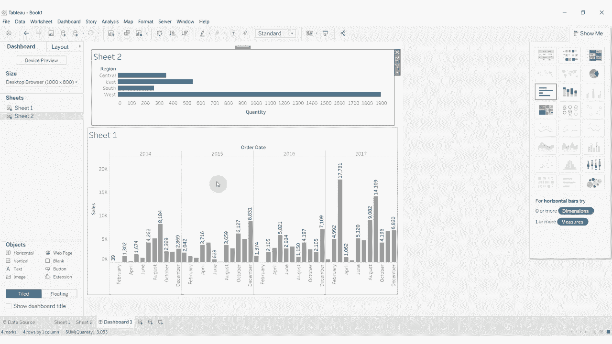