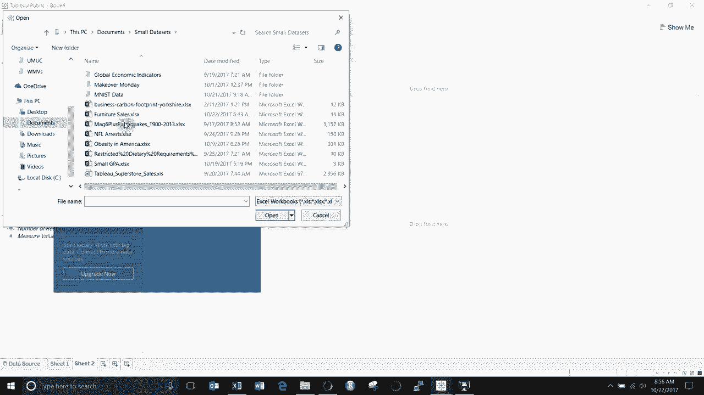
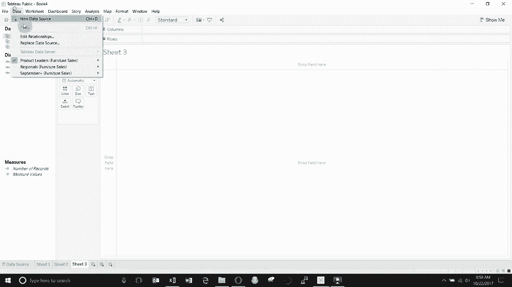
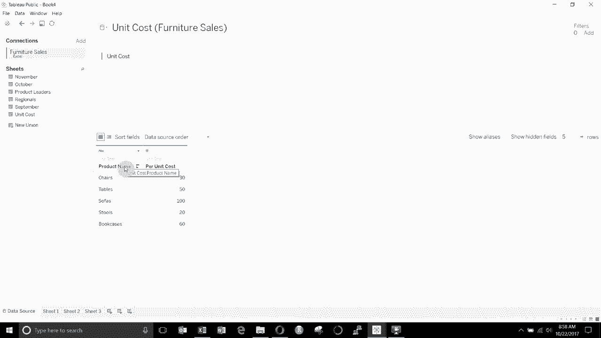
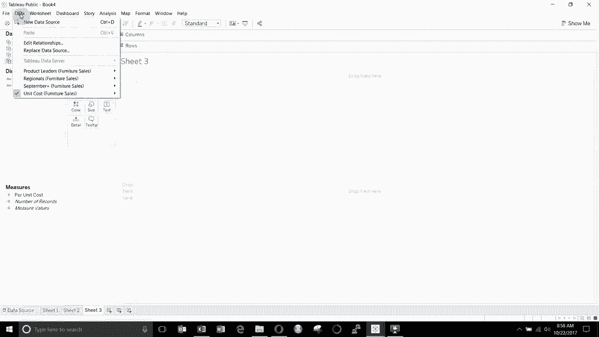
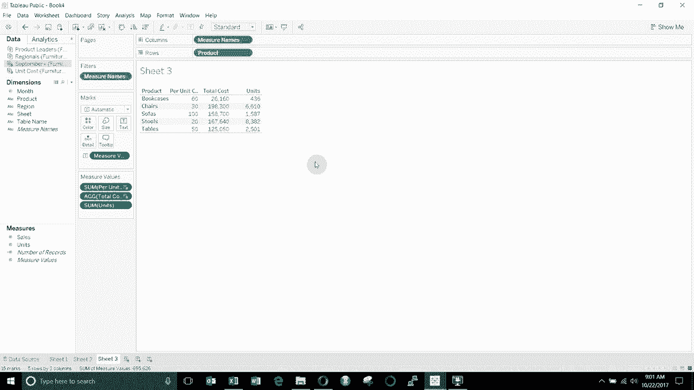

# 【双语字幕+资料下载】Tebleau操作详解，照着实例学做图！数据科学家的必备可视化工具，简单快速做出精美图表！＜实战教程系列＞ - P4：4）混合数据源 - ShowMeAI - BV1iq4y1P77U

Hi folks， welcome to another episode of Tableau in two minutes today we're going to be covering how to blend data within Tableau so I've gone ahead and connected to my fictional furniture sales data that I cooked up for these data demonstrations and I've gone ahead and just unioned all of the sales tables together so September October November December and you can see the sales that we have in our data source down here the other pieces that we have in this database as it were it's not really a database it's really an Excel sheet but close enough is a table with our regional leaders。

 our product leaders and the unit cost each of those is an individual table now you'll remember if you've seen the data joins in the data source video that we did actually join all of those together in this particular data source that we had a big like tree of tables sitting out here。

😊，We're not going to do that this time。 we're going to use data blending to achieve something that's very similar。 So we'll go ahead and hop over to sheet one and you can see that we just have our sales sheets in our sales fields rather in this data source So the first thing we need to do is we need to add a new data source we're going to go ahead and reconnect to this Excel file It's called furniture sales right here and then we're going to drag our regional leaders out and the first one we're going to join is the regional you can see we have regional and then regional sales director and then east and west or our two regions we'll hop back over to our main sheet here。

😊。

And you can see that now we have two data sources instead of having just one so why don't we go ahead and drag region out here you can see we have region west and we'll just drag sales out onto the column here and what we want to do is we want to add the regional leader to the sheet now the first thing we want to do is go up to here and go edit relationships now you'll see that our primary data source which is the sales table has a relationship set up automatically between the two region field so you'll remember we had a region field in our sales table we have a regional field in our regional leaders table and both those have automatically been assigned a relationship because they have the same name so when we click on regionals here you'll see we have this little orange link highlighted。

😊，If we were to uncheck that， then there will be no relationship between the data sources and you can see that because the little link has gone gray and it has a line through it if it's orange and connected then there is a link so that means we can use fields from this data source in our visualization so let's go ahead and drag regional sales director out here next to region and you'll see that we get regional and regional sales director in the same sheet Now what happens if we wanted to add some information about our product let's go ahead and jump to a new sheet here we're going to add our product leaders So again we're just going to reconnect to this Excel file's furniture sales open it up drag our product leaders out and you can see we have a field called product name which is the product and then we have the product leader。

😊。

Which is one of our rock star product leaders here， as I like to call them， Let's go back to sheet2。😊。

Then we'll go up again。 we just want to drag out， so let's go ahead and start with the sales table。 We'll drag out product。And then again， just go ahead and drag out sales right here and then you can see right that we've got our products and we've got a total sales Now what happens if we want to drag out the product leader as well Well if we go up to product leaders you'll see there's no established relationship here that's because product name doesn't match any of the fields in here it's just called product So to fix that we're going to go up to edit relationships。

😊。

Under the data menu instead of leaving this as automatic， you can see there's nothing listed in here。 we're going to click custom we're going click add a relationship and then we're going to select product from the primary data source product name from the secondary data source and go ahead and create that relationship click okay now when we go up and click on our product leader data so yeah our product leader data source you'll see the product name has the little link again we can check and uncheck that depending on whether we want to include or break the link and then we can drag product name across next to our。

😊。

Oh， product leaders real helpful。 product leader。 There we go。 And now it's joined up all of the product leaders with the products in our main data source。 Now there's one more thing to remember。 And that comes when you use continuous fields。 So let's go ahead and create again， we're going create a new data source。 This time。

 we are going to join the。😊。

Unit cost table。 so we're going to drag the unit across here we have a product name and a per unit cost。

So let's go back to sheet 3 again， because we have product name in one data source and product in another。 we're going to have to go up to， we want to use， this is our sales data source。 We want to use that as the primary one。 And then we want to go to unit cost。 You'll see there's no relationship。 So you gonna have to go ahead and define a custom one。

So product and product name。 Alright， so let's do this。 We're going to drag product out from here。 We're going to drag。Units out from here。And then we're going to drag unit cost out。From here per unit cost。 Okay， so now we have our table set up。 We have the per unit cost。 we have the number of units we sold。 Now， if we wanted to find out what the total was。

 we would just want to multiply these together，436 times 60。So we can do that by creating a calculated field。 Now。 you'll notice I'm creating this calc field in my unit cost data set。 So that means。😊。So this is going to be total cost so that means that when I create this field。

 it's going to show up under the unit cost data at anything that is a unit cost from this unit cost data。 any fields from here that we use specifically per unit cost we can use those unaggregated so I don't have to put these as a sum min Max etc etc etc but you'll see here when I try and add something from the sales data so in this case we're going to add units。

😊，So when I add this， you'll see it automatically aggregates it for me。 and I can't mix aggregate and non aggregate functions。😊，I also can't take away this sum。And have them be row level calculations you see because it'll say all fields must be aggregated constant when using table calculation functions or fields from multiple data sources。😊，And what that means is that because these are at a different detail level。😊。

They don't have a one to one relationship in the data source and when blending we have to summarize both data sources and we can only combine them in calculations at the summary level so we couldn't have for example。 a unit cost right where we just looked at the number of units per thing and then we we。

Subtracted them out line by line in our data source。 we have to aggregate them first and then do the calculation aggregate level。 but it does work so we've got total cost。 Now we can drag that out。 You'll see that。 We have total cost。Out here， which is just the units times the per unit calculation and we did those by summing them both up and this you'll see is Ag。

 so it's an aggregate calculation。 you'll also see that the two calculations that we have from our secondary data source。 the unit cost data source have this little check mark next to them。😊。Indicating that they're from a secondary data source。So that is a good way to tell whether you have things set up the right way around depending on how you do this you may want to organize it so that all of your calculations are done under one particular data source sometimes I like to make sure that everything's done under the primary data source but sometimes that's not always practical so this is a good way to fix that right that about wraps it up for this episode of Tableau in two minutes on data blending if you have any questions please leave them in the comments you can download the data and the Tableau workbook from the video description if you like what you're hear and you'd like more tableableau tips and tricks then please subscribe to our channel and we will see you next time。

😊。