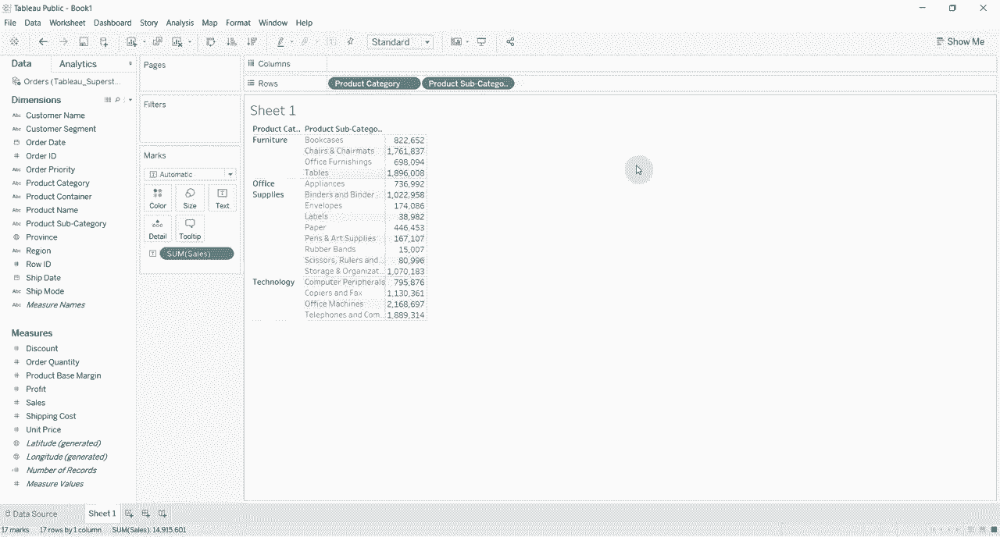
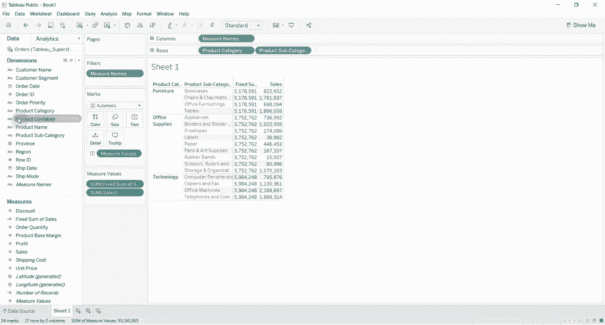
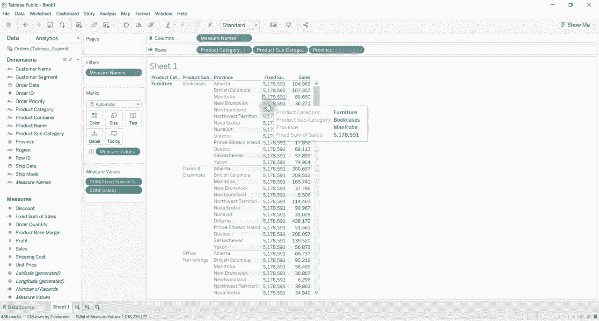
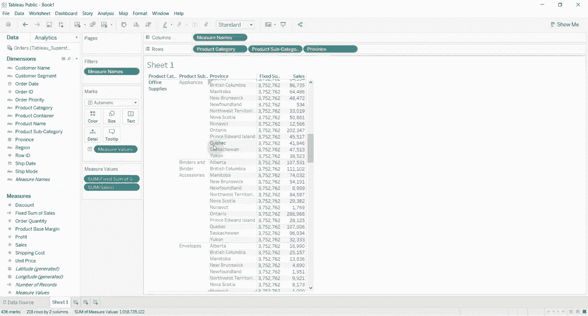
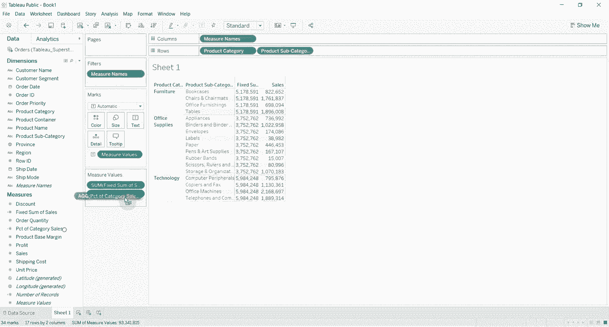

# 【双语字幕+资料下载】Tebleau操作详解，照着实例学做图！数据科学家的必备可视化工具，简单快速做出精美图表！＜实战教程系列＞ - P5：5）固定详细级别计算 - ShowMeAI - BV1iq4y1P77U

Hi folks welcome to another episode of Tableau in two minutes today we are going to be walking through level of detail calculations there are three types of level of detail calculations today we're going to be walking through what's called a fixed level of detail calculation which is the simplest so I have gone ahead and connected to my superstore sales data set it's available in the video description if you'd like to follow along。

😊，And what we're gonna do is we're gonna to take a handful of product items。 and we're gonna drag them out onto the row shelf and create ourselves a little bit of a table。 So。 we don't want product container or product category。 Then we want product subcategory。😊。

And then what we're going to drag out is sales onto our ABcs here and that's going to give us the sum of sales for each product subcategory and for each product category Now a fixed level of detail calculation is going to do the sum of sales that's like we have here but it's going to do the sum of sales at a level of detail that we tell it so we're going say this is fixed。

😊。

Some。Of sales。We're going to put some curly brackets。 We're going to say fixed。And then we're going to tell it the level of detail that we want to put it at。 in this case。 the what we're going to put it at is the product category level。So product category。 and then you put a colon and then we give it the expression that we want to do。

 which is in this case， some of sales。And then we're going to close that parentheses up。There we go。😊。

Okay， and then we're gonna drag fixed sum of sales out also onto our table here。 And now you can see what we've done is we've calculated the sum of sales for furniture。 Every number in furniture is the same。 Every number in office supplies is the same。 every number in technology is the same。 And it's always going to calculate at that product category level。

 So if we drag something out here like province， let's drag that out。😊。

You can see we're still calculating at the product category level。 So we've still got this。You know。50178，591 for everything in furniture。

No matter what the province， no matter what the product subcategory now。 let's drag Pro back a second， why is that helpful well let's say that we wanted to find out what percent of furniture sales were bookcases in that case we can take our sales number create a calcative field percent of category sales so we're going to take the sum of sales。

😊。

And then we're going to divide it by the sum of sales， the fixed sum of sales。

There we go by product category， okay。😊，Percentta category sales。 drag that out into the measure value shelf， obviously it's going to be zero because it's rounding down to zero。 so we're going to go ahead and format that to be a percentage。😊。

There you go， and you can see that。😊，Furniture bookcases were 15。9% of total furniture sales。 so that's how you'd use a fixed level of detail calculation again a fixed level of detail calculation is one that will' always calculate at the product category level no matter what other items you have in your view as stick around and we will continue working with this workbook to demonstrate both the include and the exclude level of detail calculations in just a few minutes。

😊。