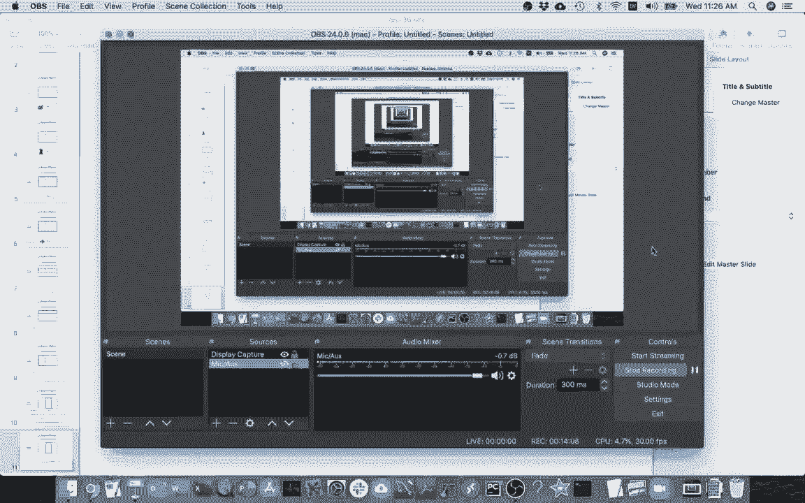
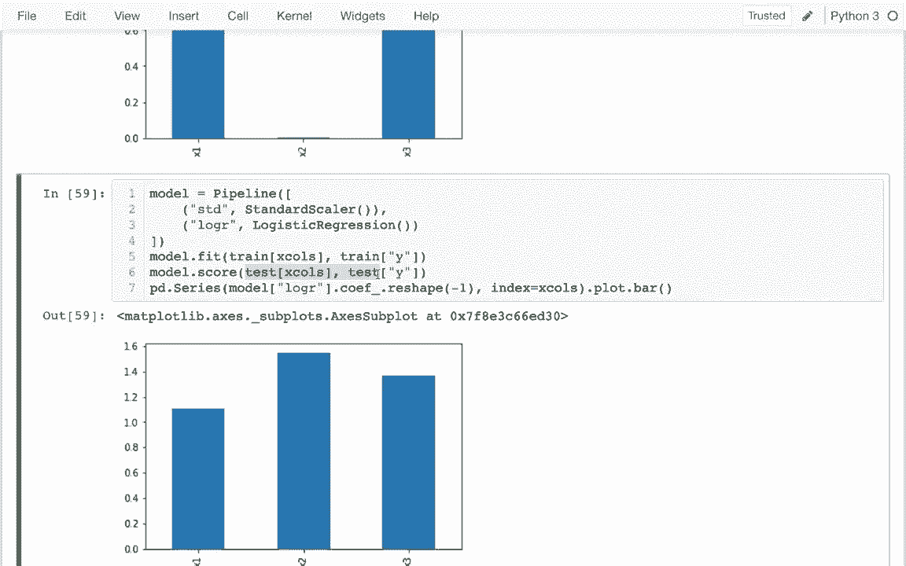

# 【双语字幕+资料下载】使用 Scikit-learn 进行机器学习，4小时实战视角刷新知识框架，初学者进阶必备！＜实战教程系列＞ - P10：10）正则化和标准化 - ShowMeAI - BV16u41127nr

Well in this video I'm may be talking about two topics。 one is regularization and other is standardization。 standardization is something that we have to use a lot in this course and understand。 and it's really relatively simple， but regularization is a very complicated topic and might require a lot of time and a more advanced machine learning course。

I'm not trying to get into any math regarding regularization。 and I'm just trying to try to give the kind of simplest intuition and we aren't going to get deep into it。 but just wanting to know that that's an important and deeper topic。So in terms of things that we've already done。

We've been using logistic regression a lot and a problem that it has that I haven't talked about is that it's very sensitive to scaling。And so for example， you might have a data set and there might be some numbers in it with specific units。And you might get one result of due do the classification if you change those units， so for example。 maybe you change miles to feet， you might get a different result。

 which is of course not what we want we just care about the actual kind of information。 not what units somebody arbitrarily chose to use。Why is that well it's because logistic regression is applying this technique to regularization？

Which tries to use smaller coefficientes and in general。 not have a very large coefficient on just one of our features。You can imagine that I have lots and lots of feature columns。That just by chance。 maybe one of them does better on the training data than others。

Even if the other feature columns are kind of still somewhat useful。 and so what I wouldn't want to do is just by chance choose that best one because then it won't work well later on a test data set。 regularization basically is providing a motivation to use multiple features and not consider one too heavily。 even if that would do better in the short term。So logistic regression does this linear regression which was the first model we learned in this course does not。

 but there are also things very similar to linear regression that do such as ridge regression and lasal regression。 we're not trying to talk about those at 320 but they're important and use all the time and so know that this regularization thing is a big deal。

So what would we really like， we don't want our model to be sensitive to units。 We would like to standardize it in some way so that we have the same numbers going in。 regardless of what their original units were。So for this example I just made up kind of a fake scenario。 we're measuring some sort of quantity in the real world three times and based on we're trying to predict what sort of category it's in the category will either be true or false。

The underlying rule is that when the true length， which we don't know。 is bigger than 5 than the category is true。 It's less than 5。 The category is false。 And so these three kind of noisy measurements， even though they know tell us exactly what the true length is。 they give us some information about that they can help us guess whether it's true or false。

So here I have that data， that fake data I'm talking about， the y column here is the category。 and then I have my three measurements， x1 x to an x3。Let me just talk a little bit about how I'm generating this。So under anumpot random。 there are a bunch of functions that will generate random data， I'm doing a normal distribution here。

 you can sample from different distributions， you don't know what that means that's fine for this course。 but basically I'm generating1000 random numbers with an average of four and putting them in here。And so this will be an array of numbers。 and then I'm saying， well， whatever that's five。 greater than five， I want to have a true， otherwise I'll have a false。

When I'm looking at this data frame down here， truefe does not directly go then into any of these columns it's unknown。 but category does and categories what we're trying to predict。So how are we trying to predict if we don't know true feet， why have these three other columns。 which are basically just true feet plus some random noise。 So if I look at it down here。

 let me look at this first one。 All three measurements were less than5。 So it makes a lot of sense that I'll predict that the y is less than than5。 Maybe I can even look at some more cases here。 I wonder if。I can see where it's true。Let me do that So I can see some other cases here where it's true right， all in this case。

 all the measurements were greater than5。 So I say it's true。 This is kind of a more interesting example。 This number is very large。 right。 One measurement was like almost of7。And even though the other two measurements were less than 5。 this was enough of a signal that the model decide it's true。 Well， it's true overall。

 and hopefully the model will decide the same。 Okay， so that's the data we're working with。 And let's see if we can。Train a model to try to predict this。 so I'm going to create a model and I'm going to use a linear or logistic regression model。And I'm going to fit it。To my data， and so I may have some x and and Y's for my Y's。

 I'm just going to pull out y column for my training data and for my X。I want to pass in a list of all my columns that contain features so x1 and x2 and x3。 and I'm going be using these again， so I'm actually try to put this in a variable called x columns。And then I don't have to keep typing that whole long thing every time。

And so I fit it and that's straight and so pretty soon I may look at the coefficients for this model。 but before that I just want to as an aside， see what accuracy it has if I want to see the accuracy of the model。 I can just say instead of fit I want to score and then to be realistic I shouldn't score it on data that I haven't seen before instead of the thing I trained it on right so this is kind of a better test and I see that it has 89% accuracy is that good 89% seems high that we would be right that often but let me show you why it's not necessarily。

If I look at this Y column， I see it's almost always false and indeed if I say value counts。 I could see it's only true less than 20% of the time。 and I can actually just divide this by the length of tests to see that。 And so what this means is that even if I had a very naive model， it just always says false。

 I would be getting 81% accuracy， 89% is better， but in that context it's not so amazing just given that there's so much skew in that column。Okay， so after I look at the accuracy of a model， the next thing I'll often want to look at are my coefficients。

 and I like to plot those in some way， oh， my model coefficients。And I see those are right here and and I'd like have some sort of bar plots。 I know that these things are paired up with these x columns right so this is the coefficient for x1 so on and so forth。 And so the way I'll often make such a bar plot is I'll say PDd do series。

And then I will have my Y values。And then I'll have index equals x values。Dot plot， dot bar。So on the x values， I'm going to use those column names， and I'm going to put the coefficients。To basically have the quantities that are going to go to the Y axis。And it's complaining that the length of one of these things is one when it was supposed to be three。

 and so x columns， that's pretty simple there， but if I look at this。This array right here what do I see I see there's it's really a twodiional thing I can flatten it into a one dimensional array with three numbers or if I say negative one。 it'll make it one dimensional it'll make it you know it doesn't matter how many numbers I have and I'll figure it out so I may put that here now and now I get this plot and this is interesting right I was talking about how maybe sometimes just by chance we focus more in one problem than another and that happens here right x1 x2 and x3 we're all equally noisy but it just so happens that based on the training data the model thinks that x1 is more kind of more useful right that was just by chance。

And so you could imagine a worse scenario where it picks one column that I really likes and ignores all these other ones that have good information in it。 and so the model will try to avoid doing that。 regularization means that we'll try not to put too much weight on just one factor we'll try to spread it out a little bit and then if you took it to an extreme。

 you might imagine that I could have a model where I just look at my intercept。My intercept is you can imagine that being like the average and the model could just predict animal all my coefficients could be zero in that case。 well we all just predict the same thing， and we want to have this problem I guess we have another problem that just want to be very accurate。Okay， so I have that。And so let me head back here and I'm going randomly generate this data。

 but this time I'm just going to change the units on this column and I'm going to change the units to be miles and so there's 5。280 feet in a mile so I'm just to make a comment here this is feet to miles like that and so I have the same kind of data just different units。

 so I might hope that my model won't do anything that differently。And so I'm going to run this again。 and I see that not too much has changed here。 And then I want to think about what's going to happen when I rerun this。So in this x2 column。The numbers are all much smaller now because it's in miles。 and so I might expect that to use this， I might have a bigger coefficient on x2。

If I wanted to be just like before。It turns out when I run it， I actually see the opposite。 It's adverse to having such large coefficients on one column because of that regularization thing I talked about。 So it actually decides， hey， I'm just going to ignore x2 entirely。 I have to put a bigger or a bigger weight on that that I'm comfortable doing to have it be a factor。

 So I just lost some information there。 I' using these two columns anymore。 Now， of course。 that's silly right， putting a bigger coefficient on it isn't really waiting it more。 It's just canceling out the fact that I have different units on it。 And so there's different ways to solve this。 One is that I could just insist that I have the same units for everything。

 Another way I could do it is I could try to kind of make this a little more uniform in some way。 And so that's what I'm going to do here。😊，I'm going head back here， and let me。Let me take my training data and my actually， where do I want to do this？

I take these x columns even sooner， Actually， no， that's fine。 I'm going to leave that there。 so I'm going take my training data and I want to take a slice of it and I want to get all the rows and I want to get columns x1。Through R x2。And so this is just my features now well through x3， sorry， these are just my features。And I want to somehow standardize it so that they all have roughly the same scale。

 And so I'm to do is I'm just going pull this out into this x variable right here。 and there's going be two things I'm going to do。 one is that I'm going take the mean of each of each column just like that。 and I'm going subtract these numbers off of each column I'm going say that。 And so now all of these columns are centered at  zero right after I subtracted away the mean the average of every column is0。

 it turns out that that is also helpful for logistic regression to run faster。 I'm not trying to get any details about why that's useful And then more importantly I want them to be on the same scale。 and so oops， what happen there。I jump onto a new column or to a new cell and so if I look at this。 that's a standard deviation of each column and if I have larger numbers while the standard deviation shall be higher and so standardization the real key part is that I'm dividing all of this by that standard deviation and if I do that I may get a bunch of small numbers that have roughly the same scale so after I've done this all of them will have the same average0 and then the same standard deviation of one and so this would be a better x data and I can actually put this back in to my training data like this so I may say this equals my new X data so I make it out here Im going say manually standardize the data。

And so after I do that I run all of this stuff again and now I see that great x2 is back in play。 even though I have different units， it's not getting obsessed with these other columns just based on the units。 so this was a good thing to do okay that's what standardization is。Now it turns out that to do this right， I have to calculate this mean and standard deviation on the training data。

 but then I have to use that same mean and standard deviation on the test data I can't retake the mean on the test data and so the methodology of this gets a little bit complicated and so generally we won't do this generally we'll have ask K learn do that for us and so it turns out that there's a preprocessing step called standardization and we're going to use that as so manually doing this so I'm going to head back here。

And you can see I've already import my standard scalar。And I'm to run this here。And this is skipping now for my model， right， I'll just actually leave this for now。 and that'll be my bad model。 What I'll do is I'll' create a new model。 which will be a pipeline model。And in that pipeline model。

 I want to have a standard scalar followed by a logistic regression。Just like that and。This one。 I may have to actually create them like that。I have to give them names， right。 So I'm going pass tus here。 So I'm going to call that standard scalar。Okay。 I have to put Thomas to separate these things。And then， then we go have this logistic regression。

Like that And this is my new model and then it turns out all this stuff I was doing before of like fitting。 for example it can work the same way I can fit just like I did before because I this new one also fit and so I can do that I could also score it like I did before let me score it now and I get something very similar and then what's might be interesting is that when I actually do this when I actually try to get this bar plot it should show that it's back in play right even though the nonstandardized version is ignoring x2 now。

 this version should show it so remember this there's gonna be a small error here and the problem is that pipeline doesn't have coefficients this pipeline as a whole doesn't have coefficients but the logistic regression inside of it does have coefficients。

😊，And so how can I get to that it turns out that any pipeline works like a dictionary and I can for example I can copy these names and use that like a key and so that would get me my standard scalar from the beginning or I could pass in this key and that would get me a logistic my logistic regression stage of it and so from that then I could actually see well what are the coefficients involved there and I would I would paste this here instead of what I originally had and so now I can see that when I have the standardization in play as a transformer before my estimator it'll automatically do that and then it'll do the right things as well if I do my fitting here it'll calculate that mean and a standard deviation and I do scoring it's just going to use the same mean in standard deviation from before it would not look at that for the task because that would be kind of a methodological mistake so we're going to be generally doing whenever we have a logistic regression unless we have some very special scenario。

For example， the data has already been standardized。