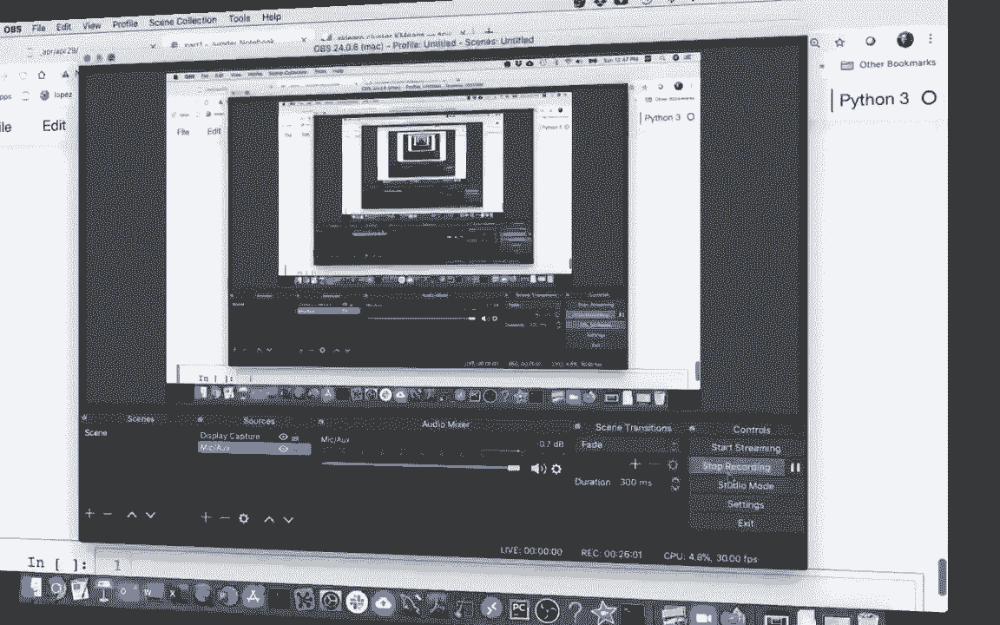
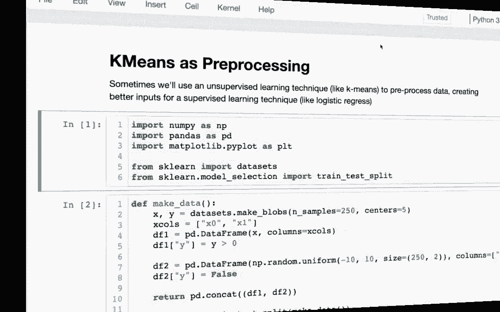
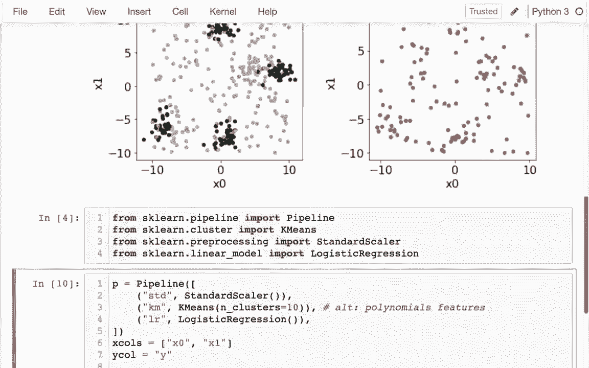

# 【双语字幕+资料下载】使用 Scikit-learn 进行机器学习，4小时实战视角刷新知识框架，初学者进阶必备！＜实战教程系列＞ - P12：12）使用 sklearn 进行 K 均值聚类 - ShowMeAI - BV16u41127nr

P。In the last video we built our own Chas class and this one we're going to be learning about how the one that comes with SKL works。And usually you'll want to do that because it works and it kind of gets all these tricky details right。 for example。You can easily have it automatically generate varying numbers of starting clusters。It will often have strategies that are smarter than pure randomness for choosing the positions of those before it runs an algorithm。

It generally has some logic around when it has been updating the centers enough and it's not going to get any need better and so you can set an upper cap on that but it's not going to do it more than necessary in general。 so overall youret want to use K means that terms of scalar rather than rolling your own So the K means actually has these three methods with it that we need to know we have fit which is not surprising right we've seen fit for both transformers and estimators what's a little bit strange about it is that it has both transform like you might expect for a transformer and predict like you might expect for an estimator so so K means has some similarities with both transformers and estimators even though estimators and prediction is a little bit it's kind of a strange use of it right because we aren't predicting some label that was given to us we're both coming up with the labels and predicting them at the same。

so it's not really a classic prediction。So I'm going to just show some rough code or kind of data to demonstrate what these three are doing in the context of the code we wrote before。 before we actually dive into using a means。Now before in our class we saw that we had these assigned points。

 an updates center， and that was the real core of what we needed to do， and a fit method。 what it'll probably be doing is some sort of loop like this for I and range of something。Yesterday I' was just going to be calling both of those it'll call the sign points。And it will call update centers and it'll do that a bunch of times to try to find the right answer and how many times is that。

 well when I call that number of times it does that。 the number of EpoCs and so I might say Epos here and like I was saying in the actual K means that comes with SK learn this will be an upper bound right if it sees that this is not improving anything further。

 it might have some break that happens if it's already done。If not getting any better。 I'm not going to do that Im just trying to write kind of rough code to give you an idea of what's happening。 And so when we do this right on our version， I plot this at the end。Hopefully。 hopefully it's solving this and kind of updating those points and indeed it is right it kind of figuring out where each of those centroids should go so that's the fit method now in the process of doing this we created a lot of supplemental information for original data frame right so this was original data frame that just has some points。

And in contrast to that。We have this data frame that the K means class was using with some extra information first we have the distance。 each of the clusters and second can be useful information in and of itself by looking at those three distances we can figure out which number is smallest in this case。

 number in the x column is smallest this is going to be this row is going to be an x cluster right in this next one the O number is smallest。So we're going to be in the old cluster。And so when we're looking at。 let me ask just shorten this up a。When we're looking at using k meanss for either transformation or prediction。 only difference is whether we're using these distances。Or the labels。

 And so let me do the transformation first to show you what we'll get there。 we'll be effectively getting this data。🤧。That's what we'll get out when we do a transformation in tas and I'll eventually talk about how that's useful as a pre processingcess step before we do something like logistic regression。

And then for prediction， all we're really getting is well what group does it fit nicely into and again。 right this is not really like classic prediction because we're both deciding what the labels are and deciding which points go with each label。Okay， I'm going to use K means on this same data from K means from SK learn this time instead of our own。And so I'm going say K M equals K means。And there's a bunch of configuration options here。

 for example， how many clusters we want to start with Im going say。We would like to start with three of them and then what we can say KM dot。But you always have to do a fit regardless of whether we're going to do a transformation or prediction next。And I want to fit that data frame。 Let me just look at that one more time。 data frame that had。

So I want to fit that data。And we do。 And And once we do that， then we can do either of those things。 we could say transform。And there might be some cases where this is a kind of a training data and then we're trying to apply our clusters or force our clusters on some you know second data frame maybe some test data and it'll be very common though we want to do it to the same original data and so when I'm doing this transformation here I saw well I have three clusters that's why I'm doing three columns of numbers here the three distances。

Or each row in my original data set。And it is very common right rather than doing fit and then transform。 you know why not do both at once？Just like sell。That would be a fine thing to do the same way I can also do a fit predict。 And then instead of saying， well， which group is in it， it's trying to tell me。Specifically， oh。 you're in group zero， you're in group two， so on， and so forth。

And so something we might want to do is that I might want to write a copy of my original data frame。And then， add this prediction in。And I'm going to say。A lot I I， I going call that cluster， right。 I could call it a classification， something like that。And。And let me actually look at this now。I can see while these are the clusters that is predicted to be in。

 they I look at the tail to see some others。Right and and so I could plot it and I could assign different colors to the different clusters if I wanted to right I could say that。dot scatter x equals x0 y equals x1， right， we're having x in both dimensions。

I get those three things， but I'd really like to see what color they are。 So I'm going to pass in。color equals data frame 2 of what cluster you are。 And and you notice one of these vanishes。 So 0 ends up being white。And so what I should do is I should pass in a different color math。And so let me head over here and look at the different color maps in matpl Lib。嗯。

Cluster 0 is not more similar to cluster1 than it is to cluster2 right so I don't really care about getting what is called a sequential color map。 something like that， where's kind of on the spectrum really01 and two or different categories for me。 so I going be looking into the qualitative color maps。And I'm just try to go with this one here。 use it in my set of colors， and I'm not trying to have more than 10 clustersters。When me do that。

 andm going say I want the tab 10 color map。And now I can see it's actually giving those different colors。 those different groups of points。If I wanted to， I could also look at the centroids and draw that on top of here。 and I get the centroids like so I can say data， I'm sorry。Came in start。Uusster centers。And what am I getting here all？But the ordinance of each centroid are like a row here。

 and I have three centroids， and that's why I have three rows。And so I could absolutely。Wrapped that up in a data frame。And I could plot it， right， I could say do plot dot scatter。And I can say all the x is x0， oh， x is 0。Y is 1。And I could plot those three points。And let me just make them larger and red， right， so I'm going say color equals red。A size equals 100。

Actually。Use S here， and I should really combine this with what I had before。I can actually see the centroids。And to really make it work， I have to say。That it should use the same region， right。You， let me just split this up here。 I it' getting too long。Central on and stop hot top Sc， same Ax。And so I can do all that same stuff。

 just like I did with our own version before。Okay。Let me address an issue which is how did I know that we should use three clusters and well the answer here is that I just kind of eyeballed it。 what if there's like 20 clusters right that might not be so easy to do or what if instead of having nice two dimensional data。

 I have x0， x1， x2 x3， x4 x5。It won't be obvious before and how many clusters there are。 And so the strategy that you'll do is you'll try a her number of clusters and see how well it does。 and this measure of how well it does is called inertia。 And so I can look at inertia。And our data like this。 And well， what is this measuring， It's measuring the average。Whered。

Distance from points to nearest。Centroid that's what that means right so for example。 this one over here is actually kind of far from that centroid right so I'll contribute a lot to this score whereas this one right here is really close to a centroid so hopefully everything's kind of neatly around a centroid and of course the more the more centroids I have this number will go down this inertia go down right lower is better it means no the number means everything's nearcentroid and so what we'll do is we'll actually try different numbers of clusters and see how quickly inertia drops off so let's do this。

So I'm going to go back and grab all of this stuff I had before。And。And somebody grab this and。So that let me， let me do this。 This is what I really need。I am going to have a little loop like this， and I don't even care about making the predictions anymore。 I just want to know that inertia score。A。Ea。Oh。E squ。Okay。

 and so you can see what I'm going to do here。 right I'm going to try different amounts。 of course。 as I add。More of these things， the nursetry goes down until the ball if I have the same number of clusters and points。Then luckily， each point hit its own cluster。 So I may have a loop here。 I'm going say 4 k in range。 And I want to have one to 10 clusters， right， So K， that's why it's K means。

K is the number of centroids and mean versus the fact that a centroid is kind of the average of other Xy values。I run this thing。And and I want to put all of these in a dictionary or better than a dictionary。 even a series， right， it's Im going to say。S。It was a series。And so I'm going to do it like this。 I'm going to say。Wars of K equals this thing。This， this inertia。I'm going to try running this。

And when I'm alld on， or I think there's maybe some issues here。 still。 one of the issues that's actually relatively new in pandas is that they don't like you。To leave it ambiguous what the type is going to be。 So I may be very explicit up front。 this series is going to have floats。And then the other thing it's complaining about is， well。

 I have a key error of one。And the reason why I have that is because when I just put brackets after a series。 it's guessing whether this is an index。Or an integer position。 And I was guessing incorrectly that an integer position。So it's guessing this。 which of course doesn't work if I change it to thatvoila I can get my scores。

And once I have my scores， of course， I can plot my scores。Like so。 And and I should also do this。 I should say。I should say that some labels here。The X label is k， which is the number of clusters。And my y label is what my Y label is。average。Bd distance。Your nearest your nearest centroid。Right and so when I'm looking at this here， I see that having two centroids。

Is much better than having one， so there's two very clear clusters。D from two to three。 another big improvement after that doesn't make sense to have four or centroids right that's not going to give me much improvement。Let's try running this again right Im going run run it from the top because sometimes these clusters will tend to overlap each other so just because。And way back here I created three clusters doesn't mean there's going to be three clear clusters at the end。

 so let me just run this again。🤧。And here， right， it's not as clear is that two clusters or three clusters and not surprisingly。While there's less benefit going from2 to。Great， that let me just try running it a couple more times。Get some more intuition here。Okay， so that that it' very clear that we want to go to three。呃。I want to see one where it's really overlapping， which is kind of a matter of luck here。

 What about that one， not so much benefit going from two to three。 right because these two are overlapping each other so much， right？Okay。 so that's what you'll often want to do so one of the use cases for these things is that you will create a plot like this just so you can say something about your data。 you can say how many kind of distinct clusters there are and that of course is a matter of prediction next time I'm may be talking about how we can do where it was my notes。

What are the uses for these transformations， why might we want to get data about the distance to each of the clusters？

In the last couple of videos， we've been looking at how we can use K means to identify how many clusters there are in the data and that can be useful in and of itself。Another common strategy is that we'll use K means as preprocess for another stage in our pipeline。

 and more generally you might apply some unsupervised learning technique like K means or principal component analysis to create better inputs for a supervised technique。 for example， logistic regression。So I'm going do that here and I've really tried to create data that will really make this work well and so here you can see in the left both my training data and my test data on the right。

And what you can see in the training data is that I've created five clusters here。And these clusters are kind of right on top of each other and out of the five clusters。 four of them have black dots。And one of them has gray dots， and other than that。 they're just gray dots kind of randomly distributed throughout the space。

And then on the right we want to predict that and so clearly there are some patterns here。 for example， as a human I might predict that these are in a similar area as this cluster of black dots over here so I probably guess that these are black and then other dots right like if I'm saying in this space right here。

 those are probably gray is in the training data those were gray。😊。And so certainly it would be hard to draw a single line that separates the black dots from the gray dots。For the purposes of a logistic regression， so I have to do some sort of pre processing。 Okay。 so I'm going to create my pipeline down here， A P is a pipeline。

And pipeline is just a list of steps。 and the last step， the most important one。Maybe a logistic regression。Like so。 And in the first one is going to be standard scaling。Bandard scalar like so， And then eventually I'm going to add in K means as a pre processing step to help logistic regression work better。And so I'm going to do this， I'm going to fit my model， so P dot fit。

And what I want to fit to I've already taken my data frame up here and split it into training and test data。And I can see that my two input column are x0 and x1。So I'm going to just put those in a variable here and going say x columns。Is x0？And x1。 then my y column I'm trying to predict is just y， as I'm going to predict on the training data or fit on the training data those x columns。

 And I'm going to compare that to my。Why， Colin？ and then after I do that， I want to score。 How well does this classifier work。 So I'm going to score it。My testing data。And so I run that and I see it's not doing very well it's only getting about 63% correct because it's hard to separate those black dots。From the gray dots。And and that's because when I just have a regular logistic regression has to only put a straight line there。

 So if I introduce K meansan as a pre processing step。Let's try that。And great ca meansians here。And。 and， and let me specify the number of clusters。 I'll say， end clusters。Equals let's say。 three first。I'm going to try running that。And what happened there？I have an extra parentheesis。 just kind of randomly。There we go。 That's where it's supposed to be。Excuse me。He。

 so still not very good because there's not enough clusters here， right。 I guess the original there are five clusters。 If I tried jumping up to 5。You can see that I'm doing significantly better but if I go up something like 10 better still right I can kind of capture the different areas and realize how close they are but having more clusters when I'm doing this preprocessing is generally not going to be as problematic is having to a few clusters so what's happening here when I'm taking the input variable to this well I'm using this K means step on the data right so what this is outputting is the distance to each of those1 clusters that identifying right so I might know is one of my variables well what is the distance to this cluster here and of course if that distance is small then it's probably a black point I might also have another problem that says well what is the distance to this cluster here if that's small well then it's actually probably a gray point。

So this is one way to do the preprocessing， an alternative， which probably works just as well。 would be polynomial features could also kind of figure out that more complex boundary between the black and the green。