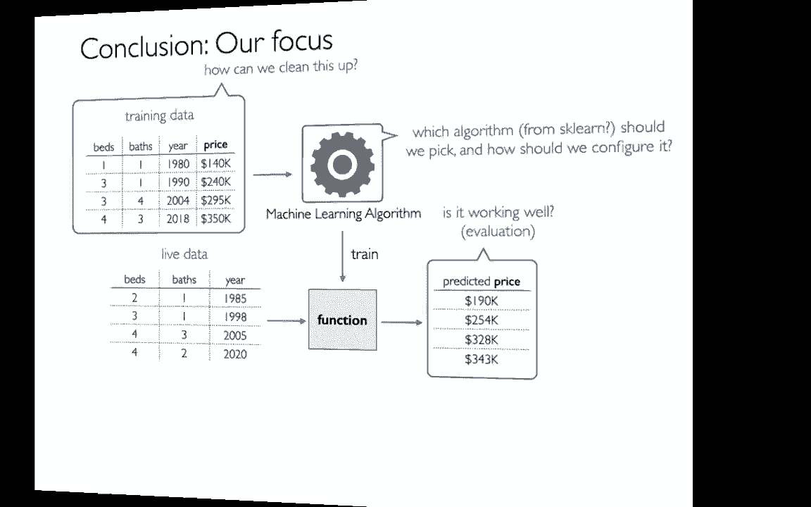
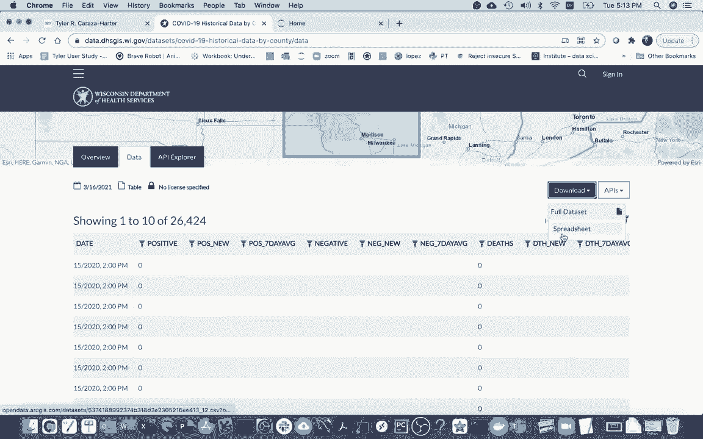
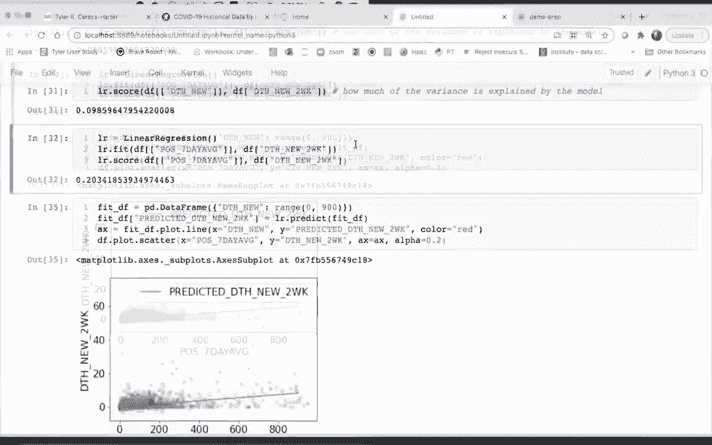

# 【双语字幕+资料下载】使用 Scikit-learn 进行机器学习，4小时实战视角刷新知识框架，初学者进阶必备！＜实战教程系列＞ - P2：2）线性回归 - ShowMeAI - BV16u41127nr

Well， in this video， I'm going to be training a regression model from Psyt Learn to some COVID data in Wisconsin。So here I am on the Department of Health Services website， a data portal。 and I can search for COVID here。And the data set I'm using is。This one right here。 the historical data by county。So there are about 70 counties in Wisconsin。

And what this data shows me is for each day， I wonder if I can draw a data browser here。It shows me for each date in each county， all of these different stats， so for example。 how many positive cases are there total， how many new cases are there。 how about over the average of the last seven days？And how many deaths are there。

 and ultimately what we're going to try to predict and this based on this data is well。 how many deaths are there two weeks in the future based on looking at the stats for today。So I had downloaded this and Im not to do it again。

And then there was a fair bit of data cleanup that I had to do here。And that's not the main point of this lecture， so I have a notebook for it that does all the cleanup。 I was just trying to kind of quickly walk you through this some of the things I did here without spending too much time on it。One I pulled out just a few interesting columns， so for example。

 how many positive cases were there on average over the last seven days and then how many new deaths were there？

We had a bunch of missing data， so I just dropped anything with missing data。And then I converted the date to an actual Pada state time and in the process I dropped what hour it was。 I just want to get the date without having the hour that it was posted。And then， finally。The documentation for this data set says that negative 999 really means that there's less than55 in whatever that field is。

 so it could be anywhere from0 to 4 and so I think just for simplicity I just replace that all 0 we don't really know what that is you can imagine doing something smarter like maybe 2。5 seems more fair in some sense。Anyway， so I get a data set that looks like this， right。

 in a lot of cases， while there's。No new cases and no new deaths。 maybe for some of these smaller counties。 and then then of course， for larger counties。 that definitely is not zero。And and so then I you go down a little bit more。 the other thing I want to do is I want to add a column which isn't just about how many new deaths are there。

 but how many new deaths are there two weeks in the future。And so I had to do some trickery with time Dltas。To basically join the data on two weeks in the future and you can look at that if you're interested。ButBut in end I get a data set that looks like this， right。 I know how many new deaths there are on this particular day。

 and then this last field is how many there are after the specific one and I save all this to this Wisconsin COVID data set so that's what I may be working with here and I'm just trying to head over here and create a new notebook。To analyze that。 So let me head here。 And then what I'm going to do is I'm going to import pandas for starters。

 So I'm going say。Import pandas as PD。And maybe I'm also add on import mat plot Lib， dot5 plot。嗯。As PLT， and then maybe I'm sure I can configure my mappl lib stuff first。Ot， lib and line。And then PRRT that。A C parametersms。Let's just make the font size a little bit bigger。Great。 so now I can actually give my data frame， so I'm going to say data frame equals PDd。read CSv。

And what do I want while that file I produced from that other notebook， which is Wisconsin。12vi。csv。 and let me just peek at that。So that's all I could and maybe just to make sure that all these things are not actually zero just I say what does the data frame mean and so I can see on average in a given to in a given day on average one in four people have died and so what I'm going be trying to do is I'm trying to be predicting this field on I might either try this as a feature or this is a feature and this is going my label column that I'm actually trying to predict。

 it's a quantity which is why I'm doing a regression instead of a classification。Often before I jump into trying to do a regression。 I'll do a scatter plot to just see if I can identify visually any patterns in the data and so I might do something like this I might say data frame dot plot。Thatts scatter。 And then I can say my x equals something， and then my y equals something。

And so in both cases， the thing I'm trying to predict my why is how many deaths are there going to be two weeks after this given date。 and then my X， I guess for the first case， I'll try，OfThe seven day average。Like that。And so I can see a picture there and then the other thing I want to do is I want to say well。 if I look at how many deaths there were a day， what will that tell me about how many deaths it'll be two weeks from now and I see a slightly different pattern there。

 sometimes for these I like to say alpha equals 0。2 or something like that just give a little bit of transparency when a lot of points are on top of each other。And I'll do that as well。And so the other thing that I really like to do as we're going forward is we're going to train a regression model。

On both of these variables， and so I want you to get a sense when we score that。 how that score corresponds to kind of the strength of the relationship in both of these。So I'll start with this one， how can we train a regression model that fits this to this？

And the first thing I have to do is I'm going to have to import it。 so I'm going to say from SKLarn do linear model， import linear。Regression。 this is the main regression model we're going to learn this semester， so I'm going to do that。And then if I want to， I can create a new linear regression object。Just like that。And。

 and so there's a few， there's a few。Methods are going to want to learn with this。 so some important methods are going to be fit。Prodect well， F， score and predict。And we're going to be running those things on our data。Right。 so let me come down here and what I can do when I'm fitting it or training it is I give it two pieces of information I give it my。

My X values， and I'll give it my Y values。And for the， the y values。That could be a series if I want。 so I could just pull off that one column for my x values， it has to be a data frame。And so let me just take a look at my data frame earlier。What I'm going to do first is do a model corresponding to this plot right so I want to do it based on how do the deaths today predict the deaths in the future。

And so what I have to do is I have plot this one column is new deaths。Into a data frame。 So the way I'll do that is like this， if I do this， just death。New。Then what then I just did a series the way I can do a data frame is I can pass in a list and I can say some columns here right and so it kind of looks weird right that I'm putting a list inside of brackets。 but that's what's happening and in this case I'm really just interested in one thing which is just well how many new deaths were there on this particular day and so I do that and I get this nice data frame which is going work well for us and then for my Y values I can just directly pull it out as a series。

And that will be death new。Two weeks from now。All， so these will be my x values。And that must be a data frame。And then this Y values and this can be a series。And in general。 why is that when I'm trying to predict one thing？But I might be making a prediction based on multiple columns。So I'm going to head down here and I'm just going to copy these things。

 I'm going to copy this right here。And then let me copy this right here。Its like that。And I train it。 so fit means。To train based on the data。So I haven't done a bunch of examples of my features。And my and my labels， right so I can do that and that's relatively uneventful。 and I would like to be able to visualize。What it looks like， what this model looks like。

 kind of what predictions is it making if I have new data。 and it turns out that since I'm doing the linear regression， Im just one column here。 it's actually going to be fairly easy to visualize because I can ask it for a given x value well what y value do you predict？

So I can do that with this， I can say Lr。preect。And then I can have to pass in some sort of value here。 right， so I think I can pass in something like， hey， if there's 10 new deaths to say。 how many do I predict？Two weeks from now。 And I have to pass this in as a list of lists， because。That was the shape of this up here。And I can see that there's also this array thing。

 which is an nu array， we're not going to worry about that too much for now。The way I'll generally do these predictions is that I might create a data frame that will help me show a fit line。 right， That's one way we can represent the relationship。Here， right if I drew a line on this。 that would tell me for my x variable well， what do I predict for my Y？

And so I'm going to create a new fit data frame like this。 that data frame and then I'm going to have a column。Wish will be。Death new remember that's the number of deaths today。And for that。 I'm just trying to try to put a bunch of different values right， Maybe I'll draw from like0 to 500。

And let me just take a peek at that。Okay， so that's something my death new。 and then what I can do is I can actually pass that whole thing in。To my prediction， to。 to basically。Figure out what those y values are so I can say LR。t predict。And if I want。 I can put in my whole data frame like that and try I find out that column。 and again。

 I get a bunch of these weird values， right in this nuy array。But the great thing is， is that。 I can say。I want to just shove those things in a new column。And I'm going call that。Thus。Im I say that and then I might like to say something like predicted right to emphasize that this is not real data it's just a prediction。 so I'm going put this up here。And now when I run this， I can see that。I have。

For a given number of deaths on today， well， how many do I predict there will be？Two weeks from now。 right， so if there's 500 deaths today， I guess I'm predicting that in two weeks。 there's maybe be 160 deaths for a particular county。And so what should I do now I can actually plot this thing， I can say fit DF dot plot online。

And I can say x equals this thing。And I can say y equals this other thing just like this。And。Different models will give you different things， but the linear regression。Right here。 that I'm using。Is trying to give me a straight line， right， I'm going to run that。And there's some sort of straight line there， and maybe I'll just make it red because I'm going to soon draw some new points。

What I often like to do is after I have my regression line， I like to compare it to my actual data。And so remember I had these similar columns before， and that was all in my original data frame。And for my original data frame， I just want to draw a scatter。Of all those points。 And then at this point， I'm not drawing some sort of prediction。 I'm actually drawing real data。

 So I'm going to do that。And I guess it's drawing it down here。 Let me actually try to put that on the same one。 I'm going to say。AX equals AX。 and I may have the first one return an AX。And then maybe。And here I'll have the alpha B 0。2 again。And why did I put AX there？There we go。And and so then I get these nice plots。

 and I can see that's far too long。 Maybe what I should have done is I should have I can see my data only goes to about。About 100， so maybe here I'll make my predictions over the range of about 100。And so I'm going to do that， and I can see how that line fits。是。Okay， well， how well do I do， I mean。 I might't try to intuit that based by looking at it。 And really。

 what I'm looking at is for each of these points。 Well， I'd hope most of them are near the line。 and I can see quite a bit of them are not， right？ And so the way we swear these things is we'll look at。What is the variance in the thing we're trying to predict？

So what is the variance and this thing of variance is kind of a measure of how much the values typically differ。From the average， right， so I can get my variance and the variance in this column is 1。35。And the idea is what we're going to do is we're going to say。 well how much do each of these points differ from the average of the points along the y axis and then we're going to compare that to like well how much do they differ from that red line that I drew if the line is good then then that variance relative to the red line might throw down a lot。

 I'm sorry their variance relative to the red line might throw down a lot relative to the average which I guess I could draw as like a horizontal line。And so the way I can do that is I can come back here and just like I fit the data。Where did I fit the data， I fit it。Right here。I can check。Instead of fitting it， I can score it。Right，And what this is going to tell me is how much of the variance is explained by the model。

And that'll typically be a score between0 and 1 with0 being the worst and then one being the best and in some kind of weird cases。 it can actually go negative and maybe we'll eventually talk about that。 generally it's going be between0 and1。And so I see this is not great。Okay。 let's try to do it for our other variable that we had as well。 right。

 So I had this one here and just looking at the plots。 I might expect that this one does a little bit better。And I think what was it like 9%。 So I'm going to copy these things down here。And so I'm going to create a new。A new linear regression object。And then what， that I'm going to。F it。Where was I fitting before。

 Here was how I was fitting before。Instead of fitting。To the desks on today。 Well。 let me try to fit to how many。Oh this I wanted to get the number of positive cases。 whereas let me go up and look at my data frame again。 I wanted to fit to the average number of cases over the last seven days。

So I'm going to do that now right I'm going to train my model by this new model based on this other variable。 how can I use this to predict how many deaths there will be in two weeks and maybe right away I'm just going to score it as well。 so maybe I'll just copy you this。And then score it。And I can see it's doing quite a bit better instead of explaining 9% of the variance。

 I'm explaining 20% of the variance if I was explaining 100% of the variance， well。 that would be very remarkable because every point would be exactly on that line。Let me try to plot it just like I did before， so I'm going to copy this here。And so I'm going to have to have this。 and then remember that for this fit data frame。

 I had to generate that up here using a range of values。 so I'm going to paste this here。And so what am I going to do again， I'm going to generate values from zero to 100。 and that is telling me well was a positive。Sur day average cases。And then I'm going get a prediction based on that。 And then I can plot a line like that。

 I'm going do that， And I can see。Well， something a little bit weird， right， I guess。I guess I didn't change everything right， I see the X axis is still how many deaths there were on today as opposed to what I'm actually training on。 which shows the seven day average， right so let me fix that。And run that again。 And so that's a little bit better。 I can see if the line doesn't extend very far。

 That makes sense previously when I was saying， well， how many deaths were there on a given day。 the number was relatively small compared to the number of positive Covid cases。 And and so maybe I'll redo this instead of going from。0 to 100， maybe I'll go from zero to like 900。 and so I run that。And and I can see this is a better F right now I'm explaining 20% of the variance instead of just nine。

So I did something bad here， well， and I want to talk about that in the next video if I just want to leave you with a thought。嗯。Let， let's say I'm teaching something in class and。I work out an example。And so maybe everybody sees that example and they try to learn from it if I put exactly that same answer or exactly that same example on any exam。What does it mean that somebody does well on that exam， I think there's two possibilities。

 One is that maybe the person genuinely。Learn something from that example and then even though they're seeing the same example again。 they understand what's going on。other possibility is that maybe somebody just memorized。The answer to the example。 and then when they sit it on the exam， well， they just repeat it。And that would be not so great。 And so the same thing happens here， right， Im when I'm fitting。

 I'm really giving my linear regression model some examples。😊，And then when I'm scoring it。 well I'm actually using those same examples。 And and so if this score were good。 and I guess here it not great， but if it were good， then I wouldn't really know， well。 did the model effectively memorize the answers or was it overfitting。

Overfitting is what we mean when it basically memorizes it。 So next time I'm going to talk about how we can actually deal with that problem and get a better sense of whether of whether it's doing a good job。