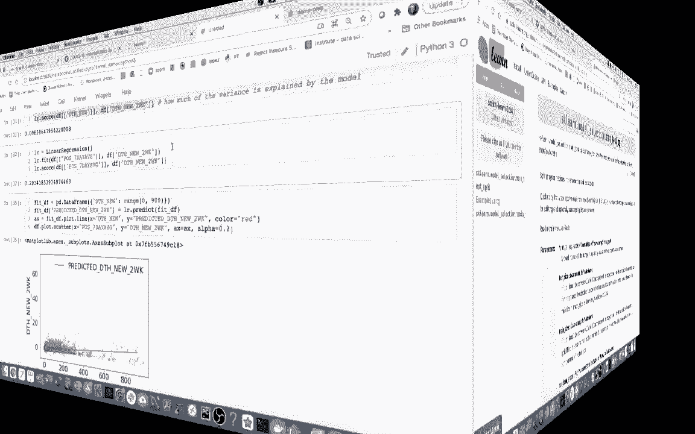
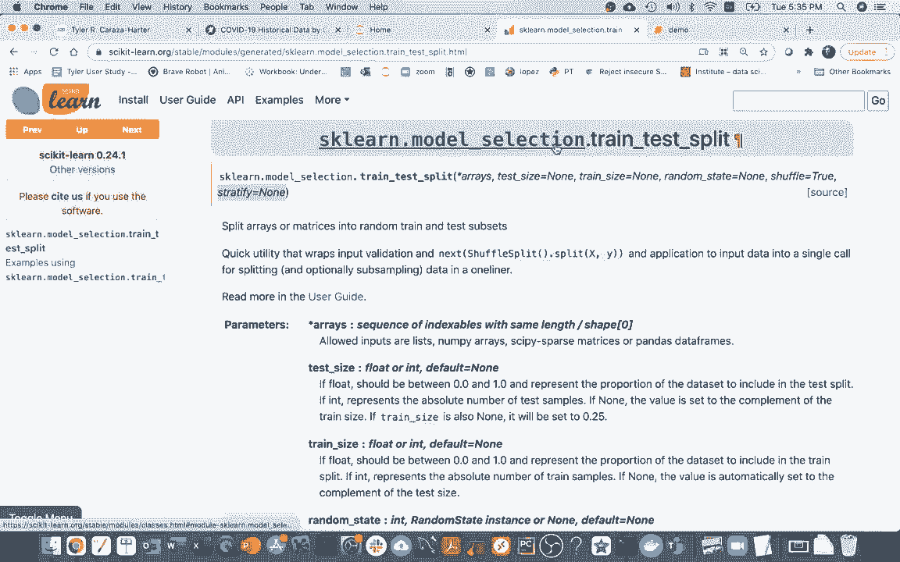
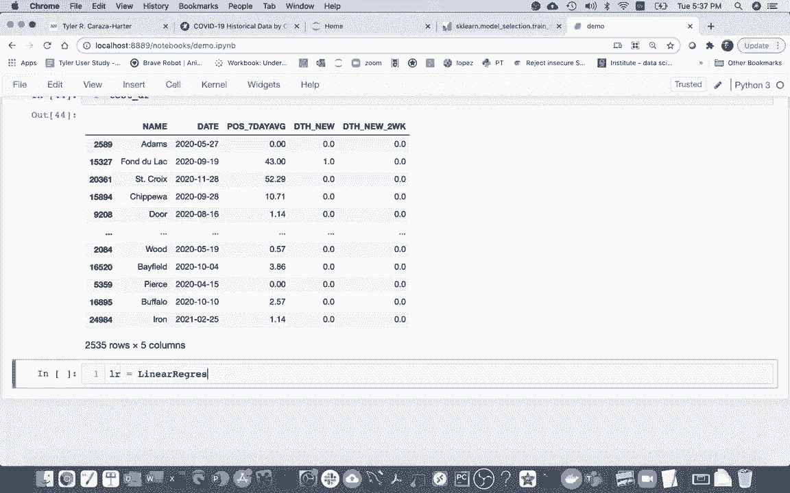
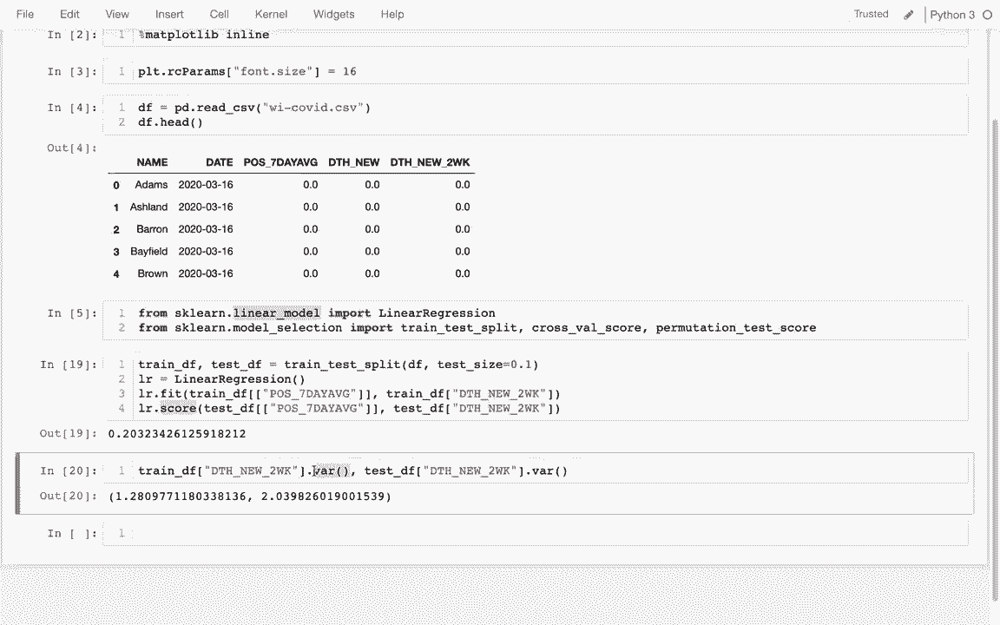
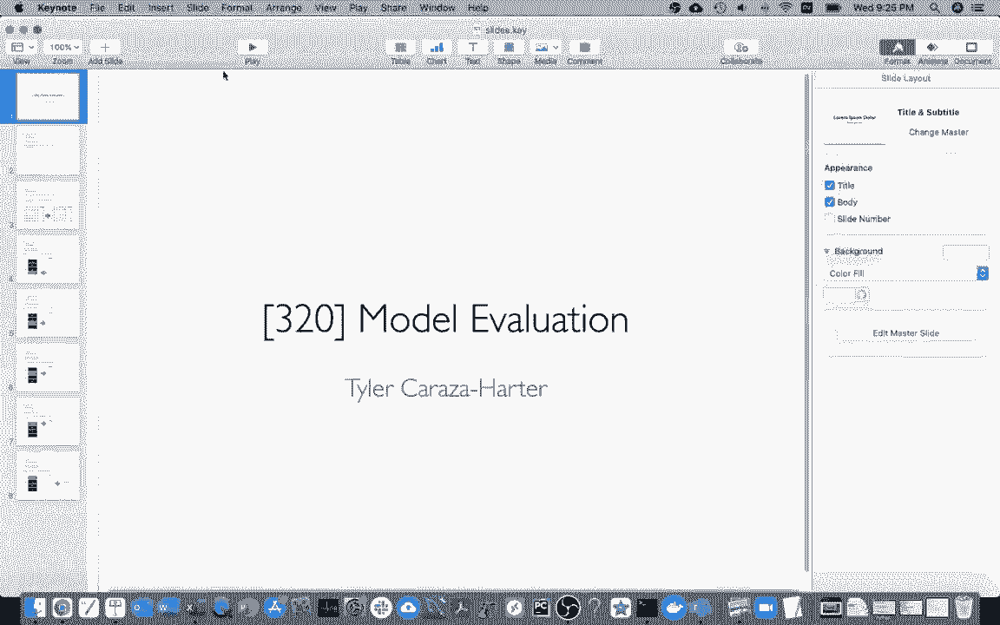
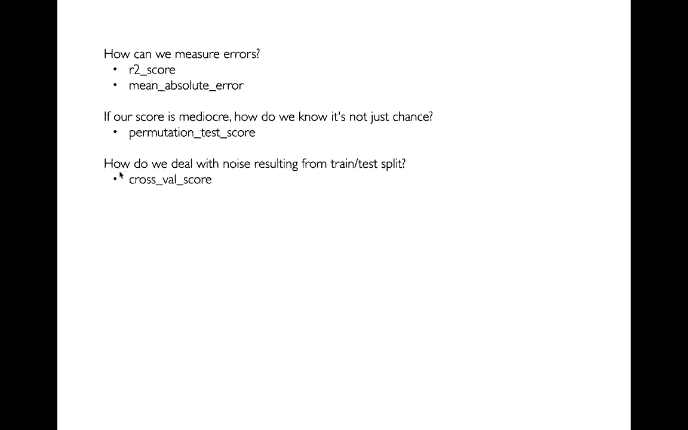
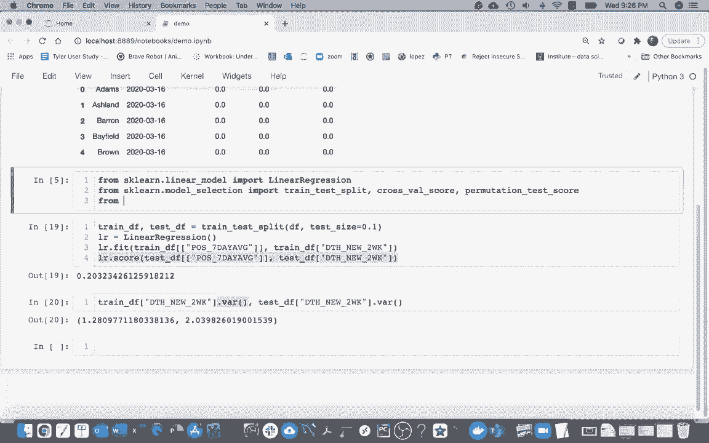
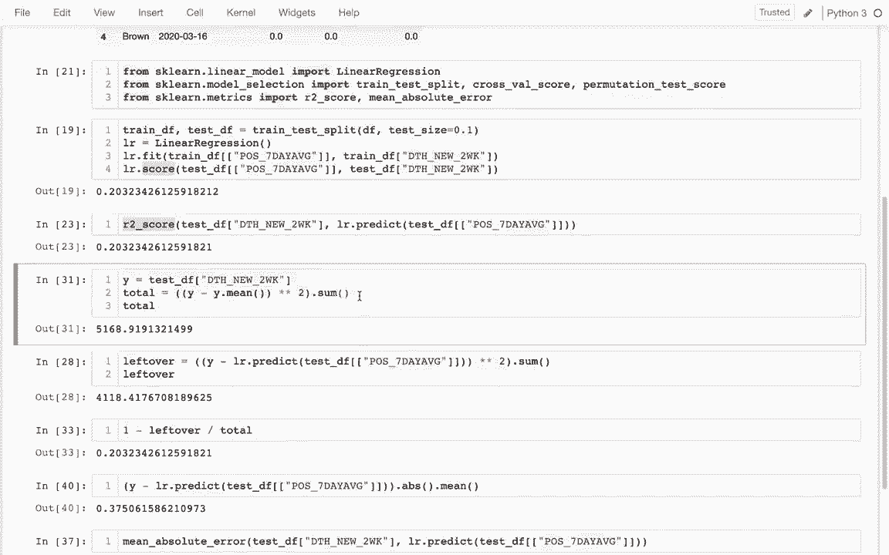

# 【双语字幕+资料下载】使用 Scikit-learn 进行机器学习，4小时实战视角刷新知识框架，初学者进阶必备！＜实战教程系列＞ - P3：3）训练测试拆分 - ShowMeAI - BV16u41127nr

So last time I talked about this issue of basically evaluating our model on the same data we fit it to。 right the model can effectively memorize an answer and look like it is doing well even if it didn't really learn anything。And so the way we'll deal with this problem is we'll use something an SK learn called a train test split。 and this is a general strategy， but this specific method will make it easy for us。

And what we'll do is I'll take our original data frame and give us back two data frames。We'll train our model to one data frame and then we'll evaluate it on the other one on the data the model has not seen before。 and so it's a better test of whether it's doing well。And so I can see that there's a number of things I can pass into this one is I can say well what ratio of my data would I like to go into my test set I can say other things like try to stratify the data like let's say I was dealing with something categorical。

 I might want to make sure that I'd have a similar number of categories on both sides I'm not trying to do that here。 but I will specify a trained test set。

So let me import this thing， I'm going to say。From SKLn import oh it's SKLn。t model selection。Import。 train， test， split。Okay， and then I'm going to say try and test split。And I'm going to try to try split on my data frame that I have originally。And。Basically。 it's returning something called an array with two data frames in it。

 and so the way I can capture this is I can say well I have my train data frame and my test data frame is order is to to return them in。And so let me take a look at these。 Here's my train data frame。And then here is my test data frame。And you can see that it kind of shuffled things around right if I look at the index。And I'm dealing with different data right so this is the data frame that my model is going to learn from and then this other one is the one I'm going to use to actually make sure it learns something。

And so I can see right now if I look at this， there's 6，300 down here and then 19，000 up here。And that's because the default split is 0。25， so I could do something like this if I want。And then that would make this first one bigger and the next one smaller。 So I'm going to do that。 Oh。 and then let me just see what I did wrong here。 I think I actually have to say test size。

 So I'm going say test size equals that。And then this is going to be a little bit bigger。 more data to test on。And then a little bit less data to train on and so there's some trade offs there。Anyway， now what I'm going to do is I'm going to head back to this example that I had earlier where I was doing my training and ideas instead of fitting and scoring on the same data。 I'm going to fit to my training data and then score on my test data。

 so I'm just to do it again from scratch for review and I'm going to say LR equals linear。Regression。

And oh， there we go， and that I say Lr。 fit。And I have my train。Data frame。 and then I have a list of columns here。And then here I may have my Y column。Right。 so that's the general strategy。 And then what I want to do is I want to score it。 when I'm scoring it， I'm going to give it a Y column and an。And an ex colony。 And I'm sorry。

 I have to say， train Diaf here。I'm going to give it that same information。 but now I'm going to be doing the test data frame。Where as I may say test data frame and then same thing down here， test data frame。And then what I'm going to do is for this。Imra passing in a list of columns， like before。

And what was I doing last time I was looking at this positive。A seven day average。 And somebody' may pass that in。Just like that and the same thing here。 and then over here I can just look at that thing that I'm trying to predict my Y。 which was this thing。When me pass that in and then the same here。 I'm going to do that。

 and I see that。 okay， my score is 0。16。Whereas what would happen if I wanted to run it on my original training data frame？

Like that training data frame。And here it does better on the data I trained on。 so this suggests that there is some overfitting here， right。 the model does better the data it learned from instead of some new data it hasn't seen before and so that of course is a concern。And so there's different things I can try to do to avoid that and we'll eventually talk about some of those things this semester。

Hello， today I'm going to be talking more about how we can determine whether or not a model is doing a good job or not。 how can we interpret different scores and make sure that we aren't getting a good score just by chance。And so I may be picking up last time with the model that's trying to predict COVID deaths two weeks out based on the current number of cases and so let me just quickly review what I did last time we were doing a train test split on our data frame and our data framework look like this right here。

And it was per county。 And then there's every day and the year there。Then I created this linear regression model， which I imported from SK learned linearar model。And then I did two things with it， I fit it to my training data。And then I scored it on my testing data， and these were the two pieces my training data and testing data came from here and so when I was doing this。

 what I basically did is I put in my Y values， which is what I'm ultimately trying to predict。And then here I put in my x values or my features， which are things I know right now， so for example。 right now I know the seven day rolling average of positive test cases and then two weeks out I'm trying to predict well how many deaths will there be。This can be a single series， which is why we just put a string。

I'm in the brackets after the data frame。Here we actually have to pass in a full data frame because in general we might have multiple features and when I pass in a list to the brackets after a data frame while I get a smaller data frame。 that's why I have the double brackets there。 So anyway， so I have this 0。

2 and and we know that the score will somewhere be be somewhere between 0 and1。 So it's a little bit hard to say how good this score is right maybe you always get something like 0。2 by chance do we know So that's one of the things I want to talk about today And then the other thing that you might notice is if I rerun this a few times Oh and now I'm at 27%  32%。 24%， 242826。So you can see that based on how I do this train test split。

I can do very different numbers and so that doesn't give us a lot of assurance so how can we get some more stable numbers out of the system I'll just give you kind of a hint of what the problem is if I look at train DF and I look at this column here。 which is the thing we're trying to predict。嗯。Let me do that。So I have all those numbers there。

 Let me look at the variance of that column variance are just kind of a measure of how different values are from the average。And then I'm also going to do that thing， same thing for the test。And so when I do it for the test。 I see that actually they have quite different variances。 and if I run this again。While instrument randomly shake out differently now the test data actually has a higher variance than than the training data。

 and we eventually look at how this scoring function works。 but it turns out that it's very much based on this variance。Which is why we have such a noisy measure。 So let me head over to the slides and try to give a preview of the things we're going to talk about today。

We're going to be learning for new functions related model evaluation。 so first we're going to learn these two functions here， which will let us score our models。

Second， if our model is trying to mediocre like mine is right， I mean 0。2 is not great。 how can we know if it's not just chance and then we're going to be using something called the permutation test score for that。 and then finally。To get a less noisy measure， we're going to be doing something called cross value scoring。

And so let me start here with these two metrics here。 I have this R2 score and mean absolute error。 and we'll talk about how those work。

If I go back to my slides or go back to my notebook right here。I'm doing the scoring here。 I can also up here， I can say， from SKL dot matrix。

Import。There's a couple things I want to do。 I want to do the R2 score， and then the mean。Absolute error score。And so the way all of these metrics work is kind of like this。 I'll call the metrics function。And then I'll say something like， I mean。 I should just check this here quick。I'll say something like I had to make sure the order is different between my true and my predicted。

 I'll say you know what are the true values and then my predicted values。And so for example， up here。 I know that these are my true values。And。Then my predicted values， Well。 how do I forget my predicted values， I could just say， well， model。 please predict for me what these y values should be based on these x values that I'm going give you。

All so I'm going to do that， and so here I'm putting in x values and it's going to return back to me Y values。And this weird anything thing that we'll eventually talk about。 but I could take this and I could put this right here。And so that I could use lots of different metric functions here， I could， for example。

 use the R2 score。Right here and guess what， it turns out that this square here that's associated with the model is just defaultfiling to use R2 score。 there's lots of different metrics I could have used instead， but this one is the default one。So let's talk a little bit about。Let's talk a little bit about how this were computed。 So the idea of it is that this is the thing I'm trying to predict right So this is my why column。

 And somebody going say why is here。And I can just peek at that。 What I want to do is I want to look at basically the squared residuals of this column relative to the mean。 and so what does that mean。 So I can take this。 and I can subtract off the mean of this。And then if I want to， I can square all of that。So this is really a measure of kind of how bad the system is if I add all of these things off。

So this is really well the variance of the system except I'm summing instead of averaging。Right so this was my original kind of total error or variance in the system I might think of it as I'm just adding out so I wasm trying a sum of squares。🤧And then what I want to think about is what if instead of vugh。Measuring the distance from each shn。Each value to the mean。 What if I measure the distance to my actual prediction。

So it'll be very similar here， I can say， what is kind of left over。If I subtract off my predictions。 how do I get my predictions， Well， that's this right here。 I'm going to grab this piece。And let me have my predictions here。Yeah， then let me take a look at that。So the way I really think about it is that originally this was how much variance I had in the system and this is how much I have。

After I， after I do predictions rather than just subtracting off the mean。And so what I could do is what I could say。嗯。I could say， well， how much is remaining。 so I could say leftover divided by the total。And。Why is that？Oh， let me just put that here。I can say that left over divided by the total， and I'm like， okay。

 why left 79% of the variance on the table basically？Which means that I took away 20%。🤧And you can see that that's exactly what this is up here right so really this is the the math that people will really kind of use to evaluate how good。A regression is typically we can do that more simply with R2 score。 and even more simply that's the default vi say linear a regression dot score。

Let me give you an example of another metric people might use。So maybe I want to just get， well。 what is the average error？And so on that case， I would go back to this piece。RightSo this is all of the errors。And if I want to get the average。 I should probably just think about the absolute error。And then I could take the mean of that。Right。

 so this would be the average。Absolute error。And it turns out that that is just。Rather than be collectulating that myself， I could just grab this mean absolute error here。 there's lots of different metrics in here and I think if I hit shift tab。Well。 maybe it's just regular tab。 I can see all the different metrics that come here。

And most of them I have never used。 so I paste this here and I see， well， that's kind of strange。 It should be the same It should be the same number。Why is that not the same number。Because on。I wanted to get the error of my predictions not relative to the mean。 and so I'm sorry this was the thing that I wanted to， this is the thing I had wanted to grab。Right。

 so I wanted to say。You know， here are all my errors。 take the absolute value of them。 right some errors are positive or negative。 I just want to have the absolute value。 then I have the average。And why is that。嗯。In balance syntax。 that usually probably means I have a mismatch in terms of my parentheses。I see。

 So this one has is matched up there。 So I don't know why I grab that squared。 Okay。 so I can see that this is all my errors。And then I'm taking the absolute and I'm picking the average。 and I'll thankfully， okay， well actually get the same thing that I have down here。And so again。 right， this is just a shortcut for this kind of more complicated math。

 but it's another metric in terms of how these metrics work。呃。This one is kind of counting all errors more equally， you know。 error that's twice as big is just twice as bad。Because this one up here where Im doing the when I'm doing where is it right here when I'm doing the R R squared score。 because that one is squaring my errors， this will tend to make it look worse if I have a few errors that are really big as opposed to many small errors。

Okay， so those were a couple metrics， which was one of the things we wanted to answer in the slide。 I'm just going to head back here。