# 【双语字幕+资料下载】使用 Scikit-learn 进行机器学习，4小时实战视角刷新知识框架，初学者进阶必备！＜实战教程系列＞ - P4：4）模型评估 - ShowMeAI - BV16u41127nr

We talked about our squared score， we talked about being an absolute squared or error。And that's different ways we can measure our errors。 The next thing I' to talk about is if our score is trying to mediocre like 0。2 out of one。 how do I know that that's actually grow and it's not just chance。

And the answer is that what we'll do is we'll take our original data here。And we'll score it with our model。 We're able to train a model that the x's and the y's and just score。 And so let's say my score is 0。8， which is not that dread。What I'll do is I'll shuffle around the data。 so I know that there's no relationship between the y's and x's。

 right， so what I'll do is I'll take this y column and just randomly shuffle it。 And the word for that is up permateated。 As I get this permutated version of this column， right。 you can see that。For example，5 used to be the first number and now now5 this down here So I just kind to randomly shuffle that thing and then I train the model on it。 trying to look for the relationship between the y's and x's。

 and there should be no relationship obviously right because I just shuffle everything around but I can try to train a model and get a score on it And so if I see that when I'm basically training a model on garbage data。 if I get a better score then then I did originally。

 well that probably means that I didn't have any sort of significant result originally so I probably didn't have any sort of meaningful model And that's the rough idea an actual implementation of what this function here is going to do for us is it's going to shuffle around the data like this。

And it's going to get a score and it's try to shuffle it again and it's going to get a score it's trying to get something like know 100 or 100 different scores based on these shuffled data。 and then based on that we can estimate and really see this score over here。

 is it kind of unusually good or does it feel like this could fit in with the garbage data and based on that we we can basically say。 well hey， do I trust this model or that So let me head over here back the notebook？

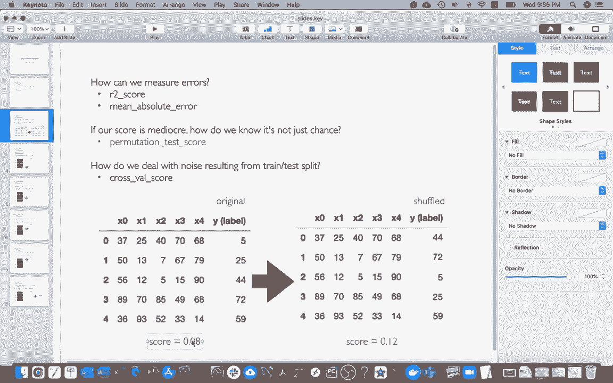

And。 And so maybe I'm just trying to make some notes in here just so it's clear to what we're doing。 So this part was about metrics。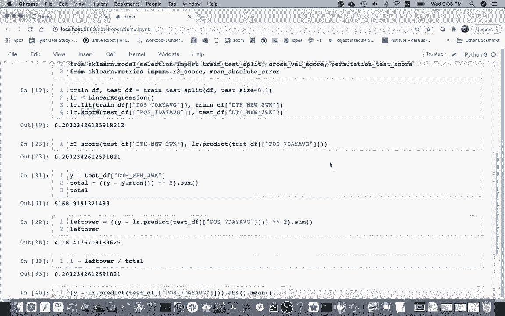

And then this part is going to be about permutation testing。

And so let me I actually already imported it， which is great so all these things that are kind of related to model evaluation and they're under this thing called model selection because what we'll often do is have a few different models and we're trying to have different tools to say well what is the model that we think is best and we're going recommend to people So I see that I have this permutation test score。

And I might paste this right here， and I can see that I need three things。At a minimum。 I have to have my model， which is just L R。🤧I have to have my own。

My x values and then finally my y values。 And so the way I'm going be doing this here is since。嗯。Since here I have this testF and and。For both my x and my Y I'm just going to grab these right。 so this was my x right here based on the seven day average， I want to predict this right here。And I'm going grab this。And it turns out that this is going to return a tuple of length  three。

 so I'm just going run that， that'll take a moment。 and the three things in that tuple are going to be the score of my module model originally。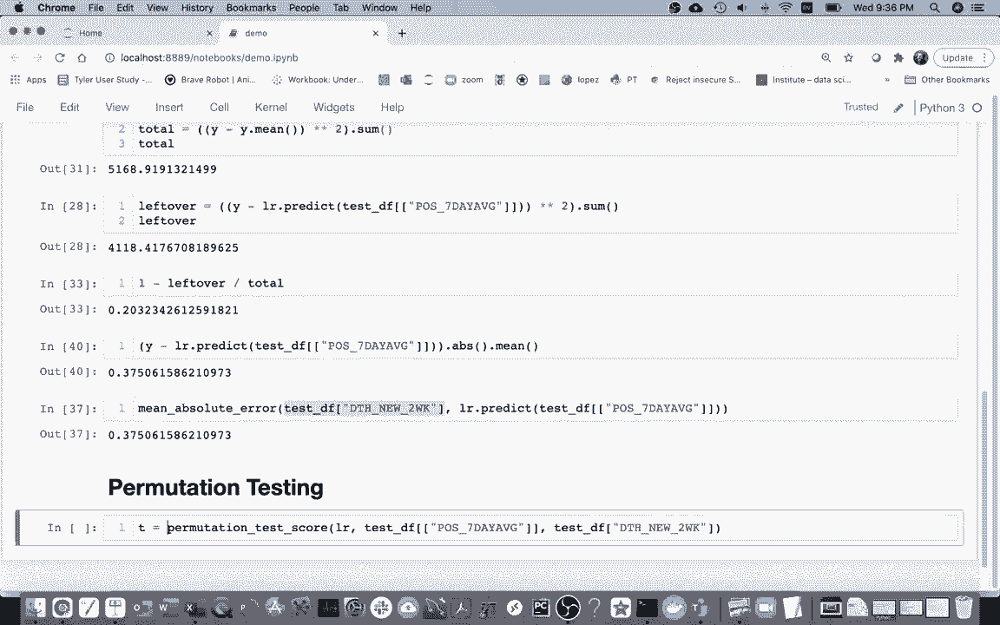

It will be you know some other scores when I have maybe I'll just tell the garbage scores since I'm peruting the data。 I'm not expecting to have any pattern， there's going to be a bunch of those。And then there's going to be something called a P value。And what the P value is telling me is。Well。 what is the probability that a score this good。Would be generated by a system that's generating all these garbage scores。

Right， and so if this is really small， then I can see， well。 this is actually much better than my garbage cores。 And so I actually have a significant result。 So since these are the three things I was returning。😊，Right I know that T is a tuple。 I just put that here and it'll automatically unpack those things for me。

 so I'll take a look at this。And then I get a score for my model。 and then I can have my garbage cores here。 I see there's a whole bunch of them。 If I want to。 I can put those in a series。

And then I could do a histogram of those。

And I can see that， you know， they're actually around0 or less， right， all of these。 And this was around 0 point。0，9， which is。Actually。Ptty far over here。 So it seems like we're pretty far away from these garbage scores。 And therefore。 this P value is going to be pretty small。 It seems like whatever process。

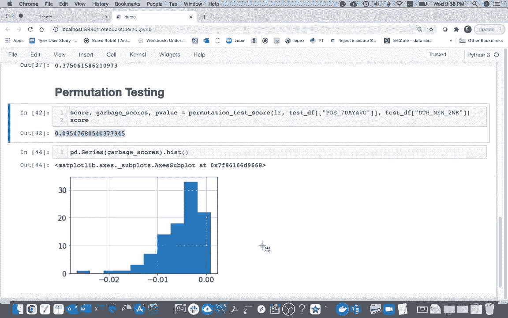

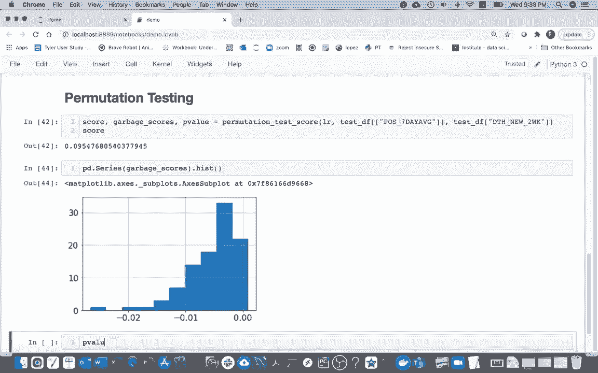

I'm using to get all these garbage cores is not likely to have a score this good。 so I will take this as a meaningful result。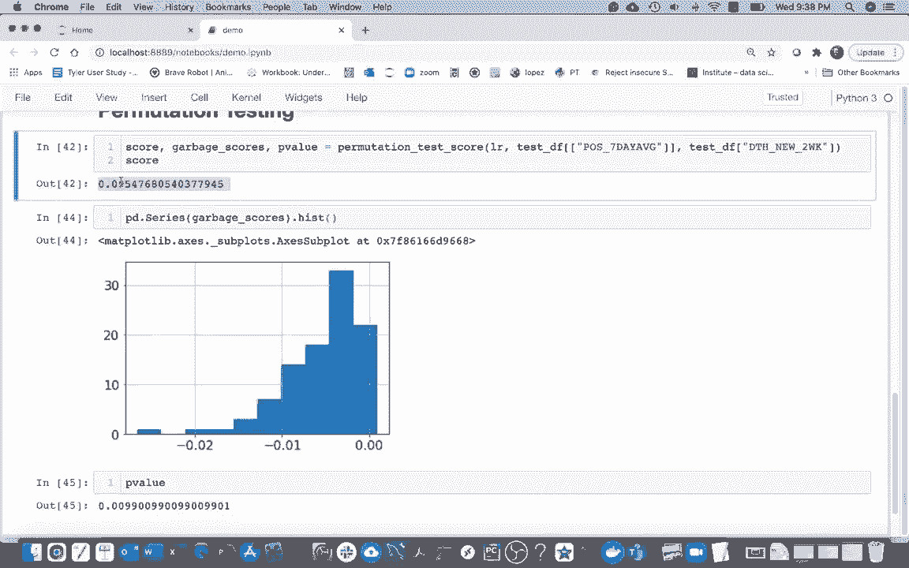

Let me head back here for another idea， so how do we deal with the noise。 we saw that when I kept doing it a bunch of times I was getting different scores and for that we're going to use as something called a cross Val。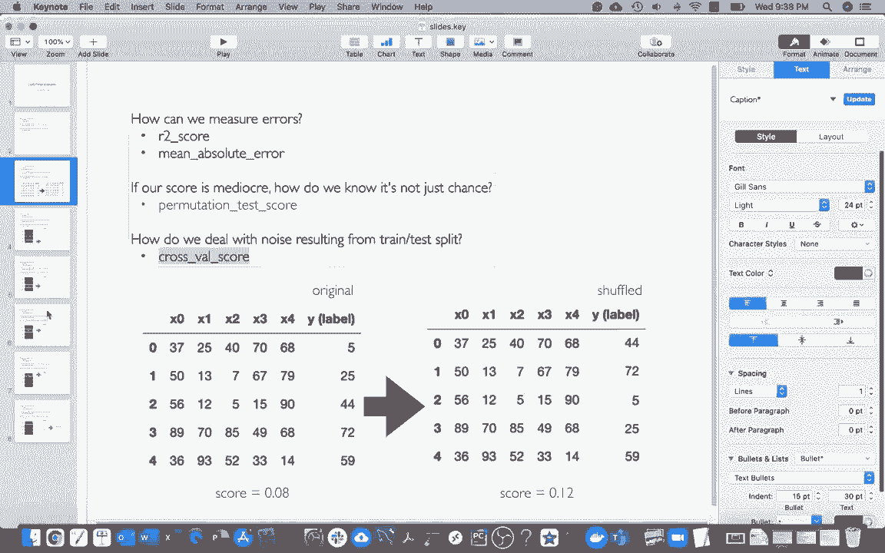

Cross validation score。 And And the way it' will work is I'm going splitlin my data instead of just having these train and tasks。 Im going split into four pieces。And then each of those four pieces are going to take turns being the test data。 so maybe first I'll train my data on these rows， and then I'll test it on this。

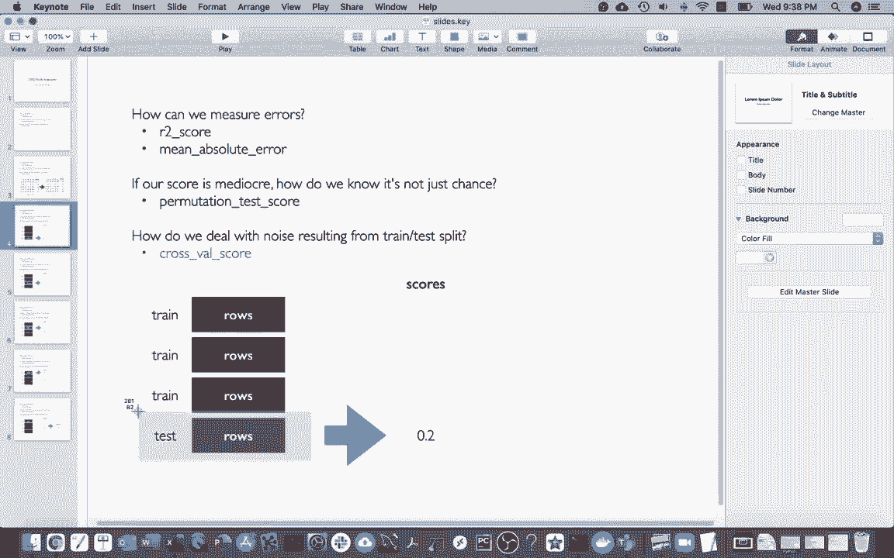

And then my model will get， let's say， a score of 0。2。And then I'll take a different chunk of the data， and each of these are called a fold of the data。 by the way， and so I'll train on those first， second and fourth pieces。So I get a model and then I evaluate on that test data set and let's say this time I get a little bit luckier and it's 0。

3， do it again， 01 again 0。2， and then I could take the average of these and that would be a more stable measurement of kind of how well my model does us not as。Its not kind of as vulnerable to what happens to go on the test or training data set is all the data at some point is in the test data。

Or the training data。 So I going head over here and and do this， right， So this is called。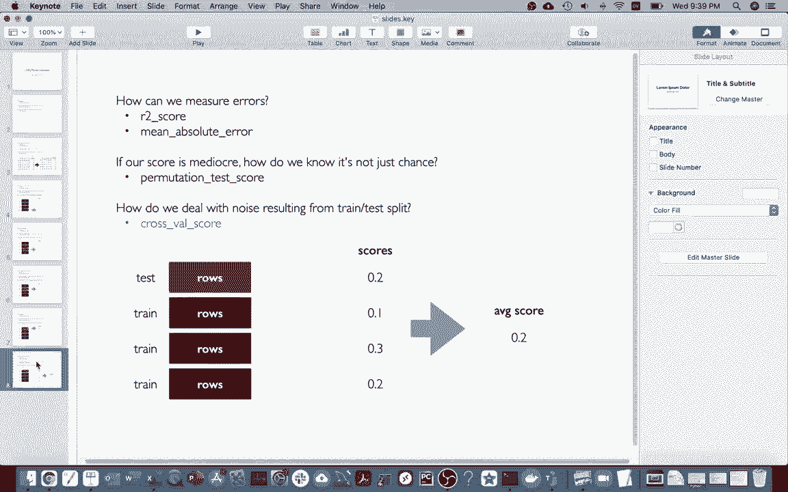

Cross validation。And let me call this thing so cross validation score。And what I have to pass in here， I pass in my estimator。And then I have to pass in my x values and then my y values。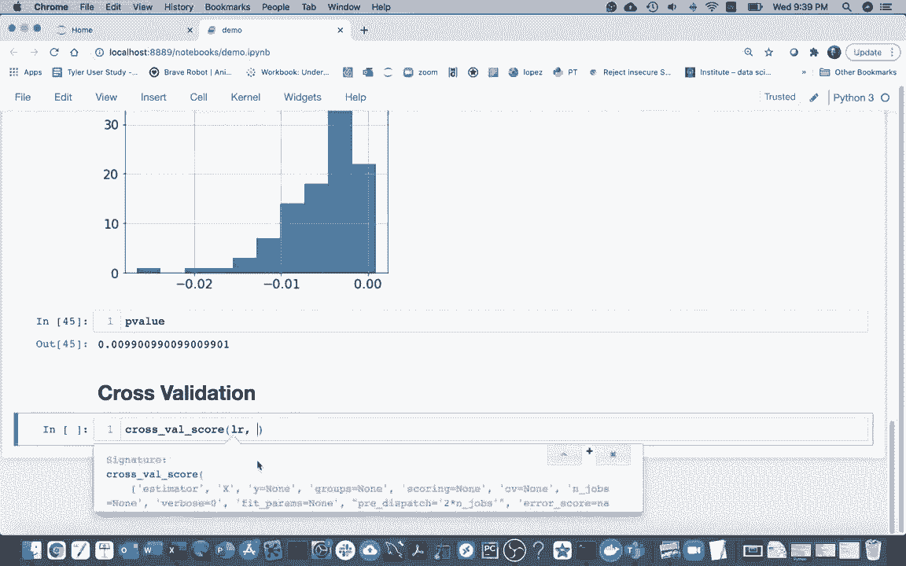

Right， so let me grab those things。So it's actually， I guess identical to this right here。 so I me grab my model， my x values and my y values。

And at this time， I just want to do it on all my data。 So can I say data frame。And then data frame and actually really what is kind of the best practices is just to that of the training data。And so I'm going to do that and then I get all these scores back right and the reason is that there were five folds by default so I can say you know in this picture right there's four here I see well by default there were five that's why I got five scores I can say I want 10 of them and I'd be fine I these 10 scores back and these times look like those numbers we were seeing earlier like 0。

27 0。17 another 0。27 is 0。304 right if I head back here and I just kind of run this thing a few times those are the kinds of numbers I'm getting out of it as I randomly split my train of my test。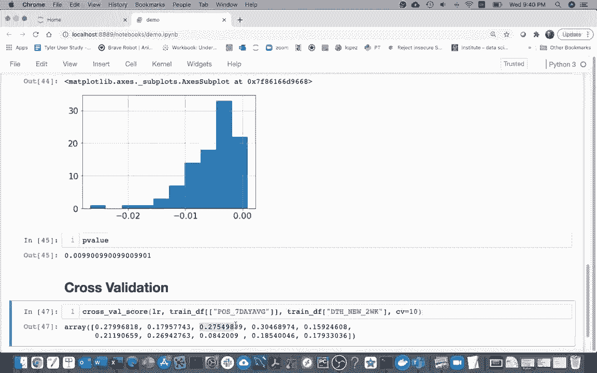

So why is this useful while I can have my scores here。And I can say a couple things I can say scores I mean。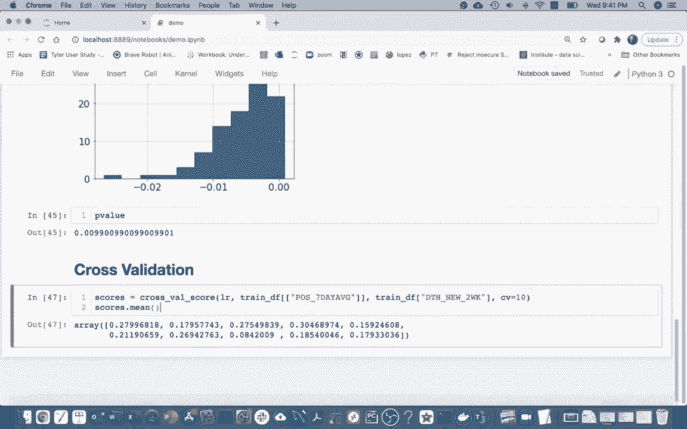

And so I can see while on average， R2 square R squared score is going to be 0。21。 but I could also get some sense of the variance， and that'll tell me how sensitive I am to what data happens to end off in the test or training data set。 and that probably depends how much on how much I have some outliers and how much outliers to。What happens with the scoring？Okay， so this will be the way we'll generally do it。

 And so one last thing， right， when I was。

Showing this picture here right， I kind of said， well， hey， I have all my data。 then I just split it up into train and test。

Why didn I use all my data here and the reason is that。Is that even though that would have been fine to do in this example what you're often going to be doing is you're going be trying to do a few different models and what you'll want to do is you'll want to do cross validation on each of the models and then you'll see well what one has the best score on average and you say well that one's the winner that's one where you use in the future。

And so there's this risk when you're doing that， let's say I evaluate 20 models。And pick the best one。 the best one probably did a little bit better than it should。 right。 if I do 20 models， some will just by luck， do better and some will do worse。 And so even though that's the right process to pick the best model I shouldn't throw brag about this cross validation score because it wasn't like I was just doing one model as in here。

 I doing many models。 So what I would do is I look at this cross validation score across each of my models。 pick the best one， And then finally what I go back and actually do my real test data which is still hanging out here。 and then that's what I would report is the kind of accuracy of my favorite chosen model。

