# 【双语字幕+资料下载】使用 Scikit-learn 进行机器学习，4小时实战视角刷新知识框架，初学者进阶必备！＜实战教程系列＞ - P8：8）混淆矩阵 - ShowMeAI - BV16u41127nr

Hello in this video I may be talking a little bit about how we can score our models on our training data and scoring them is going to involve learning some new metrics and terminology。 it turns out there's different kinds of errors and if sometimes well if we'll care more about one kind of error than another。

 we might want to use different metrics to deal with that taste。So for this I have some really simple dummy data Basically I have this data frame that has an x column and the x column is number and then the y column is a Boolean and it's true whenever x is positive and false when it's negative so not much data there and just for simplicity I'm trying to break in into the first half in the second half I wouldn't normally do this right because maybe the data is not shuffled and maybe I'm trying to getting very different data in the two half so this is just trying for an example there I have it I have my training data。

And my test data down here and if I want to try to figure out what is the relationship between Y and x。And then measure the model's understanding of that relationship I'm going to use some sort of scoring function right I'm going to do this whole logistic regression remember this is not really a regression。

 it's actually a class ofifier right because I have this categorical data that I'm trying to predict。And so I'm going to train one of those and then I want to score it。First step。 right is I'm going to say LR equals logistic regression。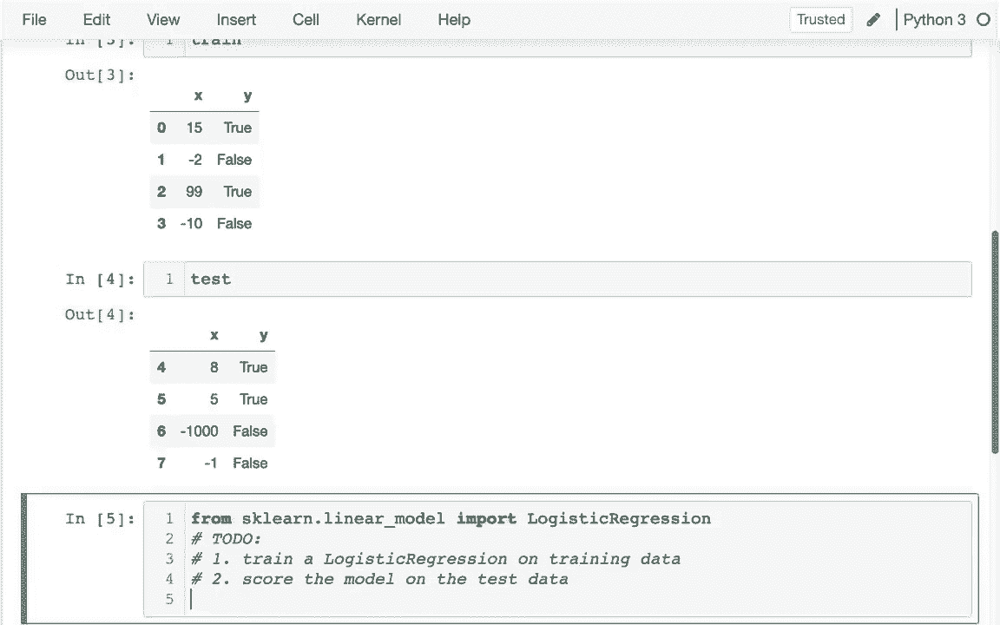

Right， and then we say Lr。t fit。And when I'm fitting。Let me I should just try to run this。

Once I run， I can actually set shift tab and into a hint。

I'm have to give it the X data and the y data， and so I'm going to give it both those things from the training data first。

And so I'm going to say training data and then the columns I want are just acts。And then other thing I'm trying to predict is just the why man you just like that。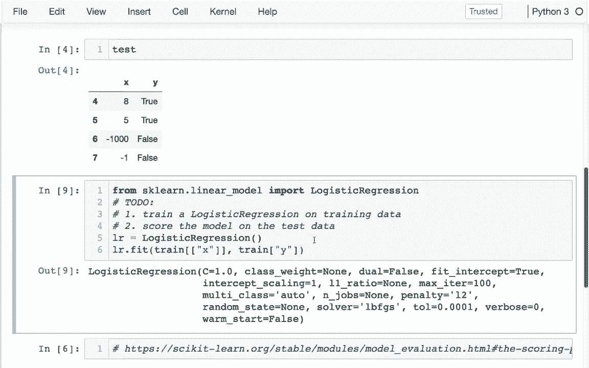

And then after I do that， I can basically。I run a command that's very similar and that command is score。 I can evaluate how well it does。The test data。And I get 0。75。 So what is this score function doing。 It turns out it's a shortcut and I'm just going to show you a little bit in the documentation what it's doing。 I head over here I see that the score function。

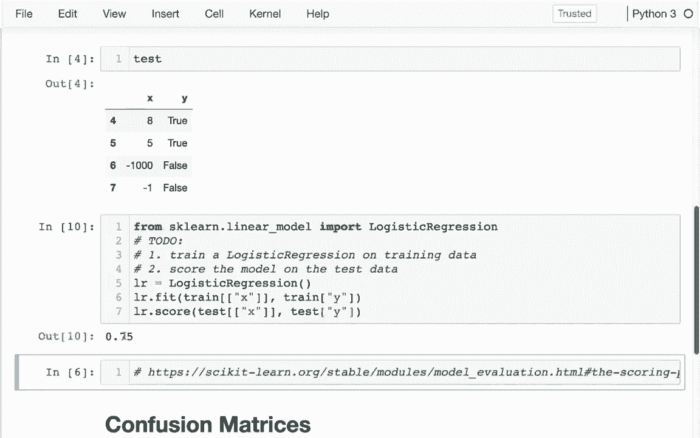

Or the logistic regression is giving me the mean accuracy。 And if you look at other estimators。 they might be doing other kinds of using other metrics for the scoring。Okay so mean accuracy so that's the default here but it turns out there's lots of different metrics we could use and so if I go to the metrics page for PsyKt learn I can see that hey there's a whole bunch of metrics here related to classification clustering which we haven't talked about yet and then a whole bunch related to regression as well and so the one I'm using right now the default is that accuracy score right you saw that how it's saying here that we're just getting the accuracy accuracy is very simple it's well what percentage of the times？

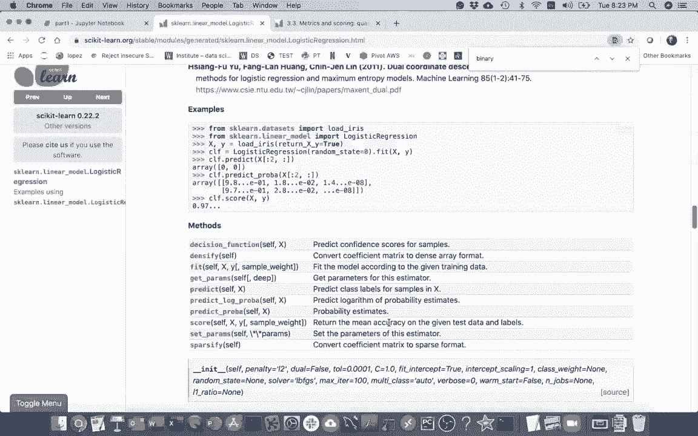

Did we get it right and so I certainly could have instead of using that score function I could have used this one myself and I think that's a good thing to do right now because once you understand how to use this manually without the shortcut then we'll understand how to use these other functions as well Okay so I can see this is my metrics submodule and so when I head back here I'm going to do this I'm going to say。

And this was that page I was just on。I am going to say， from。From SK learn metrics。Import。

Accuracy score。Okay， and let me just run that and what I call accuracy score。I hit shift tab here。 Basically what I'm doing is I'm saying， well， what are the true values？

And what did my model predict。Okay and so there different ways I could do that。 I mean I could say well， the true values are A and B， but I actually predicted A and C。 and it turns out if I do that well I're just 50% right right so this was my actual values and my predicted values。So let me actually try to get these from up above， right so before I was trying this score thing。

And then I was kind of giving my x values and my y values， and so I'm going to pull pieces from this。The first piece I'm going to do is I'm going to actually figure out what the predicted values are。So those are going to be the predicted values I actually have to call predict here instead of score right when I'm predicting。 I'm not giving it any y values right predict tells me what the y values are。

And and then I also have to have my actual right， my actual。Was just the second piece from before。On that column。So maybe actually let me just do this， I'm going to say。Let me look at the actual values and the predicted values。As a last。Okay。 and I can see actual we're true， true， false， false。But I'm actually getting true， false， false。

 false。 And so the second one is the error， right， So I'm going be wrong 25% of the time。 And so accuracy is actually going to be 70。5%， which is what we saw before and we're going to see it here too。 when we actually pass in。These two things I pass in the actual values and those predicted values。I not get that at 75%。

Okay， now so that works fine but there's going to be cases where we don't want to just know how often we're right。 but we want to know about you know about what kind of mistakes we're making right so for example。 let's imagine different things that this Y column might be let's say that this Y column means it's a good investment。

Maybe it's for a stock or something。 I don't need to know about every good investment。 but if I have some system that kind of tells me like hey these are some good investments and it's always right and it doesn't tell me about every good investment that's a pretty good system in contrast。

 maybe this is telling me I don't know is somebody contagious for CoVd-19 or whatever。 right And in that case， it's much safer to make the mistake of saying they are contagious even though they're not。 so there's different kinds of errors， false positives， the false negatives。 And so there's a lot of metrics based on that And the simplest place to start is with something called a confusion matrix and a confusion matrix。

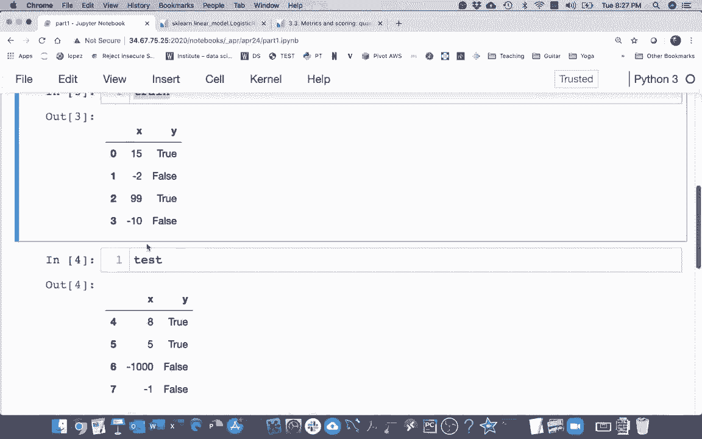

Shows the categories that things actually are and then how they mistakenly get classified as other things。😊。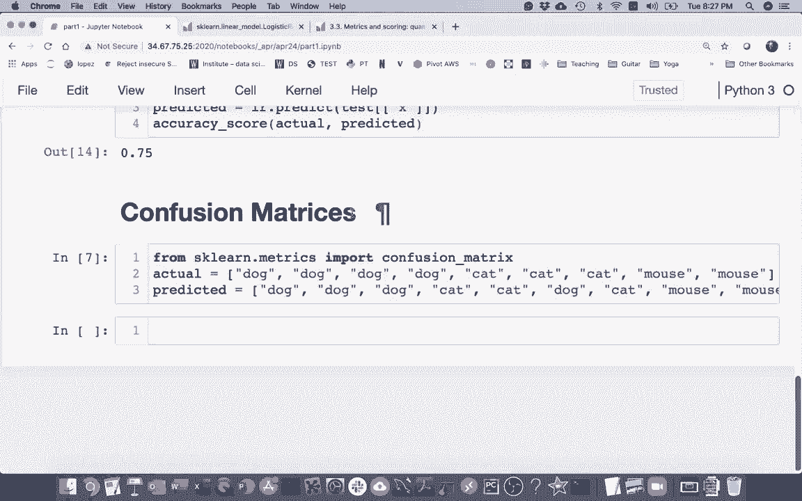

And so just like before， just like we have an actual a predicted list。 and we have a confusion matrix we're going to do the same thing。So imagine I had pictures of animals and you， I had four dogs， three cats and two mice。And but then I have some machine learning system that's looking at those pictures。

And as maybe predicting these other things。What I could do is I could read a confusion matrix。Using Psyit learn， right， this is also under metrics just like accuracy score。And so I can create one of these。 And and just like with the accuracy score。 I can put the true values and then the predicted values or sometimes I I say actual。

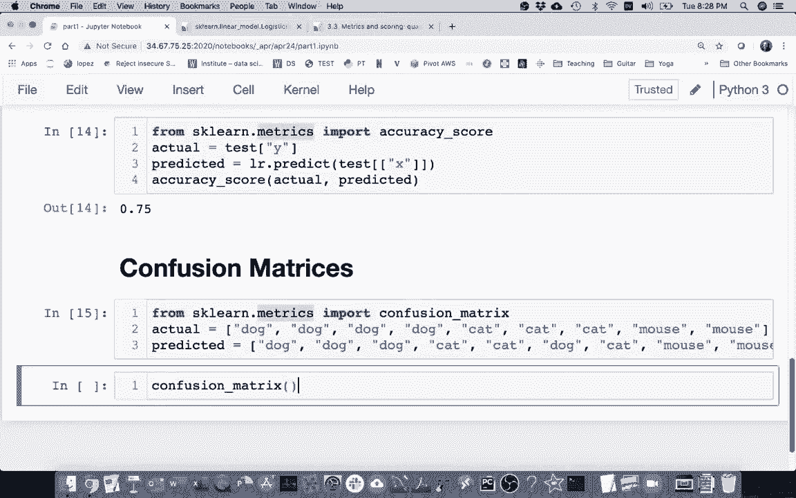

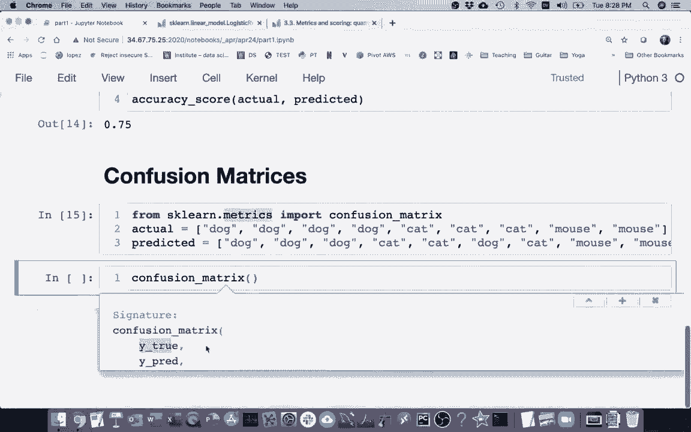

And predicted。And， and this is a little bit confusing， because。Each one of these values is kind of showing us。How many categories fall into like a specific actual category in a predicted category。And it's not really clear to line it up， right， well is this first wrong dog or is it cat。 And so what people will often do right is that they'll say labels。Like this。

And just to control the order。 So for example， I want to say like at a dog。The mouse， just like that。And then if I pass in these labels。It's going to be a little bit different， right。 whereas if I say dog。You can see these numbers switched a little and another reason for this beside just controlling the order。 so it makes sense is that I could， you know maybe there's things that I know exist but didn't even show up in the data right there's no horses。

 right？

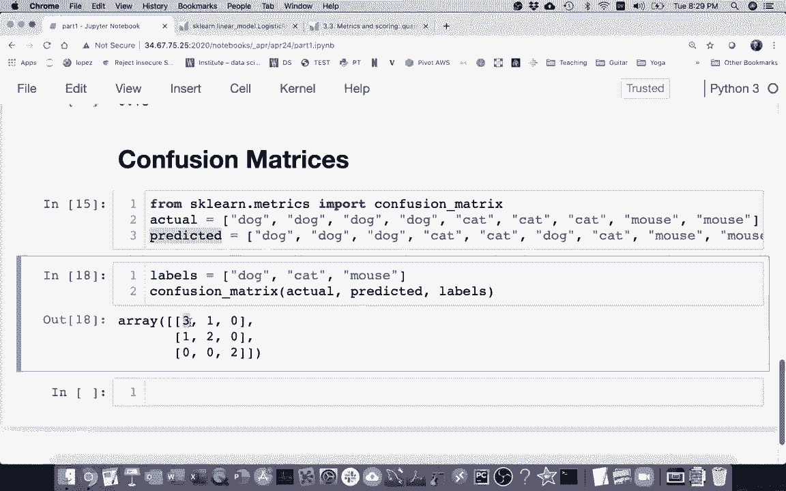

So， so let me actually。I'm really trying to talk about what these numbers mean and I think it'll be a little easier to put in a data frame and I'm going to put this in a confusion matrix here。And now I me to put this in a data frame。A PD data frame。Infusion matrix。

 And then when I'm printing a data frame from this， both the index and columnm labels。Are going to be the same right I'm going to have。E it just be like this。

And and so when I'm looking at this confusion matrix， what does it mean。 So the row means what it actually is。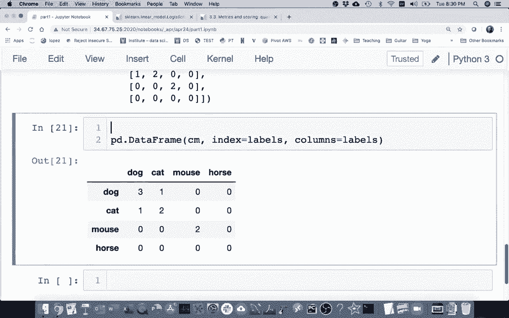

And the column is going to be what it got。Classified as so I can see in this。 right that there's four dogs。And of those four dogs， it correctly classified three of them as dogs。But one of the dogs was mistakenly identified as a cat。Okay。 it looks like there are three cats in the system。 Two of them were correctly identified as cats。

And one was considered a dog。And then I can see other things here like well the system's really good at mice right it always correctly calls the mice and doesn't mix them up with anything and so this is useful right when I have a this time matrix I can see what ways the classifier is confused since it's called you a confusion matrix right showing me how the model is confused。

All right， so hopefully that's helpful now it's very common that we'll be having these confusion matrices。😊。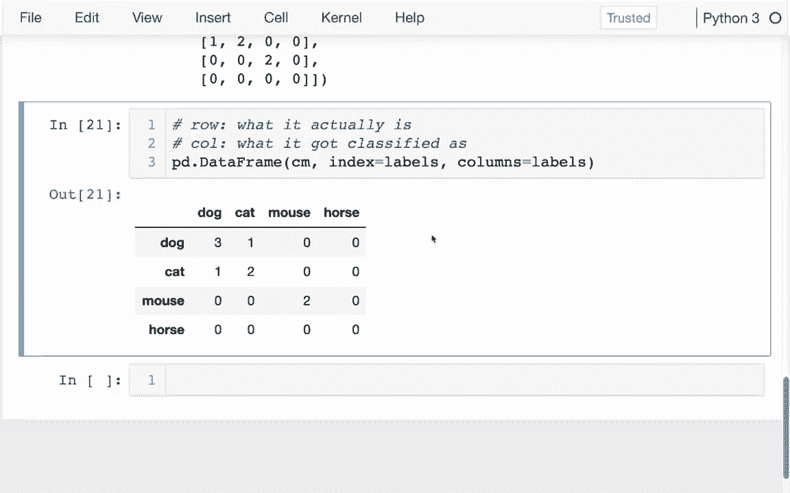

where the class is instead of being you know different animals。 it might just be true and false that would be for a binary class of fire where I just have these true and false values and so let me actually go back to what I had before right when I was computing this accuracy score。

And let me create a confusion matrix here， and maybe I just may copy some of this。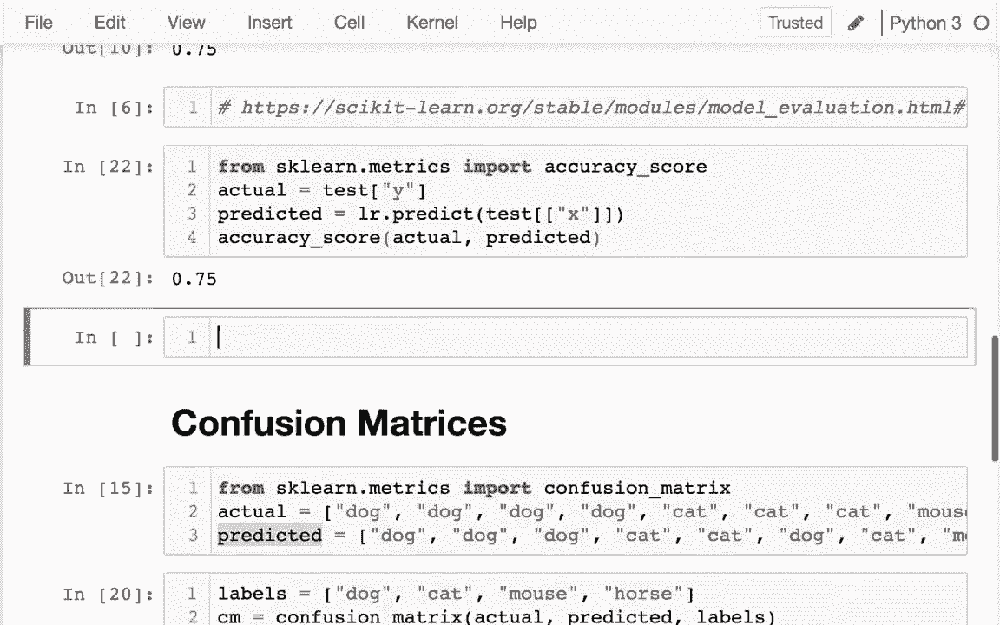

Out here， as you might grab this。

And in this case， the labels。Are false and true。

And it doesn't do anything okay， so I have these different categories and just like before。 I think it's going to be helpful to put this in a data frame。

Right。

I'm going to put a data frame here just like that。And so here again。 the row is telling me what it actually is and then the column is telling me how those got classified and ideally in a perfect world everything will be on the diagonal right that means there were no mistakes made there was no confusion。

Okay， so I have that and it turns out there are special names for each of these four values。 and so I'm just going to go through this quickly。

呃。The top left one， actually， let's start with the bottom right， so if I go to I go to。 let me put this in a date actual data frame。The last to my confusion matrix is a data frame now。

Okay， and and I go， I love。1，1， that's going to be that bottom right。

That's going to be called through。Positives in your practice kind of remembering these words are important terminology。 so I'm going to do this and then if I had been smart with this example。 I would have made sure all these numbers were different so we could more easily identify。RightAnd another number is on the top left。And those are true negatives。 right。

 So true means that that the model is doing the correct thing， Right in this case， I have。one。 you know what I should really do is I should do it like this。Through positives。Throughru negatives。 right， people often abbreviate it this way。And then there's the mistakes， right。 the mistakes are false， right， so I'm going to say false。And false。

And so what are these called the false positives？All， where are those。 So false positive means that。This column right and so it should be false right that's what it actually is in the data。 but it gets classified as true right so what does that mean that means I'm in row0 column1。And then up I sit down here， right？Sometimes。It actually is true， but the model says it's false。

 That's a false negative。

And fall negative and just like that so these are the four different cases I'd have and a lot of the statistics we're going be looking at into the next video are combinations of these and I'll be kind of talking more about why those are meaningful。