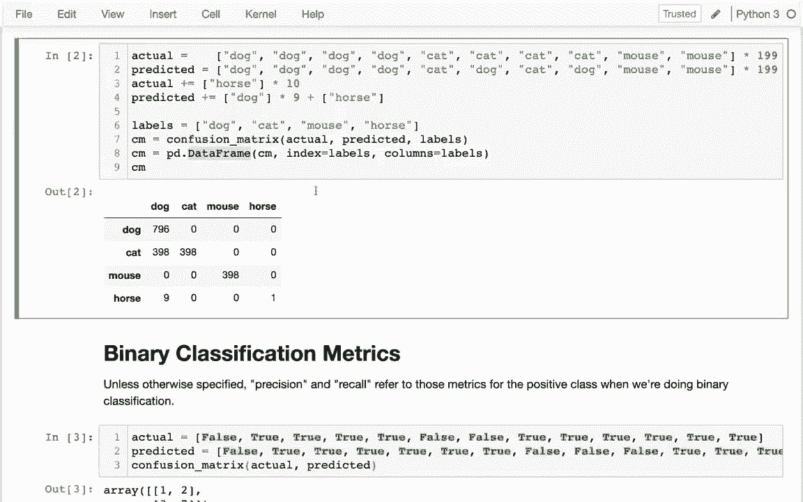
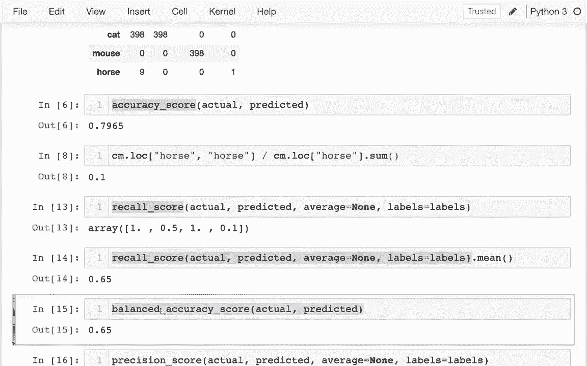
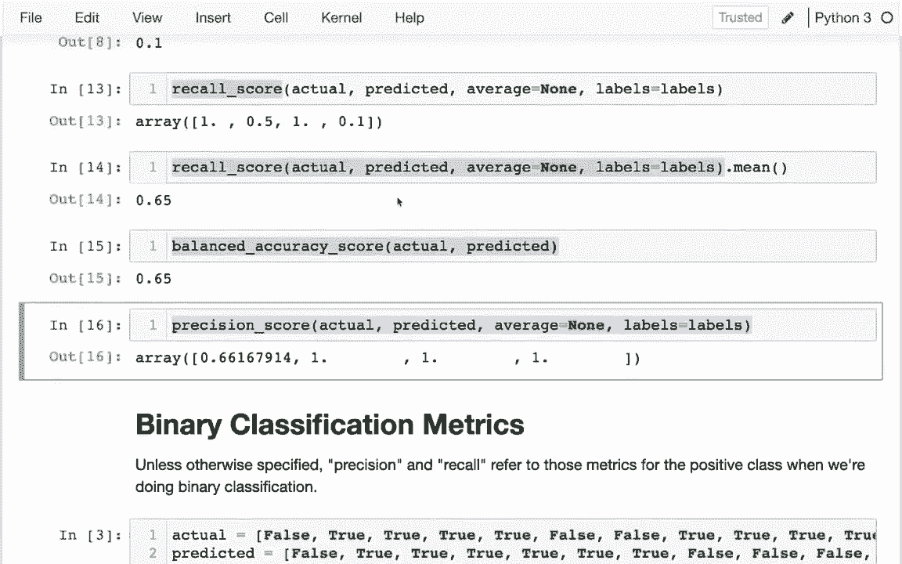
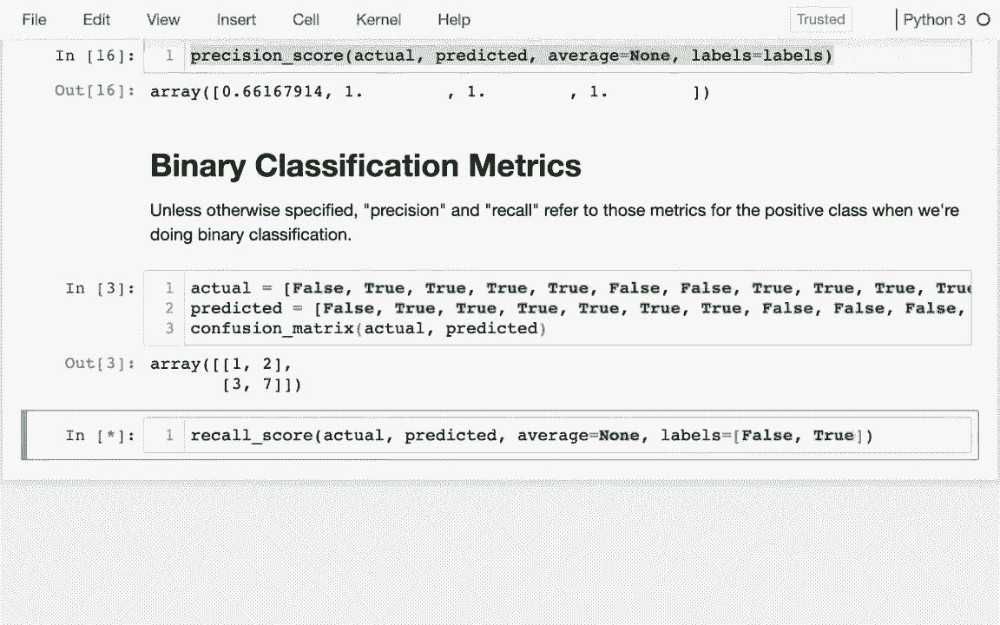
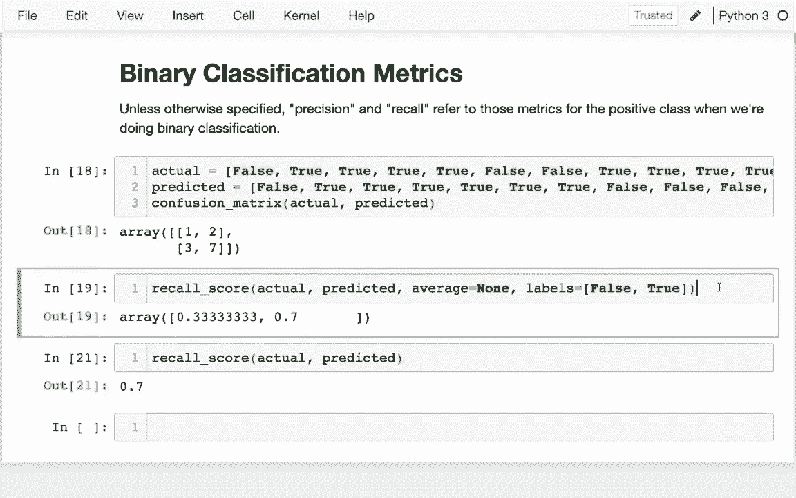

# 【双语字幕+资料下载】使用 Scikit-learn 进行机器学习，4小时实战视角刷新知识框架，初学者进阶必备！＜实战教程系列＞ - P9：9）召回率和精度 - ShowMeAI - BV16u41127nr

In the last video we learned a little bit about confusion matrices and confusion matrices give you the whole picture。

 but often we want to summarize things in just one or two numbers and one of those most important numbers which we've already seen is accuracy。

Accuracy tells us what percentage of the time our model is crap。But when it gets wrong。

 it doesn't really tell us what kind of mistakes are being made。

 and so we're going to be learning two metrics， recall and precision。

 which really you can think of as accuracy on a subset of the data right so there's still going to be fractions between zero and1 but they'll kind of help us pinpoint where the mistakes are actually being made。

Okay， so to review， here's a confusion matrix。Along the rows， I have what the data actually is。

 and along the columns I have what the model thinks it is。

And so right now I have zeros in all these places。But if I were to see an actual mouse。

And the model predicted that it's a mouse， then I would go to the mouse row in the mouse column and increment that number by one。

And that's any time we're incring numbers on the diagonal or confusion matrix。Oh。

 that means we made the right decision。Here's an example of a wrong decision if our model took a look at that picture。

 which is clearly a dog。It needs in need of some grooming and it predicted as a cat。

 then we go to the dog grow because it's actually a dog and the cat column because that's what was predicted and increment that and so we might do this over our whole data set and we have a bunch of numbers there。

Now from that we might want to figure out what the accuracy is and the accuracy is well what percentage of the times where we correct and so the way I think of that is adding up all the numbers on that diagonal。

 that's how many we got correct and then dividing by all the numbers in the matrix so then well look at8 over 10 or 80% and some observations here is that you know this number is a fraction of kind of a subset over a larger amount iss always be going to be between zero and1 and the good number is always in the numerator or accuracy so one is the best possible number and so precision and recall have those same properties but they're going to be a line different subsets of the matrix right we aren't going to be taking the whole diagonal divided by the whole whole matrix。

So precision and recall， it turns out we can actually have these metrics。For each class， right。

 So I actually I have。Six different metrics here， I have dog recall cat recall mouse recall and then similar dog precision cat precision and mouse precision and's interesting I' look at a few of these so when I'm asking well what does a cat recall。

 what I want to know is when we actually have a cat what percentage of the time is the model right？

And so since I'm asking about what is actually the case。

 what I'm really doing is I'm dividing by the sum of numbers in a row。

 right because each row represents what。What the data actually is。

In this case right so the denominator will be the sum of the row and the numerator will just be a single number which is at cat how many times do we actually call a cat a cat in this case we'll get2 over4 and so this is actually one easier way to remember recall versus precision is because recall has an R and row also has an R。

If I'm looking at dog recall， okay so when we actually have a dog。

 what percentage of the time is a model right， I'm just looking at that top dog row and I'm dividing dog dog by the sum of everything else and in this case we always get it right when we see a dog right so4 over4 100% dog recall。

The precision questions are asking something a little bit different what we're asking here is say for dog precision when the model predicts that it's a dog。

 what percentage of the time is it right and so when we're kind of looking at all the predictions now we're talking about columns right because each prediction is along a column in this case we're dividing dog dog top left。

By the dog column， I have all the different things we predict when we get four over sex。

And then similarly for cat precision， we're dividing cat cat by that cat column we see that there's perfect precision here and hopefully what you can see is that they are making different kinds of mistakes right for the cat we're great on precision but we have a recall problem for the dog it's the opposite we have perfect recall but poorer precision and so these kind of two metrics that are kind of showing an error right cat recall and dog precision are two ways of looking at that same problem sometimes we see a cat and we think it's a dog。

The opposite is not true。I'm not trying to talk about it more here but I just want to give you some exposure to it。

 often people try to reduce these numbers down to a single score。

 for example there's something popular machine learning called F1 score and a lot of these kind of simple scores are just combinations of these other metrics like precision and recall so these are kind of building blocks for other metrics。

Let me head over and write some code for this。To Jupyter notebook block。🤧。And and in this case。

I have my confusion matrix converted to a data frame and I'm showing it down here。

Like so I'm kind of similar to one in the slides， but the numbers are larger now and I also have a horse。

And and so the diagonal is good right， So I can see this is actually not doing too bad， right。

 I have a lot of large numbers on the diagonal。I see that there's a horse problem。When I see a horse。

It actually 90% of the time thinks that's a dog。 The other problem I have。

 right I big number that's not of that diagonal is right here。

About half of the cats it seas get misclassified as dogs。

Okay that's a problem so what I'm going to do is I'm going look at I've already produced this confusion matrix。

 I want to look at things like accuracy score， recall score precision score。

 then finally this new metric balanced score that I'll introduce。😊，So first。

 let's take a look at the accuracy score。So I'm going to run accuracy score。

And and I need to feed it in the actual values and then the predicted value。 So I'll do that actual。

And predicted， these are the two lists that I used。To construct my confusion matrix。And I see that。

 oh， let me just run this again。And I see that the accuracy is 78。 well， it's about 80%。

So that seems pretty good and the key thing to note here right is that when we have all these different classes it might seem like we're doing good overall。

 but there might be cases where we are making a lot of mistakes right so for example。

 when we see a cat， we end up being wrong half of the time worse when we see a horse。

 we're wrong 90% of the time and so these other metrics are going to help us dig again and actually identify that。

Okay， so let's say I wanted to look at recall for the horse。

 which I'm expecting to be 10% when I see a horse。We only know a 10% of the time。

 So one way I could do that is I could。And my confusion matrix。I could get the horse。Worse value。

 right from that bottom right。And and I could divide it by。

The sum of all the values in the horse row。 right， So I could do that。

 And I get 10% just as I expected， right， The shorter way to do that would be to use the。

This precision score function that's actually built then to ask K learnn， right。

 Im going call this thing。And so I have the true values and the predicted values。

 so I'll say actual predicted。And I actually get an error here。

And it's complaining about something called multiclass versus binary。

These metrics are kind of set up for the simple cases where our two classes are just false and true。

 as opposed to four cases like dog cat Mo horse。And so I have to clean that up a little bit。

 And and the way I may do that is。Oh， well， first off。

Let me expand this a little bit I have to change this average value。

 so there's different ways to kind of summarize information。I understand set average to none。

And I eher know it some。Unlike that。 And then what it's doing is it's actually giving me four recalls。

 one for each of these classifications。 Now the order might not be the same as up here。

 And so I'm actually going to pass in these labels as well to make sure that that I can kind of actually compare these numbers to the different values right。

 So what I see here is that in terms of actually I want to do recall first， I'm sorry。

I to recall first and so for this recall right going row by row and what I see is that recall for the dog it is perfect I see a dog。

 the model is being recognized as a dog， it's also perfect for mice right if it sees a mouse it's to recognize it as a mouse。

For cats， right if it sees a cat 50， 50 on whether it will correctly identify it， and then for horse。

 only a 10% chance said it correctly identifies it。Okay， those are my four recall numbers。

 sometimes what I'll want to do。Is all want to kind of see how I'm doing overall by taking an average of those。

 And I get 65% in that taste。 And it turns out there is a special name for this average of recall scores。

 and that special name is the balanced accuracy score。 right。

 So before this accuracy score was saying， hey， we're doing 80%。 But now I actually do this balanced。

Accuracy score， it's only 65% much worse and in some ways this is more meaningful。

 the only reason we were very accurate before is we were seeing very few horses even though our model is terrible with horses。

 we could just go and score is there are not many horses in the model right so when we're using these balance metrics it' trying to take into account for that is I say even though we have more dogs。

Then anything else really， we're going consider these four classes equally important in terms of coming up with our score。

 this will be a great one to use if you have a lot of imbalance。In your data set right。

 and accuracy can be a little bit misleading in that case。Okay， so that was the recall score。

 let me similarly。So this， I'm going to actually do the precision。

 which I guess I was already doing oh。Earlier and avertently。What happened there。There we go。

 So I'm going to paste that。 and so that I'm going to get this precision score。

And now I see something different， right， I see that actually we do perfect。On everything。

 except the dog。And why is that？When I'm talking about precision。

 I'm really going column by column and what I actually see here is great， right。

 I except on the diagonal， I only have zeros in each of these columns。

 And so that means if this model is predicting a cat， a mouse or a horse。

 it's probably right only when it's predicting a dog is there a good chance that it's making a mistake right in that case。

 you know， only two thirds chance that it's actually a dog right So this model likes to predict dogs a lot。

😊，If it predicts something else， it's sure it predicts a dog it only trying of two/ third， sure。

All right， so that's the we talk about accuracy。Recall balance accuracy。

 which is an average of the recalls and then precision。

One last thing I want to talk about is binary classification and so for binary classifications instead of cat。

 dog， mouse， we have just false and true。

And and so I'm computing the confusion matrix here for that。 and and if I want to， I can。

I can compute these same metrics like I did before， so for example if I do a recall score。

Down here， I can pass in， you know， false and true for my labels。

And。Why is that unhappy， maybe because I didn't run this yet， there we go。

 I can run that and and it's telling me， okay， row by row in that first row。

one third is track。 right， So I then the second one。

70% is correct right those are my two recall scores so I can do that just like before。

 but it turns out when we're dealing with binary classification metrics。

People will often just talk about predicted， I'm sorry。

 they'll just talk about recall and precision without specifying what class they mean and when they're doing that。

What they're talking about is the positive class， right so if I just talk about。Recall in general。

 oh I don't want that I'm just trying to talk about recall in general looks I'm talking about that positive class and the same thing for precision and actually this is probably the majority of the cases you'll see precision and recall use as kind of this special case。

Where I'm having a binary classifier， so just know that when we're doing that。

 we're talking about the positive class。

