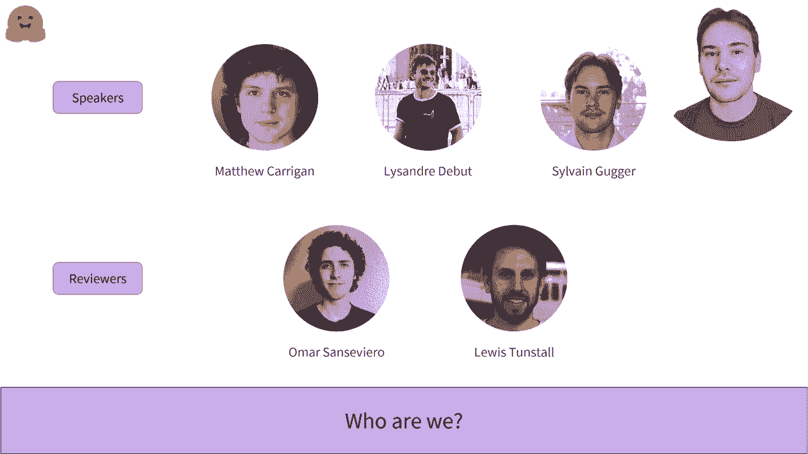

# 【双语字幕+资料下载】官方教程来了！5 位 Hugging Face 工程师带你了解 Transformers 原理细节及 NLP 任务应用！＜官方教程系列＞ - P1：L1.1 - 欢迎来到 Hugging Face 课程 - ShowMeAI - BV1Jm4y1X7UL

欢迎来到 Aing F 课程。该课程旨在教你关于 Uface 生态系统的所有知识。我们将其用作 Se Me 中心，以及开源库。以下是目录。正如你所见，课程分为三个部分，难度逐渐增加。目前，只有第一部分已发布。

这将教你如何使用变换器模型的基础知识，如何在自己的数据集上微调，并将结果分享给社区。我们正在积极工作于接下来的两个部分。我们心中的大致时间线是计划在 2021 年秋季发布第二部分，最后一部分在 2021 年底和 2022 年初发布。希望这只是预计，所以不要准备得太早。

第一章不需要技术知识，是了解迁移模型能做什么以及它们如何对你或你的公司有用的良好介绍。接下来的几章需要良好的 Python 知识，以及基本的机器学习和深度学习知识。

如果你不知道训练集和验证集是什么，或者什么是梯度下降，你应该看看一些入门课程，比如由深度学习研究院发布的课程。最好如果你对某个深度学习框架（如 PyTorch 或 TensorFlow）有一些基础知识。这门课程中介绍的每一部分材料在这两个框架中都有对应版本。

所以我们能够选择你最熟悉的那一个。这是开发本课程的团队。现在我将让每位讲者简要自我介绍。

嗨，我叫马修，我是 Hugging Face 的机器学习工程师。我在开源团队工作，负责维护那里的 TensorFlow 代码。之前，我在 Parsley 担任机器学习工程师，该公司最近被 Auto 收购。在那之前，我是在爱尔兰都柏林三一学院的博士后研究员，研究计算遗传学和视网膜疾病。

😊，嗨，我是亚历山大，我是 Hugging Face 的机器工程师。我专门在开源团队工作。我在 Hugging Face 工作了几年，和我的团队成员一起开发了本课程中大部分工具。😊，嗨，我是西尔万，我是 TechFase 的研究工程师，也是 Transformers 库的主要维护者之一。之前，我在 FAA AI 工作，帮助开发 FastAI 库以及在线 M。

在此之前，我是一名在法国教授数学和计算机科学的老师。是的。
