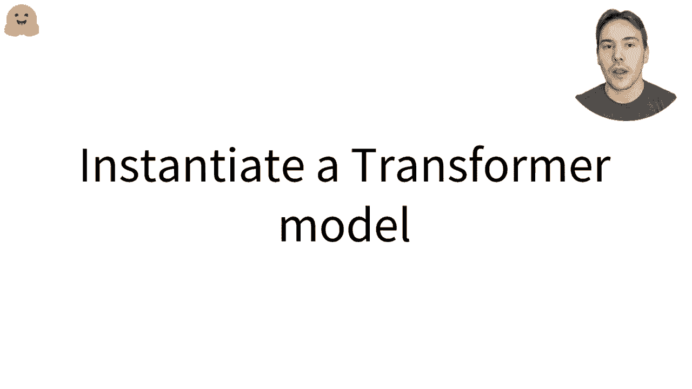
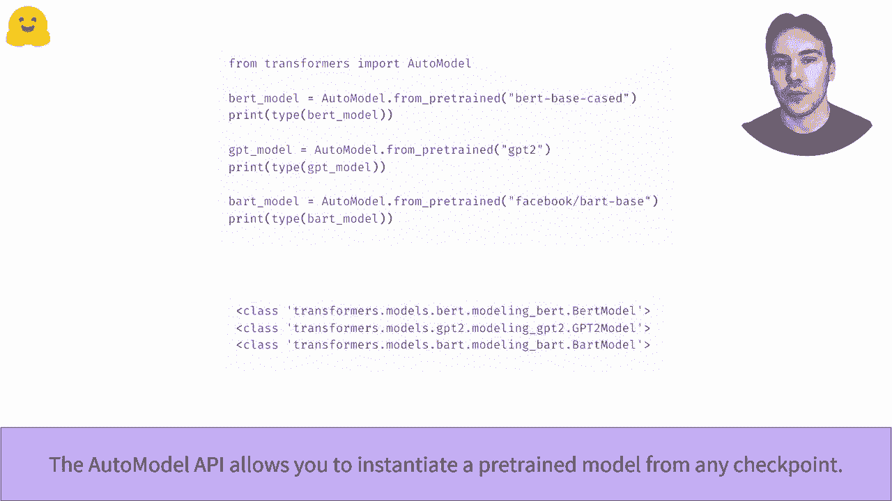
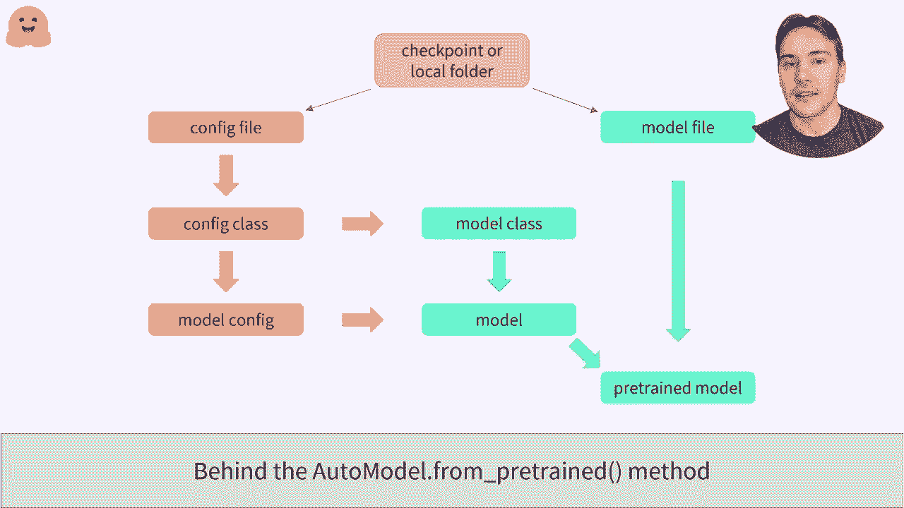
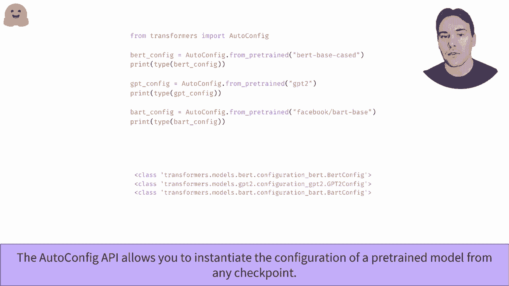
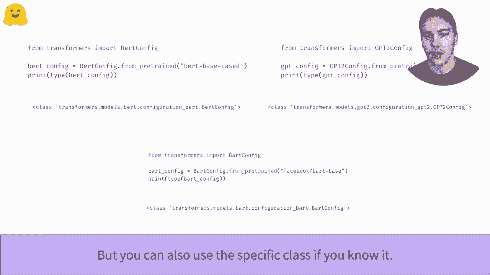
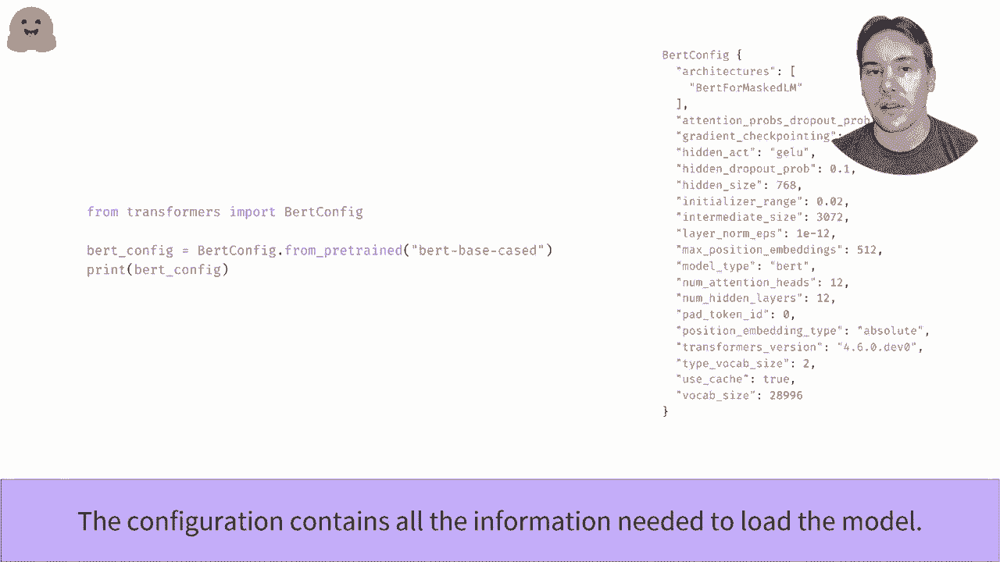
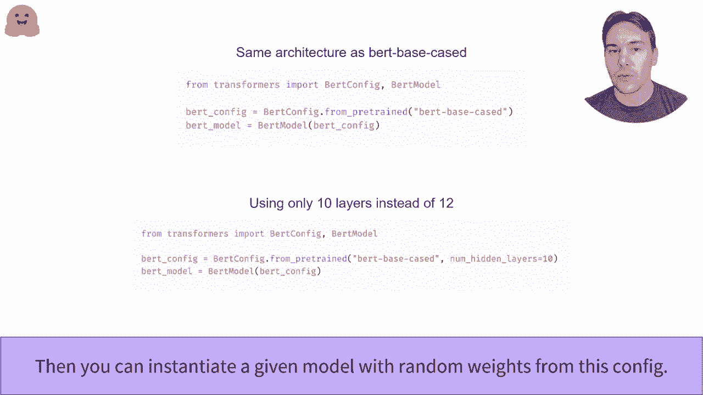
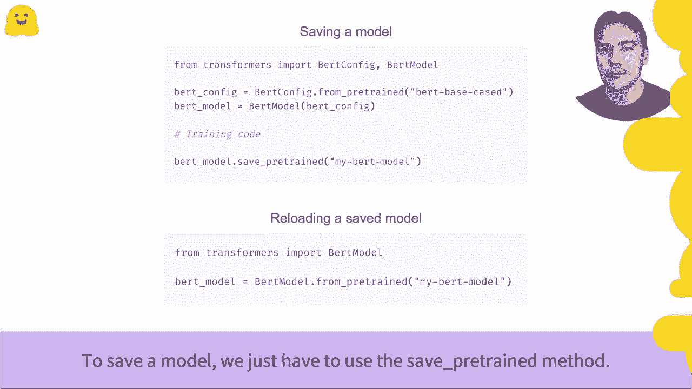

# 【双语字幕+资料下载】官方教程来啦！5位 Hugging Face 工程师带你了解 Transformers 原理细节及NLP任务应用！＜官方教程系列＞ - P10：L2.3- 实例化transformer模型(PyTorch) - ShowMeAI - BV1Jm4y1X7UL

How to instantiate a transforms model。In this video。 we'll look at how we can create and use the model from the Transformers library。

As we seen before， the Automodal class allows you to instantiate a portrayed model from any checkpoint on the I face app。It will pick the right model class from the library to instant shade the proper architecture and load the weight of the preed model inside。

As we can see， when given a bird checkpoint， we end up with a bird model and similarly for GPT2 or part。

Beyond the scenes， this API can take the name of a checkpoint on the earth。 in which case it will download and cache the configuration file as well as the model weights file。You can also specify the path to a local folder that contains a valid configuration file and a model of wastes file。To instantiate the between model， the Automodal API will first open the configuration file to look at the configuration class that should be used。

The configuration class depends on the type of the model， B， GPT2 or Bt， for instance。Once it has a proper configuration class， it can instantiate that configuration。 which is a blueprint to know how to create the model。It also uses this configuration class to find the proper model class。

Which is when combined with the loaded configuration to load the model。Its model is not yet a pro model， as it has just been initialized with randomdom weights。The last step is to load the weight from the model file inside this model。

To easily load the configuration of a model from any checkpoint or a folder containing the configuration file。 we can use the autoconfig class。Like the Automod class。 it will pick the right configuration class from the library。

We can also use a specific class corresponding to a checkpoint that we'll need to change your code each time we want to try a different model architecture。

As we said before， the configuration of a model is a blueprint that contains all the information necessary to create the model architecture。For instance， the bird model associated with the birth based case checkpoint has 12 layers。 a hidden side of 768。And the vocabulary size of 28996。

Once we add the configuration， we can create a model that has the same architecture as a checkpoint。 but is randomly initialized。We can vet training it from scratch like any by doch model。We can also change any part of the configuration by using keyword arguments。So the one snippet of code instant shades a randomly initialized layout model with 10 layers instead of 12。

Saving a model once its trend off fine tune is very easy。We just have to use the Sa between method。Here， the model will be saved in a folder named My beltt model inside the current working directory。Such a model can then be re using the from between method。To learn how to easily approach this model to the web， check out the push to video。

。