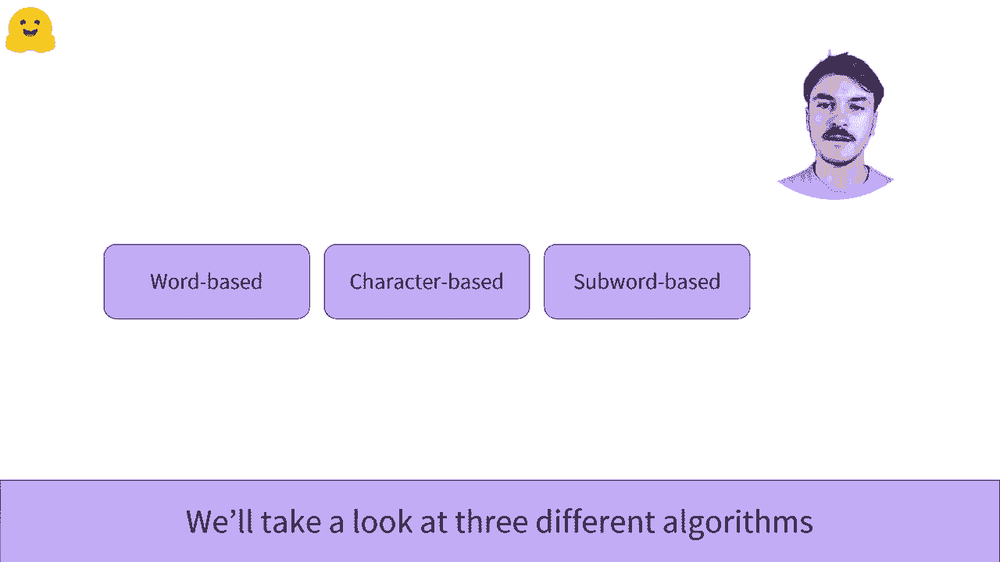
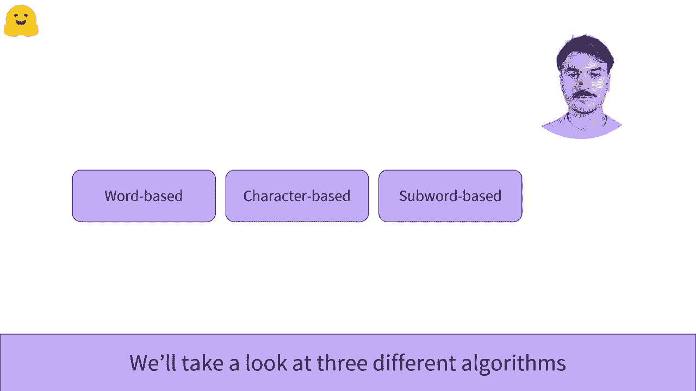

# 【双语字幕+资料下载】官方教程来啦！5位 Hugging Face 工程师带你了解 Transformers 原理细节及 NLP 任务应用！＜官方教程系列＞ - P12：L2.5 - Tokenizers 分词器概述 - ShowMeAI - BV1Jm4y1X7UL

在接下来的几段视频中，我们将查看令牌。在自然语言处理领域，我们处理的大部分数据由原始文本组成。然而，机器学习模型无法以原始形式读取或理解文本。它们只能处理数字。因此，分词器的目标是将文本转换为数字。

有几种可能的方法来进行这种转换，目标是找到最有意义的表示。我们将查看三种不同的组织算法。我们将逐一进行比较。因此，我们建议你按以下顺序观看视频。首先，基于词的。

然后是基于字符的，最后是基于子词的。😊！

。

