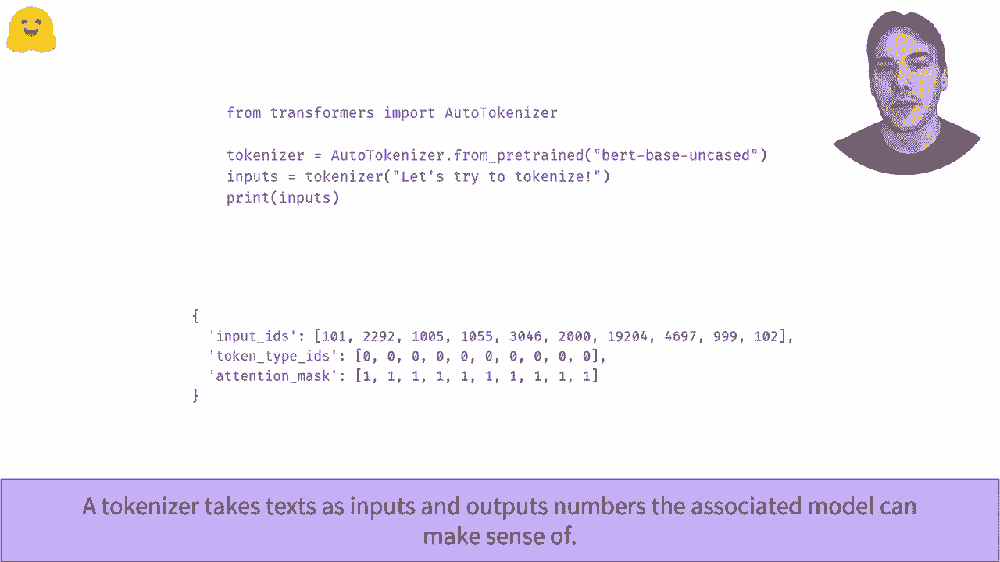

# 【双语字幕+资料下载】官方教程来啦！5位 Hugging Face 工程师带你了解 Transformers 原理细节及NLP任务应用！＜官方教程系列＞ - P16：L2.9- Tokenizer流水线处理 - ShowMeAI - BV1Jm4y1X7UL

So took a nice pipeline。In this video， while look at how tokenizer converts four text to numbers that a transformer model can make sense of。 like when we execute this good。Here is a quick overview of what happens inside the Tokener object。First， the text is split into tuets， which are words， parts of words， or punctuation symbols。Then the tokenizer adds potentent special tokens and converts each token to our unique respective ID。

 as defined by the touckenizer's vocabulary。As we'll see doesn't quite happen in this order。 but doing it like this is better for her understandings。The first step is to split our input text into tokens， we use the tokenized method for this。To do that， the tokenizer may first perform some operations like lower casing or words。

 and follow a set of rules to split the result in small chunks of text。Most of the transformer models use a sub word organization algorithm。Which means that one given word can be split in several tokens， like tokens here。Look at the tokenization algorithms video linked below for more information。

The ash ash prefix we see in front of Is is a convention used by bird to indicate histoken is not the beginning of the world。Other tokenrs may use different convention however。For instance。 Albert tokens will add a long underscore score in front of all the tokens that had its space before them。Which is a convention shared by his all sentence best tors。

The second step of the tokenization pipeline is to map those tokens to wear respective IDs。 as defined by the vocabulary of the tokenizer。This is why we need to download a file when we instant hit a tokenizer with the form between method。We have to make sure we use the same mapping as when the model was portrayed。To do this。 we use the convert tos to IDs method。You may have noticed that we don't have the exact same results as in our first slide。

On not， as this look like a list of random numbers anyway。 in which case allow me to refresh your memory。We the number at the beginning and the number at the end that are missing。Those are the special tos。The special tokens are added by the proper formalal method。 which knows the indices of a token in the vocabulary and just adds the proper numbers in the input IDs list。

You can look at the special tokens and more generally at oh the tokenizer has changed your text by using the deco method and the output of the tokenizer object。As for the prefix for beginning of Worlds part of world。 will special token vary depending on which tokenr you' are using。So B tokener uses CLS on set。 but the Robertta tokener uses HTML Tml like on calls S and/lash S。

Now that you know how the tocanazer works， you can forget all was intermediately admitted and only remember that you just have to call it on your input texts。The output of the tokenizer don't just contain the input ID， however。Purun where the attention mask is， check out the batch input Together video。To learn about tokyotype ideas， look at the process Pers or sentences video。

。