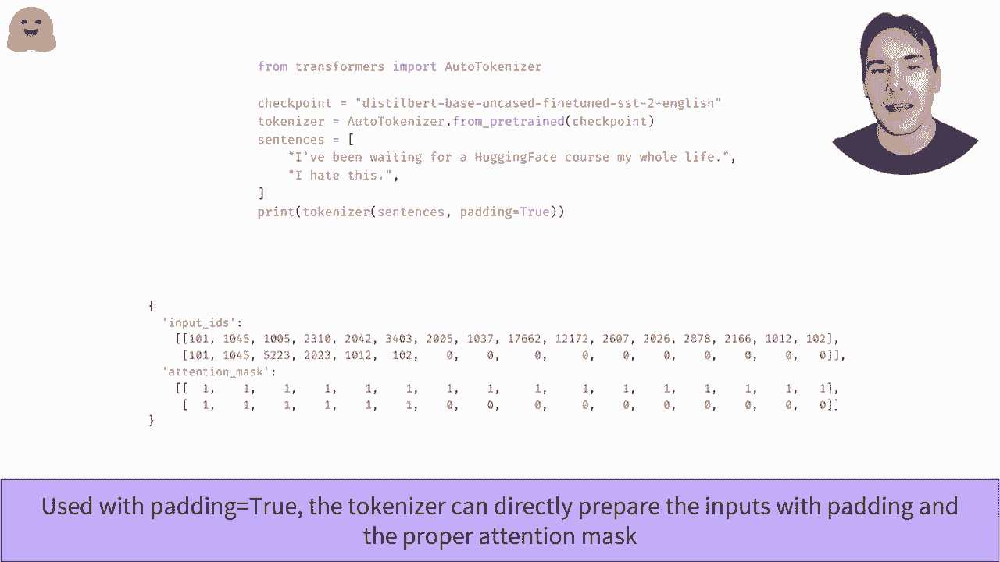

# 【双语字幕+资料下载】官方教程来啦！5位 Hugging Face 工程师带你了解 Transformers 原理细节及 NLP 任务应用！＜官方教程系列＞ - P17：L2.10- 批处理输入(PyTorch) - ShowMeAI - BV1Jm4y1X7UL

如何将输入批处理在这个视频中，我们还看到如何将输入序列批处理在一起。一般来说，我们想传递给模型的所有句子长度都不会相同。在这里，我们使用了在情感分析管道中看到的模型，想要对两个句子进行分类。当对它们进行标记并将每个标记映射到其对应的输入 ID 时。

我们得到两个长度不同的列表。试图从这两个列表创建一个张量或 Mbi 数组将导致错误，因为所有数组和张量都应该是规则的。克服这个限制的一种方法是通过添加特殊标记，将第二个句子的长度调整到第一个句子的长度，直到必要的次数。

另一种方法是将第一个序列的长度调整到第二个序列的长度。但是你将会失去很多可能对于正确分类句子必要的信息。一般来说，当句子的长度超过模型可以处理的最大长度时，我们才会截断句子。用于填充句子的值不应随机选择。

模型使用了某个填充 ID，你可以在 tokenazizerpa token8 中找到。现在我们有了更好的句子，我们可以将它们组合成一个批次。如果我们单独将这两个句子传递给模型，但将它们拼接在一起，我们会注意到填充在这里的第二个句子得不到相同的结果，这在 transformers 库中算不算一个 bug 呢？如果你还记得，transformers 会很方便地使用注意力层。

这不应该是一个完全意外的事情。当计算是每个标记的上下文表示时。注意力层会查看句子中的所有其他单词。如果你只有一个句子或几个填充标记的句子，那么，我们得不到相同的值是合乎逻辑的。为了获得有无填充的相同结果。

我们需要向注意力层指示，我们应该忽略那些填充目标。这是通过创建一个注意力掩码来完成的，它与输入 ID 具有相同的形状，并包含一系列的 0 和 1。1 表示注意力层在上下文中应该考虑的标记，而 0 表示应该忽略的标记。现在，将这个注意力掩码与输入 ID 一起传递，将会给我们与单独发送两个句子给模型时相同的结果。

这一切都是在后台由 tokenizer 完成的，当你将它应用于多个句子并将填充标志设置为时。它会将适当的值应用于较小的句子，并创建相应的注意力掩码。

。

