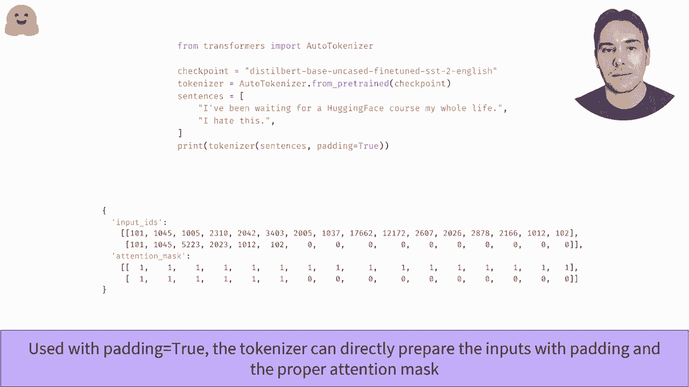

# 【双语字幕+资料下载】官方教程来啦！5位 Hugging Face 工程师带你了解 Transformers 原理细节及NLP任务应用！＜官方教程系列＞ - P18：L2.11- 批处理输入(TensorFlow) - ShowMeAI - BV1Jm4y1X7UL

How to batch inputs together in this video， we all see how two batch input sequences together。In general， the sentences we want to pass through our model want all have the same length。Here we are using the model we saw in the sentiment analysis pipeline and want to classify two sentences。When tokenizing them and mapping each token into its corresponding input IDs。

 we get two lists of different length。Trying to create a tensor on em bio array from those two lists will result in an error because all arrays and tensilrs should be rectangular。One way to overcome this limit is to make the second sentence the same length as the first by adding a special token as many times as necessary。

Another way would be to trucate the first sequence to the length of the second。 but we would then lose a lot of information that may be necessary to properly classify the sentence。In general， we only truncate sentences when we are longer than the maximum lengths the model can handle。The value used to pad the sequence sentence should not be picked randomly。

The model has been portraytrained with a certain padding ID， which you can find in tokenizer。pa tokenid。KNownow that we have padied our sentences， we can make a batch with them。If we pass the two sentences to the model separately or batch together however。 we notice that we don't get the same results for the sentence that is valid， here the second one。

So that the bes the transforma library， no， if you remember that transformer models make easy use of attention layers。This should not come as a total surprise。When computing the contextual representation of each token。 the attention layers look at all the other words in the sentence。If we have just a sentence or the sentence with several padding tokens I did， iss surgical。

 we don't get the same values。To get the same results with or without bedding。 we need to indicate to the attention layers that we should ignore the betting tickets。This is done by creating an attention mask， a tensor with the same shape as the input ID with zeros and what。Once indicate the tokens the attention layers should consider in the context and zeros the tokens we should ignore。

Now， passing this attention mask and with the input id will give us the same result as when we send the two sentences individually to the model。This is all done behind the scenes by the tokenizer when you apply it to several sentences with the flag padding equal through。

It will apply the bedding with a proper value to the smaller sentences and creates the appropriate attention mask。

。

