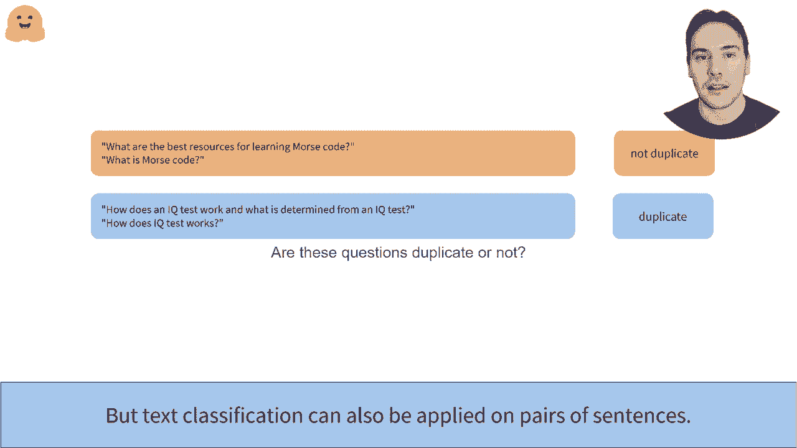

# 【双语字幕+资料下载】官方教程来啦！5位 Hugging Face 工程师带你了解 Transformers 原理细节及NLP任务应用！＜官方教程系列＞ - P19：L3.2- 预处理句对数据(PyTorch) - ShowMeAI - BV1Jm4y1X7UL

如何提出句子对。我们已经见识了如何对单句进行分词并将其拼接到覆盖输入中。如果这段代码对你来说有些陌生，请务必再次查看视频。在这里，我们专注于任务，但分类个人句子。例如，我们可能想要判断我们的两个文本是否是相同的。

这是从Qa问题P数据集中提取的示例，专注于识别重复问题。在第一对中，这两个问题在第二种格式下是重复的。

另一个分类问题是我们想知道两个句子是否在逻辑上相关。这是一个称为自然语言推理的问题。在这个从multiana数据集中提取的例子中，我们为每个可能的标签准备了一对句子，矛盾、网络或确证。

这是一种华丽的说法，意味着第一句暗示第二句。

所以，某些配对分类确实是一个值得讨论的问题。实际上，在群体基准中，这是一个文本验证的学术基准。10个数据集中的8个专注于使用句子对的任务。这就是为什么像Bt这样的模型通常采用双重目标。

除了语言建模目标外，我们通常还有与句子对相关的目标。例如，在共同训练过程中，B展示了一对句子，并必须预测随机掩盖的标记的值以及第二句是否从第一句引出。

幸运的是，transformer库中的Tukenezer有一个不错的API来处理句子对。你只需将它们作为两个参数传递给分词器。在我们已经学习的输入ID和附加掩码之上，它返回一个新字段，称为token type 8s，这告诉模型哪个可以映射到第一句。

哪些属于第二句？稍微放大一下，这里有与我们各自的标记类型ID和注意力掩码对应的输入ID。我们可以看到分词器也添加了特殊标记。所以我们有一个C S标记，来自第一句的标记，还有一个来自第二句的septukin标记。

以及一个最终的septuken。如果我们有多个句子对，可以通过传递第一句的列表，然后是某些句子的列表，以及我们已经学习的所有关键字参数，如填充选项，来整合它们。

放大后，我们可以看到分词器如何为第二对句子添加填充，以使两个输出具有相同的长度，并正确处理两个句子的标记类型ID和注意力掩码。这已经是一个2次传递的模型。

。
