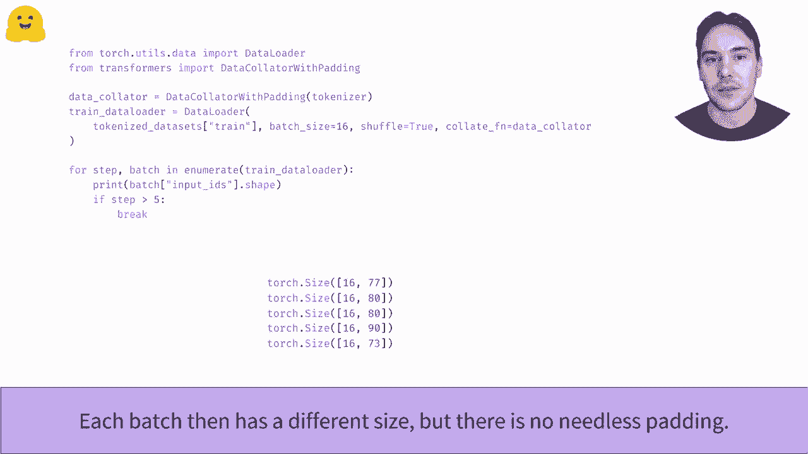

# 【双语字幕+资料下载】官方教程来啦！5位 Hugging Face 工程师带你了解 Transformers 原理细节及NLP任务应用！＜官方教程系列＞ - P20：L3.3- 什么是动态填充？ - ShowMeAI - BV1Jm4y1X7UL

What is dynamic bedding？In the batchching inputs Together video。 we have seen that to be able to group inputs of different lengths in the same batch。We need to add patting tokens to all the shot inputs until by all of the sameim。Here， for instance。 the longest sentence is the third one and we need to add five。

 two or seven pettucans to the other sentences to have four sentences of the same length。When dealing with a word data set， there are value being strategies we can apply。So most of use one is to add all the elements of the data set to the same lengths。 the length of the longest sample。This will then give us patches that all have the same shape determined by the maximum sequence length。

So downside is that patches composed from short sentences， we have a lot of patting tokens。 which will introduce more computations in the model we ultimately don't need。To avoid this。 another strategy is to patch the elements when we batch them together to the longerest sentence inside the batch。This way， batches compose of short input voltage smaller than the batch containing the longest sentence in the dataset set。

This will lead some nice speed on CPU and GPU。So the downside is that all batches will then have different shapes。 which slow down things on accelerators like TUs。Let's do to apply both strategies in practice。We have actually seen to applied fixed padding in the dataset sets of a view video when we propose the Ar PCC dataset。 after alling the dataset undertkenizer， we applied the tokenization to all the dataset set with padding and locationcation to make all samples of lengths 128。

As a result， if we pass this data set to a byythch data， we get patches of shape patch size here， 16。 528。To apply a dynamic bedding， we must defer the bedding to the batch preparation。So we remove that part from a tokenized function。We still leave the conation part so that inputs that are bigger than the maximum lengths accepted by the model。 usually 512 get trunccateated to that length。Then we paddle some poll dynamically by using a data curator。

Those classes in the transforms library are responsible for applyinging all the final preprocessing needed before forming a batch。Here， the decoulator with padding allpa the samples to maximum length inside a patch of sentences。We pass it to the Pyth stalor as a collate function and observe that the batch is generated at various lengths all way below the 128 form before。Dynamic pitching will almost always be faster on CPUs and GPs， so you should apply it if you can。

Remember to switch back to fixed bidding however， if you run your training script on TU or need batches of fixed chips。

。

