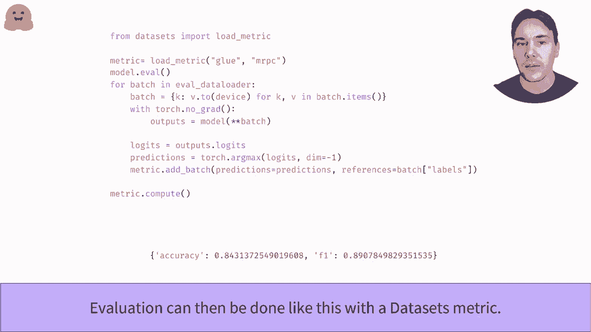

# 【双语字幕+资料下载】官方教程来啦！5位 Hugging Face 工程师带你了解 Transformers 原理细节及NLP任务应用！＜官方教程系列＞ - P22：L3.5- 使用PyTorch编写训练流程 - ShowMeAI - BV1Jm4y1X7UL

Write your own training loop bit by doch。In this video。

 along Kaar we can do the same functioning as in the train video but without relying on web class。

 this way， you'll be able to easily customize each type to of the training loop to your needs。

This is also very useful to manually debug something things that went along with the train API。

Before we dive into the code， here is a sketch of a training loop。

We take a batch of training data and feed it to the model。With the labels， we can get computer less。

That number is not useful in turn， but is used to compute the gradient of our model weights；

 that is the derivative of thes with respect to each model weight。

Those gradients are then used by the optimizer to update the model ways and make them a little bit better。

We then repeated the process with a new batch of training data。If any of this isn't。

 don't hesitate to take a refresher on your fabric deep learning course。

We'll use the G MRRPC dataset set here again， and we're seen to propose head the data using the data sets library with dynamicy Pdding。

Check out the videos link below if you haven't seen them already。With this done。

 we only have to define Pytorrch data loadors， which will be responsible to convert the elements of a dataset set into patches。

We use our data coulator for padding as a correct function and sh for the training set to make sure we don't go through the samples in the same order as a cheaper。

To check that everything works as intended， we try to grab a batch of data and inspect it。

Like how that asset set elements， it's a dictionary。

 but this time the values are not a single list of integers。

 but the tonso of shapepa sizes by sequence length。

The next step is to send the training data in our model。

Now that will need to actually create a model。As seen in the model API video。

 we use the front pretrained method and adjust the number of labels to the number of classes we have on this dataset set here too。

Again， to be sure everything is going well， we pass the batch we to our model and check there is no error。

I the labels are provided， the models of the Transence library always returns the list directly。

We'll be able to do less step backward to compute all the gradient。

 and we'll then need the Optr to do the training step。We use the Adam W optimizer here。

 which is the variant of Adam with proper weight decay。

 but you can pick any by doch optimizer you like。Using the previous loss and computing the gradients we've listeded backward。

 we check that we can do the optimizer step without an error。

Don't forget to zero your gradient afterward， or the next step from get added to the gradient you computed。

We got already white or training loop， but we add two more things to make it as good as it can be。

The first one is a learning rate scheduler to progressively decay a learning rate to0。

The GtSched function from the Transformer library is just a convenience function to easily build searcher Sch。

You can again use any Pythto learning weight scheduler instead。Finally。

 if we want our training to take a couple of minutes instead of a few hours we'll need to use a GPU the first step is to get one for instance by using a collaborative book。

Then you need to actually send your model and training that on it by using a dashch device。

Do will check the following lines point your good databases for you or be prepared for your training to last more than an hour。

We cannot put everything together。First， we put our model in training mode。

 which will activate the training behavior for some layers like dropout。

Then we go through the number of reports books we picked and all the data in our training data。

Then we go through all the steps we've seen already， send the data to the GPU。

 compute the model outputs， and in particular the less。Use the list to compute gradients。

 then make a training step with the optimizer。Updates are earn rate and our schedule error for the next detereration and the gradient of the optimizer。

Once this is finished， we can evaluate our model very easily with a metric from the dataset sets library。

😊，First， we put our model in the evaluation mode to deactivate layers like dropout。

Then goes through all the des the evaluation the。As we' seen in the trainer video。

 the model outputs logggets and we need to apply the Agm function to convert them into predictions。

The metric object then has a net batch method we can use to send it for intermediate predictions。

Once the evaluation loop is finished， you just have to call the compute method to get the final results。

Congratulations， you have no find model all by yourself。

。

