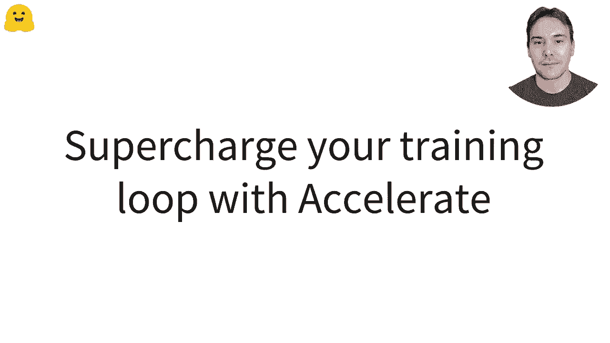
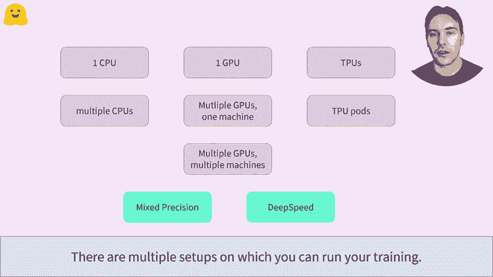
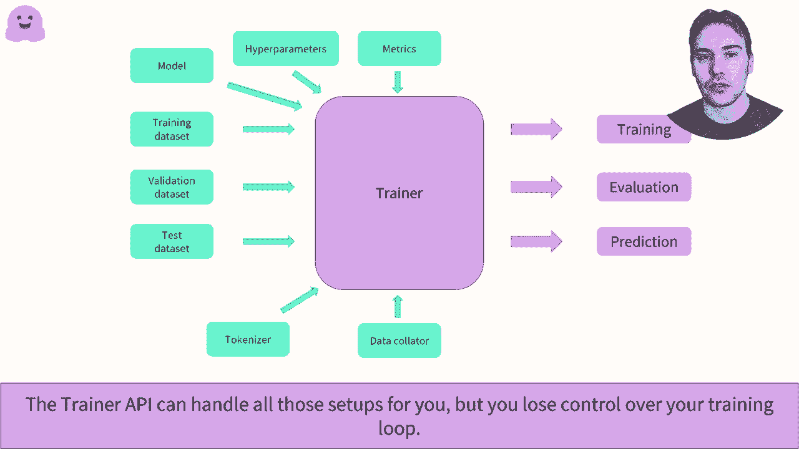
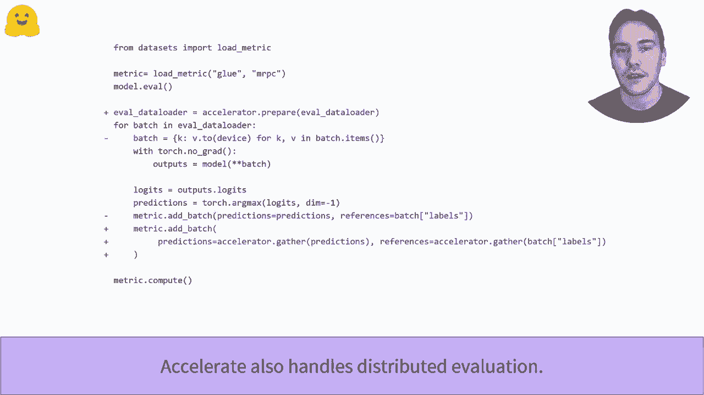
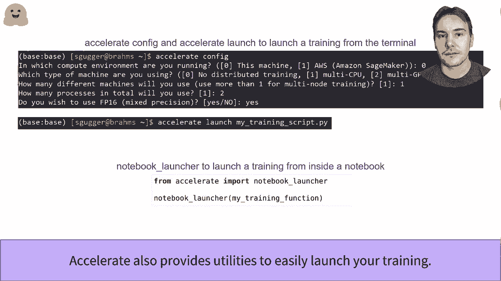

# 【双语字幕+资料下载】官方教程来啦！5位 Hugging Face 工程师带你了解 Transformers 原理细节及NLP任务应用！＜官方教程系列＞ - P23：L3.6- 使用 Accelerate 增强您的 PyTorch 训练流程 - ShowMeAI - BV1Jm4y1X7UL

Supercharge your by doch training loop with eggging face accelerate。

There are multiple setups on which you can run your training。It could be on CPU， GPUus， GPus。Distributed on one machine with several devices or even several machines often called nodes with multiplepo devices。On top of that， there are new tricks to make your training faster or more efficient。 like mixed precision and dip speed。Each of a setup or training trick requires you to change the code of your training loop in one way or another and to learn a new API。

All were setups found all by the trainer API and also have all field party libraries that can help。The problem with is that we can feel like a black box and that it might not be easy to implement the tweak to the training loop you need。

Accelrate has been designed specifically to let you retain full control over your training loop and be as non intrusive as possible。With just four lines of code to add to your training loop。 you have shown us the example of the training loop video。Accelerate will install all the setep and training tricks to monoon on the first slide。

It's only one API to learn on master instead of 10 different ones。More specifically。 you have to import an instant sheet an accelerator object that will handle all the necessary code for your specific set。Then you have to send it to model， optimizeizer， and that you're using in the prepare。This is the main method to remember。Acceleleerate on those device placement。

 so you don't need to put your batchge on the specific device you're using。Finally。 you have to replace the lost dot back line by accelerate tall dot backward loss。And that's all it。Accelator also involves distributed evaluation。You can still use the classic evaluation loop such as what we saw in the training group video。 in which case all processes well perform the full evaluation。To use a distributed evaluation。

 you just have to adapt to a evaluation look like this。That's along the a that the adults was the accelerator or per， like training。Then you can dismiss the line that places the batch on the proper device。And just before passing your predictions and labels through your metric。

 use accelerator Gar to give the predictions and labels from each process。

The distributed training script has to be launched several times on different processes。 for instance， one per GPU you're using。You can use the Pytoch tools to do that if you're familiar with them。The accelerate also provides an easy API to configure your setup and launch your training script。In a terminal， run accelerate Config and un a small questionnaireer to generate a configuration file with all the relevant information。

Then you can just run accelerateerate launch followed by the past or your training script。In a notebook， you can use a notebook launcher function to launch your training。

。