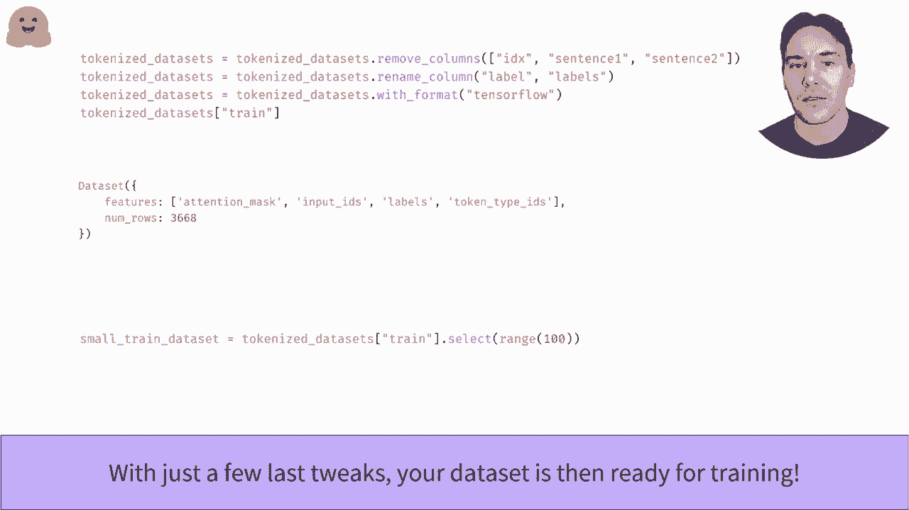

# 【双语字幕+资料下载】官方教程来啦！5位Hugging Face工程师带你了解Transformers原理细节及NLP任务应用！＜官方教程系列＞ - P24：L4.1- Hugging Face数据集概述(Tensorflow) - ShowMeAI - BV1Jm4y1X7UL

E phase数据集库的快速概述。你可以F数据集库，这是一个提供API以快速下载许多公共数据集并预处理它们的库。在这个视频中，我们将探讨如何做到这一点。所以部分是通过load data set函数轻松完成的。你可以直接从其网站下载并缓存数据集，如果我拥有数据集集的中心。

这里我们从crew benchmarkch获取我们的PC数据集。它是一个包含成对句子的集合，任务是确定配对。Lu数据集函数返回的对象是数据集字典，这是一种包含每个数据集切分的字典。

我们可以通过索引名称访问每个切分。这个切分是数据集类的一个实例，包含句子1、句子2、级别和IDX，以及规则。你可以通过索引访问给定元素。Uing phase数据库的惊人之处在于，一切都是安全地使用上层Sharo保存到磁盘的。

这意味着即使你的数据集庞大，你也不会耗尽内存。当这些语句在内存中请求时，访问数据集的一个切片就像访问一个元素一样简单。结果是一个字典，包含每个案例的值列表。这里是标签列表、第一句的列表和第二句的列表。

数据集的features属性为我们提供了关于其列的更多信息。特别地，我们可以看到它在这里提供了整数和标签名称之间的对应关系。0代表净等价，1代表等价。为了处理数据集的所有元素，我们需要对其进行分词。看看视频，预处理句子对以进行复习。

但你只需要将这两句发送给文档分词器，并附加一些关键字参数。这里我们指定最大长度为128，并将短于此长度的输入进行填充，长于该长度的输入则被截断。我们将所有这些放入分词函数中，可以直接通过map方法应用于数据集中的所有sps。只要函数返回字典对象。

map方法会根据需要添加新列或更新现有列。为了加快预处理，并利用分词器由rust支持的事实，感谢tick phase分词器的库，我们可以使用batch为true参数在自动化函数中同时处理多个元素。因为分词器可以列出第一句或第二句。

分词函数不需要从这里改变。你还可以使用多处理和map方法，查看下面的文档链接。完成后，我们几乎准备好进行训练。我们只需使用remove columns方法移除不再需要的列。

我们将label2命名为labels，因为Tom库中的模型期望如此。并设置所需后端的输出格式，torch，pencilsor F影响。如果需要，我们还可以使用select方法生成数据集的短样本。

。
