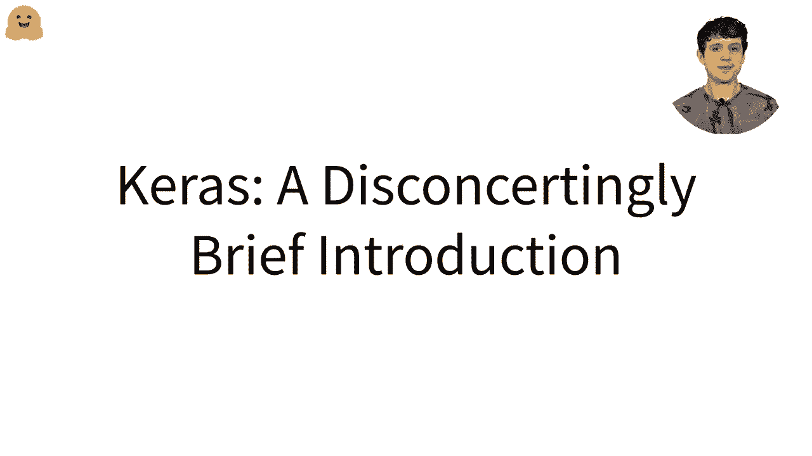
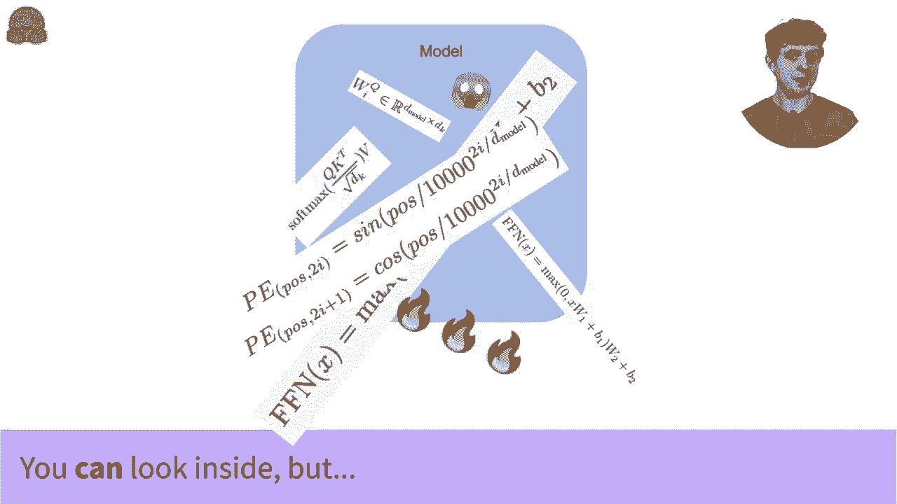
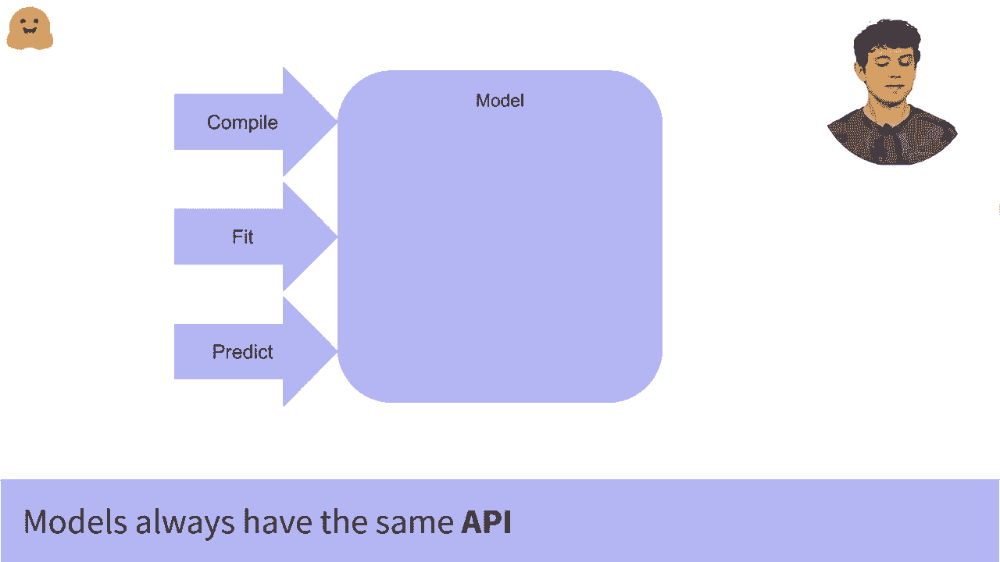

# 【双语字幕+资料下载】官方教程来啦！5位 Hugging Face 工程师带你了解 Transformers 原理细节及NLP任务应用！＜官方教程系列＞ - P26：L4.3- Keras介绍 - ShowMeAI - BV1Jm4y1X7UL

In this video， I'm going to give you a very quick introduction to how our transformer models work together with TensorFlow and Kas。The very short explanation is that all of our TensorF models are also Keis model objects。 and so they have the standard KeIS model API。😊，If you're an experienced machine learning engineer who's used Kais a lot。 that's probably all you need to know to start working with them， but for everyone else。

 including the prodigal Pytorrch engineers out there who are returning to the fold。 I'm going to quickly introduce Keis models and how we work with them。In other videos。 which I'll link below， I'll run through training with Keis models in more detail， but first。 at a high level， what is a Keis model？

So your model basically contains your entire network。 it contains the layers and the weights for those layers and also tells the model what to do with them。 so it defines the whole path all the way from your inputs to your outputs。If you've used Keis before， you probably started using model objects by building them out by hand。

 you added one layer after another， maybe using the model dot ad or the functional approach。And there's nothing wrong with that。 you can lots of great models are built that way。 but you can also preload an entire model weights and all。 And this is really helpful because if you as you can see here。

 if you try reading the paper or if you try looking at the code。 you'll see the inside of a transformer is pretty complex and writing it all out from scratch and getting it right would be hired even for an experienced machine learning engineer。 but because it's all packed inside a model， you don't need to worry about that complexity on that if you don't want to。 if you're a researcher if you want to really dig in there， you can。

 but you can also just load a pre-trained preconfigured transformer model in just one line of code。😊。

And when I mentioned earlier about the KaIS API， the advantage of it is that whether you write your own model from scratch or load a pre-trained one。 you interact with the model through that same API so you use exactly the same few methods and you're going to see them again and again these methods like fit。

 compile and predict and like I mentioned will see cover concrete examples of how to use those methods in the videos I'll link below For now。 the key thing to take away from this video if you've never seen Keis before is that this neat encapsulation means that all the complexity of a huge neuralnet becomes manageable because you interact with it in exactly the same way using exactly the same methods。

Whether it's a huge pretrained language model or a simple model you wrote out by hand。

。