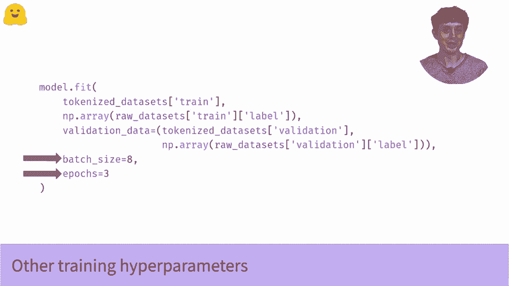

# 【双语字幕+资料下载】官方教程来啦！5位 Hugging Face 工程师带你了解 Transformers 原理细节及NLP任务应用！＜官方教程系列＞ - P27：L4.4- 使用 TensorFlow 进行微调(迁移学习) - ShowMeAI - BV1Jm4y1X7UL

So in this video， we're going to see how to load and fine tune a pre trained model。 It's very quick。

 And if you've watched our pipeline videos， which I'll link below， the process is very similar。😊。

This time， though， we're going to be using transfer learning and doing some training ourselves。

 rather than just loading a model and using it as is， like we did in the pipeline videos。

 So if you to learn more about transfer learning， if you don't know much about it。

 you can head to the what is transfer learning video。 And I'll link that below as well。😊，But for now。

 let's look at this code。 So to start， we pick which model we want to use。 In this case。

 we're going to use the famous plastic Bt。But what does this， this line here， this monstrosity。

 this TF auto model for sequence classification， What does that mean。Well。

 the TF stands for Tensorflow， and the rest means take a language model and stick a sequence classification head onto it if it doesn't have one already。

So what we're going to do here is load Bt， which is a general general purpose language model that doesn't have a sequence classification head。

 We're going to use the from pre traineded method， and that method ensures that all our weights come from the pre trained model。

 So they're not randomly initialized with the exception of the new sequence classification head we're going to add。

😊，So this method needs to know two things。Firstly， it needs to know the name of the model you wanted to load。

 And secondly， it needs to know how many classes your problem has。

So if you want to follow along with the data from our data sets videos， which I'll link below。

 then you'll have two classes， positive and negative， and thus nu labels equals 2。

But what about this compile thing。So if you're familiar with Caris。

 you've probably seen this already。 But if not， this is one of the core methods in Caris。

 you always need to compile your model before you train it。 compileile needs to know two things。

 Firstly， the loss function， which is basically， what are we trying to optimize。

 And here we import the sparse categorical cross entropy loss function。 So that's a mouthful。

 If you've never encountered it before。 but it's the standard loss function for any neural network that's doing a classification task。

 It basically encourages the network to output large values。

 So large probabilities for the right class and low values of low probabilities for the wrong classes。

Notice that you， you can specify the last function as a string like we do with the optr here。

 But there's a very common pitfall here。 By default。

 the last assumes the output is probabilities from a softm layer。

 But what our model has actually output is the values before the softm。

 These are often called the logicits or logicits。 You saw these before in the video about pipelines。

😊，If you get that this wrong， your model won't train。 And it'll be very annoying to figure out why。

 In fact， I'm going to go so far as to say that if you remember absolutely nothing else from this video。

 remember to always check whether your model is outputting logicits or probabilities。

 and make sure your loss is set up to match that。 So this is going save you a lot of debugging headaches in your career。

 That would otherwise be very difficult to track down and very annoying。But leaving that aside。

 the second thing compile needs to know is the optr you want。 In our case， we're going to use atom。

 which is sort of the standard optimizer for deep learning these days。

 The one thing you might want to change is the learning rate。

 And to do that we'll need to import the actual optr， rather than just calling it by string。

 So much like we did with the loss。 But we can talk about that in another video。

 and I'll link that below for now， let's just try training the model。😊，So how do you train the model？

 Well， if you've used Kais before， this will all be very familiar to you。 But if not。

 let's look at what we're doing here。 Fit is pretty much the central method for Kais models。

 It tells the model to break the input into batches and then train on it。

 So the first input is tokenized text。 you'll almost always be getting this from a tokenizer。

 And if you want to learn more about that process。 what exactly these inputs look like。

 please check out our videos on tokens。 And again， there'll be links for those below。

So those are our inputs。But then the second argument is our labels。

 and this is really straightforward。 This is just a one dimensional nuy or tensorflow array of integers。

 and they correspond to the classes for examples。 that's it。😊。

So if you're following along with our data from our data sets video， there'll only be two classes。

 so this will just be a vector of zeros and ones， but you can have many more classes than that for your own problems。

So once we have our inputs and our labels， we do the same thing with the validation data。

 We pass the validation inputs and the validation labels in a tuple。 and then we can。

 if we want to specify date details like the batch size for training。

 And then you just pass the whole thing to model dot fit and you let it rip。

 So if everything works out， you should see a little training progress bar as your last goes down。

 And while that's running， you know， you sit back， you call your boss and you tell them you're a senior NLP machine learning engineer now。

 and you're going to want to salary review next quarter。 So this is really， I'm kidding a bit。

 But this is really all it takes to apply the power of a massive pretrained language model to your N LP problem。

😊，But could we do better than this， Like， is there any changes we could make， So there certainly are。

 There's a few more advanced careis features like a tune scheduled learning rate。

 We could get an even lower loss。 And even therefore for an even more accurate model。 And also。

 when we when fit finishes， what do we do with our model once it's trained。 So these are all topics。

 I'm going to cover these and more in the videos。 And again。

 I'm going to link those subsequent videos below。😊。

。