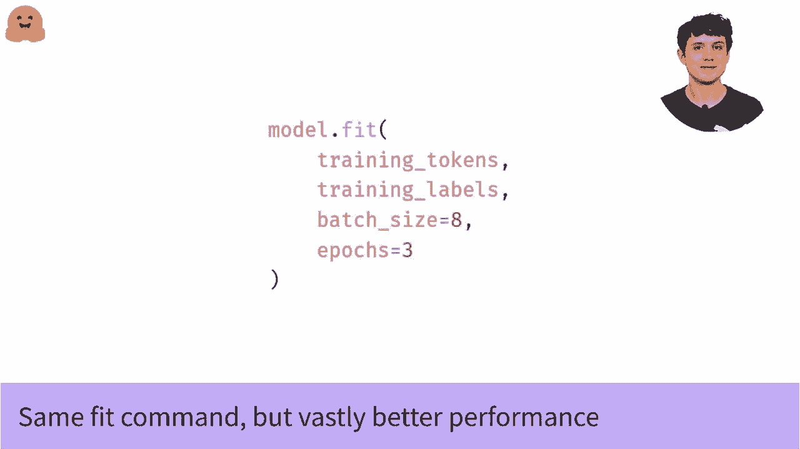

# 【双语字幕+资料下载】官方教程来啦！5位 Hugging Face 工程师带你了解 Transformers 原理细节及NLP任务应用！＜官方教程系列＞ - P28：L4.5- 使用 TensorFlow 进行学习率调度 - ShowMeAI - BV1Jm4y1X7UL

In our other videos， we talked about the basics of fine tuning a language model with Tensorflow。 And as always， when I refer to videos， I'll link them below。 But still， can we do better。 So here's the code from our model fine tuning video。 And while， while it works。 we could definitely tweak a couple of things。 by far。

 the most important thing is the learning w In this video， we'll talk about how to change it。 which will make your training much more consistently successful。😊，In fact。 there are two things we want to change about the default learning rate for at。 The first is that it's way too high for our models。 So by default。

 Adam uses a learning rate of 10 to the -3， which is very high for training transformers。 We're going to start at 5 by 10 to the-5， which is 20 times lower than the default。 And secondly。 we don't just want a constant learning rate。 We can get even better performance if we decay the learning rate down to a tiny value。 or even to 0 over the course of training。 So that's what this polynomial decay schedule thing is doing。

 So that name might be intimidating， especially if you only vaguely remember what a polynomial is from Atslas。 So I'll show you what that decay looks like in a second。 But first we need to tell the scheduler how long training is going to be。 So that it decays of the right speed， And that's what this code here is doing。😊。

So we're computing how many mini batches the model is going to see over the entire training run and to compute that。 we're taking the size of the training set， dividing it by the batch size which gives us the number of batches per epoch。 and then we're multiplying that by the number of epochs to get a total number of batches。 it's going to see over the whole training run。😊，So once we know how many batches。

 how many training steps we're taking， we just pass all of that information to the scheduler and we're ready to go。So what does the polynomial decay schedule look like？With default options。 it's actually just a linear schedule， so it looks like this。 It starts at our initial value。 which is 5 by 10 to the minus5 or 5 e minus5 and then it decays down at a constant rate until it hits zero right at the very end of training So why do they call it polynomial and not linear Well if you tweak the options you can get a higher order at a truly polynomial decay schedule but there's no need to do that right now by default。

 you get a linear schedule and if you were aware that a linear function is a special case of a polynomial you can feel proud。😊，So that aside， how do we actually use the scheduler。 So easily， we just pass it to Adam。 You'll notice the first time when we compiled the model， we just pass the string at。 Curris recognizes the names of common optimizers and loss functions if you pass them with strings So it saves time and it avoids imports to do it that way。

 if you only want the default settings。 but we're professional machine learners now with our very own learning rate schedule So we have to do things properly。 So the first thing we do is we import the optimizer。 Then we initialize it with our scheduler in the learning rate argument。 and then we compile the model using our new optimizer and whatever loss function you want。

 we'll leave that unchanged。 This will be sparse categorical cross entropy。 if you're following long from the fine tuning video。 but it can be anything else that you're using yourself。😊。So now we have a high performance model ready to go。 all that remains is to fit the model just like we did before。And remember because we've compiled the model with the new optimizer at the new learning rate。 we actually don't need to change anything about the fit I call at all。 we just call fit here exactly the same command we used before if you've seen in other videos。😊。

But now we get a beautiful training with a nice， smooth。 a good initial learning rate and a solid learning rate decaying。And you will get much better performance as a result。

。

