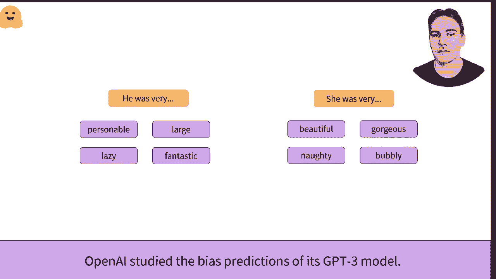
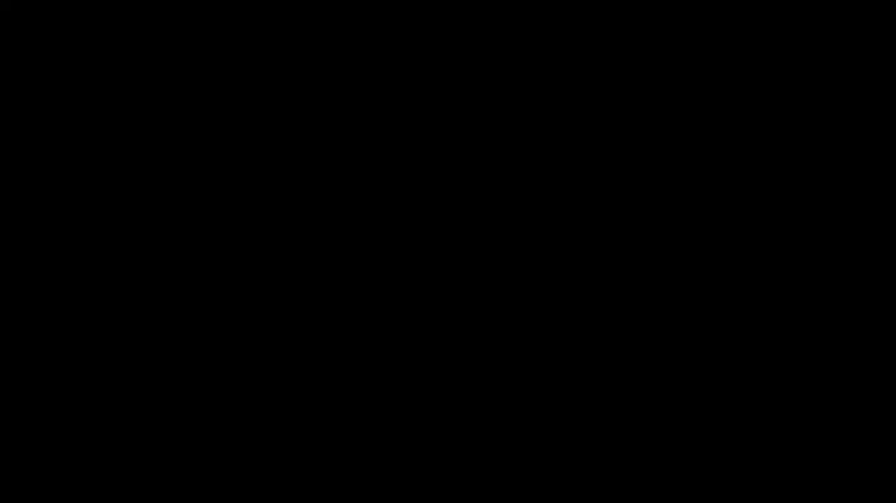

# 【双语字幕+资料下载】官方教程来了！5位 Hugging Face 工程师带你了解 Transformers 原理细节及NLP任务应用！＜官方教程系列＞ - P3：L1.3- 什么是迁移学习？ - ShowMeAI - BV1Jm4y1X7UL

什么是迁移学习？迁移学习的理念是利用在另一个任务上用大量数据训练的模型所获得的知识。模型A将专门为任务A进行训练。现在假设你想为不同的任务B训练它。一种选择是从头开始训练模型，这可能需要大量计算。

时间和数据。相反，我们可以用与模型A相同的权重初始化模型B，从而将模型A在TP上的知识转移过来。从头开始训练时，所有的中间权重都是随机初始化的。在这个例子中，我们在识别两个句子是否相似的任务上训练一个模型。

左边是从头开始训练，右边是微调的预训练模型。可以看到，在预训练模型上使用迁移学习能取得更好的结果。而且无论我们训练多久，从头开始的训练保持在70%的准确率，而微调的模型则能轻松达到86%。这是因为预训练模型通常是在大量数据上训练的。

但提供一个模型对在预训练期间使用的语言有统计理解。在计算机视觉中，迁移学习已经成功应用了近10年。模型通常在一个包含120万张照片的ImageNet数据集上进行微调，每张图像被分类为1000个类别之一。这样的训练方式。

无标签数据称为监督学习。在自然语言处理领域，迁移学习相对较新。与ImageNet的一个关键区别在于，训练通常是自监督的，这意味着不需要人工标注。一个很常见的预训练目标是猜测句子中的下一个单词。

这只需要大量的文本。例如，GPT2就是这样使用用户在read上发布的4500万个链接的内容来表现的。另一个自监督预训练目标的例子是预测随机掩蔽的词汇，这类似于你在学校做的血液B测试。

这是通过使用英语维基百科和1,000本已出版的书籍之间的方式。在实践中，迁移学习是通过抛弃一个给定模型的头部来应用的，即其最后几层专注于预训练目标。然后我们用一个新随机初始化的模型进行适配。例如。

当你早些时候在构建模型时，我们移除了分类Mque的部分，并用具有两个输出的分类器替换它，因为我们的任务是两个层次的。为了尽可能高效，所用的预训练模型应该与其微调的任务尽可能相似。

例如，如果问题是对德语句子进行分类，最好使用德语模型。但好的东西也会带来坏处。这个模型不仅传递其知识，还传递它可能包含的任何偏见。ImageNe主要包含来自美国和西欧的图像。

因此，用它微调的模型通常在这些国家的图像上表现更好。但Beni也研究了其Gpyy3预测中的偏见，这涉及到使用猜测和X世界目标之间的关系。将性别从E Westbury改为she Westbury改变了大部分中立目标的预测。

几乎仅限于物理模型。在GT2 Mor的模型代码中，Open AI也承认其偏见，并不鼓励在与人类互动的系统中使用它。

是的。
