# 【双语字幕+资料下载】官方教程来啦！5位 Hugging Face 工程师带你了解 Transformers 原理细节及NLP任务应用！＜官方教程系列＞ - P30：L5.1- 模型Hub中心速览 - ShowMeAI - BV1Jm4y1X7UL

In this video， we're going to go over the Huging F model H navigation。This is the Huging phase。t co landing page。To access the Model hub， click on the Models tab in the upper right corner。You should be facing this web interface， which can be split into several parts。

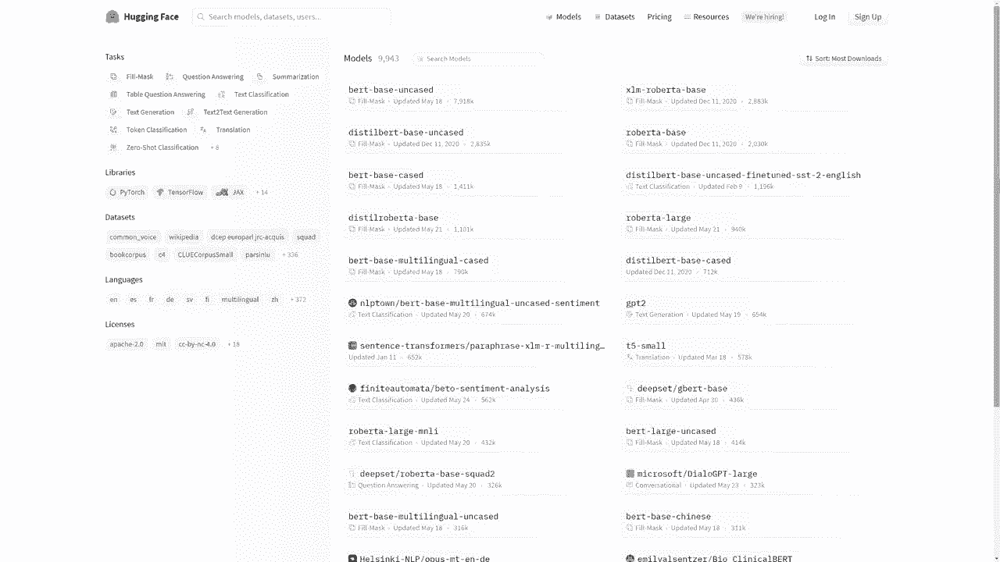

On the left， you will find categories which you can use to tailor your model search。The first category is the tasks。Mugles on the hub may be used for a wide variety of tasks。 These include natural language processing tasks such as question answering or text classification。 but it isn't only limited to an LP。Other tasks from other fields are also available。

 such as image classification for computer vision or automatic speech recognition for speech。The second category is the libraries。Moels on the hub usually share one of three backbones， pytorrch。 Tensorflowlow， or jacks。However， other backbones such as rust or onyx， also exist。Finally。 this tab can also be used to specify from which high level framework the models comes。

This includes transformers， but it isn't limited to it。 The model hub is used to host a lot of different frameworks models。 and we are actively looking to host other frameworks models。The third category is the datasets tab。Selecting a dataset set from this tab means filtering the models so that they were trained on that specific dataset。

The fourth category is the languages tab。Selecting a language from this tab means filtering the models so that the handle of the language selected。Finally， the last category allows to choose the license with which the model is shared。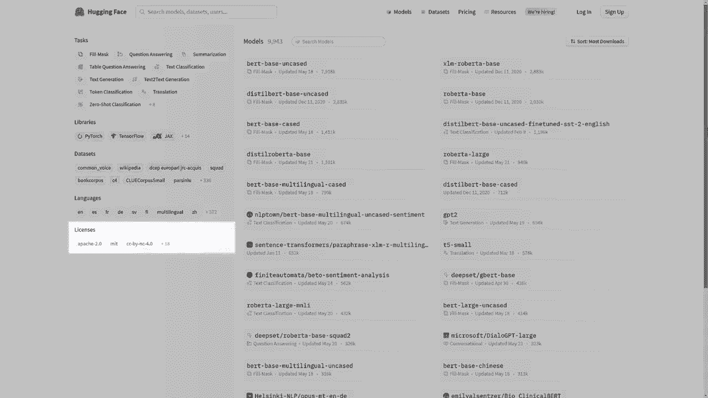

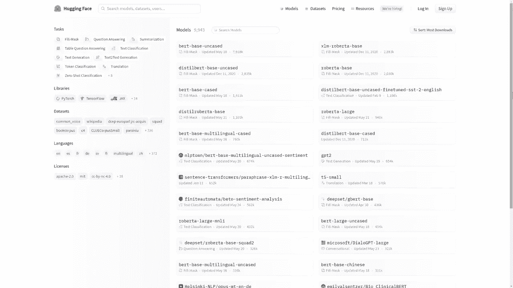

On the right， you'll find the models available on the Model H。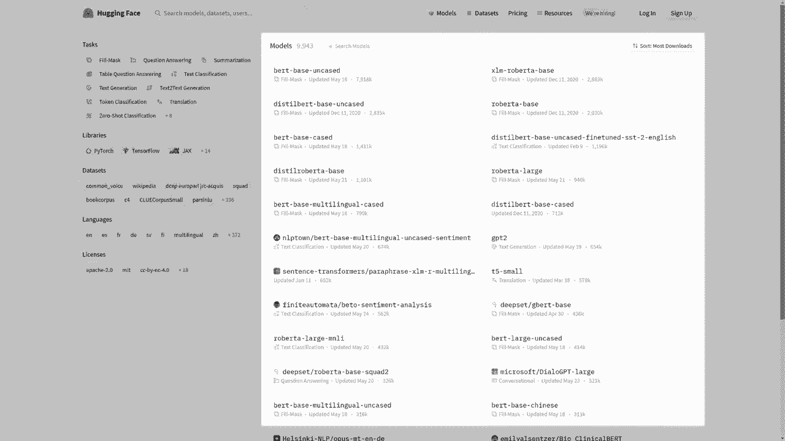

The models are ordered by download by default。When clicking on a model。 you should be facing its model card。The model card contains information about the model。 its description intended use， limitations and biases。It can also show code snippets on how to use the model as well as any relevant information， training。

 procedure， data processing， evaluation results or copyrights。This information is crucial for the model to be used。 the better craft to a model card is the easier it will be for other users to leverage your model and their applications。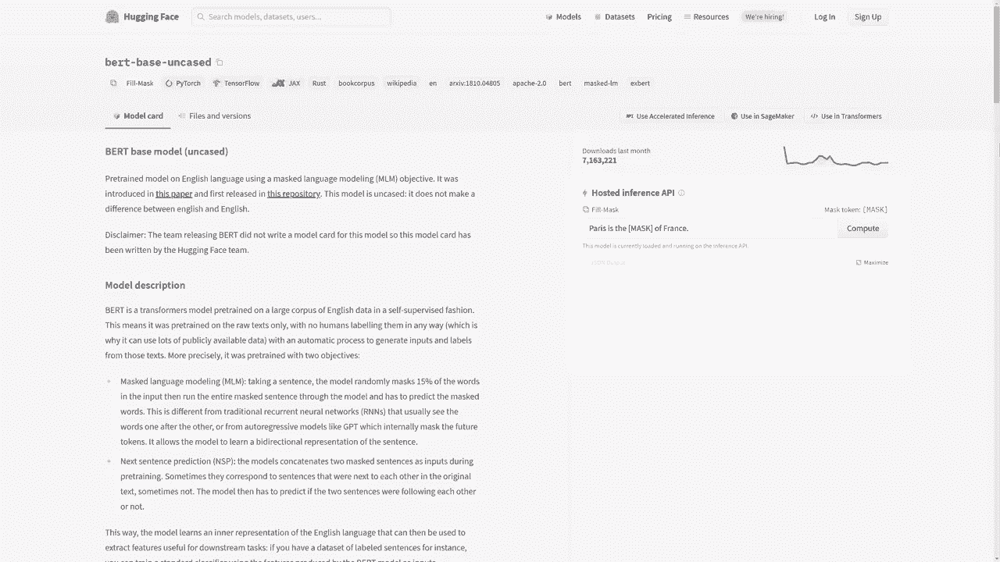

On the right of the model card is the inference API。This inference API can be used to play with the model directly。Feel free to modify the text and click on Comp to see how would the model behave to your inputs。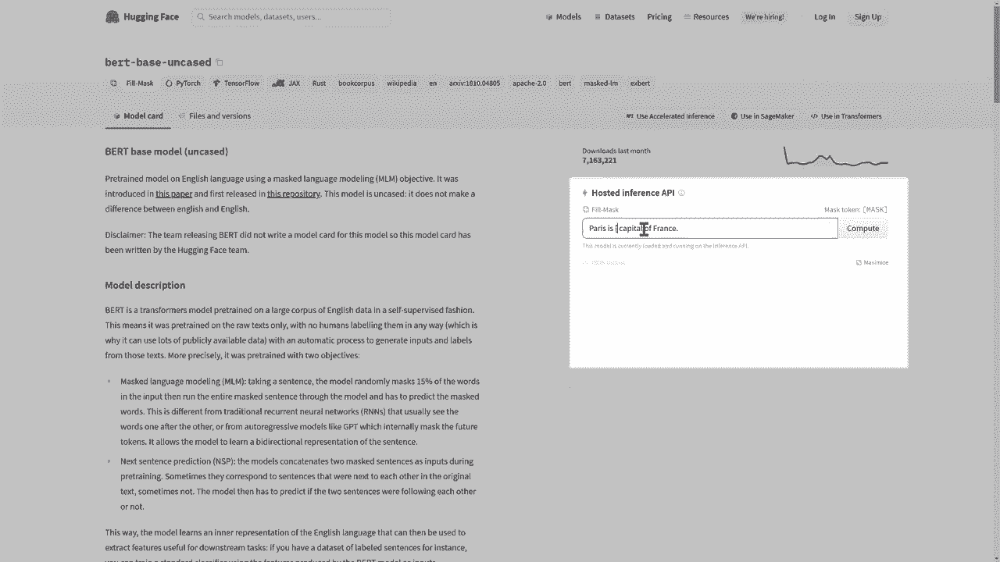

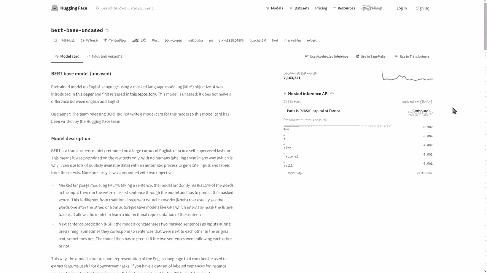

At the top of your screen lies the model tags。😊，These includes the model task as well as any other tag that is relevant to the categories we have just seen。😊。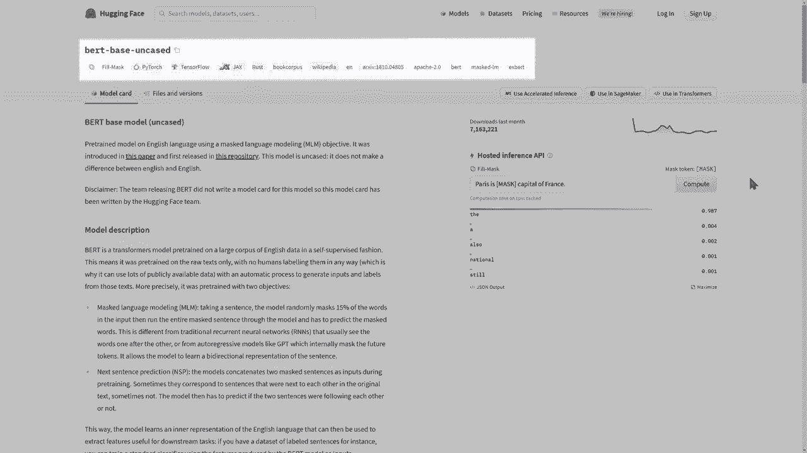

The files and version tab displays the architecture of the repository of that model。Here we can see all the files that define this model。You will see all usual features of a getT repository， the branches available。Do you commit history。As well as the committed di。

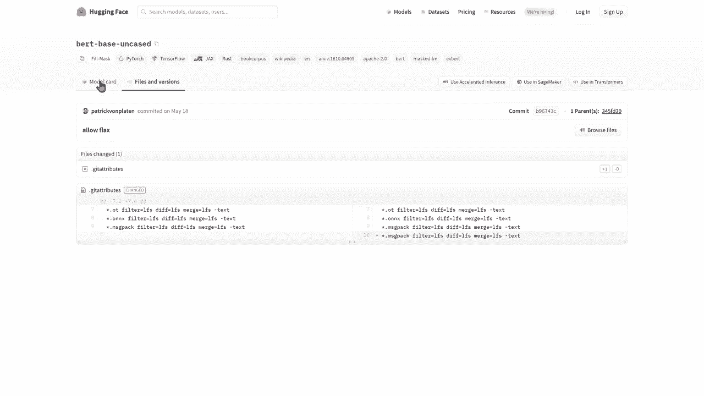

Three different buttons are available at the top of the model card。The first one shows how to use the inference API programmatically。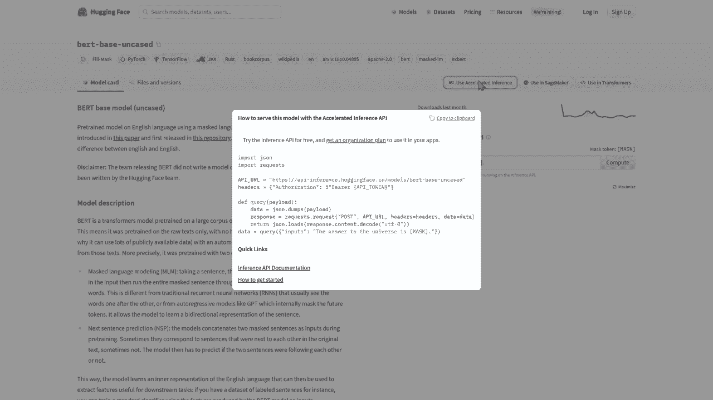

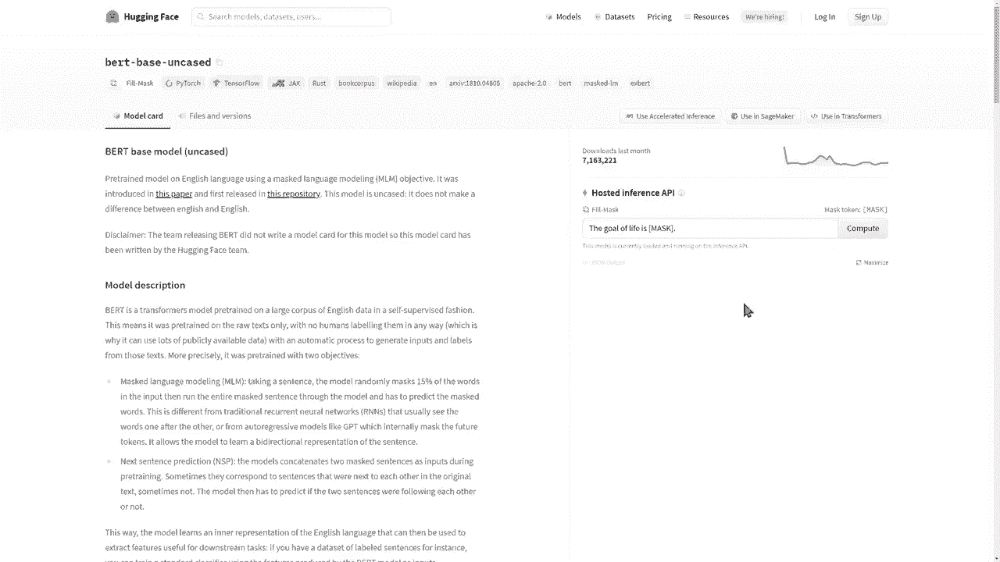

The second one shows how to train this model in sage maker。And the last one shows how to load that model within the appropriate library for Bt。 this is transformers。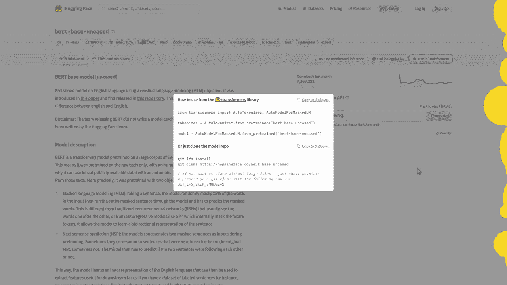

嗯。