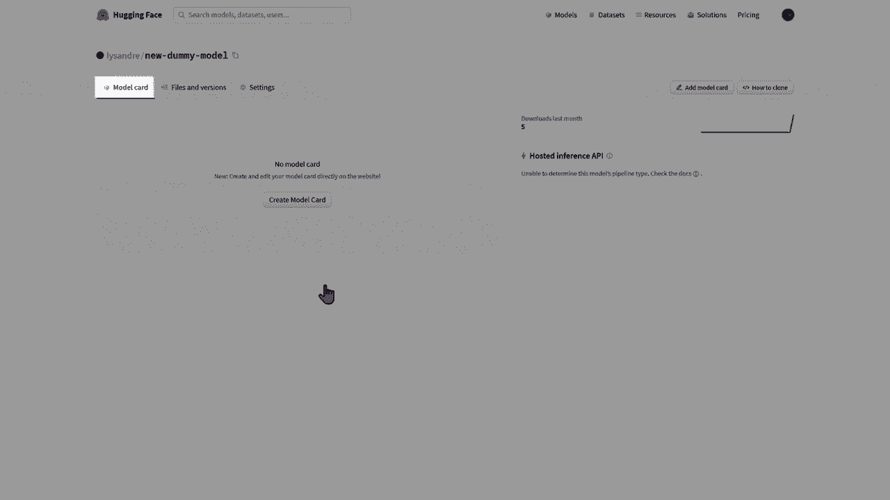
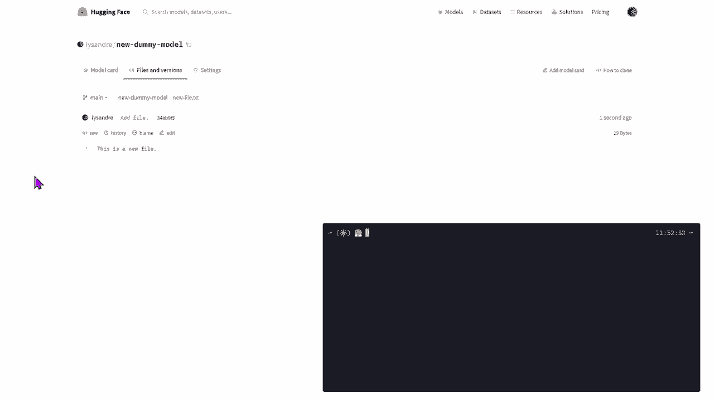
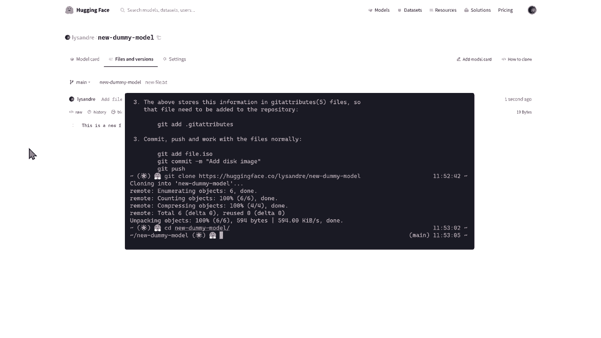
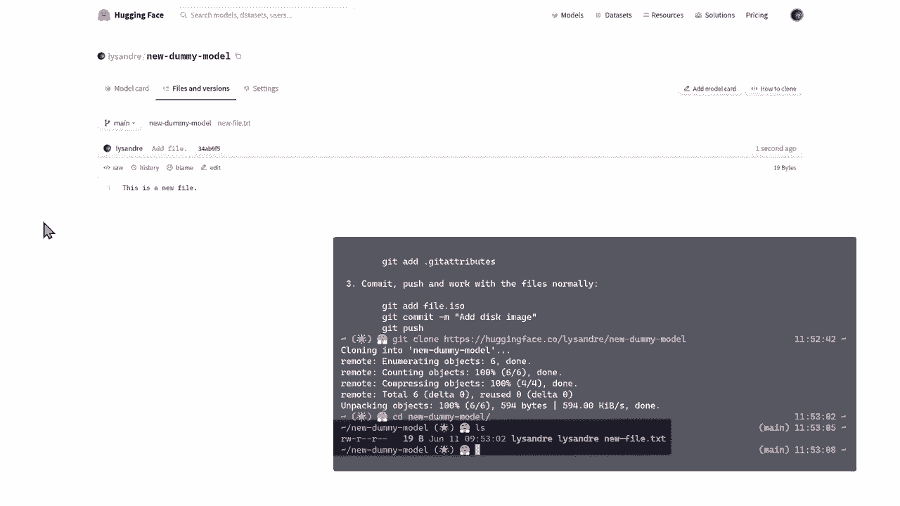
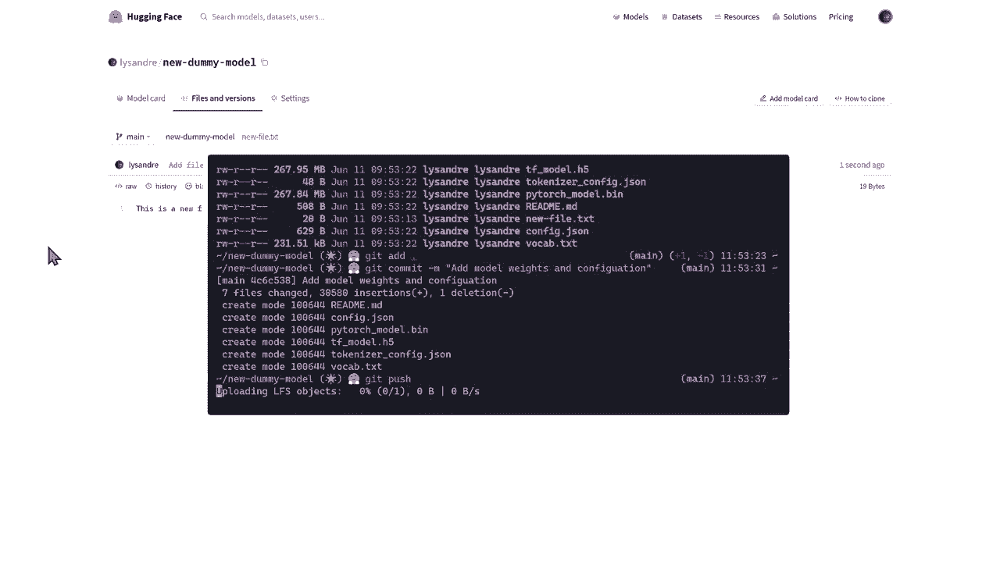

# 【双语字幕+资料下载】官方教程来啦！5位 Hugging Face 工程师带你了解 Transformers 原理细节及NLP任务应用！＜官方教程系列＞ - P32：L5.3- 在Model Hub管理模型repo - ShowMeAI - BV1Jm4y1X7UL

In this video， we're going to understand how to manage a model repository on the Hoging F model hub。In order to handle a repository， you should first have a hugging face account。 aing to create a new account is available in the description。Once you're logged in。 you can create a new repository by clicking on the new model option。

You should be facing a similar model to the following。😊，In the owner input。 you can put either your own namespace or any of your organization's namespaces。😊。The model name is the model identifier that will then be used to identify your model on the chosen namespace。And the final choice is between public and private。Public models are accessible by anyone。

This is the recommended free option as this makes your model easily accessible and shareable。The owners of your namespace are the only ones who can update and change your model。A more advanced option is the private option。In this case。 only the owners of your namespace will have visibility over your model。

Other users won't know it exists and will not be able to use it。Let's create a dummy model to play with。Once your model is created comes the management of that model。

Three tabs are available to you。You're facing the first one， which is the Model card page。

This is the page you used to showcase your model to the world。We'll see how it can be completed in a bit。The second one is the files and versions。Your model itself is a gitT repository。If you're unaware of what is a gett repository。 you can think of it as a folder containing files which can be versioned。

If you have never used Gid before， we recommend looking at an introduction like the one provided in this video's description。The gett repository allows you to see the changes happening over time in this fold。 hence of the term versions。We'll see how to add files and versions in a bit。The final tab is the Settings tab， which allow you to manage your model's visibility and availability。

😊，Let's first start by adding files to the repositor。Fileles can be added through the web interface thanks to the Add file button。The added files can be of any type， Python J text， you name it。Alongside your adult file and its content， you should name your change or commit。Generally。

 adding files is simpler when using the command line。Well show guys how to do this using Git。😊。

In addition to Git， we're using Git LFS， which stands for Git Large file storage in order to manage large model files。

First， I make sure that both Git and Git LFS are correctly installed on my system。Links to Insall Git and GiLFS are provided in the video description。Then we can get to work by cloning the repository local。We have a repository with a single file。😊。

The file that we have just added to the repository using the web interface。

We can edit it to see the contents of this file and update these。

It turns out I have a model handy that can be used for sentiment analysis。I'll simply copy over the contents to this folder。This includes the model weights。 configuration file and tokenizer to the repositor。I can then track these files with the Git add command。Then， I commence the changes。

And giving this commit the title of add model weights and configuration。😊，Finally。 I can push the new commit to the hugging phase。 co remote。

When going back to the files and version tab on the web interface。 we can now see the newly added commit with the updated files。We have seen two ways of adding files to a repository here。 a third way is explored in the video about the pushush to Hub API。

A link to this video is in the description。Unfortunately。 the front page of our model is still very empty。Let's add a readme markdown file to complete it a little bit。This read me is known as the model card and it's arguably as important as the model and tokenizer files in a model repository。It is the central definition of the model， ensuring reusibility by fellow community members and reproducibility of results。

😊，And providing a platform on which other members may build their own artifacts。We'll only add a title in a small description here for simplicityimp's sake。 but we encourage you to add information relevant to how is the model trained。 its intended uses and limitations， as well as its identified and potential biases。

 evaluation results and code samples on how should your model be used。😊。Great work contributing a model to the model hub。 This model can now be used in downstream libraries simply by specifying your model identifier。😊。

Yeah。