# 【双语字幕+资料下载】官方教程来啦！5位 Hugging Face 工程师带你了解 Transformers 原理细节及NLP任务应用！＜官方教程系列＞ - P34：L6.2- Lewis的在线直播讲解 - ShowMeAI - BV1Jm4y1X7UL

So basically the goal of this session is to go through chapter 2 together and in this chapter what we're going to be doing is diving into the sort of internals of the transformers library and in particular we're going to be looking at the sort of models so there's a set of model APIs that we're going to look at and also the tokenizers which we relied on heavily to convert text into a format that the models can process。

And so you've seen in the first lessons that we have。A pipeline API。And this pipeline API basically wraps all of the complexity of pre processing and post processing text and also fitting it to the model so that you just have to basically give it a sentence and then you could classify。

 for example， the sentiment。And today we just want to sort of unpack what's happening inside this function and also to understand some of the different sort of approaches you can take for tokenizing your text and also how to save and load the models and tokens。

And we'll finish by looking at what you have to kind of do when you're dealing with sentences or texts that have different lengths。 because it turns out that in pytorrch and Tensorflow and most deep learning frameworks。 we need a kind of standardized sort of rectangular input for our models。And basically the way we're going to do this is I'm going to go through the sections and then pause for questions。

 but in the meantime， if you have some sort of very urgent thing that you want to ask。 Omar will be here helping us with guidance。So just to give you a taste of like what we're going to be sort of covering but at a higher level。 every single model in the Transformers' library has a corresponding modeling file。 so for example here what I'm looking at is the modeling file for BERT。

And this this file has all of the source code for all of the different tasks that you can use BRT for so for example。 if I look for。Vt model， this is the sort of base class that we're going to be looking at today which is responsible for basically creating contextualized embeddings of the inputs so how do we create kind of numerical representations of our text that have some sense of meaning and this kind of class is relatively simple it just has the embedding layer which you saw in the first chapter so the thing that we pass through before we hit the transformer stack and then we have an encoder and this encoder is essentially responsible for converting these tokens or these token embeddings into these contextualized representations。

And I just recommend sort of let your homework have a look through some of this code。 so any sort of class that you see us using today， for example， BERT model。 have a look at the sort of source code and this really helps you understand how transformers work and at least for me personally it was only by sort of going through this kind of step by step and understanding how all the inputs go through the forward pass that I was really able to understand all the workings of a transformer。

So that's just a little side note。So。To get started。 maybe let's have a look at what really happens behind the pipeline。 so let's kick start with this video。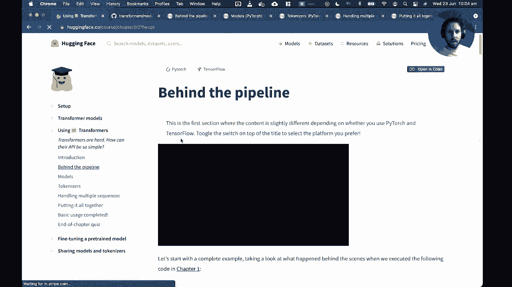

What happens inside the pipelinebra function？In this video。 we'll look at what actually happens when we use the pipeline function of the transformformerss library。Well specifically， well look at the sentiment analysis pipeline。 and now it went from the two following sentences so the positive and negative labels were respective scores。

As we've said in the byprint presentation。There are three stages in the pipeline。First。 we convert the verex to numbers the model can make sense of using a tokenizer。Then those numbers goes through the model which outputs lows。Finally。 the first processing steps transform Voor gets into labels and scores。

Let's look in details at those three steps and how to replicate their using the Transformerss library。 beginning with the first stage tokenization。The to process has several steps first。 the text is split into small chunks called tokens。They can be words。 part of words or punctuation symbols， then the tokenser will add some special tokens if the model expected。

Here， the middle used expect a seal token at the beginning and a sep token at the end of the sentence to classify。Lastly， the token ison patches each token to its unique ID in the vocabulary of the pro model。To load the tokenizer， the transformformers library provides the Utokenizer API。The most important method of this class is from Pretrained。

 which will download and cache the configuration and the vocabulary associated to a given checkpoint。Here， the checkpoint used by default for the sentiment analysis pipeline is distill belt basin case Fiin tuned SSs2 English。 which is a bit of a mouthful。We instant to token associated with a checkpoint and feed it to the two sentences。Since the two sentences are not of the same size， well need to pad the shest one to be able to build an array。

This is done by the tokenizer with the option padding equal。With trucation equal2。 we ensure that any sentence longer than the maximum the model can handle is truncated。Lastly。 the return tensil option tells the tokenizer to return the byythch tensil。Looking as a result。 we see we have a dictionary with two keys， input ID contains the ideas of both sentences with zero where the padding is applied。

The second key attention mask indicates where petting has been applied。 so the model does not pay attention to it。This is all what is inside the took step。Now let's have a look at the second step。三ほど。As sponsor to an either。 for is a notomodal API with from pretrain method， it would download lu and cache the configuration of the model。

 as well as the pertrain weight。However， the Automod API will only instantiate the body of the model。 that is the part of the model that is left once the pro traininging head is removed。It will output a high dimensional tensor that is a representation of the sentences past。 but which is not directly useful for our classification product。Here the tensor has two sentences。

 each of 16 tokens， and the last dimension is the Indian size of our model 768。To get an output link to our classification problem。 we need to use the Automodal for sequence classificationification class。It works exactly as you to model class， except with12 build a model with a classification head。😊。

Praise one auto class for each common NLP task in the transformformers library。Here。 after giving all models of two sentences。We get a ten of size 2 by2。1 result for each sentence and for each possible level。Those outputs are not probabilities yet。 we can see they don't sum to one。This is because each model of the transformformer's library returns look it。

To make sense of look it， we need to dig into the third and last step of the pipeline。Plus processing。To conduct LoAT into probabilities， we need to apply a softmax layers to them。As we can see， this transforms them into positive number that's a to1。So last step is to know which of those corresponds to the positive of the negative label。

This is given by the IT2lipal field of the model conflictg。The first proba is index0。 correspond to the negative level and the seconds index1 correspond to the positive level。This is how our classifier built with the pipeline function peaked with labels and compute those scores。😊，Now that you know how each step works， you can easily tweak them to your needs。

。

So。Let's see。All right， so do we have any questions at this stage about the pipeline？

So one of the things that we saw is that there's these kind of three components。 there's like a pre processingcess stage。Okay， great。Okay great so one of the first questions we have is could you please explain the intuition behind the BRT SST2 English checkpoint and what are the different flavors of checkpoints to be used and how did we choose SST2 Okay great so basically each of the transformer models。

 they have sort of pretrained base or pretrained backbone which I think you saw in the first chapter。And then what we do typically with models like BERT and GP is we fine tune them on a downstream task。So the idea is that you take， for example， BEert which was pre-trained on Wikipedia and the book corpus and then you say。 okay， I want to do classification now so I'm going to basically take these weights that I had in my original model and I'm going to add a classification head which is going to just basically be a linear layer that allows us to do the classification task and then we do the fine tuning step on a particular task。

So if you want to understand a little bit about how the。

The models work or the description of the models。 If we look at Bert and what was this guy called。 this is Bt。三八八八。Uncased， fine tuned。 So uncased。Un tuneed。嗯。And then it's S。 what was it。Fine tuned are distber okay。The stillber。Uncased， fine tuned。What are I missing here？😔。Distill B face and case function indicate。 So if we look at this。

Then what we can see is that this is a checkpoint that was fine tuned on a particular task。 so this task here is called the T bank task。

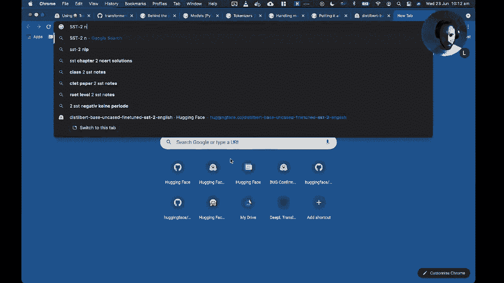

The binary classification benchmark， and I think from memory this is just like a sentiment analysis task which just has label or data given in terms of just two labels like you know positive or negative。So the basic idea of like why did we choose this or the basic answer is that we were just trying to sort of demonstrate how the pipeline works for sentiment analysis and this is one model which is well suited for that task。

So I hope that answers your question， DK creative。And then the other question we have is in this case。 we assume that there are only two classes for classification。 how do we specify a multiclass problem and what checkpoint would use Okay， great。 that's a very good question。So maybe what we can do is let's have a look at the coabab for this chapter。

So here we've got a sentiment analysis pipeline。And of course。 it's just going to predict two classes。 And so now I'm just going to instantiate the tokenizer。And here's the model。Okay， so if we look at a model。😊，Every single model has a config。And this config tells you things， for example， like the number of classes。

 so you can see we've got two classes here。And what you can do when you instantiate a model。 you can define the number of classes you would like when you instantiate the thing for text classification。 so just to give you an example。Let's suppose that I take a checkpoint。For multi class。Now I'm going to do two things here， I'm going to show you first。

 how do we insha a model that we then would fine sharing ourselves。 and then I'll show you the sort of simpler case where we have an existing pretrain model。So if I don't have， imagine I just have my own data set and there's no model in the hub that is suitable for what I want to do。 what I might do is I'll say， okay， I'm going to take distillbert base uncased。

And this is just the pretrain model， there's nothing sort of special about it。 I still have to do some work。And then what I could do is I can say， okay， I'm going to take。First thing to take from transformers。I'm going to import an auto model。 but now I'm going to do it for sequence classification。

 so this is where anytime you're dealing with like text classification or you know multiclass multilabel these things。 this is a sequence classification task。And then what I'm going to do。 I'm going to take my model for sequence classification。And then I can do my usual from pretrained。I take my。Checkpoint that I've got now。 All this new one。

And then what I can do I can pass keyword arguments that will specify how many labels I'm dealing with so imagine that my data set has six classes that I'm dealing with。 so what I can do is I can say the number of labels is six。And now what will happen。

It will download the base model or the pretrain model for distillvert。And it will then add a classification head on top of this model and it will configure it with the right number of classes so that you know we can do fine tuning appropriately so now if we look at our config you can see that it's already initialized the model with six different classes。

And we don't know the labels yet because we haven't provided our own data set and our own labeling convention。 but we could do that。And then from here we could then just fine tune and train the model exactly as we've done。 or we will do in the next chapter， so that's one way of doing it。Now。 the other part of the question is， how do I take a sort of pretrain model or fine tune model from the hub？

And this is a little trickier to figure out like， you know which model is suitable for your task。 So the way I usually do it is I look， for example， at text classification。 so I do a filter here on text classification。And then I sort of like ask myself， okay。 maybe I'm dealing with let's see。Now， this isn't so easy to find a multi class example， so。I think。

 in general。Yeah， so。Actually， finding the multiclass model that is suitable for your task takes a bit of work。 I mean， maybe maybe Omar already knows a fast way to get this。 but generally speaking all of the models that we have here are in some sense， fine tuned on a task。 So for example， like this German sentiment Bt。presumably is two classes and one way you could quickly check that is by looking at the files and versions and seeing in the configuration how many labels you have so in this case there's three labels。

But actually searching for this effectively on the H。 I'm not sure maybe there is a way of doing this。Or maybe this is a good feature we should add in the hub。I am Holmes， I hope that sort of partially answers your question。But if not。 then feel free to write in the chat。Yeah， exactly we should add a feature that is great basically I think what we would like is a filter where we could filter between binary classification multiclass and multilaval and then that would allow us to refine things good question awesome。

😊，Okay， so are there any more questions about the pipelines before we look a bit more at the code？

Okay， so in that case， let's， let's have a sort of walk through this this coab with the pipeline to sort of get a deeper understanding of what's going on。 So we've got this。诶。Example here where we're basically downloading the sentiment analysis pipeline。

And we've got now the classifier， which we can feed these two texts that you saw in one of the earlier chapters。But now what we want to do is we want to understand what really is happening under the wood so remember that the first thing we need to do is we need to process or pre process these raw texts because。

Basically all neural networks can't do operations on raw textex it's kind of like imagine you want to do like matrix multi。 how do you do that on like a string？And so what we can do instead。Is we use a tokenizer？

And one of the key things that you should remember is that if you're doing any sort of fine tuning or any like sort of inference or predictions。 it's really important that the checkpoint you use here is the same for the tokenizer and the model and that's because when these transformers are pre-trained on a large corpus there's a corresponding tokenizer that was also find you're trained in some sense to learn the vocabulary of that corpus and so if you sort of mix and match a checkpoint for one tokenizer and then a different checkpoint for the model。

 basically you'll get a mismatch in the vocabulary and then you'll get kind of garbage in in your outputs so just that's one sort of thing to watch out for。Okay， so we've got a tokenizer。😊，And now we've got these same raw inputs。 and if we basically feed these two sentences into the tokenizer。 you get generally there are two things that you just sort of need to remember。

 You're going to get something called input Is。And these input Is are basically a mapping of every single token in our sequence to a unique number or a unique integer to be precise。 and this is basically a mapping in the vocabulary so imagine that I was thinking about like I don't know the whole English language where I'm just dealing with words then I'm going to have probably several hundred thousand words or tokens in my vocabulary and then if I get like the word whole。

 I would like to be able to match that to number that corresponds to this mapping in the vocabulary。But as we saw， I think in the first chapter， in fact we might see it as well today。 this kind of like tokenization in terms of words is not very efficient and so what we usually do is something a bit cleverer。 but the basic idea is that every single token in this input is going to be mapped to a number and then those numbers allow us to sort of distinguish between different tokens in the sequence。

So that's what input ID are。And the other thing that you're going to see today in more detail is something called an attention mask。 and I'll explain a bit more later on what this is really doing。 but you can already see that it's kind of putting a bunch of ones at some part of the sequence and a bunch of zeros towards the end of the sequence。 and this will become clearer later on。Okay， so we've got the tokenizer。

 so we've now converted our raw text into these Is， these numbers we can operate on。And then let me just make sure I load the correct checkpoint here。So now we're going to load the model， so this is the thing that will process these inputs。And let me just delete this。Okay， and so then the question is how do you feed your inputs to your model so the simplest way is to just take this dictionary that we have here。

 which has two keys， it has input IDs and attention mask。And then we can just use the standard Python unpacking operator to just feed all of the keys and values to the model。And when we do this， this will basically feed the inputs to the forward pass of the model to generate the outputs。And so one way we could look at that， I think we can probably do this。 if we look at the forward。

You can see here in the coab it's showing us basically what the arguments this forward pass can accept。 so it tells us we can accept input IDs， we can have an attention mask and then there are like some more kind of sophisticated or advanced things we could also provide but you know we don't need to do them for today but just so you know there are other things that you can do。

So you can see that， okay， we need to provide at least these input Is in attention mask。😊。And so when we do the unpacking like here， this will basically run through the forward pass and produce some outputs。And as we saw in the video。These outputs are basically called like hidden states and these hidden states are just some sort of like like say compressed representation of the text。 so we're taking this raw text， we're converting it first into numbers and then we're taking those numbers and then we're converting those sort of integers into dense vectors so basically every token is now associated with a vector。

And in this case we've got 16 vectors per sentence， and each vector has 768 dimensions。 and that's just because of the way Bt was or distill Bert as well was pre traineded。So let's have a look at one of these vectors， so we've got outputs。So I'm going to take the first sentence， so that's the first index。

 and I'm going to look at the first token of this sentence and so if you look at this。They must be slices or integers。Ca I need to do last hidden state。 Okay， good。So actually。 let's just take one step back if we just look at the raw outputs。You can see that in transformers。 all the outputs from the models are usually wrapped in an object which is kind of something we can then like you know index by attribute name and so here we've got something called the base model output and then this has in this case it's a single attribute called the last hidden state and the Tensor。

So if I want to then access this last hidden state。Now I've got a tensor。 which has the thing I wanted to do。 So I'm going to get the first sentence。 I'm going to get the first vector or the first token。 sorry the vector corresponding to the first token。 And this is now this， you know。

 huge thing of you know， numbers from， you know， negative to positive。 and this should have。A size of 768， where are we？Yeah。So this is basically the numerical representation of the first token in the first sequence or the first sentence we passed。Okay， so let's just check are there any questions？Okay， cool， so let's carry on。Okay。 so this is basically what the numerical representations are produced by the model。

And then as we saw in the video， these numerical representations by themselves they don't let us do things like text classification。 they just say the numerical representation of this token is blah。 and now if we want to do classification， we need to take that vector or these feature vectors and then we need to add them or combine them with a classification head。And so the whole Transer library is built around this idea of like taking like a model for task X and task X can be things like sequence classification。

 question answering， summarization， translation， so on so forth。And in this case。 when we instantiate a model with sequence classification， as we saw before。 this is now going to create。A model。Which has。A number of labels。 so you can see here we've now got a model with two labels because that's what this pre train checkpoint has。

And then when we look at the outputs。We've now got instead of having just these last hidden states。We've got。Loges。And these logicits are basically what happens when you feed these feature vectors through this linear layer。 this will now compress these 768 dimensional vectors into just two numbers or project them into two numbers。And these are the things that we can then use to derive probabilities and figure out for example。

 which class is the most likely， so you can see here that you know this one here is more likely than this one and vice versa because I think the second example is like a negative sentiment。Okay， so that's more or less how we think about the outputs from a model versus a model with a classification head。

And here what we can see is if we want to convert our lodges from into probabilities。 we can just take a softmax over them and you may remember that the softmax basically takes all of the inputs。 it exponentials them and then it normalizes that exponential by the sum of all the exponentials so you basically end up having something that ranges from zero to1。 so it's a good candidate for a probability。And if we do that。

 we then get now probabilities for each of the two sentiments。And also we now can see this is the way we can map between the label ID， which says。 you know what does zero mean in terms of something that's a bit more meaningful？Okay。 so let's have a look。Let's see。Okay， great， So we have a question from SRM Sumya。

Which says the classification model should take the output from the distiller model that's exactly right so in fact's let's have a look at this。If we look at。Class， I'm doing this for Bert， but it's the same for dist Bt。 So if we take Bt model for。Where the full sequence classification。So if you look at what this model actually has， it has the BRT model that we saw or the distilled Bt model we saw in our example。

 and then it just applies dropout and a linear layer。And linear layer has a dimension of the hidden size of the 768。 and then it's going to compress that into just these two numbers defined by the number of labels。And so if we look down at what happens inside the forward pass。

 the first thing we do is we get the outputs from the BRT model。 So these are just the feature vectors， these 768 dimensional vectors。And then you can skip most of this kind of stuff。 the main point is that。here。We。But but well。 don't worry about the port output， the main thing is that we feed these outputs into the classification head to produce the logicits。

So that's a great question。Yes。嗯。这这。Okay， so we've got a question from Platin Chiba， so。How can we see what the token representation means in the text？So。Cool， so maybe just to show you。 like。Something that let's see， maybe we get ahead of ourselves， but that's okay， okay。We've got these raw inputs which are given by these strings。

 and then we get these input IDs like this， right？And so one thing we could do。If you want to go backwards and we're going to see this later。But what I could do。I can say okay。Tokenizer， and I'm going to decode， so I'm going to do the opposite of what I did before。And now I'm going take my input Ids。And fingers crossed。This need to do input。Hies。

And now you can see by using this decocode method， we're able to kind of reverse the process of the broad text。 but what it does is it also introduces some special tokens， one is called the CLS token。 which kind of just tells you this is like the start of the sentence。 and then we have a Sep token which basically is used to distinguish between pairs of sentences。

So this is one where you can go back from where you started。And yeah， if you have more questions。 we can tackle them as we go ahead。Okay， cool， so that's some the the sort of first look at how the pipeline works under the hood。So now what we could do。Is let's have a look at like the models in more detail。So I'm going to start by watching this video and then we'll pause for questions and then again look at some code。

How to instantiate a transforms model。In this video。 we'll look at how we can create and use the model from the Transformers library。As we seen before。 the Automod class allows you to instantiate a proed model from any checkpoint on the I face app。It will pick the right model class from the library to instant shade the proper architecture and load the weight of the preed model inside。

As we can see， when given a bird checkpoint， we end up with a bird model and similarly for GPT2 or part。Beyond the scenes， this API can take the name of a checkpoint on the earth。 in which case it will download and cache the configuration file as well as the model weights file。You can also specify the path to a local folder that contains a valid configuration file and a model of weights file。

To instantiate the between model， the Automodal API will first open the configuration file to look at the configuration class that should be used。The configuration class depends on the type of the model， B， GPT2 or partt， for instance。Once it has a proper configuration class， it can instantiate that configuration。 which is a blueprint to know how to create the model。

It also uses this configuration class to find the proper model class。Which is then combined with the loaded configuration to load the model。Its model is not yet a pro model， as it has just been initialized with randomdom weights。The last step is to load the weight from the model file inside this model。

To easily load the configuration of a model from any checkpoint or a folder containing the configuration file。 we can use the autoconfig class。Like the Automod class。 it will pick the right configuration class from the library。We can also use a specific class corresponding to a checkpoint that well need to change your code each time we want to try a different model architecture。

As we said before， the configuration of a model is a blueprint that contains all the information necessary to create the model architecture。For instance， the bird model associated with a bird based case checkpoint has 12 layers。 a hidden side of 768。And the vocabulary size of 28996。Once we add the configuration。 we can create a model that has the same architecture as a checkpoint， but is randomly initialized。

We can vet training it from scratch like any by doch model。We can also change any part of the configuration by using keyword arguments。So sequence snippet of code instant shades a randomly initialized layout model with 10 layers instead of 12。Saving a model once its trend off fine tune is very easy。We just have to use the safe between method。

Here， the model will be saved in a folder named My beltt model inside the current working directory。Such a model can then be re using the from between method。To learn how to easily approach this model to the a， check out the push to video。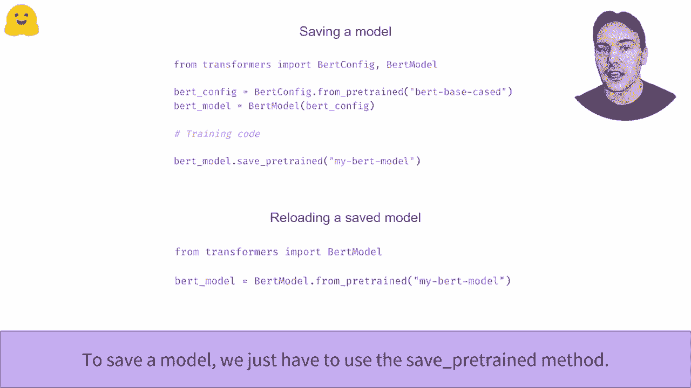

。So any questions so far about the model like loading and saving models before we dive into some code？

So。Just to sort of summarize what we saw in the video。 whenever we do this from pretrained method with a model。 we first need to get a config and then we saw that config just a couple of minutes ago。 it defines things like the mapping of the labels to the ideas and how many labels the model has and all that kind of stuff。

 how many layers all those things， and then that config is then used to load the weights of the model so that it makes sure that everything is kind of configured in the right way。And then once we have。This model， we can then save it and then use it for other things。So。

If there's no kind of urgent questions right now， I'll have a look at。The models code。 just as a mentioned， you can watch these videos and your own time and work through this kind of text。 but I think it might be sort of more useful if we just have a look。

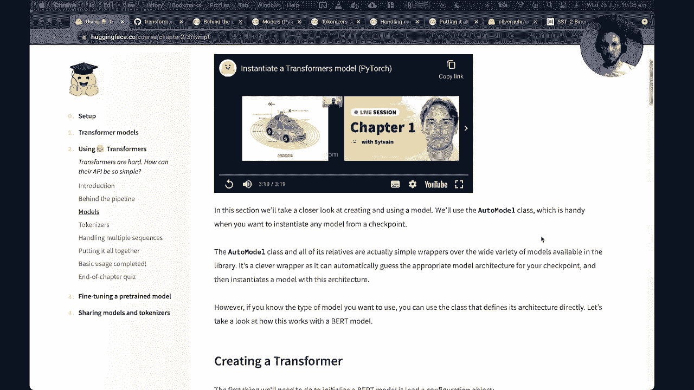

At。At the code， so。嗯But but but。Let's just check， I can run transformers。ok，所。One thing maybe to mention is。A really common example or situation that youll find yourself in is you basically you've trained a model and now you want to share it in some way and the sharing typically at least when I was working in my previous company。

 it was much more about deploying this model so that you could serve it or produce predictions that other services could consume。And so once you've saved your model， the question is， okay， what the hell do I do with this thing？😊。And as we can see here， this save thing will basically save two objects。 it will save a configuration JO file， and it will also save a Pytorrch model do bin file。

 and this is something in Pytorrch called a state dictionary which basically provides all the information for the layers and the weights。And so if we want to use this in like to produce predictions。The first thing we need to do is what we've always been doing is we take some input text。We convert it into input IDs。And then we need to convert those input IDs into tensesors。

 which we can then feed to the model。And so previously what we were doing was using like the tokenizer。 and that's exactly what you would also do in practice。 but in this example。 we're just showing the outputs of the tokenizer。So let's have a look at what that looks like in code。So Is check if there are any questions， okay？Okay， so。😊，嗯。😊。

Maybe just to quickly summarize we've got you can also load your configurations using two different things。 you can either load your model directly from one of the default configs in the library and then this will provide you with like you know a kind of summary about the hidden size and so on。

But if you do this， the model is completely randomly initialized。 which means all the weights are just random and this model is going to just be garbage。 it's not going to help you make any good predictions and this is what you do actually when you want to pretrain a model or you want to really train a model from scratch。嗯。So in practice， most of the time， what you're really doing is using the from pretrained and then this will initialize the model with the pretrain weights and the correct head if we need it。

So if we wanted to do， say predictions， let me just instantiate this。So let's suppose that I've got my model and I'm happy with it and so I want to。Save it so I can deploy it somewhere。So let's just wait through this model to download。Okay， good。 So then what I could do is I could save my model， and this is just some path on your your on your machine so。

If we now look。Inside the file system。We can see that we've got a directory called directory on my computer。 So now if I have a look at what's inside that directory。I've got these two files。 I've got this config Jason， and I've got this like binary file called Pythtorage model。And so。What we can do now is we can take that folder and we can you know wrap it up， zip it up。

 put it on a machine。And then if we want to get new predictions。Then what we do is we take our tokenized inputs。We then feed those or convert them into a tensor because all the ptorch models expect towarch tensors。And so if we look at this model inputs。It's just going to be a tensor。And then we feed these inputs to the model， and then this is now what would constitute a prediction。

 and then you can you know do whatever you want with that prediction。 maybe use it to make some sort of decisions or maybe use it to feed a dashboard。 basically the skysal limit。And that's more or less like sort of， you know。 how you generate predictions，' pretty straightforward。So let's have a look。

 We've got a question here。Out of interest， how long would it take to train Bert from scratch and can you do it on coab？

Okay， so。I think if you it really depends on the size of the corpus that you want to use So for example。 Bert was trained if I'm not mistaken on all of English Wikipedia。And a corpus called the Books corpus， which is sort of scanned library books。And。I think。Let me think。So， you know let's do something like this let's why don't we find the answer so on the fly because I don't remember off the top of my head how long it took them to do it。

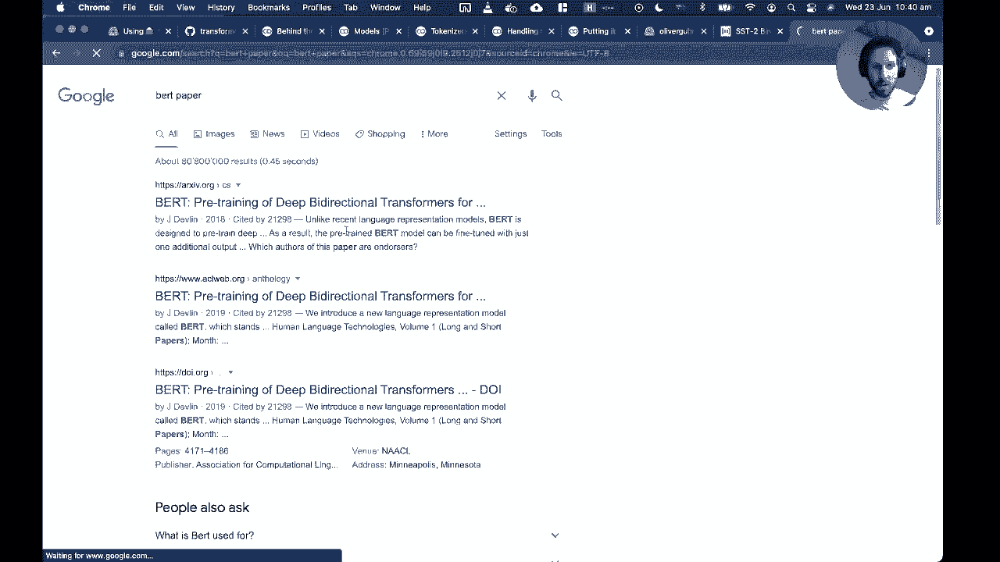

And there's nothing better than live。Reading papers。

Okay。😊，So， here's the book paper。And let's have a look at， I'm guessing they use TPUs。Okay， so。They say here that they trained BerRT base on four cloud TPUs， so this is 16 TPU chips。And each pre training took four days to complete。So。I think from memory。 the cloud TPUs you get on coabab are just one TPU chip。So sort of roughly speaking。

 it would take you maybe 16 days，16 times 4。 So 64。Days to train on curtL。You know。 with the same corpus。嗯。😊，But。I don't think so。 Yeah， I'm not sure if there's a quick Bt training。 However， I will show you something。

There's a blog post by Huging face。Let's see on training。

A model on Esperanto， so I'll chuck this in the chat。So。Can I do that？Okay， so this blog post。 it uses a slightly older API， but the basic idea is to show you that you actually can train in a coab a BERT model as long as your corpus isn't too big。 so this is Estoranto which is a special language that is you know has much less text than English。But I think from memory， this was trained。In just an hour and a half， maybe a few hours。So let's see。

ちて。Okay， maybe we don't see it here。 We just have to look at the coab。嗯。Let's see。 So the training of this model。Okay。So yeah， this training took。Almost three hours。So it really kind of depends on the size of your corpus， so in principle you can。 but if you want to do something that's like say as powerful as Bert。

 then you're going to need some some more serious hardware。Okay。嗯。So there's another question by I am homess I understand that transfer learning or using a pretrain model is the way to go instead Yes。 that's exactly right so the sort of real power of like transformers and NLP sort of nowadays in general is that we don't really want to do pretraining ourselves because again it's expensive and time and takes a long time so I would almost always use a pretrain model if I can。

The only time you might really be stuck is if you're dealing with like a domain that's very different from any pretm model that exists。For example， suppose I was trying to train a model on like source code。So you know。 in the early days of transformers that there weren't any pre-trained models on source code。 like you know trying to for example， understand Python the language and so then you know using BERT base like on English and then trying to transfer to source code might be a bit tricky it might not give you very good results and so if you you trained on a source code corpus that would give you better results。

And the other example where you generally need to find an alternative is if you're dealing with like a language that is not one of the sort of commonly supported ones。 so my understanding is that there's like many languages for example， in Africa。 which aren't really represent it highly in Wikipedia and so then this is hard for people to train models or train transformers on and then you typically need to do some sort of tricks to like take something that is like multilingual like a multilingual version of BERT and try to somehow adapt it to your language but these are generally more advanced things that we can talk about later。

Okay。So。Let's see。 So where were we We have looked at how we can another question。 can we change the config parameters of a pretrain model and use it？诶。Yes， but with some caveats。So。For example。Let's think about what can we change and what can't we change？So。嗯。I want to make sure I don't say something silly。Let's have a look at the model config we have here。

So this is the。This is the config associated with Bert Bates。And here you can see that there's a bunch of hyperparameters。That were associated with the pre training of this model。So。For example。Let's see。So I have a suspicion that if we change many of these things。

 we're going to break the model in a non trivial way。However。Let me think。What happens if we change the number of hidden layers？😔，So you know what。 let's try the usual way of doing things in deep learning is just to try。So。I'm going to try to change。 So， so Bt has a number of attention heads。

 so I'm going to see what happens。If I reduce the number of tension heads from 12 to6。Let's see。If this works。So let's have a look at the config to make sure that worked。So now we've got attention heads six。Now， what happens if we try to feed some inputs to this model？

Okay。😊，Okay， so。Interesting。Okay， so。It seems that we can change the config and things work in the sense that we don't get errors。But I have a suspicion that like hacking into this in a pretrain model would affect the the kind of performance in some non trivial way because。

If we think about like what happens when we do something like text classification。 we're taking the whole like base model of BRT and then we're just stacking on top of this the classification head。And if I start kind of like you know， doing an like dissecting Bt into pieces or something， you know。 reducing the attention heads or changing the number of transformer layers。

 so Bert has 12 encoder layers。I have a suspicion that I would probably have some sort of non trivial or negative impact on the downstream task。 like classification that I want to fine tune on。But maybe Omar has a different insight here。Okay。Soir。That's a good question I've actually never hacked into a pre trend model this way。Maybe you could try and see you like do some experiments like what happens if I completely change the number of layers the number of attention heads invert and to try to do classification like sentiment analysis。

 do I get better or worse performance？I have a feeling it would be worse。 but it'd be a cool thing to check and if you do check please share it on the forum。Okay。So that was the look at sort of how we generate predictions。 let's now have a look at the tokenizers。In more detail。So。Let's。Ccroros our fingers that the Internet still works。

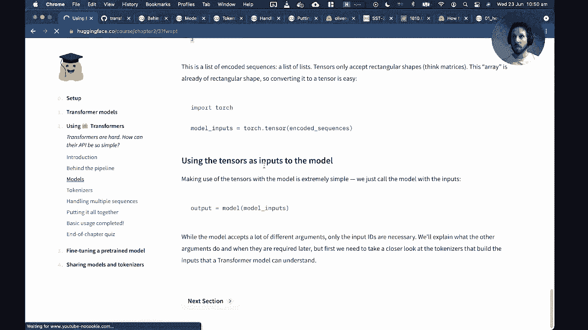

Okay。

In the next few videos， we'll take a look at the tokens。In natural language processing。 most of the data that we handle consists of raw text。 However。 machine learning models cannot read or understand text in its raw form。They can only work with numbers。So the tokenizer objective will be to translate the text into numbers。

There are several possible approaches to this conversion。 and the objective is to find the most meaningful representation。We'll take a look at three distinct organizationization algorithms。 We compare them one to one。 So we recommend you take a look at the videos in the following order。 first， word based。

 followed by character based， and finally， sub word based。😊。

Yeah。

嗯。Okay， so。つけられです。Okay so that was like a high level overview of what we're been talking about that there this general process we have to go through of converting text into into numbers。There's a bunch of videos in this section that you can look at。 which show the different types of ways you can tokenize text。嗯。😊，am I all right。 can you guys see me or not？Can you。Okay， good， great。Oh good。Yeah。😊，The joys of Home office， okay。😊。

What I was saying is there are different approaches or strategies you can take for tokenizing text and the advantages and disadvantages of them just depend on the application you're interested in。So I'm not going to go through the videos， you can watch these yourselves。

 but let's just have a quick look at the sort of three most popular approaches。So the sort of first thing I might imagine is if I got like a text like Jim Henson was a puppeteer。Then what I might do is say， okay， I just want to split this text into words。And in English。 a simple like trick to do that is just to split on white space。 So most of the time in English。

 if there's a white space， that's the boundary between words。And then this would convert。 for example， Jim Henson was a puppeteer into these five tokens， so in this case a word is a token。But there are like several languages where this is like a terrible idea， so for example。 if you have ever learnt Japanese you have characters called Kanji and these kanji don't have any words for any space it's just a sequence of Kanji and in general they're actually not even written from left to right they're written from top to bottom。

So doing this kind of splitting or tokenization in terms of white space just wouldn't work。And so an alternative approach is to try something called character based。 so this would be like imagine you just split every letter in an English sequence into its own token。 and this would actually be then quite good for Japanese because every character is a kanji character which then you know we could represent with a token。

And so the kind of thing you can see here is that it really the sort of tokenization strategy seems to really depend on the language that we're studying。And so。The thing that like a lot of research has gone into is trying to find something that gives you like a good trade off between these two kind of extremes of word tokenization and character tokenization。

And maybe I should also mention a couple of drawbacks before we go into that。 so one of the drawbacks with word tokenization。Is that this will create a vocabulary which is the size of the number of words in our language。 so basically if we have imagine we just tokenize English。 then we will need a token for every single word in the English language and this sum this is generally huge it's going to be several hundred thousand tokens which makes it very like computationally expensive。

But the other thing that's kind of not great about this is that it doesn't make any sort of distinction between like like I don't know。 dog and dogs， which are kind of like， you know， similar words and we're kind of representing them now with two independent tokens。

So that's the drawback with the word ones and the character based ones have the drawback that the model has to basically learn what a word actually means because the only thing it gets now characters or it gets character tokens。And then it has to figure out over training that， okay。

 if I put together these characters in this order， this seems to represent like a more abstract object like a word。 and so this at least for English would be not a great strategy。So most tokenizers。 they use something called subword tokenization。And the basic idea is that instead of like just splitting on word boundaries or on characters。 you basically split or you decompose a word into sub wordss。And an example here is like。

 let's take the word annoyingly， so annoyingly can be represented as maybe two sub wordss。 annoying and Lee。And then what we can do is we can just kind of collect the frequencies of these subwords and then use this to figure out basically what I like the most frequent subwords in the language and then we can use those sub wordss to build back the full word itself。

 so if you know that you've got annoying and Lee， you can then reconstruct annoyingly from these two components。And so like I guess there's an example here， you can sort of split。 let's do tokenization into these subwords so that you can see this is kind of a mix of a wordtoken with a subwordization。 and we've also got the exclamation mark being treated as its own separate token。

And the sort of most common tokenizers that you would see， there's a good question。 I'll get to that are things called word peace， which is the one that Bert used or sentence piece。 which is the one that GT and the GPT models are typically use。So there's a really good question。 how do you design the subweb boundaries， is it manual？

So this is more or less determined by the algorithm that you choose to use。I think。Like in general。 it's a mix of like manual rules and also learning a form of learning from the corpus。 So let's have a quick look at。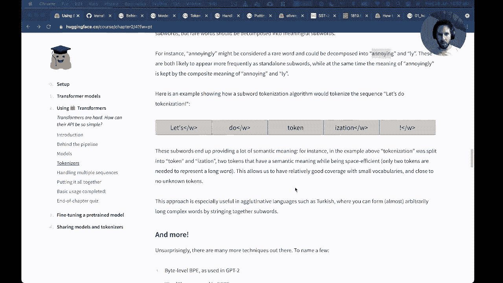

LetSee， I think it's the sentence piece paper。

这这这。So this is， I'm going to put this in the chat。Okay。 so this is one of the most famous papers on tokenization。And let's have a quick look at。So how are these boundaries。Okay。嗯。Yeah， that's right。😊，That's what I remember from this paper。 So they say that historically， most like tokenization。Algorithms。

 they were they used manual rules and the problem with this， of course。 is that for every language in your during set of rules and it's a real like pain to。To sort of maintain and extend。And so if I'm not mistaken。 sentence piece is kind of like a learned tokenizer。

 so you actually have like a sort of optimization objective and then you train this like you train a model and so by training this on your corpus。 you actually learn the word boundaries。嗯。😊，But I haven't read this for a few years。 and I might be forgetting something but。Yeah， that's a good question and I think it may something that we can add in a future version of course。ok。😊，So。Where were we， So we were looking at these different tokenization strategies。

 So let's maybe look at the coab。嗯。So。One of the things I often like to do is to sort of capture the outputs in my piping stools on coLab so I don't have this humongous。没。Of installation。Okay， so what you can see here is what we were talking about before。

 this is if you just do word peace tokenization oh sorry word splitting into words and now we can have a look at like what the BRT tokenizer does。And there are two ways you can do this in transformers。 you can specify the specific class that you want to use for the tokennova。And this is if you know happen to be maybe doing something very specific and you really you want to make sure you get the ver organizer。

But the thing that I personally use all the time is just the auto tokenizer because this will automatically convert the tokenizer into this class anyway。 so if I provide a checkpoint and it can identify that， it will then automatically load it this way。

Okay， so if we take a tokenizer。It converts the text into these input IDs。But now let's have a look at something here。So why are we doing this twice？😔，Okay。Okay。 good so what we're doing here is we're just taking a sequence of text and then we're extracting the tokens as a list and so you can see here。That in the case of BERT， which uses this word piece tokenization algorithm。

The way it distinguishes like words from sub wordss is using this double hash symbol。So you can see here that in the vocabulary of the Bt tokenoer。It has learned that it's good to split words between trans and everything else and if we wanted to reconstruct these two words。 we just need to know that this double hash means that this former belongs to trans to build transformer。

And so one way you can reconstruct the sentence is you can take your tokens and you can convert them back into input IDs like this。 so this will create these IDs， and then you can decode these input IDs to build back the original string。Another way you could do this is let's have a look where we have our inputs。とて 왜。Okay。 so another way you could do this is if I take my。Tokenizer。And I just tokenized my sequence。

Then this produces what we saw before。And then what I could do is I could go tokenizer。decode。I put my inputs and my input Is。And this should return what we saw before。 And now you can see the difference between this approach and the one here is we don't have these。Special tokens， so if you don't want these to be present， I think we can do skip special tokens true。

And then this will give us back the original sequence。Cool。 so that's some more or less like a sort of deep dive into the tokenizers。嗯。😊。Maybe one thing to mention， let's have a look at a different tokenizer so you get an idea of。What you might also see。 So let's find a GPT model。That is not going to block the collab。So， G to。

Let let's do maybe this one。So I'm going to just take a tiny GPT。 you can also copy the name of the checkpoint， which is quite handy， so we are here。So what I'm going to do is I just want to show you the difference between the GPT model and the way it tokenizes。 so hopefully this works。Yeah， so GPT has a kind of very quirky。

Tokenizer where it uses this weird symbol， it's like a G with a little like thought on top of it。 and this is what it uses to indicate that there's a white space between this token and this one。So you can see that it's saying， okay。Using， and then there's a white space， then R。 then there's a white space and then trans， but then former has no white space so if we wanted to reconstruct this。

 we just stitch this back to this。But then there's a white space with a network and so on。 and so you can see this is kind of quite different to the Bt one which basically treats every token as having a corresponding white space unless we have the two hash symbols。

 whereas GPT2 is kind of the other way around it says。 assume no there is no white space unless I put a special symbol like this。Okay。 so are there any questions about the tokenizers？Okay， okay， so let's now have a look。At how we can handle。Multiple sequences together。I'll start the video。

How to batch inputs together in this video， we also see how two batch input sequences together。In share all of the sentences we want to pass through our model won't all have the same length。Here we are using the model we saw in the sentiment analysis pipeline and want to classify two sentences。When tokenizing them and mapping each token to its corresponding input ID。

 we get two lists of different length。Trying to create a densor or an Mbi array from the list will result in an error because all arrays and densils should be recangular。One way to overcome this limit is to make the second sentence the same length at the first by adding a special token as many times as necessary。

Another way would be to trun gate the first sequence to the length of the second。But you would then lose a lot of information that may be necessary to properly classify the sentence。In general， we only truncate sentences when we are longer than the maximum length the model can handle。The value used to pad the circum sentence should not be picked randomly。

The model has been portrayed with a certain padding ID， which you can find in tokenazizer。pa tokenite。Now that we have p sentences， we can make a batch with them。If we pass the two sentences to the model separately and patch together however。 we notice that we don't get the same results for the sentence that is pad here the second one h is that a bug in the transformers library now if you remember that transformers will all make easy user of attention layers。

 this should not come as a total surprise。When computing is the contextual representation of each token。The attention layers look at all the other words in the sentence。If you have just a sentence or the sentence with several padic tokens that it。 it's logical we don't get the same values。To get the same results with or without padding。

 we need to indicate to the attention layers that we should ignore those padding targets。This is done by creating an attention mask， a tonsil with the same shape as the input IDs with series and ones。Once indicates the tokens the attention layers should consider in the context。 and the the tokens we should ignore。Now， passing this attention mask along with the input ID will give us the same results as when we send the two sentences individually to the model。

This is all done behind the scenes by the tokenizer when you apply to several sentences with the flag padding equal to。It will apply his bedding with a proper value to the smaller sentences and create the appropriate attention mask。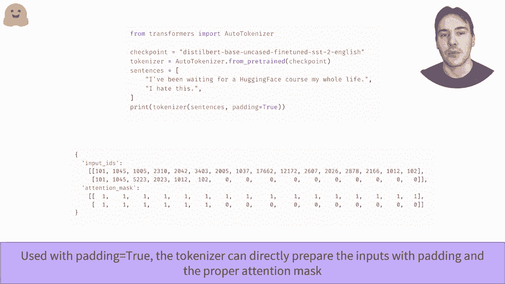

Yeah。Okay， so I see we have a couple of questions so the first question from IM homesmes。 I don't understand why we needed the extra dimension。Based on the error message that has returned。 how would you troubleshoot to determine that you needed another dimension？Okay。 so I think the best way to look at this is probably with some code， so let's go here。😔，And。

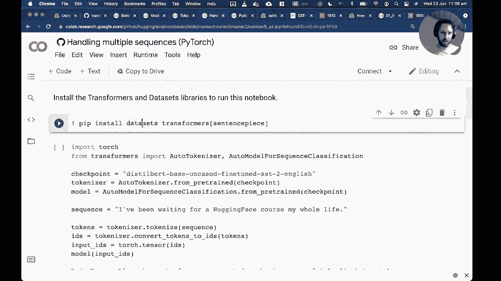

Install transformers。

Okay， so。If I understand the question from O homes， you're talking about this error message。 Let's see if it is reproducible。Okay， good。 So I think you're talking about this index error。That we're getting here。So let's have a look how we might debug this。So the error is saying that the dimension is out of range。And we expected to be in the range -1 to 0。

 but got one。So let's have a look at what the shape of our inputs are。 This is sort of how I would debug this message， so。Okay， so we can see that the。The input IDs have a size of just 14， and that's just representing the 14 tokens that we get when we tokenize the sequence。嗯。😊，So I'm going to show you a dirty secret of how most software engineers debug stuff。

 so you take this。And you checkuck it into Google。And then you go， a， this looks like a pythor ch。And then we have a look and we see if someone can explain what's going on。Sorry。You can see some message， someone has a thing here， getting some dimension at a range error。U。 and then okay， this looks like it's like a deeper issue in pytorrch， maybe that's going so helpful。

But then maybe let's look a stack overflow this is often where you'll find a good answer。 so someone is getting the same kind of error and let's see what someone told them in the answer。So they're saying that you're giving a 1D tensor to this thing， but it expects this kind of object。So let's see if that is kind of relevant to what we're doing。So。If we look at the error here。

 it's saying that at some point in the stack trace。We tried to compute sequence length。By taking the size of the input Is。And then we actually tried to access the second dimension of the input IDs。And so if you look at。The the size that we provide， it only has one dimension。 so basically。 I can access。Size 0， because that's the。The the first first dimension that's available。

 I don't know why coab is so slow。However， if I tried to access the second dimension of a one dimensional object。 then that's not possible， so it's going to throw this kind of error。For some reason。 CoAab is acting really slowly， I'm just going to restart it。See if can do that。More interesting。So let's see， is it intent。Interesting， so coabab， okay。Let's see。I spin up curl again。

Maybe I have too many colorss open。Okay， let's try again。So。你 to。Andst this， okay。 fingers crossed this works。Sorry for， okay， good。We're trying to debug this error。 and we see that the stack trace is telling us it's here。 And the problem is that we're trying to。Determine the size， or basically we're trying to pick out the size of the dimension in the second component of the input IDs。

But the problem that we have is that the input Is。I only have one dimension。 so their size like that 14。And if we access the first element， we get 14， that's good。 but if we access the second， we're going to get the same error。And so here we're seeing that the problem is that we need to basically provide a batch dimension which says that we're dealing with one sentence。

 which has a sequence of length 14。 So basically most of the inputs。The input Is。Ids should have。Shape。Thattch size。And then secrets like that。No。Does that answer the question， I'm Holmes？

I think that was a bit of a convoluted way of debugging， but that's more or less how I would do it。嗯。Cool， so then there's another question from SRM Sma about can we modify the padding technique？

So the answer is yes， and let's have a look where we do padding。あった。Okay。 I'm going to just make this up。Okay， so let's have a look。So I've got a tokenizer。And if I just take a sequence like this。I'm going to get these input IDs。And so then the question might be， if I add some padding。

Then what what's going to happen to my input is so basically this should I think just in this case。 provide no no padding tokens。So what I'm going to do is I'm going to create。Two sequences， so。My dog。Is called photo。And then another sequence， which is like my cat is。Is cold。Something really cool， like。I know， Eliza。So now I've got these two sequences。

 one is shorter than the other。So now if I pass these to my tokenizer with the padding true。You can see that what happens is in the first sequence， it takes the normal tokens。 and then it adds a bunch of zeros to the end。And the number of tokens it adds is just designed so that it matches the same length as the longest sequence in the。In the in the inputs。Now the question is。Kind of like what strategy can we do？To do that。

And let's see， I think we can do do。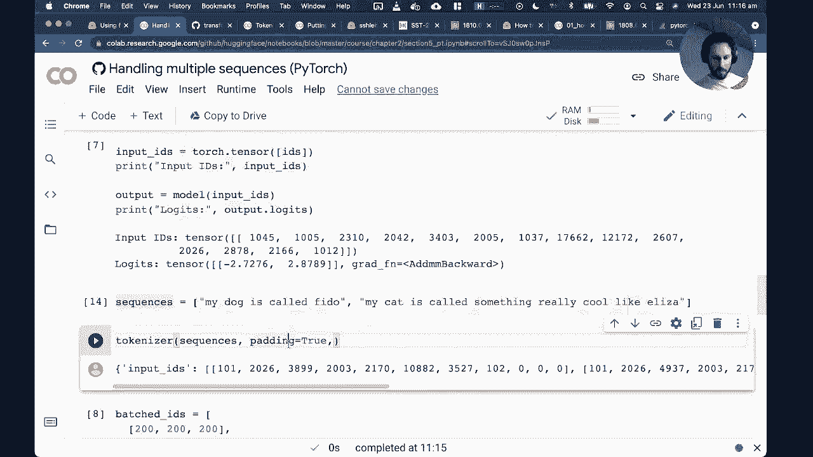

So what I'm going to do to find the actual argument I need is I'm going to go to transformformers。

And I'm going to look at padding because I can't remember how I pad on the left。So maybe is it。Ptting arguments for pretrain。To。So， look at the source code。ok。So I can do longest max length。Interesting， so okay， that only will give us the options。 for example， if I do。Max length。Then this will pad to the maximum length of the whole model， so the model， which is Bt。

 can process 512 tokens。And so this will process huge number of zeroes all the way out to the length of 512。And the other option that we have here is Longest， which is the default of just the longest example in the inputs。But let's see how we've pad to the left。嗯。I remember。We can do this。うん。Okay， so。Let's see。 So we can take in the input。Padding strategy。And。Had to multiple。嗯嗯。I was。

I was pretty sure that I can pat on both sides。So， let's see。Thanks， Oma has the answer， great。😊，So。 so then we can do this。 We do padding true。And then， patting side。Equals left。Interesting。 did I do wrong。Maybe it's only for some。Tchkenizes and we can do this。Okay， so padding inside。So here we can see that their default values to pad should be right or left。

And this is for the pre trained tokenizer。Interesting okay， let's do this， so。Let's see。Sorry for this live hacking。So let's have a look。 If we look at one of the attributes of the tokenizer。 it's called padding side。And here by default it's right。 so I can override this attribute by saying make it left。So it's not a keyword argument。

 it's an attribute of the tokenizer， that's what I was missing。And so now you can see indeed。That we can pad to the left。So I think that should answer the question from SRM swimmer。Thanks so much for the help with that。嗯。😊，嗯。Thanks Dk crazy do you see what it's really like in the real world all right so let's see so the question follow up question is will it have an impact in the attention mechanism Okay that's a really good question so。

😊，The reason we have， so there are two things going on here， so on the one hand。嗯。😊。There's the padding which we need to do so that we can make sure all the inputs are basically a rectangular array。 and that's just the way that we need to do things like matrix modificationification。In the in the network and。So once we introduce padding。

 we introduce the problem that Sylvan mentioned in the video。 which is that the attention mask or sorry the attention in general will attend to every single token in the input。 so you know in this case here every single one of these zeros in principle is a token which has its own embedding and then when we calculate attention we basically do a pairwise multiplication of every token with every other token in the sequence。And that would be a problem because this would sort of say to the model， hey。

 I've got these three tokens， they seem to be related to each other and then when I construct my kind of representation at the end of the encoder。 this would have this kind of like artificial like information from padding and we don't really want that because you know padding was something we just artificially injected。

And so the thing that Sylvan mentioned is that we will get in general something called an attention mask。 so I'm going to just call this my tokenized。Well， let's call it inputs。对的。So if I look at my inputs。 I've got input Ids。And I've got an attention mask。And this attention mask will then when we compute the attention inside the。

 it will say every time you see a zero。Completely ignore that token。And so what you can see is that the tokenizer has correctly figured out that if I say pat on the left。 then make sure that there's a mask for the first three elements or the first three padding tokens。 so these zeros will basically be we'll say to hurt， ignore this when you compute attention。

 just compute attention on the actual words we care about。So to answer your question， Sm Ser。 it doesn't have an impact because the attention mask takes care of that and it's all done automatically through the tokenizer。Thanks I Hol， that's very kind。 I'm doing one next week， So I think for session three。 you can come join。😊，Okay， so let's see。 let's maybe have a look at。

 I think the one of the last sections we have here。Putting it all together， so。嗯。Let's see。Yeah。 let's walk through a little bit the code this of this section。 so this is going to kind of bring together all the things that we've learned in this session。And I'm going to just。Go through the code。So， the idea。

Just to remember what we're doing in this chapter， we're kind of deconstructing the pipeline。 looking at all the pieces that go into it。 And now we're going to sort of put this all together to sort of have our own custom pipeline。So first thing we just load a checkpoint， a tokenizer， and feed some inputs。And in fact。 I'm going to do this one here， which now produces with two sequences。

And so now we can have a look at the different sort of ways that we could pad。 So this is。 I think we saw this before。 the model inputs now are going to have padding tokens that go all the way。Sorry， they match the longest in the sequence。So in this case， this is the longest input。So the first one doesn't get any padding tokens， but the second guy gets all these extra zeros here。

And as we saw before。The attention mask will get all these extra zeros to say。 don't pay attention to those documents。Then as we saw before。We can put max length。 and then this will。To diplomaacy。This will now。Put a bazillion zeroes on top of everything。 So all these zeroes we saw。 So this goes up to 512 extra zeroes for the bird。M length。

 and then you can also configure how far you want to add padding to if you want to。The other thing I didn't really mention so far is this concept of truncation。So let's have a look at how that could work， so。Basically。 what will happen most of the time in like unless you're dealing with like tweets or you know。

 very short texts， a lot of the time your inputs will exceed the maximum length that the transformer can process。And so this is actually one of the main like challenges with transformers is that they're really good at like kind of short to medium length inputs generally。

 but as we go to very long sequences there's two problems。 one is that attention is very computationally intensive and expensive to do and the second is that most of the models just predeefine what is the maximum length that the input can have in the pretraining phase and once you define that you can't exceed it。

So in this case， I want to show you what would happen if we did that。 so I'm going to take a sequence and I'm going to say I don't know。Let's take this guy。And。I'm going to try and break the so I'm going to times this。' there's this Pro 14 tokens。 let's times it by 1 thousand0。So now I've got a really long sequence。And I want to see。

What happens if I try to pass。This sequence。Oops。To my tokenizer。Just you know。 if I just did nothing， what would happen？Okay， so now what you can see is that we get a warning。 the token in sequence length is longer than the maximum sequence length of this model。Where's message to to to。So， it's saying that we've got。You know， way more tokens than we have。

And then you go， oh， okay， I don't care about warnings。 So I'm gonna just say。Who cares。And I'm going to try and return tensor tensesors。Okay， so this seems to work。 And now what happens if I。Take a。Do we have a model， Not okay。 So from transformers import auto model。And now what happens if I try to。Do we have a checkpoint？😔。

Where is my checkpoint？Yes， I' check good。Let's try to load my model。So what I'm trying to do here is I'm trying to see。 I want to show you what happens if we just naively try to pass a 14000。ALong sequence to both。And so now， if I'm not mistaken， our inputs。Should break the model。Indeed。

So here we can see we've got an index error， the index error is out of range。And that is essentially trying to say to us， look， you tried to do this embedding operation somewhere in the code。And you are trying to pass an input which violates the constraints set by the model。And so this is an example where， you know， we just broke the model because we gave it something that was too long。

The solution to that is to use the truncation parent parameter and set it to true。And what this will do is this will now。Take our inputs， and truncate them。So let's get the input IDs。And then， the size。And this will now。This has now converted them to the maximum size of the model or trunceted them to the maximum size。And so now I can feed this to my model and it's happy。

So this is one way you can deal with the the problem of when your text is too long。 you can just truncate it。 and my experience is generally that truncation works okay for。Like classification tasks， so if you're doing like you know multiclass with this kind of thing generally like a lot of the information is actually at the start of the review or the tweet。But you don't want to do this for things like question answering because you know the answer might be somewhere towards the end of the text and then if you truncate it you lose it and we'll probably see later on in another。

Iteration of the course， how you handle that。And also in summarization。 it's a little bit depends on the case， sometimes I've been able to truncate and get okay results。 but sometimes you have to do clever things like you know， split the text into different pieces。 truncate those pieces， and then kind of aggregate the results。Okay。

 so that's truncation and padding。嗯。And yeah， I think。Yeah。I think that's pretty much what we need to do for this。So are there any questions at the stage？Okay。 so one thing I would like to mention is。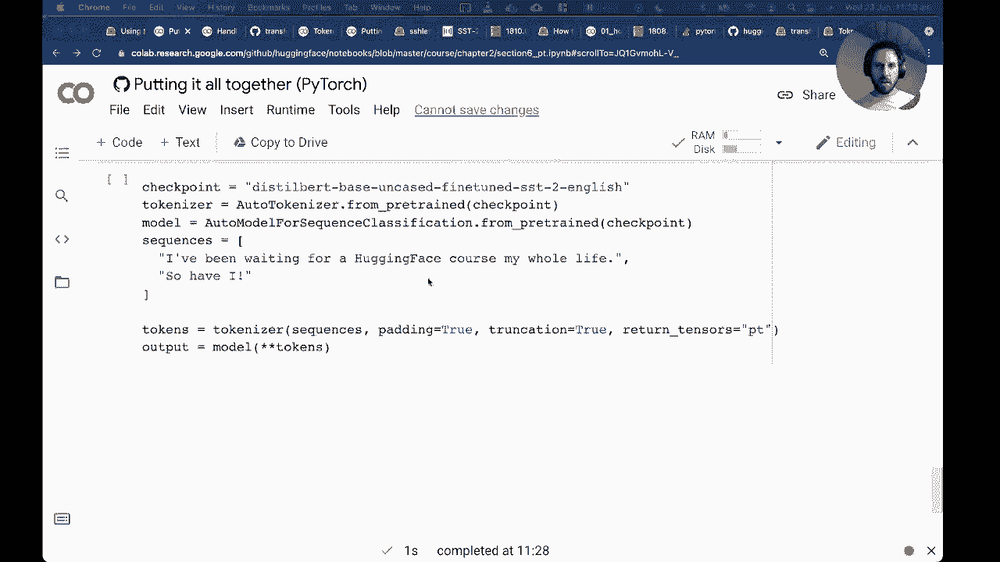

You've probably seen we have the forums and on the forums， we have a course category。

So if you have any questions that come to mind after this session or just questions in general about transformers。 just you can ask them here and one of us will respond。I think a really cool thing to do if you have the time is to share your projects。 so in fact we can see DK Cr De here sharing his awesome data set for the Model hub。

And you know as you start learning transformers， a really cool way to sort of get some feedback on how you're going is to kind of share your work and at least for me personally。 you know I come from a non-computer science background I studied physics and then decided to switch into machine learning for me。

 this kind of sharing was a very powerful way of getting some feedback from the community and also trying to like you know learn how to communicate。Which is a really important part of you know doing any data science in the real world or in general。So， for example， a cool experiment would be this one that Tom was asked today of like。What happens if I change the con figure of the model， does it break things。

 That would be a cool thing to show or in general。Like， you know。 any any sort of training experiments you do reveal awesome awesome。继续。Okay。 there's one last question from Rash Mashik， how to check the default model。Okay。 so let's have a look at this。Okay， so。Let's take a pipeline。

So I probably need to go from transformers。Import pipeline。And then I'm going to create a pipeline。For sentiment analysis。For example。So the question is。How do we check what model is being used so the pipe line object it has a bunch of different attributes and the attribute that is interesting is the model。In this case， so if we look at this， it's going to tell us， okay， it's like some output。

 but maybe we can just look at the config of the model。And then we can see that in this case。 the model that we're using for sentiment analysis by default is distillbert and it's this checkpoint that we saw earlier in the class。So I hope that answers the question Rash Mashik， you can do this for any other pipeline。 let's have a quick look what happens if I do question answering。ううい。

So the default model in question answering is going to be。Distillber base case on squad。So that's the long we have。Cool， so there's another question are the recordings available for session one from Silvan。 I was not able to find it on the YouTube channel， I believe。😊，They will be。 but I guess I'll have to check with Silvin later。 So I'm pretty sure we try to put everything on YouTube that we can。

 so。I'll let you know it up。So yeah thanks a lot for your really cool questions。 it's a real pleasure having people interact otherwise I'll just be talking to the screen by myself。Thanks for your input。And。We'll see you for the next session。 so Sylvane is giving the session tomorrow。Which is the same one as today and next week we kick off with chapter3。

아。