# 【双语字幕+资料下载】官方教程来啦！5位 Hugging Face 工程师带你了解 Transformers 原理细节及NLP任务应用！＜官方教程系列＞ - P35：L6.3- Sylvain的在线直播讲解 - ShowMeAI - BV1Jm4y1X7UL

Yeah。Welcome to the live session where we'll go over chapter2 of the Iing this course。 I'm joined by Lewis who on the chat and we' is going to answer all your question quicker than I will and don't hesitate to ask all your questions because I'm going to read themlo and answer them on the live stream that's like the main advantage of following this live stream instead of just watching the course by yourself。

So over inside this chapter2， we all look at the pipeline object that we used at length during chapter 1 on all NLP tasks。And we'll see exactly how it works， we'll see how it loads a model。 how it preprocesses the inputs with a tokenizer， and then how it processes with output to get the predictions and probabilities that we got during chapterpt1。So we'll watch a few videos that answer all the questions that you have and we'll do more life coding than in chapter 1 because。

Because chapter 1 was just a general introductionction and varies a lot of more code in chapter 2。So as an introduction， as you may know， again face is mainly known for its Transformers library。 which is a library containing a lot of transformers model。 and it provides an easy API to download pre trade model and to use the different architectures。

 I think there are more than 60 architectures now available into the library。And。It all exposes unified API but inside and provides you with either a torch module or a tons of flu care model that you can use by yourself or that you can。A train with the API that the library also provides。And the goal is the views flexibility and simplicity and the library doesn't contain any abstraction at all。

 it's not a library composed of building blocks， every model。 every one of the 60 architectures I was talking about is completely defined in its own modeling files so we can have a quick look for instance at the modeling B file which contains also the code of the bird model inside the library as if you look at the input you see like there are just torch imports and then some internal classes that this uses but we share between all models which are mainly the output types that we use will see exactly what the outputs are a little bit later when we could but there is no other inputs where is not like an attention block that we reuse the Que model the attention block for the B model is defined inside this modeling file so we have the B buildingsddings you have the B self attention etca。

 etc。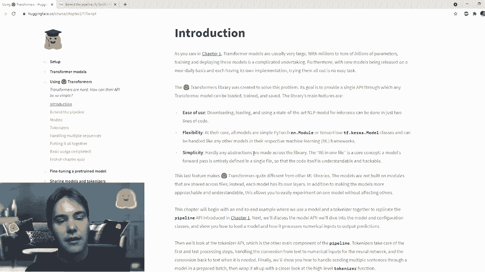

The idea is that if you want to play around with the model and change a line of code inside the model you won't have to learn 50 different files。 it's not subclassing something， that subclassing something， that' subclass something， everything。 oh， I'm guessing I'm just realizing I'm hiding a bits okay， I guess I'm just going to scroll faster。You have everything in that modeling belt file and you can play around and modify everything you want if you want to experiment with it。

 and that's really one of the strengths of the transformformer library。 one of the features that our users have said very accurate。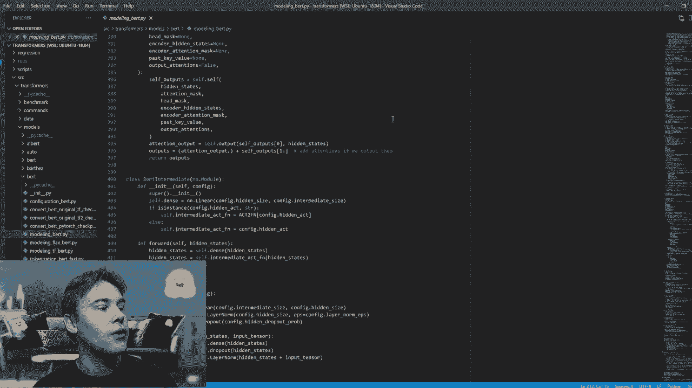

Which is why I wanted to show it to you briefly。And。So yeah。 we'll see how the pipeline API loads that B model。 it was actually a digitaltill B model that we use in chapter 1 and the corresponding dokenizer。And how to do everything that this pipeline function was doing by hand so that you can tweak any of those steps if you need to on your own tasks。

So let's begin with the first section and first video we're going to watch this introductory video that' is going to present what's happening behind the pipeline I'm just not going to stream them from YouTube because that's making this the live stream like a lot I'm just I have all the videos look at it So if you give me just one minute。

I'm going to extract it。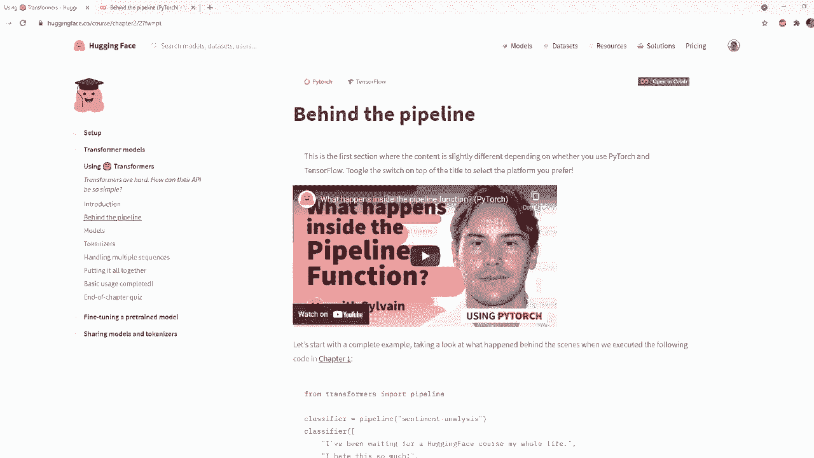

And played from my computer。

Yeah。What happens inside the pipeline function？In this video。 we'll look at what actually happens when we use the pipeline function of the transformforms library。Now specifically， well look at the sentiment analysis pipeline and then we went from the two following sentences to the positive and negative labels with respective scores。As we've seen in the pipeline presentation， there are three stages in the pipeline。First。

 we convert the redex to numbers the model can make signs of using a tokenizer。Then those numbers goes through the model， which outputs loads。Finally。 the best processing steps transform those delegates into labels and skull。Let's look in details at those three steps and how to replicate them using the Transform library。

 beginning with the first stage tokenization。So to process has several steps first。 the text is split into small chunks called tokens。They can be words。 part of words or punctuation symbols， then the tokensizer will add some special tokens in the model expect。Here， the middle used expect a CLS token at the beginning and a S token at the end of the sentence to classify。

Lastly， the token isone patches each token to its unique ID in the vocabulary of the pro model。To load the tokenizer， the transformformers library provides the autotokenizer API。The most important method of this class is from Pretrained。 which will download and cache the configuration and the vocabulary associated to a given checkpoint。

Here， the checkpoint used by default for the supplement analysis pipeline is distillbel baseline case5 tune SS2 English。 which is a bit of a mouthful。We instance to tookken as with a checkpoint。 and feed it to the two sentences。Since the two sentences are not the same size。 well need to pad the shed oneand to be able to build an array。

This is done by the tokenizer with the option padding equal true。With truation equal true。 we ensure that any sentence longer and the maximum the model can handle is truncated。Lastly。 the return tensil option gal the tokenizer to return the bytch tensil。Looking as a result。 we see we have a dictionary with two keys， input ID contains the ideas of both sentences with zero where the padding is applied。

The second key attention mask indicates where petting has been applied。 so the model does not pay attention to it。This is always is inside the took step。Now let's have a look at the second step。这不懂。As for tokenizer。 or is a nottomod API over from pretrained method， it will download lu and cache the configuration of the model as well as the pretrain weight。

However， the autotomodl API will only instantiate the body of the model。 that is the part of the model that is left once the pro traininging head is removed。It will output a high dimensional tensor， that is a representation of the sentence's past。 but which is not directly useful for a classification problem。Here， the tensor has two sentences。

 each of 16 tokens， and the last dimension is the Indian size of our model， 768。To get an output link to our classification problem。 we need to use the Automodal for sequence classificationification class。It works exactly as zero to model class， except by 12 built a model with a classification head。😊。

Praise one auto class for each common NLP task in the transformformers library。Here。 after giving our models the two sentences， we get a tensor of size 2 by 2。 one result for each sentence and for each possible level。Those outputs are not probabilities yet。 we can see they don't sum to one。This is because each model of the transformformer's library returns look it。

To make sense of those looks， we need to dig into the third and last step of the pipeline plus processing。To conduct Lo into probabilities， we need to apply a softmax layers to them。As we can see。 this transforms them into positive number that's a up to1。The last step is to know which of those corresponds to the positive or the negative label。

 this is given by the ID2lipal field of the model conflict。The first proba is index0。 correspond to the negative level and the second index1 correspond to the positive level。This is how our classifier built with the pipeline function peaked with labels and compute those scores。😊，Now that you know how each step works， you can easily tweak them to your needs。

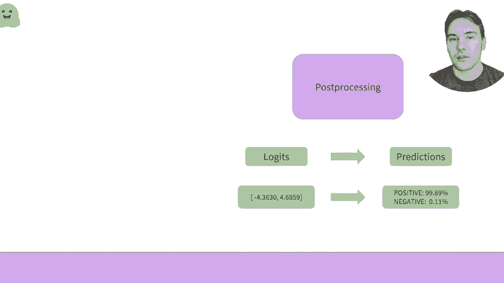

嗯。

Yeah。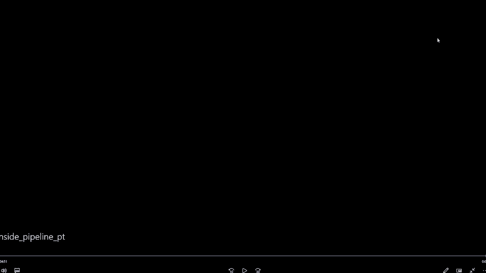

嗯对。哎呀。Back。嗯。I think that something。Wronong with webcam。 Let me just double double check。Okay。 somehow my head disappeared。 I don't know why exactly。 if you can see it。 feel free to say it in the chat。In the meantime， there is a question。 what does the triple that signify in from that activations import act to function in the PY files shownone？

Very good question， so this is standard Python if you're building the package。In Python。 and you're trying to import things。You have several levels。 so it's because of the structure of the transformer repo。 let me try to pull it back and quit my VS code。

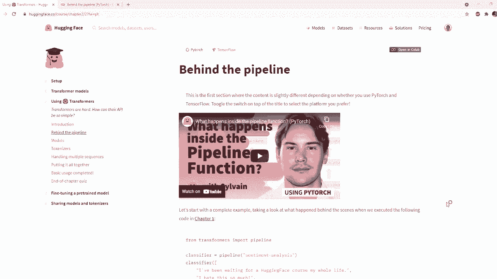

But。Rise either Here we are。 So you as a transformers folder and then inside that transformer models。 you have a model subfold and then a bird subfold and when the modeling file is here And since we've organized the good that way to avoid everything all the files directly in the transformers folder because as I said we have like 60 different architecture。

 So that would be a little of files there are organized like this And when you're trying to import when you say from dot it's to go back inside the structure。 So from import blah blah blah would be in the bird foldert is in the model folder and then thet gets back to the transformers folder。

 So it's just a way to come back to the root of the post directory。嗯。I I didn't see any of questions。 but don't hesitate to ask at any time in the chat your questions and I'll answer as best as I can and as I expected my webca is not showing anymore and I have no idea why because。

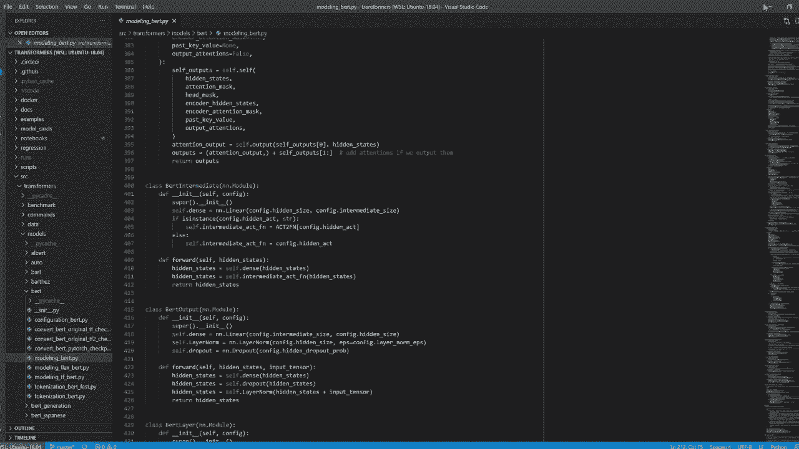

I just。S the video and it' is not working。Let me just try something。Here we are。 sorry about that hair too just shut it down and restart started it。So we're good to continue our expression behind the pipeline function and so we'll just take a little bit at the code that we just doing in the video I'm not going to show it from the section side but remember that in most sections in all the sections that have could you have an open coll button at the top like this which I opened a little bit earlier just to execute the first cell which is installing everything and can take a bit of time and then the second cell which is download the model I executed it already so that we have the result instantaneously here and we are ready to look at the rest of the notebook so like in the video let me move myself on the other side of the screen because the code。

Is mostly on the left。And。So like in the video， we all look exactly at the code that is executed when we try to use the sentiment analysis pipeline on two sentences like that。And see how we get to the results on those labels。 So as we've seen in the video。

 the first step the prepossessing is done by a tokenizer so we'll look into the tokens in detail a little bit further ahead but for not just you just need to know that the tokenizer texts the input text so those two sentences I've been waiting for the U face calls my own life and I edit it so much it's going to take those two sentences and convert that them into numbers because the model doesn't understand text it understand numbers So basically behind the scenes it's going to split that text into small chunks that we call token and so will tokenizer and then associate each of us token to a unique ID which is the numbers that were gonna to see。

To load the tokenizer， we need to know the identifier of the tokenizer。So here this is the identifier of the model that is used by sentiment analysis pipeline by default。 and then we just call autotokenize order from pretrained and。It's gonna download if you I've the files already downloaded because I executed this first。

 but if it's the first time you're executing this， it's going to download the files of the tokenizer and in particular the vocabulary which contains the mapping token to unique ID and instantiate it and once you have that objective available。 you can fit it your input directly like this so raw input inside the tokenizer and we all exactly explain what for spaing and tru mean。

A little bit for and we tell it to return tensilors and since we are using Pytoch here。 we tell it to returns Pytoch tensor with viPT。You can also say TF of tons of litensils。 N for N arrays or Fls for flex， which is， I guess for Fl， it's also an n arrays。And if we execute it， we can see that we get an output which is a dictionary with input ID and attention mask we'll explain what the attention mask means a little bit for in the course。

In this last session， sorry， and the input I are the unique numbers I was talking about。 So it's converted that text into small chunks of petaccle tokens and each of us token have been associated to unique number And once we are that we can。Use as the model。On this input。Just if we want to have a look。Back。Why are you annoying me if we want to have a look back at how those Is correspond to the text that we had at the beginning。

 we can use the decocode method of autokenizer， So I type tokenizer the Decode。And then。 I'm gonna to。Take my inputs， grab the key input I。Ohello。D di。Like this， so this is a tensor。 so I'm going to convert it to a list。And take this is a list of lists because I have two the two sentences in my sentence in my tensor sorry。 so I'm just taking the first one， for instance， and if I that execute that sorry I can see my original text which has been a bit prepossessed。

 there is no capital anymore for the I for instance。And we can also see that the tokenizer added something at the beginning and something at the end。 This is perfectly logical， as the tokenizer is adding those。The token is always adding for tokens because the model expects them。

So I'm just going to pause here for questions before I go into the model part of the code。What does in Ututuanizer mean？And what type of tokenazizer is used。 So the auto for auto tokenizer mean in the auto tokenazizer class means that you can。Load any tokenizer corresponding to any architecture using that API。 So for instance。

 here our model is a distilled bird model。 So the tokenizer is going to be a distilled bird tokenizer can double check that by just adding a console So if I type。Dkenizer。And print the output。It's going to tell me it's a pretend tokener fast。 which is not super useful。M。But the representation is not purposeable。 but the type should be a distill belt tokenizer fast。嗯。And if I had used a bird checkpoint。

 I would have a bird tokenizer fast， if I had used， I don't know about checkpoint。 I would have a badt tokenizer fast， etc cea etcettera。 so the U in autotokenazizer means that that class is going to pick the right so class of tokenazizer so when corresponding to the model used by your checkpoint automatically so your code here tokenazizer equals auto tokenizer that from between checkpoint is going to work from for any checkpoint on the model whatever the class of your model as long as it's a class of model that has been implemented in transformers it's going to work on it。

Whereas if you were using here Distill B tokenizer。 you would have to change the class used if you change the type of checkpoint， for instance。 if you would use the belt model， you would have to change it to bird tokenizer if you were using a GT2 checkpoint。 you would need to change it to GT2 tokenizer， etca， etca。嗯。The second question was。

 will I be broken into I and M and the answer to that is yes， we'll see a little bit。 I'm just going to push an answer more completely a little bit later when we see exactly the different type of tokenizer。And what is the difference between a fast tokenizer and a standard tokenizer Very good question So we usually have for each model two tokens one that is called slow or standout and the ver that is called fast the fast tokenizer is backed by the cookingface tokenizer library which is not written in Python but in rust and which in turn because you may have known that Python is a slow language and so if you do the wall tokenization in pure Python it can be a bit slow when you have lots of lots of text whereas the tokenizer fast backed by rust is going to be extremely fast。

So the main difference， that's the main difference between the two of them if you are just processing one text。 you won't see any difference， but if you're processing 10000 of texts at the same time as the tokenator fast is going to be much faster than the python tokenizer。

And that's also the question we have for the moment。 I'm going to continue and look at the model。So the same way we have nout to kal API， we have a newto modelal API and again the auto in automod API means that this class is going to pick the right subclass belt model。

 GT2 model， distill belt model， etc depending on the checkpoint that it receives so here since it's a dist belt checkpoint it's gonna。I would put distill button model， I can just show you here。Ma that model， and it should。I have a nice wrap we can see here， this steel bird bottle。嗯。I'm gonna to remove that cell because it's a bit annoying。Thank you for that。嗯。So， that model。Is。

Coming with again， we didn't download any file here because when we executed the pipeline instruction at the very beginning。 we downloaded everything we needed。 so the model is already cached。 that's why we don't see any download here and we get the warning which I'm going explain just after this。 which is because。This automod class is going to give us the base pretrained model。

 and this space pretrained model doesn't output classification of a sentence between positive and negative。 it outputs the hidden state of the pretrained model， which is a dimension of 168。So that's why here we have a warning because that model auto model is missing a classification head and as the warning was saying。 some weights of the checkpoint were not used when initializing the model。

 specifically classifier bias， classifier weights， etca。 which are all the weights of the classifier head。So Automod is something that can be useful if you just want the tensor or hidden features outputted by your pre model。 but here we want to classify our sentences between positive and negative so we need a model with a classification head and that's given to us by the automod for sequence classification class。And this one， when I execute the cell is not going to output any warninging because all the weights are going to be used and there is not going to be anything problematic when you dig the checkpoint。

And if we。G our input to thatmo and look at the shape and we can see that it's going to be a tons of size 2 by 2。One little comment about the output is that the output of transformer models。 so that was the thing that were imported at the beginning of our modeling file。 if you remember like we had a lot of import from the the dot model outputs。Moule。

 So those outputs are a bit of an hybrid between the name to and the dictionary so you can access everything either by doing dot like this So output dot logits。 you can also access things。By。嗯。Asking。With the key。So， outputs。And when we ask for the logicit key。

 like it would if like a dictionary， which works as well。嗯。And if we just ask for the base representation， we can see it's a sequence classifier output which contain Lu sheet and thistensor。 so here it contains only one thing but most of the transformer model can return lots of things as output。 for instance if I added labels here it would return a loss。

 we could also ask the model to return all the hiddenden states or all the attentions results and in which case our output is becoming a bit quoted。 which is why it's organized as this spec class that behaves likeedt and an imable。So those legits。 because those names of what we get are numbers which appear a bit random。 they don't really look like probabilities and we will need to do one last step of post processing as we saw in the video to convert them into probabilities。

 that is apply the surfmax。And if we just import from torturer soft max function plate。 we can see that now we get the exact same score that we had at the beginning。 so for instance for the second sentence like we have that 0。99 so 99。95% and if we look back at the result of the pipeline we can see that we had 99。

945 yeah so the exact same scores。And to know which which one was the negative and which one was positively label。The pipeline is using that field from the model configuration， so for each model。 the configuration file associated to it is accessible via the configure attributebute and the ID2 level field contains a correspondence between integers and levels。So let's see if we have any questions。哎呀。First question is。

 is there any reason to use the standard Python to can？

I work at a game phase so I'm a little bit biased and I'm going to say no you have to using the fast tokenser is always going be better。 so it's going to be even if you don't have many many text。 it's going to be at the same speed at the very minimum maybe faster than the Python tokenazer standardt Python tokenneer。 but also it has many more features， so we'll look at them in the second part of the course mainly but it has features that have been designed specifically for tasks like like token classification or question answering that allow you to know for instance。

 if from which word the token comes from or to exactly which span of text both tokens represent in the original text which fit that are a little bit not a little bit way out together to get with the slow tokener。Another question is。Are there any similar tutorials or resources for sentiment analysis for multilabels that or regression tasks for sequences not right now which is that's a very good question so not right now and we should definitely work on that so the main thing you would have to change is the processing at the end instead of applying softmax you would apply for a regression you wouldn't apply anything I guess and then for multiplelabel so multiple label multiple possible labels for each of your sentence you would apply probably a stingoid to your result。

And then last question is the first two input ID， the two lines are the same。 but the words are not why is that so we have to look back at the decoding because the two words are indeed the same so the sentence here。Begins with 101 and 101 which is the idea that CSO。 so that's why you have the first two input id that the same and then the 1045 correspond to the I because the two sentences begin with I and then it starts being different because you have the ver or8 for the two sentences。

And another question would it be possible to do a video explaining the code structure of the library and the ID behind it so that's to maybe make it easier to contribute very。 very good question and it's actually scheduled for the last part of the course in the part of the course we have a chapter that's going to be dedicated to how to contribute to againface libraries and particular the transformformers library and then well have video explaining the good structure of all the libraries of the again phase ecosystem。

Again， don't hesitate to ask any questions I'm going to pose regularly to answer it。So that's pretty much everything that was behind the pipeline and we've seen it in detail in the code。 So now let's have a look at the main object inside the pipeline， which is the model。So again。 we have a short video that I'm going to show from my computer and then we'll look at the code in detail and if you have questions。

 I can answer them and live code with you。Let me just grab the video。呃。Which of course。 I can't find easily otherwise， but would be too easy。 Why did it disappear。And one was ver poormiss。 I just moved it。Recently。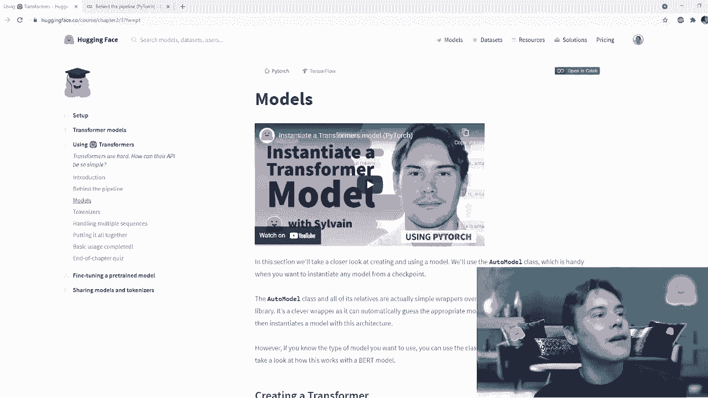

And。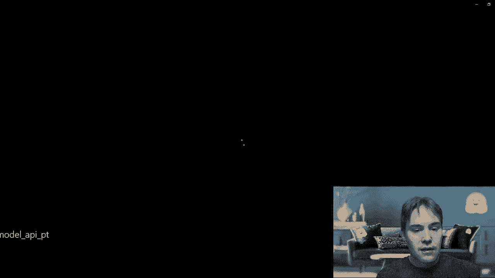

How to instantiate a transforms model。In this video。 we'll look at how we can create and use the model from the Transformers library。As we' seen before。 the Automodal class allows you to instantiate a portrayed model from any checkpoint on the I face app。It will pick the right model class from the library to instant shade the proper architecture and load the weights of the preed model inside。

As we can see， when given a bird checkpoint， we end up with a bird model and similarly for GPT2 or part。Beyond the scenes， this APII can take the name of a checkpoint on the U。 in which case it will download and cache the configuration file as well as the model weights file。You can also specify the path to a local folder that contains a valid configuration file and a model of waste file。

To instant shade the between model， the Automodal API will first open the configuration file to look at the configuration class that should be used。The configuration class depends on the type of the model， B， GPPT2， or Bt， for instance。Once it has a proper configuration class， it can instantiate that configuration。 which is a blueprint to know how to create the model。

It also uses this configuration class to find the proper model class。 which is when combined with the root configuration to load the model。This model is not yet a portraytrain model， as it has just been initialized with random weights。The last step is to load the weight from the model file inside this model。

To easily load the configuration of a model from any checkpoint or a folder containing the configuration file。 we can use the autoconfigug class。Like the Automod class。 it will pick the right configuration class from the library。We can also use a specific class corresponding to a checkpoint。

 but well need to change your code each time we want to try a different model architecture。As we said before， the configuration of a model is a blueprint that contains all the information necessary to create the model architecture。For instance， the bird model associated with a birth based case checkpoint as 12 layers。 the hidden side of 768。And the vocabulary size of 28996。Once we add a configuration。

 we can create a model that has the same architecture as a checkpoint， but is randomly initialized。We can vet training it from scratch like any by doch model。We can also change any part of the configuration by using keyword arguments。So sequence one sniet of code， instant sheets a randomly initialized B model with 10 layers instead of 12。

Saving a model once its trend off fine is very easy。We just have to use the safe between method。Here。 the model will be saved in a folder named My belt model inside the current working directory。Such a model can then be re using the from between method。To learn how to easily approach this model to the web， check out the push to video。

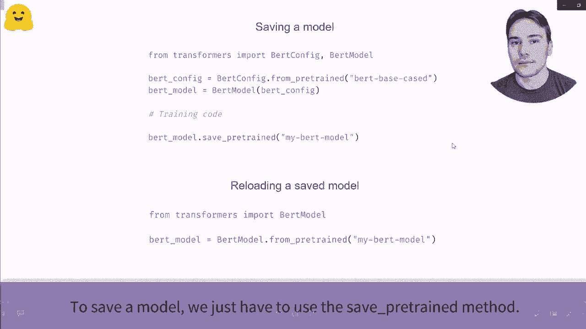

嗯。

Okay， so let's see if we have any questions， not just yet。 Don't hesitate to ask any question in the chat and I'll answer them。Regularly， and for this。 let's open the code app。And look a little bit at the code behind the Automod API。And in particular。 we'll see， for instance， I told you a little bit earlier that our model could return more venture surligit and it could return。

 for instance， all the hidden states or things like that and we'll see how to do that just here。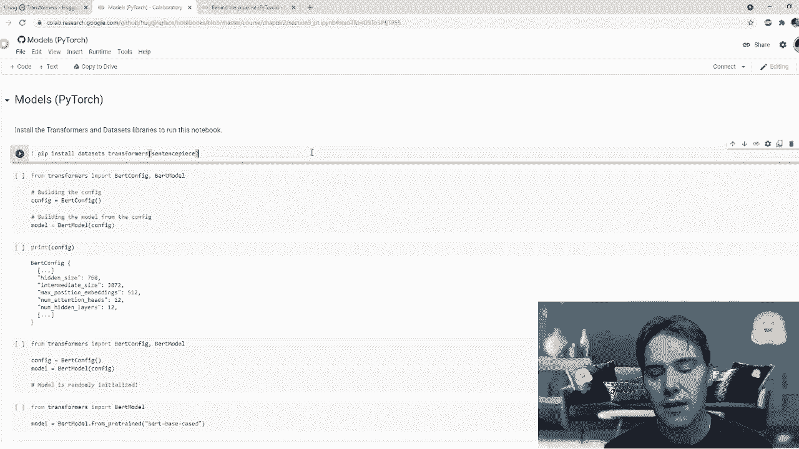

Yeses。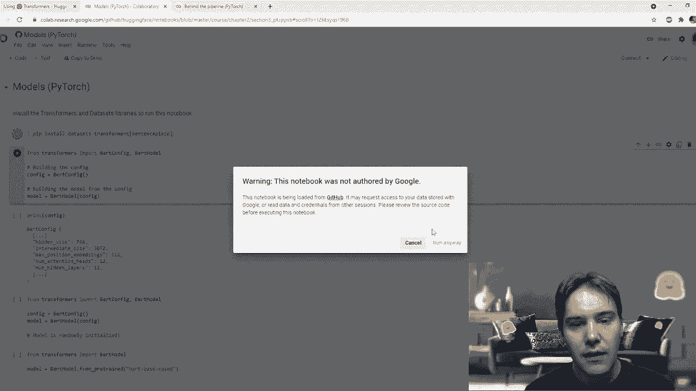

So。If you had any questions， that would be an need all time because I didn't execute this notebook in advance。 so we need to wait for it to install everything。Okay， that didn't think so。嗯。So。To create a random model that looks exactly like the per model。 we can just instantiate the default configuration and use that configuration inside the model。

Like we saw in the video， the config contains lots of fields that are related to what's happening inside the model。 so for instance we have the hidden size configured。 we have the number of words that our model can taken， we have the vocabulary size。The mobile type。 which is built， the activation it' used， which is Kiu， etctera， etca。嗯。So， that model。

Using just random usage the config is going to be randomly initialized and there is nothing to download there if we。Want to use a pretrained model we have to use the from pretrained method。 which is going to download the exact config and then the model weights and as we saw in the video。 it's going to use the config to first instantiate randomly initialized model and then load the weights from that checkpoint inside the model we have。

And if we。Want to change anything。いのもの。More specifically in its configuration。 we can say it in several places。 So， for instance， we can start with。呃。A config that is exactly like birds。So con to convicted from pre traineded。B pesquiist。Which is gonna download， and it's already downloaded from here。

Where you mean the two configurefig is not defined。 Oh yeah， I have only use B config。 So let's continue with that。So。B con from between。 which is gonna reuse the con that was download here。 So this is the configuration of the per model。 And if we want to change anything inside it， we saw the video， for instance。

 to change certain number of hidden layers。 but let's say that。I want to change the fact that I want my model to return all the hidden states。Which I would say with outputs in states equal to。So I can do this in the config and then instant shape my model with model equal bad model config。 I can also directly change this when I do。That model that from betweentrained here。

So since if I were to change here the number of hidden layers it wouldn't work anymore。 the command would fail because I would then try to load a checkpoints that has been defined with 12 layers inside the model with 10 layers so bytoch would complete I mean it would probably work but I would have a warning with like the widths not being used and the model would probably not get super useful results but for something like outputed in states which doesn't really change the way the model was pretrained this is going to work super nicely。

And if I try to take inputs。So let's define some random input and then pass it to a tokenizer。 So I'll have to。Use the part toagonizer and then instantiate it with a form betweentrain method。Should oh， yes， it's finding it here。Should have executeded the elder or or。So if I'm creating a do like this。And then， applying it。呃。To my inputs。🎼Return a tensor。

 I don't need to put the padding and location that we saw before， because there is only one sentence。 I'll see why a little bit earlier。 So once I have done that， I can look at my。Outputs。And it should have。Now， two keys。Still one key。YeahWith a little bit more because the bird model has a pull output you on top of the luggit but oh and it's not luets anymore sorry it's less hidden states because this is not the classification model it's a base model I used a be model which is the same as using automod not a be model for second classification so I get a last hidden states instead of look key the puller output is specific to B so it's always as that and then I can say have a last key with hidden states and a list of all the turnsult which correspond to all the hidden states of my model so this is how you change the configuration of your model on the fly either insides when we create a config if you are trying to initialize a randomly initialized model or to the form pretrain letter if you are trying to use。

A pre model in particular， if you're using a classification model， for instance。 a sequence classification model， you can specify the most important argument is going to be nu levels。Because when you add your classification head， you want to control how many outputs that classification head hass。 so you would do that with a new labels argument。So that model。

 And then once you finish training or a tuning your model。 you can use safe pretrain to save it on the floor on your。On your hard drive and you can use Pushtb。 which we just released today actually。So on your model to directly upload your model on the Higing face hub so that anyone in the world can use it。Don't see any questions again， don't hesitate to ask any questions。

 I'm going to answer them regularly。And so this is all we have to。 this is all we various intersection for models and then let's look at tokenizer。 which is responsible for prepoing the input I'm going to move myself， oh not to screen。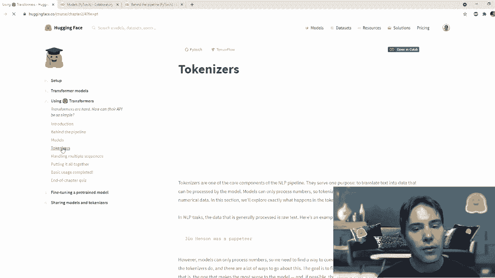

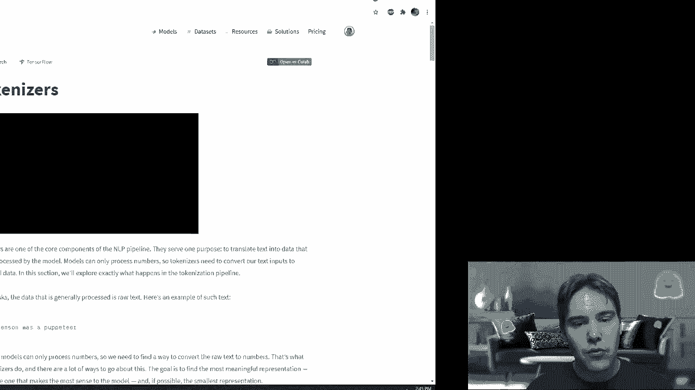

Come back。Going to move myself。Back on the left。Because。And we。 we look at this section here and look that the code inside the code app。嗯。So tokenizer。Oh yeah let's look at the video with tokens of first and then I'll comment everything that's happening in this section。T can as introduction video。

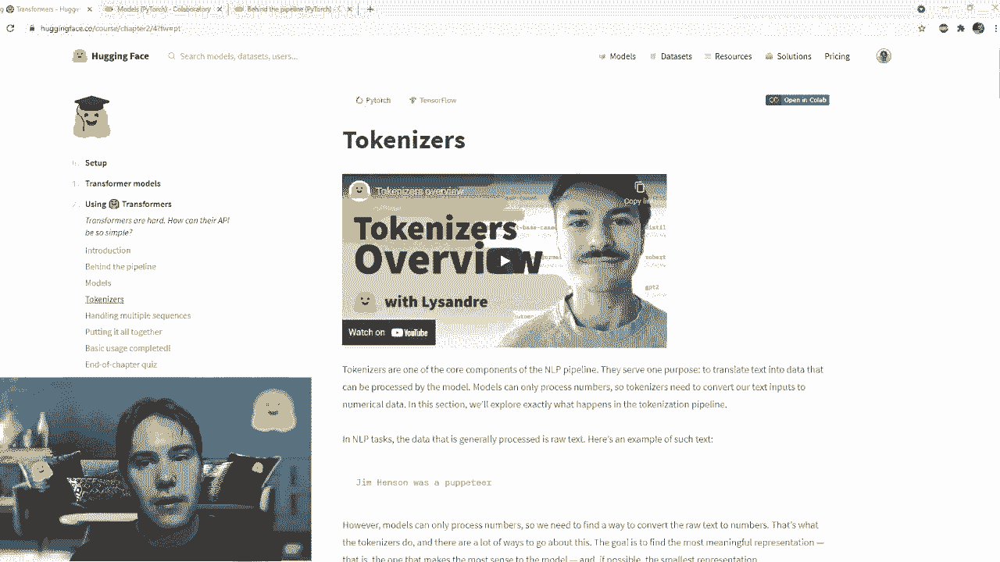

Yeah。In the next few minutes， we'll take a look at the tokens。😊，In natural language processing。 most of the data that we handle consists of raw text； however。 machine learning models cannot read or understand text in its raw form。They can only work with numbers。So the tokenizers objective will be to translate the text into numbers。

There are several possible approaches to this conversion。 and the objective is to find the most meaningful representation。😊。We'll take a look at three distinct organization algorithms， we compare them one to one。 so we recommend you take a look at the videos in the following order， first word based。

 followed by character based and finally sub word based。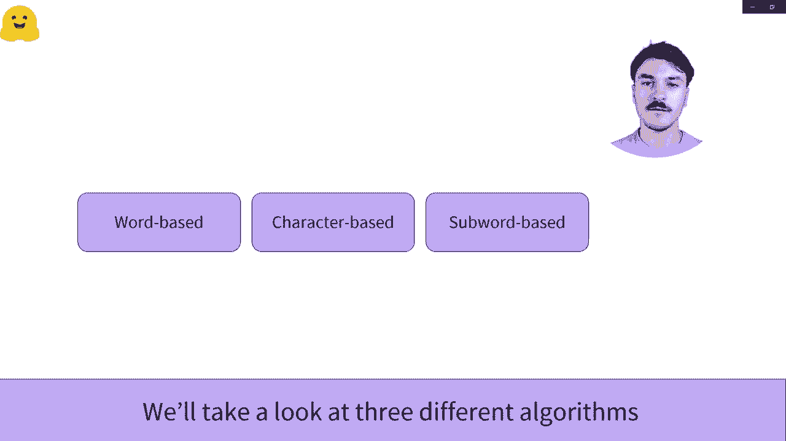

Yeah。So we won't look at the video。 Actually， we're gonna look directly at the text inside inside the the。The course and I'll comment because we won't have time to watch all those videos in the slide we。So world based tokens so you can look at the video in your free time but we're gonna explain it a little bit more in depth with what I' to do。 but the world based tokenizer is just going to split your sentence by word so the easiest way to do that is to take all the spaces and then split your text onto those spaces more advanced would be to include some walls to split and punctuation so for instance the exclam mark separated it from tokenization or here let's split it between let and aworth as。

So we can see this on this example with Chi and Sun weather Preter。 which is separated into five words here。So the world organizers are。Were used a lot before transformers， mostly the advantage is that。You split naturally your text onto the spaces and punctuation see disadvantage is that you end up with pretty large vocabularies because there there are lots of different worlds in English and every time someone makes a typo in some world you end up with in a new world in your vocabulary。

So each word gets assigned in ID starting from0 going up to the size of the vocabulary and then since we can't guarantee that the user is never going to make a tape or anything。 there is a special rule， if we encounter a token that doesn't exist in the vocabulary。

 it's usually replaced by something called the unknown token which is usually something that looks like that and between brackets。So this is one of the other drawbacks of the world based tokennea。 so the first one is that we have very largeocabularies。 the second one is that we need to learn that the word Do and the word Dos are very similar。

 they won't know that from scratch because when the model is initialized randomly。 it's going to have a set of abidding for that word dos and another one for that word dogss and it's going to need to learn by seeing lots and lots of data that those two world look a little a bitlike。

And the last disadvantage is that Ung token so every word that the depo is going to end up like this and the more can learn in your representation of that。 it it says if you had just deleted the world in the sentence。So another way is to just split your text on all characters which is the what character best organizes to in this case your vocabulary is not going to be very large because 256 SI characters。 for instance， a little bit more if you take the wall any good thing。

 but you're not going to end up with models but have a vocabulary size of I don't know 300。000 or something like that。So this is better for the vocabulary size。 you probably won't get a known token because you all see all the different character possible。But the drawback is that now the representation is based on character， so the model as to on that。

 for instance， the letter E is not does not mean the same thing when it's between an a T compared to the letter E here with the key and the n beside the word organization。So is a representation of each letter is less meaningful， that's what I't trying to say。

And compared to what we had we've worked。The overall drawback is that we end up with very long sentences。 for instance， for leads to tokenization， if we look back with two world based tokenization it was split into five words with the tokenization with the character based tokenization it splits in much more concor here but it's between 15 and 20。

 let's say so we end up with longer sentences and our transformer models are usually constrained by a maximum lengths。 So for instance， the built model can only do5 can only treats 512 tokens at a time。 So using a character based tokenization algorithm would。Make sure the maximum sentence。 you can feed them all pretty short。So that's why transformmonology usually use a compromise between word and character based tocanization。

 which is the world tokenization。So sub organization。As the name indicates。 it's going to split your text into subwors， so it's still split between words。 but some wordss are got into， for instance here， you've got lets do and then token and Iization are separated into。Notice that you get the small and。With like the animals know to say that in English。

 but that special thing between an inferior superior sign with slash W。 which means that it's the end of a world。 So Tuken doesn't have it because that's for the。That's because we want the model to be able to differentiate token as a single world and token followed by something else like tokenization。 so the Iization as the specificx that says here its in the other world that token does not。

And so that depends on the convention used by the tokenizer。 some tokens have a thing at the beginning of world。 some tokens have a thing at the end of the world。And so this approach。 this approach allows you to have a vocabulary that's not going to be too huge and the two can still have some meaningfulmantic some semantic meaning that's more meaningful than just characters。

And the last thing is that for worlds based tokens， for instance， Doug and dogs。 well two separate wordss here， Do as dogs would probably be split into Do and nest。 the same way tokenization is split between token and Iization so it can learn that they have the same prefix and then the sization is going to be used in another world like modernization。And the twoken can the model sorry can then make sense of the Su fixes and learn that they are always kind of the same。

And so in the next part of the course， we'll look at into detail as a different because there are three different。Suborgan algorithm that are by level word piece and sentence piece will explain exactly the difference between them in the next part of the course。

So let's see if we have any questions before we look at oh the tokenazer work practice。Yes。 I'm just going to put myself here properly。Tuckenneer breaks a sentence into tokens。 but no limatizations or stming is performed before learning。嗯。You know。It's。Lets meet the bullsh。I would say no， but you should ask the questions from where people that are more competent than me can answer you because I'm not completely sure。

Could you provide intuition into word piece usingbed and sentence piece type tos？I could。 but it's going to take a bit of time so again I'm going to readdirect you on the form where I can take the time to properly answer you and there is also maybe Louisis can share it here phrase his the tokenazal summary in the transformal documentation that explains the difference between what piece and the sentence piece which is using Uniigram behind the scene and the key difference between the two。

Does the W slashW tag add any information in the subwe tokenization， so yes。 as I said it's what allows them all all to know the difference between a single world like I mean between token used as a single world or token inside a world like tokenization or tokenizer。

And then let's see how the tokener work in practice。呃。So can we have seen to load the tokenizer using the form pretrain method。And what it returns。 and we'll now quickly look at the video on the tokenization pipeline。 which is going to explain what's happened when we feed the tokener sequence like that and how it returns those numbers。

Let me just grab it from my computer， and then I'll continue answering questions。嗯。So took a nice pipeline。In this video， while look at how tokenizer converts ver text to numbers that a transformer model can make sense of。 like when we execute this good。Here is a quick overview of what happens inside the tokenizer object。First， the text is split into tuets， which are words， parts of words， or punctuation symbols。

Then the tokenizer adds potential special tos and converts each token to our unique respective ID。 as defined by the touckenizer's vocabulary。As we'll see it doesn't quite happen in this order。 but doing it like this is better for her understandings。The first step is to split our input text into tokens， we use the tokenized method for this。

To do that， the tokenizer may first perform some operations like lower casing or words。 then follow a set of rules to split the result in small chunks of text。Most of the transformable models use a word organization algorithm。Which means that one given word can be split in several tokens， like tokens here。

Look at the Tokenization algorithms video linked below for more information。The ash ash prefix we see in front of I is a convention used by bird to indicate thistoken is not the beginning of the world。Other organrs may use different convention however。For instance。 Albert tokenizers will add a long end score in front of all the tokens that had its space before them。

Which is a convention shared by all sentence based tors。The second step of the tokenization pipeline is to map those tokens to respective IDs。 as defined by the vocabulary of the tokenizer。This is why we need to download the file when we instant hit a tokenizer with the form pre method。We have to make sure we use the same mapping as when the model was portrayed。To do this。

 we use the converttugans to IDs method。You may have noticed that we don't have the exact same results as in our first slide。Or note as this look like a list of random numbers anyway。 in which case allow me to refresh your memory。We the number at the beginning and the number at the end that are missing。Those are the special tickets。So special tokens are added by the proper formalal method。

 which knows the indices of a token in the vocabulary and just adds the proper numbers in the input IDs list。You can look at the special tokens and more generally at how the tokenizer has changed your text by using the decocode method and the outputs of the tokenizer object。

As for the prefix for beginning of worlds part of worlds。 both special token vary depending on which tor you are using。So belt tokener uses CLS on。 but the Robertta tokener uses HTMLl like on calls S and/lash S。Now that you know how the tocanazer works， you can forget all was intermediately admitted and don remember that you have to call it on your input texts。

The output of the decokenizer don't just contain the input ID， however。To learn where the attention mask is， check out the batch input Together video。To learn about targettype ideas， you get the process spells of start video。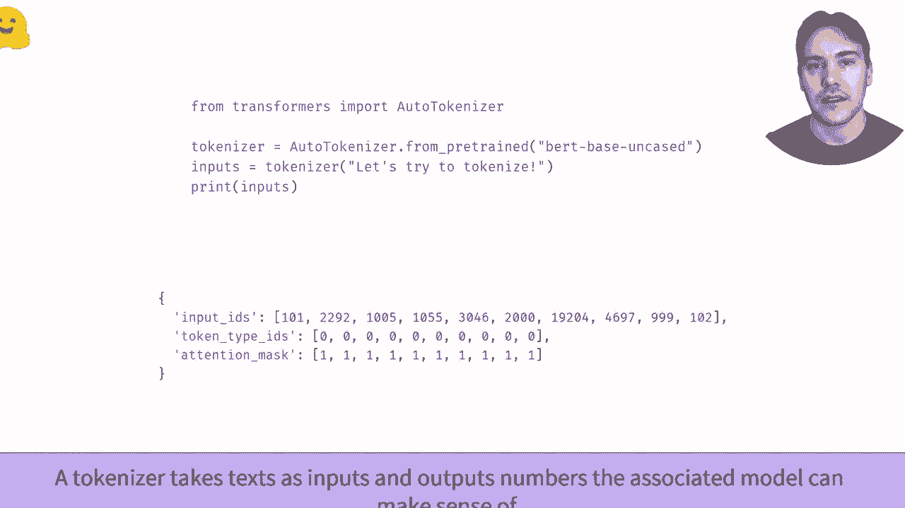

Yeah。So we have one questions that's linked to what we were seeing just before the video are token slash W and token going to have separate representation IDs and yes。 we are going to have separate representation IDs because we are not the same token。As which is the。

 the the whole meaning of that slashable you2an。Ne and sorry specific。So tokenizer or the tokenization pipeline， I'm not going to livecode was intermediately admitted because you shouldn't really learn them。 we're just showing them to show you the steps inside the pipeline the main thing to remember is that you just have to call your tokenizer on your input like this because this is the main E that's the most useful and now we'll look at what the attention mask is and what padding and Fun means the arguments that we had at the very beginning so that we fully explain what's happening inside all the tokenizer。

Oh， another question， is there a reason you would save a proed organizer or then better to just have a local copy。Very good question。 So， yeah， there is no real reason to save your patron organizer if you don't need to。If you didn't make any change inside it and you always you would always have a local copy because auto tokenizer that from pretrained is going to cache the files to avoid you download them again so there is no reason to save it the one exception is when youre creating folder that you want to push to the model hub in which case you should save your tokenizer inside that folder so that when you push user you push your model the configuration and the tokenizer that's used with it and we have all those threethink。

The the the A face website is going to be able to apply in front APII in your model and you will be able to play with the Wichat online。other than that you won't really need to use the safe pretrain method on the tokener。 it's mostly for the model that's going to be super useful or and we will see part two closer to do that if you're training a tokener from scratch because you're pretraining a model。 for instance， in a new language， then youll need to use the safe pretrain method to save the result of your tokener。

So we're going to watch the last video for today live session about batching inputs to cover and then we'll look more crisly at the good to。 let me just。Launch the collab first so that we don't have to wait after the video and then we'll watch the video together。

嗯。Come on。Sth。Yes， I want to run it。And let me grab the video， patching and put together。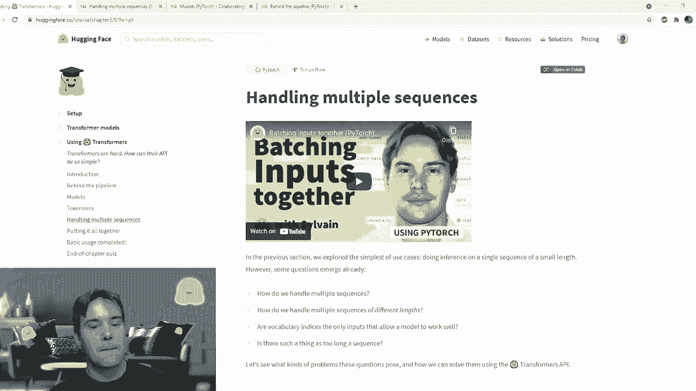

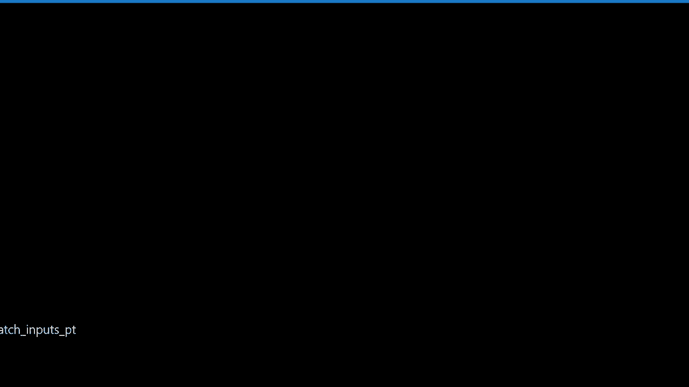

嗯。Yeah。How to batch inputs together in this video， well see how2 batch input sequences together。In general all， the sentences we want to pass through our model won't all have the same length。Here we are using the model we saw in the sentiment analysis pipeline and want to classify two sentences。When tokenizing them and mapping each token to its corresponding input I。

 we get two lists of different length。Trying to create a densor or an newbi array from the two will result in an error because all arrays and densilrs should be a recangro。One way to overcome this limit is to make the second sentence the same length at the first by adding a special token as many times as necessary。

Another way would be to truk the first sequence to the length of the second。But we would then lose a lot of information that may be necessary to properly classify the sentence。In general， we only truncate sentences when we are longer than the maximum length the model can handle。The value used to pad the circums should not be picked randomly。

The model has been portrayed with a certain padding ID， which you can find in tokenizer。pa tokenite。Now that we have better sentences， we can make a batch with them。If we pass the two sentences to the model separately and patched together however。 we notice that we don't get the same results for the sentence that is pad here the second one is that the bug in the transformerers library now if you remember that transformers will all make easy use of attention layers。

 this should not come as a total surprise。When computing is the contextual representation of each token。The attention layers look at all the other words in the sentence。If you have just a sentence or the sentence with soball padic tos added。 each logicalal don't get the same values。To get the same results with or without padding。

 we need to indicate to the attention layers that we should ignore those padding tickets。This is done by creating an attention mask， a tonsil with the same shape as the input IDs with series and ones。Once indicates the tokens the attention layers should consider in the context。 and the the tokens which should ignore。Now， passing this attention mask along with the input ID will give us the same results as when we send the two sentences individually to the model。

This is all done behind the scenes by the tokenizer when you apply to several sentences with a flag bedding equal true。It will apply his bedding with a proper value to the smaller sentences and create the appropriate attention mask。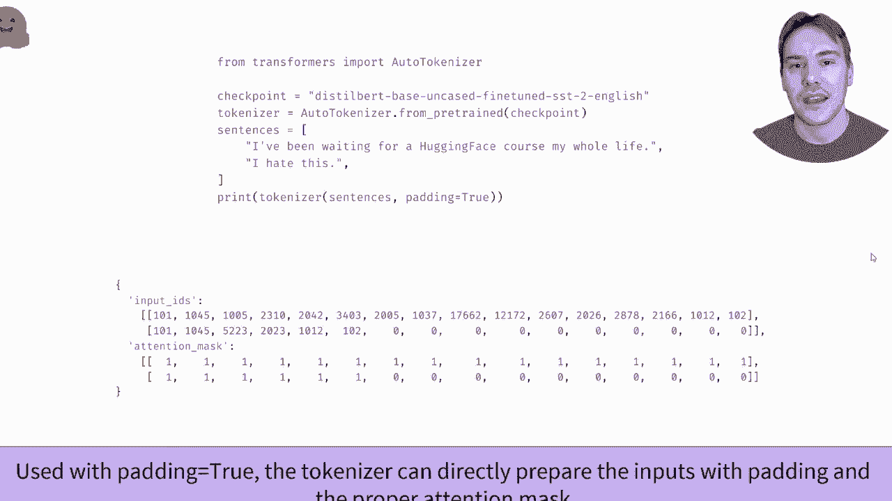

。So， let's。Look at the same thing in collab。Let for any questions。 no， I don't see any questions。 don't hesitate to ask your questions in the chat again。 and let's look at the same code that we had to look again at what the padding and attention mask are exactly。So as we saw in the video， if we try to。Apply our model。Directly。

Oh no it it not take the exact same thing as in the video。 If we try to apply our model directly on just one sentence that we recognize and converted to to ideas like that using the the same code as in the previous video。 it's gonna fail because the model wants batches of input so it wants。It's actually the dokenizer even if you have just one sentence is adding one dimension。

 you can see like there are two pairs of brackets surrounding that so here this is a tonsor of shape1 by a guess 60。And so if you want to pass just one sentence that you processed manually to a model。 you have two had one dimension， for instance， by adding a pair of brackets here。This is for a separate example， so now looking at two sentences together， so if we have two lists。

 so let's say we have both id and both ID and we want to make a pair of sentences。We can't we can create a list of lists like that， but we can't create an array with the two of them because then don't have the same shape。So we need to add a padding index so we could ever hide it at the handle at the beginning。 most of the Transal model expects the padding to be applied on the right with the exception of ExcelNe which expects it at the beginning。

 but the tokenizer should be responsible to apply the padding because the tokenizer knows what the model wants and is going to apply it on the right side。嗯。So once you have thosepat I， you can create。You can sorry。 create done source from them and then pass them through the model。And if we look like we we've just done in the video at the outputs。

 if we pass the sentences separately， So we still have to add power brackets if we want the model to be applied on them because the model expects a batch。 So the batch can have just one thing inside it， but it needs to be something that has two dimension。

So if we pass sequence1 and sequence 2， we get those two results and if we pass the patch with the two sentences。 we get the same result for the first sentence， but different result for the second sentence we can see that Ph2 are difference here which is because the circumst with a paddingken if we don't do anything special the model is not going to compute the same results it's not going to properly ignore the paddingken so that's so in the video is because of the attention layers the attention layers are call the transformers model and are we explain that at length during chapter1 there are layers that not computer presentation not just of one word but one word within its context because the transformer models were designed for translation at the very beginning and if we want to translate the word we don't just need to pay attention to that word but all the words around it for instance to know which genders the word hard。

It's a singular or parole known， things like that。And so if we don't say to if we don't tell the attention layer that this is not a real token it just affect token we needed to to have a rectangle and make a batch the attention layer is going to pay attention to the token and computer contextual representation that adds that token into account So to tell the attention layer now that's not a real token don't pay attention to it we have to create what is called an attention mask so here we put ones where we want the attention layer to pay attention and zero where we want the attention layer to ignore so is the same shape as the batch adss that we are using and the zero is put where we have the token I token ID。

And if we do that and pass those through the model now we see that we get the same output。 so here the first sentence is still the same because there was not bedding。 but this output here is the same as this output here。 which was the output of the model with the second sentence。So this is what's done by the tokenizer。

 if you remember when we were passinging all two sentences， it was returning something with two keys。 one was the input Is which correspond to this thing here。 and therefore one was the attention mask which corresponds to this thing here。The truncation argument， so when we passed the two sentences to auto at the very beginning。

 we said padding equal true and truncation equal2， so truncation equal true is going to truncate very very long sentences because for be model。 for instance， can only handle sequences that have a length of 512 maximum。So if we have a sequence that's longer than that， the model is going to fail and we need to truncate it。 you shouldn't truncate your input for any other reason when making them shorter than the maximum length the model can handle otherwise because when you trun sorry you remove information so for padding we are adding something and we can tell the attention layer to ignore it so at the end we get the exact same results with or without padding with truncation you're ignoring information but you just can't recover so you will never be able to get the same results without truncation。

But sadly it's needed because transformers have a maximum length。 so if you have very long inputs that are greater than than at maximum length you need to locate them。And if we go back looking at the course in the putting all。Putting it all section。We have the various patting on from strategy。 So here。

So if we go back with the two sentences we are using at the very beginning of this left session and pass them we can pass them to the skener。 which is going to then output list of list， but we won't be able to patch them together without applying padding so we have various strategies to apply padding when we do padding equal through it's the same as doing padding equal longest which is going to pad the sequences up to the maximum length inside the samples that you're passing so here。

We have two sequences with patting equal longest， it's going to add the second sentences。 the second sentence here to the length of the longer sentence。 If we go back to the notebook behind pipeline， we can see that here。With all those zeros being added so that the circum sentence inside the batch is the exact same length at the first。

You can also say patting equal max length max length refer to the model max length， so for instance。 it's 512 for be or distber， so this is going to add every sentence to 512 the maximum length of the model of adoption should not be considered when。When you have short sentences， for instance， its in general it's better to add to the longest thing you have unless you need to use fixed shaped for some reason。 for instance， TPUus like fixed shapes better in which case you would use the max length option and which is a bit inefficient but for instance with the TPU accelerator。

 it's the only way to get some real speed because they need all the inputs towards the exact same shape。And you can also specify a max length that you want， so for instance。 if you know that in your dataset set， all your sentences are shorter than 1 around28。 you could say patting equal max length max length equal 1028。And so you should also use truncation。

 as we said， because you need to truncate when your inputs when you there are longer than the maximum length a model can handle。 you can also specify the maximum length to which you want to truncate your inputs。So that's it for padding on。 Do we have any questions。嗯。No questions， Small links shared by Lewiss。So。The last thing is， as we saw before， you can tell you token to return bytoch tensor and soft flu tensor on entire array。

And as we saw in one of the videos， the tokenizer， the tokener pipeline video specifically。 the tokenazer adds the special token at the beginning and at the end of our sentence。 so it depends exactly on which model youre using， but the tokener will all know what token's special token the model expects and will put them at the beginning and at the end of your sentences。And so to conclude this chapter， here is the world code， it's just missing the post processing。

 but here is the world code that was executed behind the scene by the pipeline。嗯。So you import auto tokenizer on automod for sequence classification。 the auto beam meaning that you can use any checkpoint from the hub。 it's going to pick the right architecture for you。

The checkpoint that was used by the pipeline is this1。 you can use any of our checkpoint on the model hub that correspond to a sentiment analysis task。We can load the tokenazizer with the from betweentrain method。 we can load our model with the from betweenttrain method and if we have two sentences。

 we can tokenize them together with padding equal2 con equal2 which on tensor source equal piy toch if we're using py toch tensor flu which using tensor flu and then we pass the tokens to the model and to get the plus process results it's just missing the soft max here to have the exact same result as pipeline。

One last question I'm confused between padding you call longest and dynamic padding。 Is it similar。 Yes， it's very， very similar。 Well look at dynamic padding in the next chapter when doing training。 but for those who don't know what it is dynamic padding is when you。When you go through your training data and beL batches。

 dynamic padding means each time you have to build a batch。 you pad your sentences to the maximum length inside the batch。 and so that's what padding equal longest will do if you pass your sentences a small batch of sentences is going to create a batch with for instance eight sentences and the second dimension is going to be the maximum length inside that batch。Whereas patting equal max length is going to add everything to a fixed max length。

 either the maximum length of model canon all or the maximum length you passed along to the dekenizer。And so that's it for the basic use of models and tokenizers。Thank you for following the live stream so now that weve seen that chapter together you should be able to complete the questionnaire at the hand and then before going to chapter 3。 it's useful if you try to run again the pipeline collab that we saw together on the batching input togetherab that we looked at together and try to understand what every cell is doing and maybe even try to redo it yourself。

And then try to think of a problem you want to work on on a classification with a text classification problem you want to work on and try to use a base model and an organizer on that problem to be able to get outputs from some inputs and we'll see in the next chapter of to actually find tuneni model on your given problem and in chapter 4 we'll see how to upload as a result to the bundle hub so that you can venture that model to with the rest of the community and use the widgets of the inference API online to have demos of。

Of your model。 let me look at the questions before we end this live stream。Oh。 following up from the previous question with patting equal whole longest。 we don't need to use that decorator with padding。 That's not entirely true。 And we' all see exactly why in the next chapter， we。

 we need to be in the dynamic of training a model， but。If you are playing padding all longest while you' doing tokenization on your wall data set。 it's going to add to the longest element in your data set。 so that's not really the same thing as doing dynamic padding。

But yeah well we'll dive into that in the next chapter。Otherwise。 thank you all for following this live stream and next week on Cha 3 there are four different live streams because Cha 3 is very different for Pytch and Tensorflow since it's about training and functioning until now the code add some little differences and you can see that you have a switch here for the course if you want to switch between Pytch and Tensofflow if you want to look at exactly what' difference but for next chapter is going to be very different so you have live session specifically for Pythtch and live section specifically for Tensorflow be sure to check on the formss which one you want to attend to and market into your calendar。

And yeah， let's first this up。 Thanks a lot for coming， bye bye。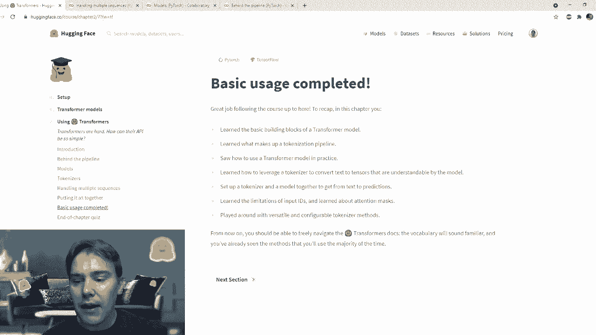

。

