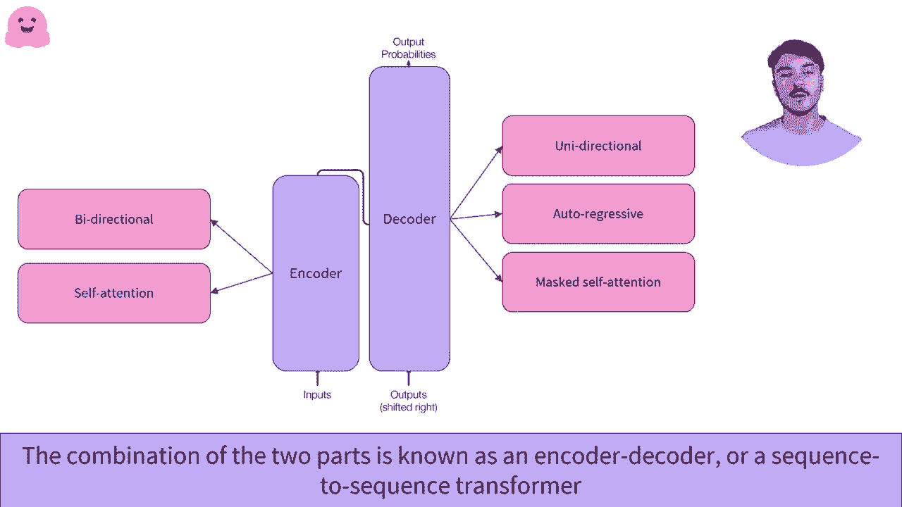

# 【双语字幕+资料下载】官方教程来啦！5位 Hugging Face 工程师带你了解 Transformers 原理细节及 NLP 任务应用！＜官方教程系列＞ - P4：L1.4- Transformer架构 - ShowMeAI - BV1Jm4y1X7UL

让我们研究 Transformer 架构。这个视频是关于编码器、解码器和编码器解码器系列视频的介绍视频。在这个系列中，我们将尝试理解 Transformer 网络的组成，并努力以简单的高级术语进行解释。无需对神经网络有深入理解。

但理解基本的向量和张量可能会有所帮助。为了开始，我们将从Pawa的原始论文《注意力是你所需要的一切》中提取此图。正如我们在这里看到的，我们可以根据我们要做的事情，利用其中的一些部分。我们想深入探讨具体的层，构建该架构。

但我们会尝试理解这架构可以被使用的不同方式。首先，让我们将该架构分为左侧的编码器和右侧的解码器。这两个部分可以一起使用，但也可以独立使用。让我们理解这些是如何工作的。

编码器接受代表文本的输入，并将这些文本转换为数字表示。这些数字表示也可以称为嵌入或特征。我们将看到，它使用自注意力机制作为其主要组件。我们建议你特别查看关于编码器的视频，以了解这些数字表示是什么，以及它是如何工作的。

😊我们将更详细地研究自注意力机制及其双向特性。😊解码器类似于编码器，也可以接受文本输入。它使用与编码器相似的机制，即被掩蔽的自注意力。由于其单向特性，它与编码器有所不同，通常以自回归方式使用。

在这里，我们也建议你查看关于解码器的视频，特别是为了理解这一切是如何工作的。将两个部分结合在一起形成了所谓的锚解码器或序列到序列变换。编码器接受输入并计算这些输入的高级表示。这些输出随后被传递给解码器。解码器使用编码器的输出和其他输入来生成预测。

然后预测一个输出，这将在未来的迭代中重用，因此称为自回归。最后，为了全面理解编码器-解码器，我们建议你查看关于编码器-解码器的视频。

是的。
