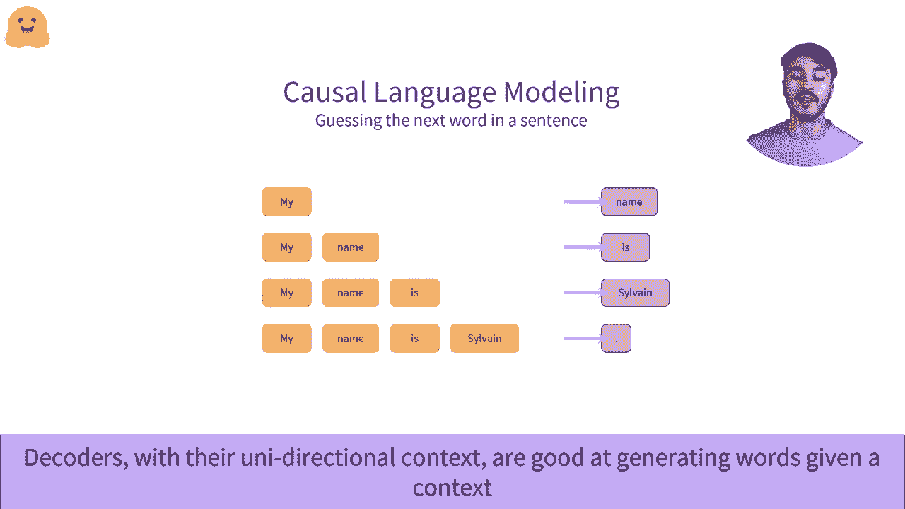

# 【双语字幕+资料下载】官方教程来啦！5位Hugging Face工程师带你了解Transformers原理细节及NLP任务应用！＜官方教程系列＞ - P6：L1.6- Transformer：解码器 - ShowMeAI - BV1Jm4y1X7UL

在这段视频中，我们将研究解码器架构。一个流行的仅解码器架构示例是GPT2。为了理解解码器的工作原理，我们建议查看有关编码器的视频，它们与解码器非常相似。解码器可以用于大多数与编码器相同的任务。

尽管通常会有一点性能损失。让我们采用与编码器相同的方法，试图理解编码器和ID解码器之间的架构差异。我们将使用三个单词的小示例。我们将它们传递通过解码器。我们为每个单词检索数值表示。这里，例如。

解码器将三个单词“welcome to NYC”转换为三个数字序列。解码器为每个输入单词输出恰好一个数字序列。这种数值表示也可以称为特征向量或特征张量。让我们深入探讨这种表示。它包含每个通过解码器传递的单词的一个向量。

这些向量是所讨论单词的数值表示。😊 向量的维度由模型的架构定义。解码器与编码器的主要区别在于其自注意机制，它使用所谓的掩码自注意。这里，例如，如果我们关注单词“2”。

我们会看到这个向量绝对不受“NYC”一词的影响。这是因为右侧的所有单词，也称为单词的右上下文，都被掩码处理。解码器只访问单个上下文，可能是左上下文或右上下文，而不是从左右两侧的所有单词中受益。

掩码自注意机制通过使用额外的掩码来隐藏单词两侧的上下文，与自注意机制有所不同。单词的数值表示不会受到隐藏上下文中单词的影响。因此，何时使用解码器就显得重要，解码器和编码器一样可以作为独立模型使用。由于它们生成数值表示，因此可以应用于各种任务。

然而，解码器的强大之处在于单词仅能访问其左上下文。仅能访问左侧上下文，使其在生成文本方面天生优秀，能够根据已知单词序列生成单词或单词序列。这被称为因果语言建模或自然语言生成。😊

这是因果语言建模如何工作的一个例子。我们从一个初始单词开始，即“my”。我们将其作为解码器的输入。😊 模型输出一个数字向量，这个向量包含关于序列的信息，在这里是一个单词。我们对这个向量进行小的转换，使其映射到模型已知的所有单词。

这是一种映射，被称为语言模型头。我们确定模型认为最可能的下一个单词是“name”。然后，我们将这个新单词添加到初始序列中。从“my”开始，我们现在的序列是“my name”。这就是自回归方面的体现。😊。

自回归模型将过去的输出重用作为输入，接下来的步骤也一样。我们再次进行相同的操作。我们通过解码器处理该序列，并提取出最可能的下一个单词。在这种情况下，是单词“is”。我们重复这一操作，直到感到满意。从一个单词开始，我们现在生成了一个错误的句子。我们决定在此停止。

但我们可以继续一段时间。例如，GPT-2的最大上下文大小为1024。我们最终可以生成多达1024个单词，解码器仍然会对前面的单词和序列有一定的记忆。😊。

嗯。
