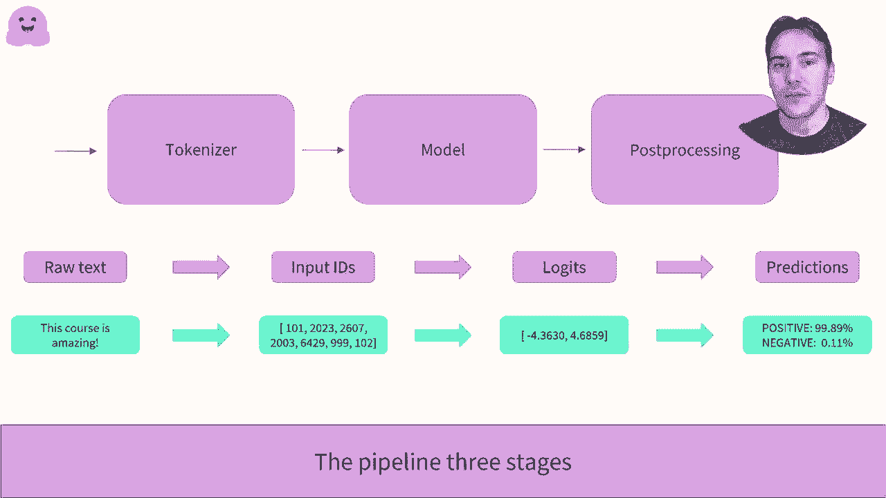

# 【双语字幕+资料下载】官方教程来啦！5位 Hugging Face 工程师带你了解 Transformers 原理细节及NLP任务应用！＜官方教程系列＞ - P8：L2.1- 管道函数内部会发生什么？(PyTorch) - ShowMeAI - BV1Jm4y1X7UL

What happens inside the by function？In this video， we'll look at what actually happens when we use the pipeline function of the Transforms library。

Now specifically， well look at the sentiment analysis pipeline and then it went from the two following sentences so the positive and negative labels were respective scores。

As we've seen in the pipeline plan presentation。There are three stages in the pipeline。First。

 we convert a verex to numbers the model can make signs of using a tokenizer。

Then those numbers go through the model which outputs lows。Finally。

 the first processing steps transform Vo gate into labels and scores。

Let's look in details at those three steps and how to replicate their music the Transformerss library。

 beginning with the first stage tokenization。So organization process has several steps first。

 the text is split into small chunks called tokens。They can be words， part of words。

 or punctuation symbols。Then the tokenizer will add some special tokens if the model expected。Here。

 the model used expect a seal token at the beginning and a sep token at the end of the sentence to classify。

Lastly， the tokenazer patches each token to its unique ID in the vocabulary of the portrayed model。

To load such a tokenizer， the transformformers library provides the Utokenizer API。

The most important method of this class is from Pretrained。

 which will download and cache the configuration and the vocabulary associated to a given checkpoint。

Here， the checkpoint used by default for the sentiment analysis pipeline is distber based case fine tuned SS2 English。

 which is a bit of a mouthful。We instant to tookken associated with a checkpoint。

 and feed it to the two sentences。Since the two sentences are not of the same size。

 well need to pad the shest one to be able to build an array。

This is done by the tokenizer with the option padding equal true。With truation equal2。

 we ensure that any sentence longer and the maximum the middle can handle is truncated。Lastly。

 the return tensil option tells the tokenizer to return the byytch tensil。Looking at a result。

 we see we have a dictionary with two keys， input ID contains the ideas of both sentences with zero where the padding is applied。

The second key attention mask indicates where patting has been applied。

 so the model does not pay attention to it。This is all what is inside the token step。

Now let's have a look at the second step。三もど。As also to an。

 there is a notomod API with from prettrain method。

 it would download and cache the configuration of the model， as well as the pretrain weight。However。

 the Automod API will only instantiate the body of the model。

 that is the part of the model that is left once the pro traininging head is removed。

It will output a high dimensional tensor， that is a representation of the sentence's past。

 but which is not directly useful for our classification program。Here， the tensor has two sentences。

 each of 16 tokens， and the last dimension is the Indian size of our model， 768。

To get an output linked to our classification problem。

 we need to use the Automodal for sequence classificationification class。

It works exactly as you to model class， except that12 build a model with a classification head。😊。

Praise one auto class for each common NLP task in the transformformers library。Here。

 after giving all models of two sentences。We get a tensor of size 2 by2。

 one result for each sentence and for each possible level。Those outputs are not probabilities yet。

 we can see they don't sum to one。This is because each model of the transformformers's library returns look it。

To make sense of look it， we need to dig into the third and last step of the pipeline。

Plus processing。To conduct Lo into probabilities， we need to apply a softmax layers to them。

As we can see， this transforms them into positive number that's a up to1。

The last step is to know which of those corresponds to the positive of the negative label。

This is given by the I2lipol field of the model cong。The first probabilityba is index0。

 correspond to the negative level and the seconds index1 correspond to the positive level。

This is how our classifier built with the pipeline function pickeded with labels and compute those scores。

😊，Now that you know how each step works， you can easily tweak them to your needs。

。