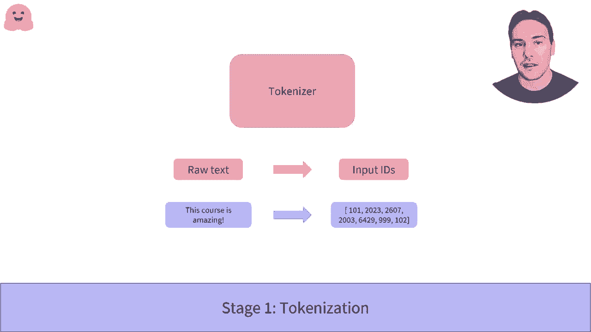
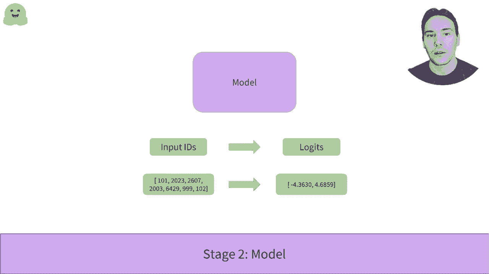

# 【双语字幕+资料下载】官方教程来啦！5位 Hugging Face 工程师带你了解 Transformers 原理细节及NLP任务应用！＜官方教程系列＞ - P9：L2.2- 管道函数内部会发生什么？(TensorFlow) - ShowMeAI - BV1Jm4y1X7UL

在pipelineplan函数内部发生了什么？在这个视频中，我们将看看当我们使用transformers库的pipeline函数时，实际发生了什么。更具体地说，我们将查看科学分析管道，了解它是如何从以下两个句子转化为积极和消极标签及其相应的分数。

正如我们在pipeline视频中看到的，管道中有三个阶段。首先，我们通过使用标记器将文本转化为模型可以理解的数字。然后，这些数字与模型进行交互，输出标签。最后，处理步骤将这些标签转化为分类和得分。

让我们详细看看这三个步骤以及如何在transformers库中复制它们，首先是第一阶段的标记化。

标记化过程包含几个步骤，首先，文本被拆分成称为token的小块。它们可以是单词、词的一部分或标点符号。然后，标记器会添加一些模型所期望的特殊标记。在这里，所使用的模型在句子的开头期望一个CS标记，在结尾期望一个s标记以进行分类。

最后，标记器将每个标记与预训练模型词汇中的唯一ID进行匹配。

要加载这样的标记器，transformers库提供了autotokenizer API。该API中最重要的方法是from betray trade，它将下载并缓存与给定检查点相关的配置和词汇。在这里，默认用于情感分析管道的检查点是dist belt paste和case fine tune SS through English。

这有点难以表达。我们实例化与检查点关联的标记，然后输入这两个句子。由于这两个句子的长度不同，我们需要对较短的句子进行填充，以便能够形成一个数组。这是通过标记器进行的，使用ytion，填充相等。通过truation相等。

我们确保任何超过模型最大处理能力的句子都会被截断。最后，returntensil选项告诉标记器返回一个由doch tensil构成的数组。查看结果，我们可以看到我们有一个包含两个键的字典。Input IDs包含两个句子的ID，其中填充的部分为零。第二个键attention mask指示填充的应用位置。

因此，模型不会对此给予关注。

这始终是组织步骤中的内容。

现在让我们看一下第二步。模型。

至于tokenizer，使用newmod API和between方法。它将下载并缓存模型的配置以及预训练权重。然而，Auto API仅实例化模型的主体。即在去除预训练边缘后剩下的模型部分。

它将输出一个高维张量，表示句子的过去，但这对于分类问题并没有直接用处。这里的张量有两个句子，每个有16个标记，最后的维度是模型的大小，768。

为了获得与我们的分类问题相关的输出链接，我们需要使用序列分类类的Automod。它的工作方式与零到模型类完全相同，只是它将构建一个带有分类头的模型。价格1不是Transformers库中每个常见LLP任务的类。

在给我们的模型两个句子后，我们得到了大小为2x2的张量源。每个句子和每个可能标签的一个结果。这些输出还不是概率，我们可以看到它们的总和不为1。这是因为transformer库的每个模型返回logits。为了理解这些，我们需要深入挖掘管道的最后一步。

加上处理。为了将logits转换为概率，我们需要对其应用一个C max层。正如我们所看到的，这将其转换为正数，使它们的总和为1。最后一步是知道哪些对应于正标签或负标签。

这由模型配置的ID2lipold字段给出。第一个概率是索引0，对应于负标签，第二个索引1对应于正标签。这就是我们的分类器如何通过管道函数构建的，选择标签并计算vicos。

现在你知道每个步骤是如何工作的，你可以轻松调整它们以满足你的需求。

嗯。
