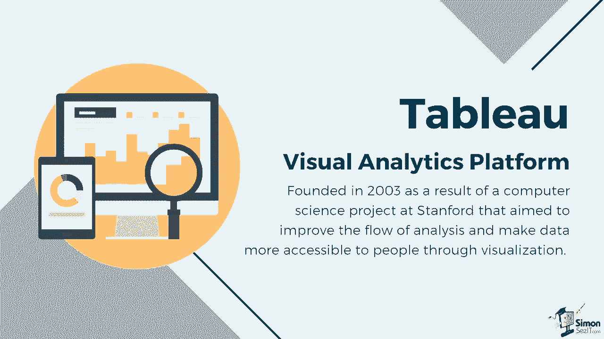
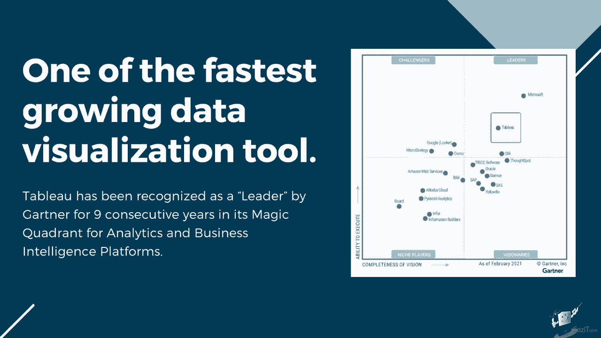
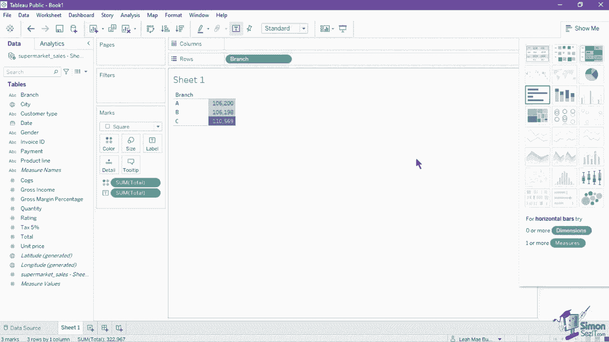
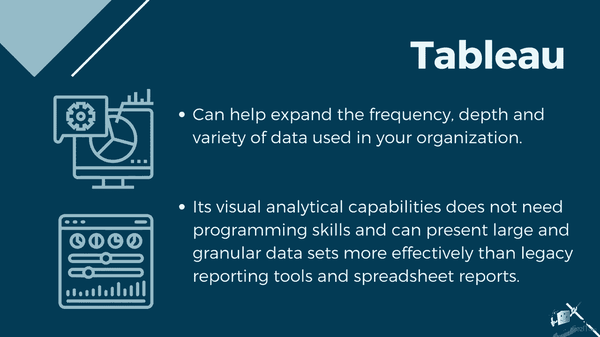

# 【双语字幕+资料下载】数据可视化神器 Tebleau！无需编程，使用拖拽和点击就做出超精美的图表。1小时新手教程，从安装到做图一气呵成~＜快速入门系列＞ - P1：1）Tableau 简介 - ShowMeAI - BV1T341117q7

Subscribe。And click the bell icon to turn on notifications。

We've made the accompanying exercise files for this tutorial available for free。

 Just click the link below in the video details to get these。

Many leading industries use Tableau to apply modern business intelligence to their systems。

 Tableau is a visual analytics platform founded in 2003 as a result of a computer science project at Stanmford that aim to improve the flow of analysis and make data more accessible to people through visualization。

It is currently one of the fastest growing data visualization tools， and it is powerful。

 easy to use and can be easily integrated。Tableau has been recognized as a leader by Gartner for nine consecutive years in its magic quadrant for analytics and BI intelligence platforms。

Tableau has a flexible front end and an intuitive interface that visually expresses data by translating drag and drop actions into data queries。

The software can connect， blend and extract data from various sources such as flat files like Excel。

 It can also connect to different types of databases or live connections and even get data from the web。

 Tableau separates the data layer from the presentation layer and makes updating a spreadsheet data source a trivial append to the bottom of your source spreadsheet。

Tableau helps simplify raw data to an easily understandable format。 In a few clicks。

 you can create charts and views that are both interactive and shareable。

 It is easy to learn such that any Excel user and non technical personnel can grasp it。

 but it is still powerful enough to handle complex analytical processes and advanced visualization。

It can also handle copious amounts of data without compromising the performance of the dashboards。

 its dashboards also have a responsive design which lets you view and operate from several handheld devices such as mobile phones and tablets。

Tableau can help expand the frequency depth and variety of data used in your organization。

Most importantly， Tableau's visual analytic capabilities do not need programming skills。

 and they present large and granular data sets more effectively than legacy reporting tools and spreadsheet reports。

