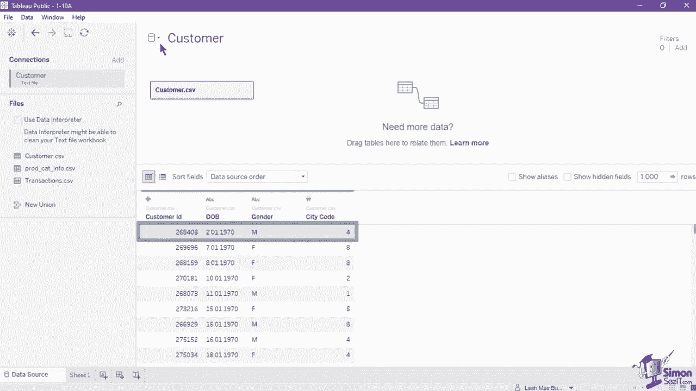
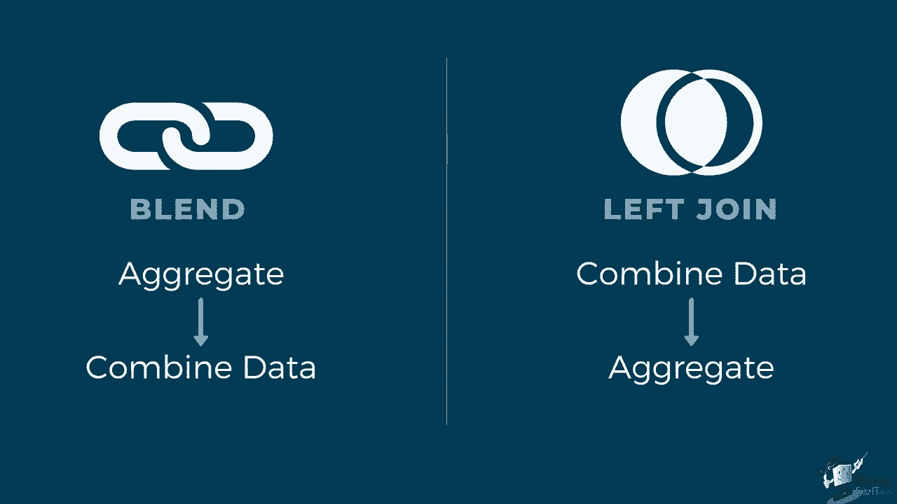
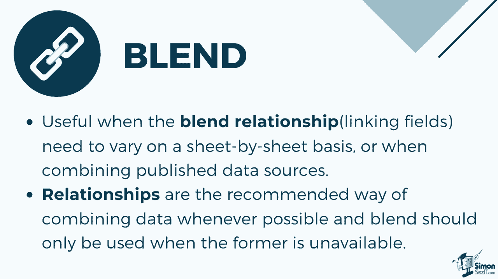
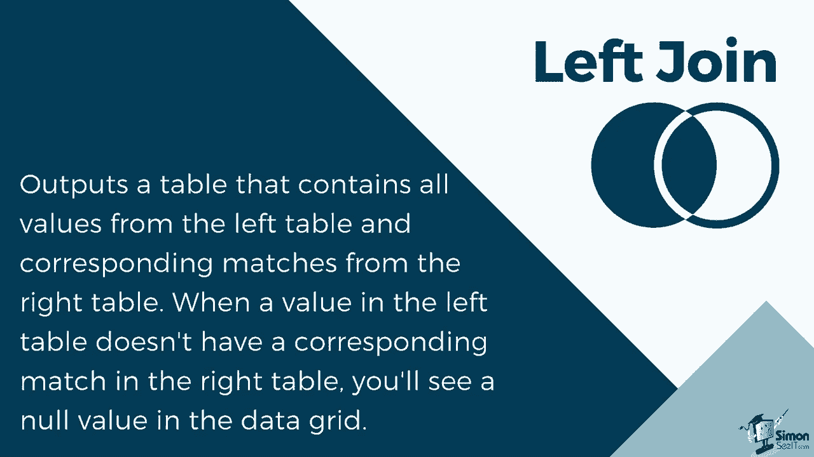
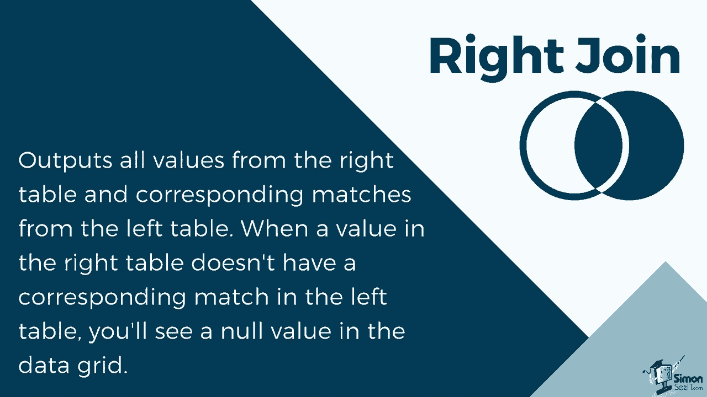
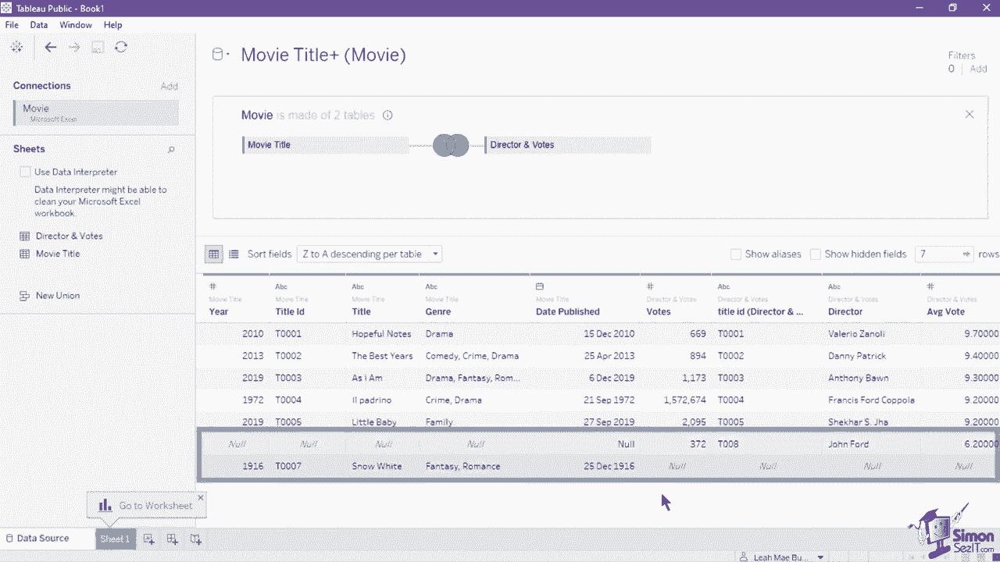
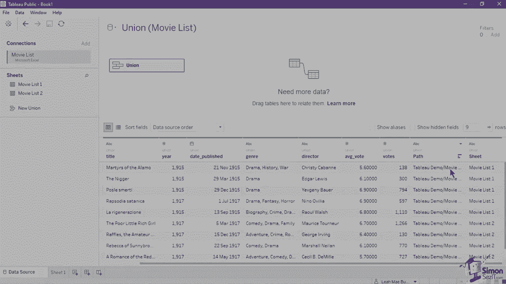
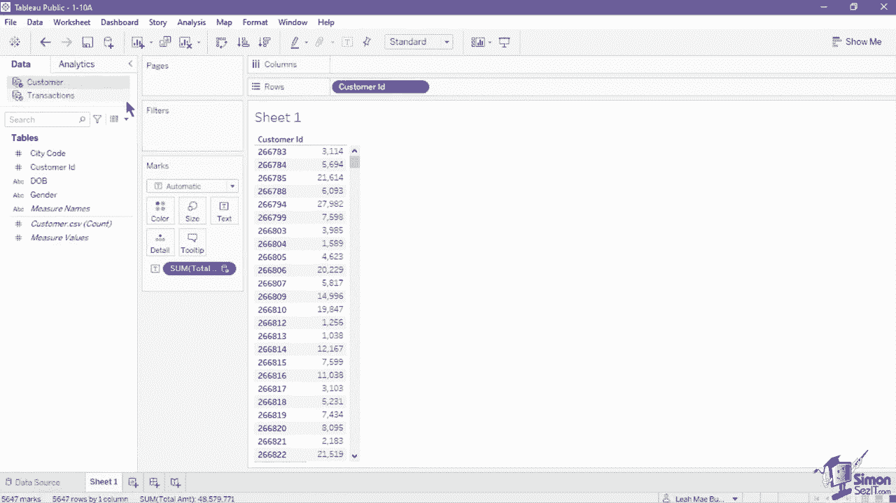
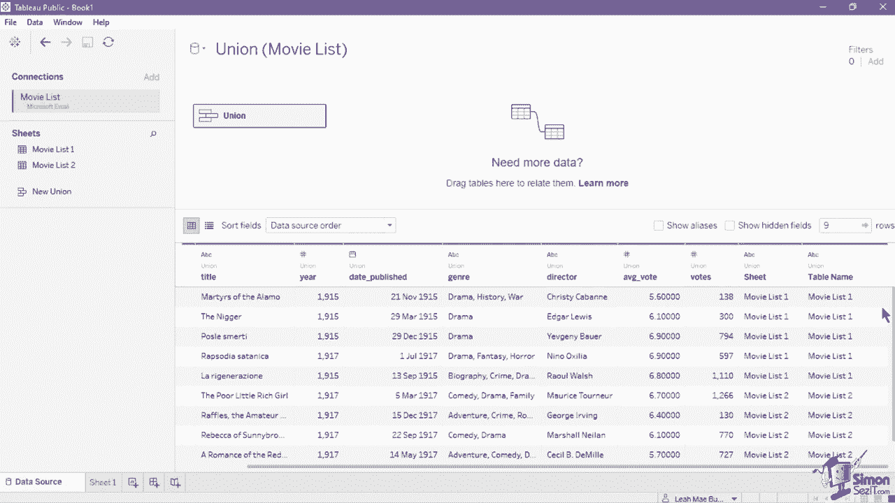

# 【双语字幕+资料下载】数据可视化神器 Tebleau！无需编程，使用拖拽和点击就做出超精美的图表。1小时新手教程，从安装到做图一气呵成~＜快速入门系列＞ - P10：10）在 Tableau 中使用多个数据源 - ShowMeAI - BV1T341117q7

In an earlier lesson， we identified how the method of joins and relationships differ。

Both methods are applied when combining multiple data connections from one data source。

But what if we need data from different data sources？

Blens， unlike relationships or joins， never truly combine the data。 Instead。

 blends query each data source independently。The results are aggregated to the appropriate level。

 Then the results are presented visually together in the view。Because of this。

 lenss can handle different levels of detail， and they work with published data sources。For example。

 in this workbook we have two data sources。First is the customer data source。

 which has the customer information。And second is the transactionsions data source。

 which has the transactions information。Both data sources have the field customer ID。

 but in different levels of detail。Transactions data source can have multiple customer IDs in it if they bought from the store multiple times。

While the customer data source contains unique customer ID。

When data blending， your data sources will be identified as either a primary or a secondary data source。

 This is done on a sheet by sheet basis， meaning a new sheet can have a different primary and secondary data source。

The primary will always be the first data source used in the view。 For example， in this view。

 we have used the customer ID as the first field in the rows shelf。

 and so customer data source has been marked as a primary for sheet1。

A primary data source is marked with a check mark on its name in the date of pane。

 Let's supply the blend in this view。 Click on the transactions data source。

 then select the total amount measure field and set it as the text value in the view。Upon doing so。

 this creates the blend and marks the transactions data source as a secondary source。

A secondary source will have an orange check indicator in its name in the data pane。

Notice that there is a red chain icon in the customer field ID of the transactions data source。

This means that Tableau automatically made the customer ID as the linking field of the primary and secondary data source。

If a field has the exact same name for both data sources。

 it is automatically set as a linking field to make the blend work。

 the linking field values must have the same values or members。

 You can edit the linking field by navigating to the data menu and clicking on edit blend relationships。

The new menu lets you specify which data source will be set as the primary and the field that will be used as a link。

The linking field is marked with a red chain if its active， meaning it is currently used in the view。

This will be replaced by a gray broken chain icon if the field is not in use。

 observe at what happens if we remove the customer I D and place it with date of birth。

 Upon doing so， the customer I D field in the data pane now has the gray chain icon。

It also removed the link between the data source， and so the values on the table changed to a single value。

 which is the aggregated amount。The graycha icon also serves as a marker that the field can be potentially used as a linking field。

Let's click the icon to establish the linking field。Once activated。

 the correct values will now be shown in the table。When lending data。

 the primary data source defines how the view will be aggregated in this tabular view that we have created。

 the total amount， which was originally aggregated per order or transaction。

 is now aggregated into the customer level， showing the total amount paid by each customer ID。

The secondary data source will be limited to only the values that have corresponding matches to that of the primary data source。

 so customers that have no customer ID recorded on the customer data source will not be included in the view。

This process is similar to that of a traditional left join。

 but the main difference between the two is when aggregation is applied。

 A join combines the data first before applying an aggregation。

 while a blend will aggregate data first before combining the data。

Blens are established individually on every sheet and can never be published because there is no true blended data source。

 simply blended results from multiple data sources in a visualization Instead you need to publish data sources separately。

 then blend the published data source afterwards。Data blending is particularly useful when the blend relationship linking fields need to vary on a sheet by sheet basis or when combining published data sources。

Although data blending has been the only means of using data from different sources。

In Tableau version 2020，01 and earlier。A more efficient way of combining data using relationships has been applied。

 Relationships are the recommended way of combining data whenever possible。

 and blend should only be used when the former is unavailable。

Earlier， we mentioned that blend is similar to that of a left join。As a review。

 join is applied on the physical layer of the canvas in the data source page。

You need to establish a specific field to use for the join and the specific join type。

 Let's look at the different types of join that we can apply in tableau。

 An inner join table will contain the records that matched in both left and right tables。

 If any row from either left or right does not match。 it is removed entirely。

Let's look at how the inner join is applied in this movie data source。

This data connection has two sheets in it。 First is the movie title。

 which has six records and contains the movie information and genre。

 The second sheet is the director and the vote sheet。

 which has six records and contains the director name， average votes and total number of votes。

 Both sheets have the title I D field， which we will use on applying a join to apply a join。

 open the physical layer and drag the second sheet into the layer here。

 Tableau automatically applies an inner join between the two records because it recognizes the similar field of title I D The resulting output of the inner join only contains five records from Title I to Title 5。

1 record was dropped from both the left and right table。 The drop records were t 0，0，0，7。

 Snow White from the left table and t 0，0，0，8， which was directed by John Ford。

Both records were dropped because they did not have a matching record on the other table。

Next is the left join。When you use a left join to combine tables。

 the result is a table that contains all values from the left table and corresponding matches from the right table。

When a value in the left table doesn't have a corresponding match in the right table。

 you see a null value in the data grid。

In the sample tableau data source， let's change the join into a left join and observe which fields are included in the output to change the join type。

 click the join icon and set the join type in the join window。

Select left join and retain the join clauses used。 The output has six records。

 The same titles of  one to 5 that has a matching record on both left and right table。

And a record with IDT 0007， which is unique for the left table。

You can see that the record is unique to that of the left table because it has null values in the right table fields。

 votes， director and average votes。 Since it is a left join。

 all records of the left table are included。 Even the records that have no matching value to that of the right。

The result of a right join contains all values from the right table and corresponding matches from the left table。

 When a value in the right table doesn't have a corresponding match in the left table。

 you will see a null value in the data grid。

Let's change the type of join in this data source to a right join。

 The result of the right join is the five records with matching title I D values and a unique record of t 0。

0，0，8 from the right table。 Notice that same as the left join。

 This record has no matching value from the left table。

 So the year title genre and data published was null。

 The right join will include all records from the right table。

The final join type is the full outer join。 When you see a full outer join to combine tables。

 the result is a table that contains all values from both tables。

When a value from either table doesn't have a match with the other table。

 you'll see a null value in the data grid。 Let's change the join type to a full outer join and observe the output。

 The result has all of the records included in both tables， even those that have no matching value。

 noticeice that the unique records from both tables still have null values since they have no matches on the other。

Aside from blends， relationships and joins， there is also another way of combining data from multiple sources。

 Union combines tables in a way that it depends the values of one table to another compared to the other methods。

 union apps or combines values vertically rather than horizontally。

 in order to apply a union in a tableau data source。

 The tables or sheets used must be in the same data connection。

 Let's create a union on this movie list。 data source。

We have two sheets， Mo list 1 and movie list 2， which has the same fields and data types。

 It is recommended to use a union in tables that have the same structure。

 They should have the same number of fields have matching field names and data types to create the union double click the button new union on the sheets or tables section。

 This opens a new window where you can specify sheets manually or automatically。

Let's try using the manual method first， drag the movie list1 from the sheet section into the Union window。

 then drag the movie list2 from the same section and place it below Mo list1 in the Union window once done。

 hit apply。The data pane now shows all records from both sheets。

 The union was seamless because they have the same exact structure。

 Notice that the end of the table has additional fields called sheet and table name。

 The new fields provide information about where the original values in the union came from。

 including the sheet and table names。 These fields are useful when unique information that is critical to your analysis is embedded in the sheet or table name。

Let's remove the union we created before trying the automatic method。

 Click the drop down of the union and select remove。 Once the canvas is cleared。

 double click the new union to go back to the union window。

 Select the tab Wild card automatic in this window。

 you can set up a criterion to include multiple files in your union。This way。

 you don't have to drag all files into the union window By default。

 this will search the files available in the path that we haven't indicated for the first data connection we created。

You can enable the two check boxeses below to expand search to subfolds and expand search to parent folder to capture more files。

The criterion you can set is limited to setting a wild card or an exact value to the sheets or work book that it will find from this data source。

 we will set the criteria of sheets to include movie list。

 asterisks where asterisks suggest that there is a combination of alphanumeric characters after the name movie list。

In the sheet name。If you wish to exclude the sheets with this type of name。

 you can set exclude in the drop down。For the workbook criteria。

 we have set it to include movie list dot X L S X。 Since we have the exact workbook name that we need。

 you can indicate a wild card in the workbook name。 If you are going to include multiple files。

 Hi apply once done。 same as the manual union output It also included all9 rows from both sheets that was found according to the criteria with set。

 Notice that two fields included were path and sheet。 path was used instead of table name this time。

 because we are searching the whole folder for the file。

 This is done to exclude the exact path of where each file was taken， including the workbook name。

Blens， unlike relationships or joins， never truly combine the data。 Instead。

 blends query each data source independently。The results are aggregated to the appropriate level。

 Then the results are presented visually together in the view。In this view。

 we have used the customer I D as the first field in the row shelf。

 and so customer data source has been marked as a primary for sheet 1。

A primary data source is marked with a check mark on its name in the date of pane。

 Let's supply the blend in this view。 Click on the transactions data source。

 then select the total amount measure field and set it as the text value in the view。Upon doing so。

 this creates the blend and marks the transactions data source as a secondary source。

A secondary source will have an orange check indicator in its name in the data pane。

Notice that there is a red chain icon in the customer field I D of the transactions data source。

 This means that Tableau automatically made the customer I D as the linking field of the primary and secondary data source。

 If a field has the exact same name for both data sources。

 it is automatically set as a linking field to make the blend work。

 The linking field values must have the same values or members。

A join combines the data first before applying an aggregation union appends or combines values vertically。

 rather than horizontally。 Let's create a union on this movie list data source。 We have two sheets。

 Mo list 1 and movie list 2， which has the same fields and data types。

 It is recommended to use a union in tables that have the same structure。

 They should have the same number of fields have matching field names and data types。

 to create the union double click the button new union on the sheets or tables section。

 This opens a new window where you can specify sheets manually or automatically。

Let's try using the manual method first， drag the movie list1 from the sheets section into the Union window。

 then drag the movie list2 from the same section and place it below Mo list1 in the Union window once done。

 hit apply。The data pane now shows all records from both sheets。

 The union was seamless because they have the same exact structure。

 Notice that the end of the table has additional fields called sheet and table name。

 The new fields provide information about where the original values in the union came from。

 including the sheet and table names。 These fields are useful when unique information that is critical to your analysis is embedded in the sheet or table name。

For the next section， you'll want to download the course exercise files。

 Click the link below in the video description to get these。

You can also scroll through the details to find timestamps for each section in this course。

If you're enjoying this training， please leave us a comment。

