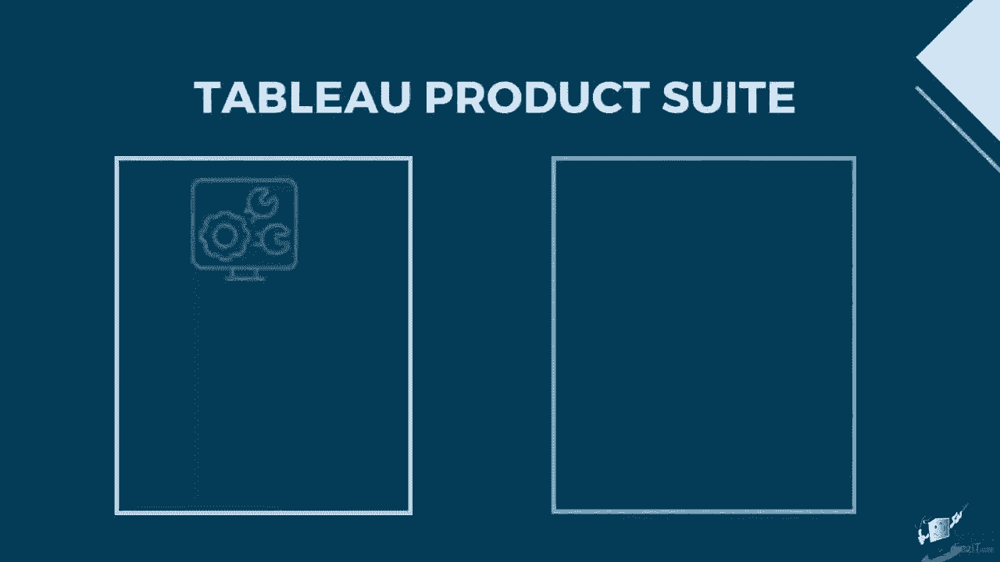
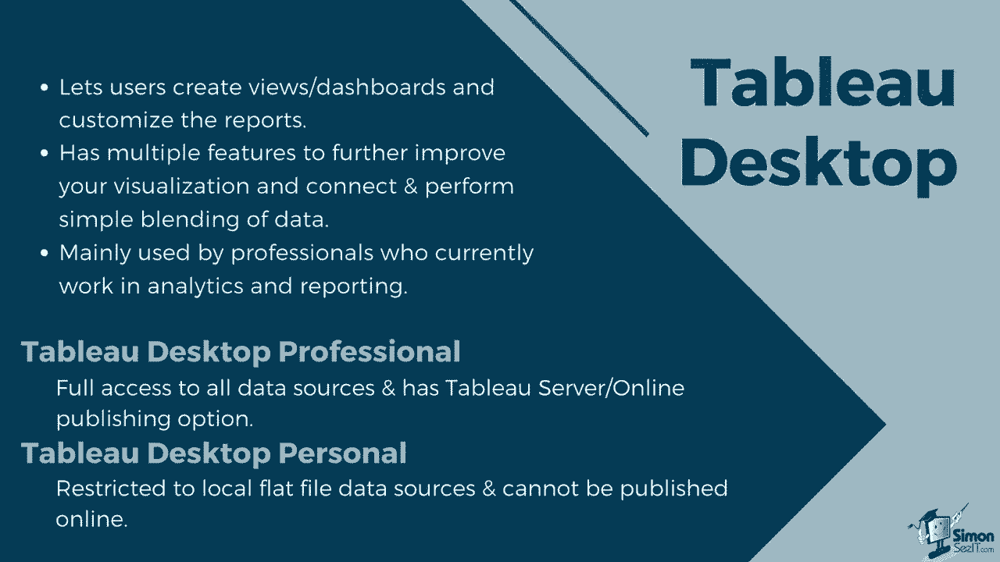
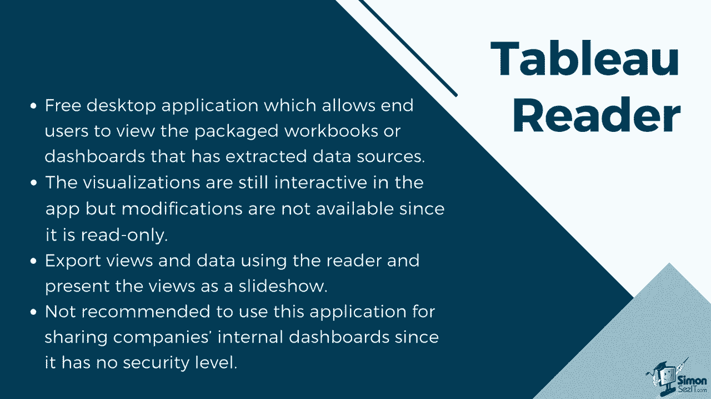
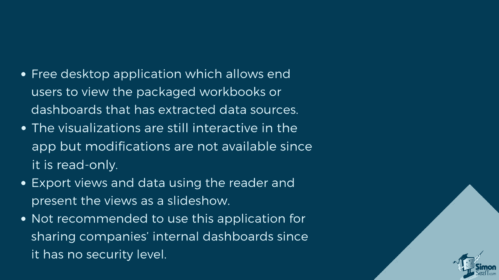
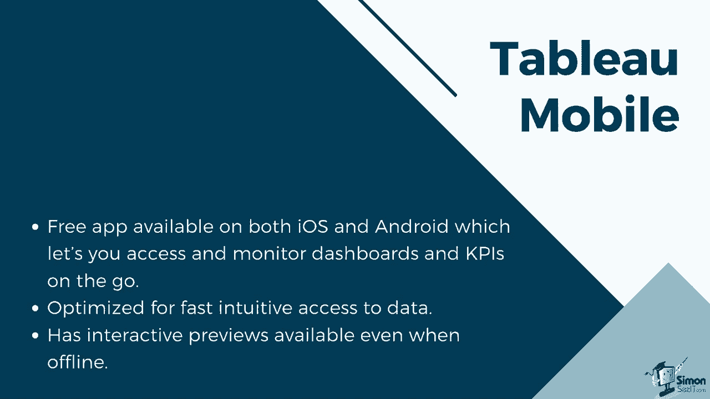

# 【双语字幕+资料下载】数据可视化神器 Tebleau！无需编程，使用拖拽和点击就做出超精美的图表。1小时新手教程，从安装到做图一气呵成~＜快速入门系列＞ - P2：2）Tableau 产品套件介绍 - ShowMeAI - BV1T341117q7

The Tableau product suite consists of several pieces of software。 and these can be classified into two sections，  developer tools。 which are used for creating charts or views， as well as generating reports。 connecting or blending data and forming dashboards。 Tableau Prep。

 Tableau desktop and Tableau public， are under this category。 Sha tools。 which is mainly used for sharing or publishing reports that were created using the developer tools。Tableaus Ser， Tableau Online and Tableau Reader are sharing tools。

Let's start with the  developer tools。Tableau desktopstop lets users create views s dashboards。 and allows users to customize the reports。It has multiple features which let users further improve their visualization。 and it can also connect and perform simple blending of data。It is mainly used by professionals who currently work in analytics and reporting。

Tableau desktopstop has two types based on its connectivity and publishing options。 Tableau desktopstop professional has full access to all data sources and data types。 The professional version also lets you share your dashboards online through the Tableau server。 The other version is the Tableau desktop personal。

It is more restricted compared to the professional version。 Tableau desktops personal only connects to flat files such as Excel and CSB。 and its dashboard cannot be published into Tableau's server。 but you can save the workbooks locally or publish it to the Tableau Public website。

Tableau Public is the free version， which still lets you create and customize dashboards。 You can use it to connect to flat files， but not to live database connections。Compared to Tableau Destop personal， it does not let you save the workbooks locally。 but you can publish the dashboards you've created into the Tableau Public website。

It also has a limit of 1 million rows。 This version is most suitable for beginners who want to try out the product and explore data analytics。 We will utilize Tableau public for the duration of this course。Tableau Prep is a self service data preparation tool， providing a visual and direct way to combine。 shape and clean data。It is comprised of two products。

 Tableau prep builder and Tableau Prep conductor。 Tableau Prep builder gives you a complete picture of your data for analysis that lets you combine。 shape and clean your data to prep it for visualization。 It comes in three coordinated views to let you see row level data profiles of each field or column and the entire data prep process。Tableau PrepBuilder also lets you connect to data both on premise or in the cloud。

Tableau prep conductor， on the other hand， lets you schedule， monitor and administer your data flow。 The data flow can be published into either Tableaus server or Tableau On。 where administrators can schedule when it will run and when the data will be updated as well as monitor the schedule flows。

Now， let's look at the sharing tools which can be utilized after creating a workbook or dashboard from the developer tools。 Tableau readerer is a free desktop application， which allows end users to view the packaged workbooks or dashboards that have extracted data sources。

 The visualizations are still interactive in the app。 but modifications are not available since it is read only。

You can still export views and data using the reader， as well as present the views as a slideshow。 it is not recommended to use this application for sharing company' internal dashboards since there is no security level。

Tableau Ser lets users share dashboards within the organization's on premisemise server or Cloud server。The dashboards will be viewable through a browser where data refresh and extracts can be scheduled。It also supports connections to live data sources。It can be configured for local authenticification。 active directory integration， trusted authentication， or single signon using SML or Kber。

It also provides a core licensing option， which allows guest access。 It allows creating and maintaining multiple sites at no additional cost。 configuring users and permissions。Tableau On is a hosted Saas version of the Tableau server。 The dashboards and data will be saved on the servers provided and maintained by the Tableau group。

 which removes the need for you to manage the servers。 same as a server。 It has features for data management， cloud connections and automatic updates。 you can authenticate users through Tableau I D， email address and password or configure a site for single sign on using S Ml。 But unlike the Tableau server， it has no guest access。 So all viewers must be authenticated。

Both Tableau Server and Tableau On works with Tableau Mobile。 Tableau Mobile is a free app available on both ios and Android。 which lets you access and monitor dashboards and Kpis on the go。 It is optimized for fast intuitive access to data。 It has interactive previews。

 which downloads your favorite workbooks while you are connected to the server。 so you can access them later， even when offline。 Since Tableau desktoptop has been improved for mobile layout。 you can view dashboards in a clear and readable format， even on a smaller mobile screen。😊。

