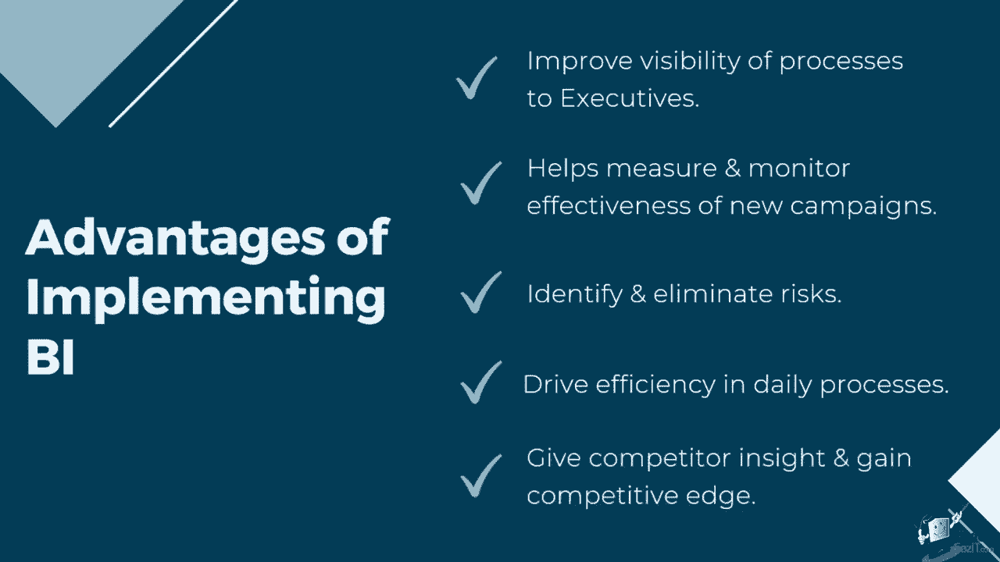
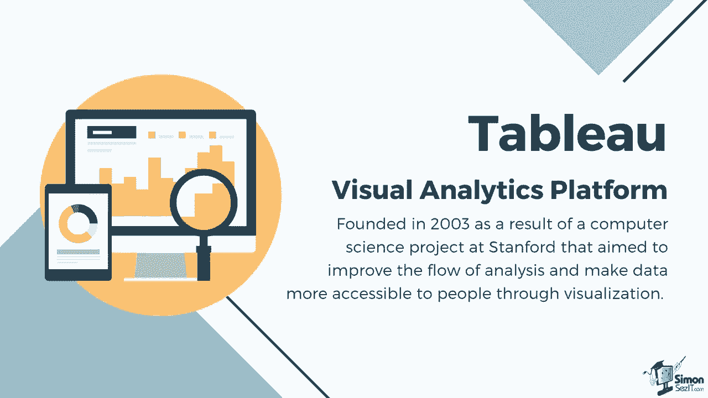

# 【双语字幕+资料下载】数据可视化神器 Tebleau！无需编程，使用拖拽和点击就做出超精美的图表。1小时新手教程，从安装到做图一气呵成~＜快速入门系列＞ - P3：3）商业智能简介 - ShowMeAI - BV1T341117q7

Business intelligence refers to the processes and technologies leveraged by enterprises to collect。 integrate， analyze and present pertinent business information in a format that is easy to interpret。

It provides historical， current and predictive views of the business's operation and turns raw data into actionable insights。Business intelligence tools analyze data sets and present its findings using reports， summaries。 dashboards， graphs， charts and maps to provide users with detailed intelligence about the state of the business。The key purpose of business intelligence is to support corporate end users in evaluating the current state of their business and facilitate better business decisions。

Adopting B I into different departments allows an enterprise to make full use of their available data。 For example， sales teams can apply business intelligence to visualize their quarterly Kpis and effectively track how their current output is faring。

It can also be used to create revenue analysis and compare sales performance。Human resources can implement B I for payroll tracking。 as well as gain insights on employee satisfaction。 Finance departments can be assisted by business intelligence in expense management。

 and they can utilize B I tools for financial planning and analysis。Investing in a solid B I strategy and system helps improve the visibility of processes to executives as they can proactively make decisions using real time data on dashboards。 using an effective visualization method to highlight insights allows them to quickly comprehend data instead of skimming through pages of annual reports to assess the business。It also helps measure and monitor the effectiveness of new campaigns and processes。

BI enables a business to get access to detailed insights and analytics about the business。This data helps them identify risks and elements that set them back or are not efficient in growing the business。BI systems also drive efficiency in daily processes。 such as automating the processing and extraction of data。

 which in turn can increase productivity and revenue。Business intelligence can help give insight into what competitors are doing。 allowing your organization to make educated decisions。 as well as plan for future endeavors to gain competitive edge。

Many leading industries use Tableau to apply modern business intelligence to their systems。 Tableau is a visual analytics platform founded in 2003 as a result of a computer science project at Stanmford that aim to improve the flow of analysis and make data more accessible to people through visualization。

