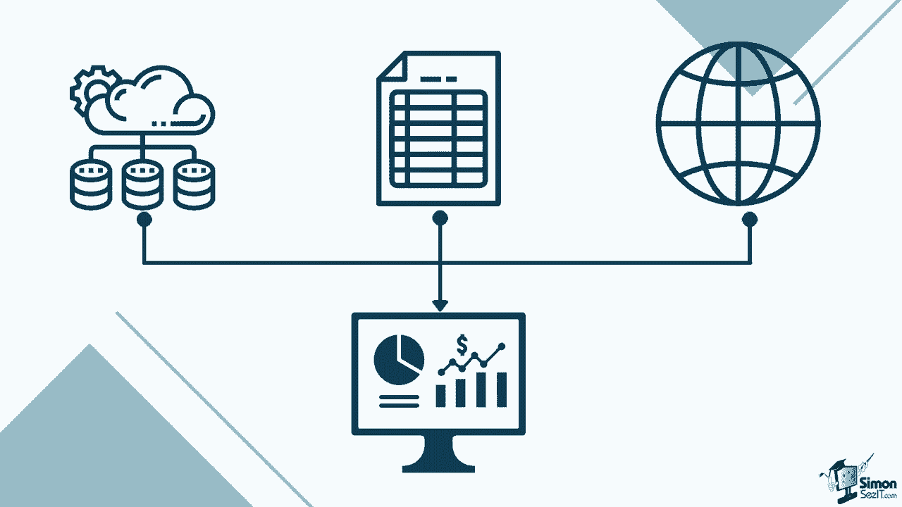
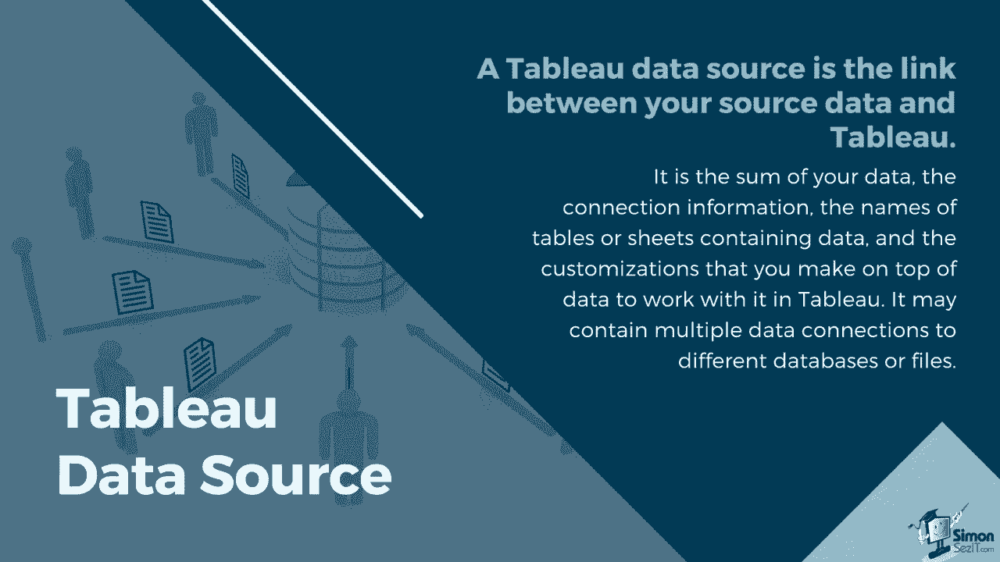
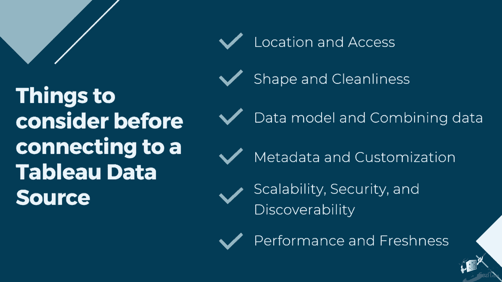
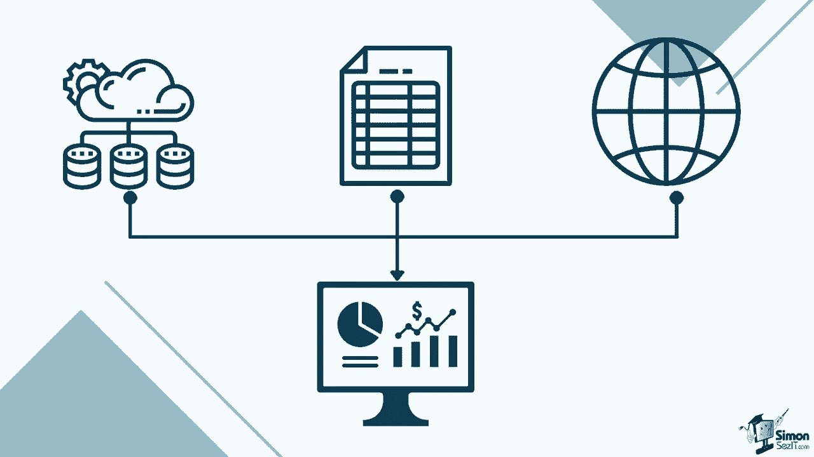
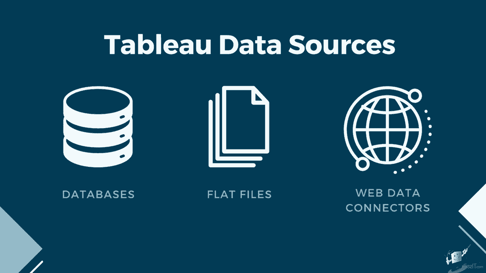
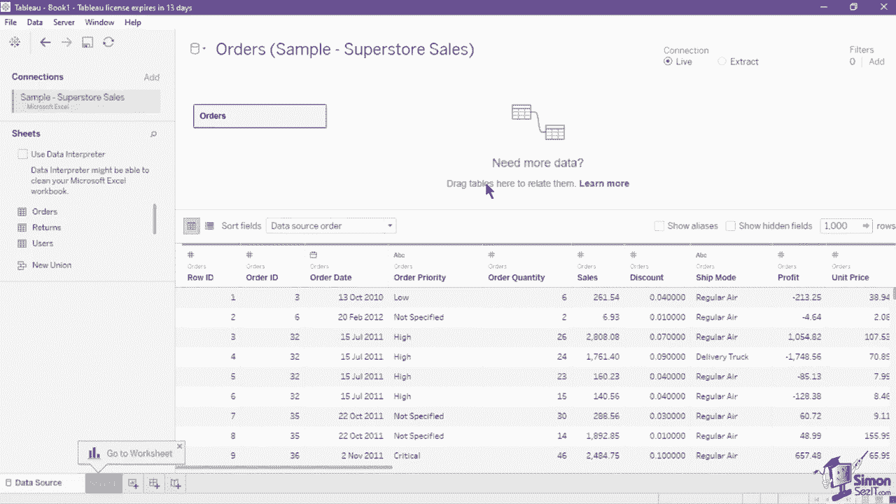
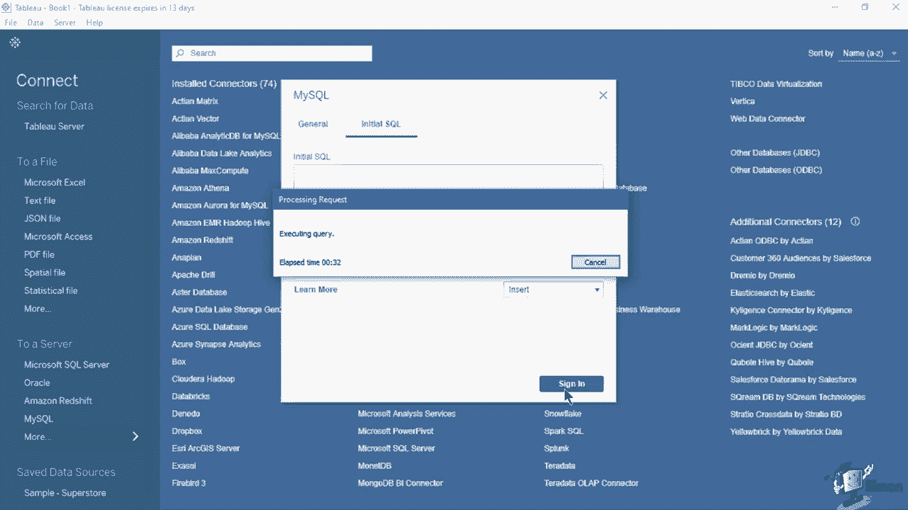
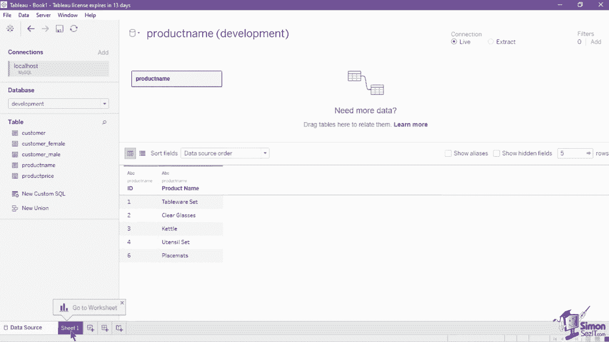

# 【双语字幕+资料下载】数据可视化神器 Tebleau！无需编程，使用拖拽和点击就做出超精美的图表。1小时新手教程，从安装到做图一气呵成~＜快速入门系列＞ - P6：6）连接到 Tableau 中的数据源 - ShowMeAI - BV1T341117q7

嗯。Now that we've learned how to structure and prepare data sets for Tableau。

 let's try connecting the tool to different types of data sources。

A working data connection is needed in order to create visualizations on the platform。

The Tableau Data source is the link between your source data and Tableau。

It is essentially the sum of your data， the connection information。

 the names of tables or sheets containing the data。

 and the customizations that you will make on top of data to work with in Tableau。

A tableableau data source may contain multiple data connections to different databases or files。

Connection information includes where the data is located。

 such as a file name and a path or a network location。

 and details on how to connect to your data such as database Ser and server sign in information。

There are several things to consider before connecting to a Tableau data source。

 First is the location and access。 Will your users have access to the data。

Is user filtering and row level security needed？Next is the shape and cleanliness。

Is the source well structured for Tableau。Is any of the data unnecessary or missing。

What calculations or manipulations would be best done natively in Tableau？

Third is the data model and combining the data。Is the data spread across multiple systems？

What is the best way to combine each table of data？

You should also think about metadata and customization。

 Are the tables and field names understandable， Does it need calculations。Fifth is the scalability。

 security and discoverability。 Should the data source stay embedded in the workbook。

How big will the source be。 And finally， look at the performance and freshness。

 Will the data connection be live or an extract。What will the schedule of data refresh be？

When you take these things into consideration， you can officially create quality data sources for your visualization。

Tableau supports many types of data stored in different places， but the catch is。

 this will depend on the type of tableableau product that you have installed。

Tableau Destop Professional has the complete data source connections。

Which includes a native connection to server hosted data sources。

 It has several options of relational， multidimensional and cloud based databases and repositories。

Tableau desktopstop personal， and public， on the other hand， can only connect to flat files。

 Google Sheets， O data， and web data connectors。As mentioned earlier。

 Tableau can use data from databases， flat files and web data connectors。 Datas are great to use。

 as they already have a defined structure where data types are already defined and data that has wrong format for their data types are automatically held back。

This makes it possible for Tableau to understand precisely how to use the data in each field。However。

 at times， flat files are provided as data source。Flat files can be prone to wrong data formats。

 and it sensitive to change in column names。Make sure to follow the data structure tips that we mentioned in the last session to load the data properly into Tableau。

But aside from that， flat files are great for their flexibility。

 You can easily adjust the columns and insert rows into the files。

Always be aware that consistency in formatting is needed if you decide to use flat files for your regularly updated dashboards。

 Finally， we have the web data connector。 a web data connector is an HTML file that includes jascript code。

 You can use a web data connector to connect to data that is accessible over HTP and that doesn't already have a connector It allows developers to create their own data source connectivity to source data from web pages that were not included out of the box in Tau。

 for this lesson we will demonstrate how to connect to flat files and databases。

There are two ways to connect to flat files in Tableau。

 The first one is to simply drag the file from your file Explorer into the start page of the platform。

 It will show a small progress window when loading and will lead you to the data source page once done。

The second way of inserting a flat file is by selecting the file type of your data set from the connect pane of the start page。

 This will open a new file browse window where you can navigate into the file path of your data source。

Once you have found the file， select it and click open。

 this will load the data and lead you to the data source page。Once in the data source page。

 you can now add further formats to the data if needed。If your flat file only has one sheet。

 it should automatically be available in the logical layer of the canvas。

 but if it has multiple sheets， you still need to indicate which one you'll use from the sheet's pane by dragging the sheet name or table name from the pane and placing it in the canvas。

If you need to use multiple sheets or tables， you are required to either use a join or a data relationship to use in the platform we will further discuss these functions in a later session。

To connect to a database， select the type under the connect pane of the start page。

This opens a new dialog box where you can input the necessary connection credentials such as the server name。

 port， database name， username and password， you can also specify an initial SQL command in the second tab that will run when a connection is made to the database。

You can use this command to set up temporary tables to access during the session or set up a custom data environment Once done click on the sign in button to connect to the database。

Once a successful connection to the database or server has been created。

 it will lead you to the data source page。 Select the table that you will use for your visualization from the tables section and drag it into the canvas to view the data from the selected table。

 click on the update Now button in the data preview below。

If you need to use a different database， you can choose the new one from the database section of the left panel。

 an additional function for SQL database connections is the ability to create customSQL queries using custom SQL queries can be useful when you know exactly the information you need and understand how to write SQL queries to create one just click on the new custom SQL button below the table section。

You can use custom SQL queries to combine data vertically， apply across database join。

 reduce or restructure your data， and many other things。

Upon creating your data connection and selecting the table or sheet you will use。

You can now head on to the Tableau worksheet window to begin your visualization。

