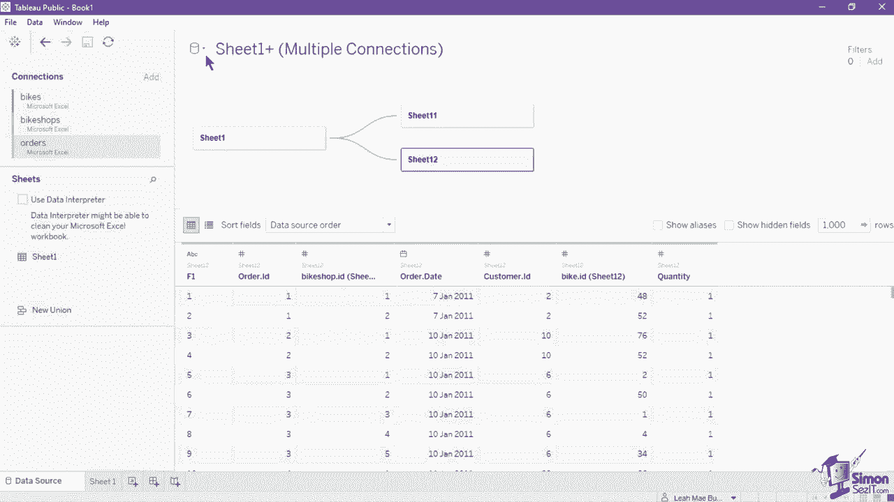
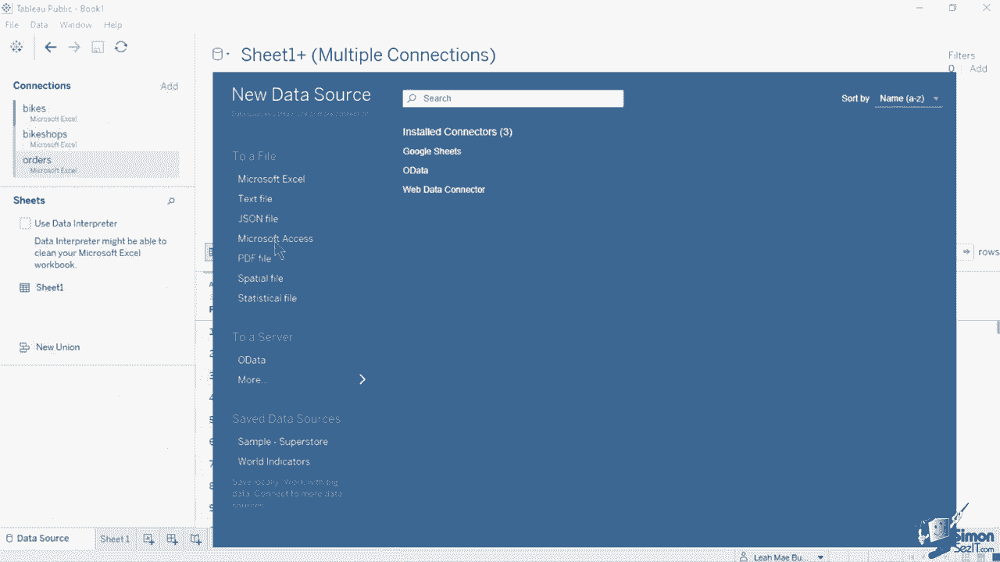
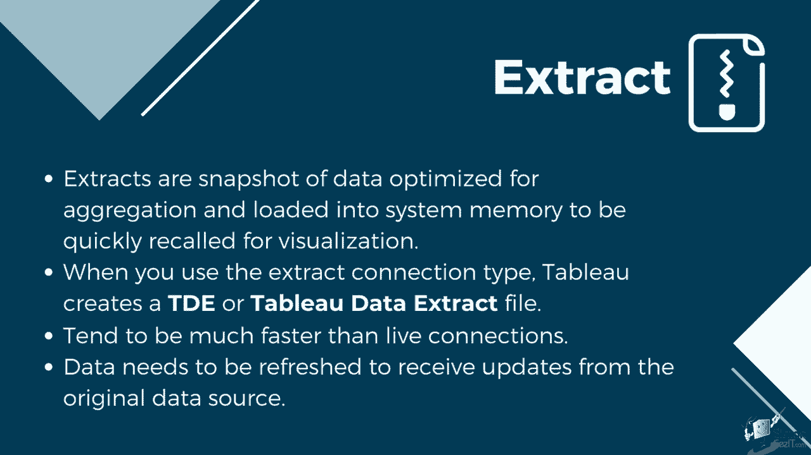
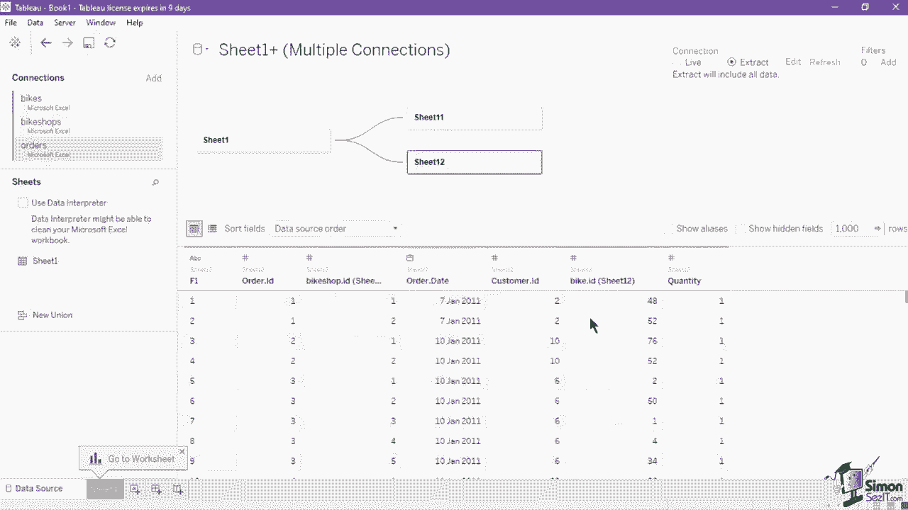
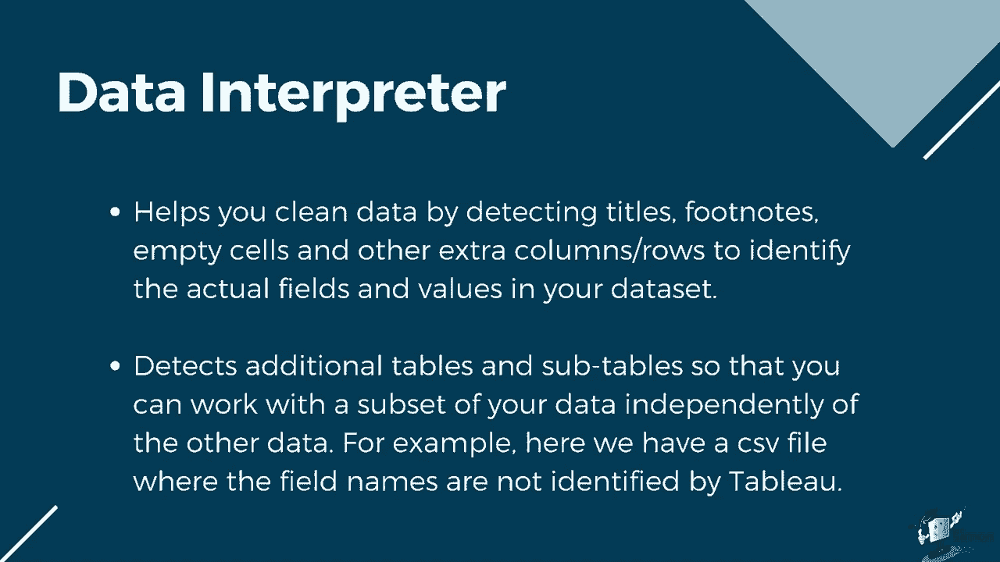
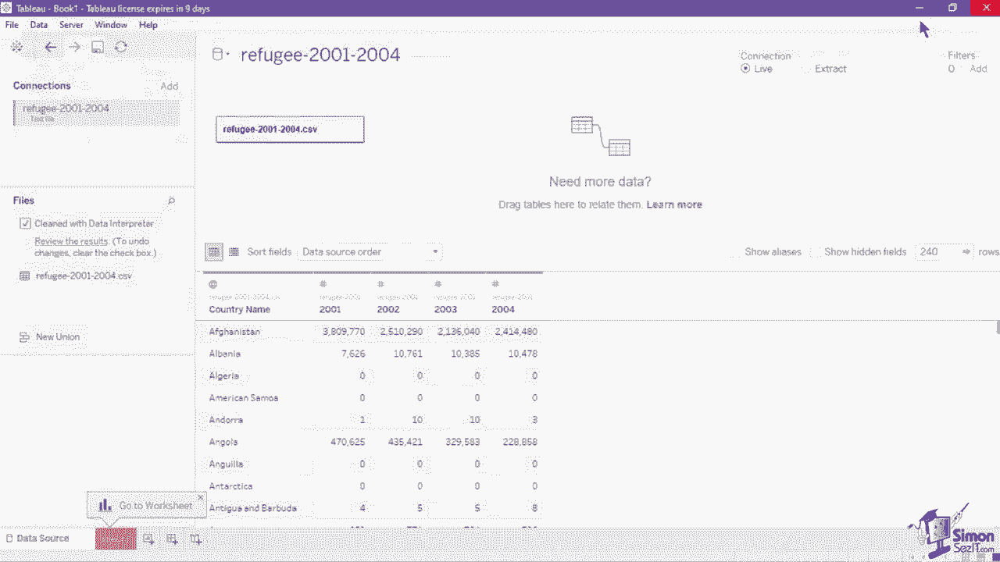
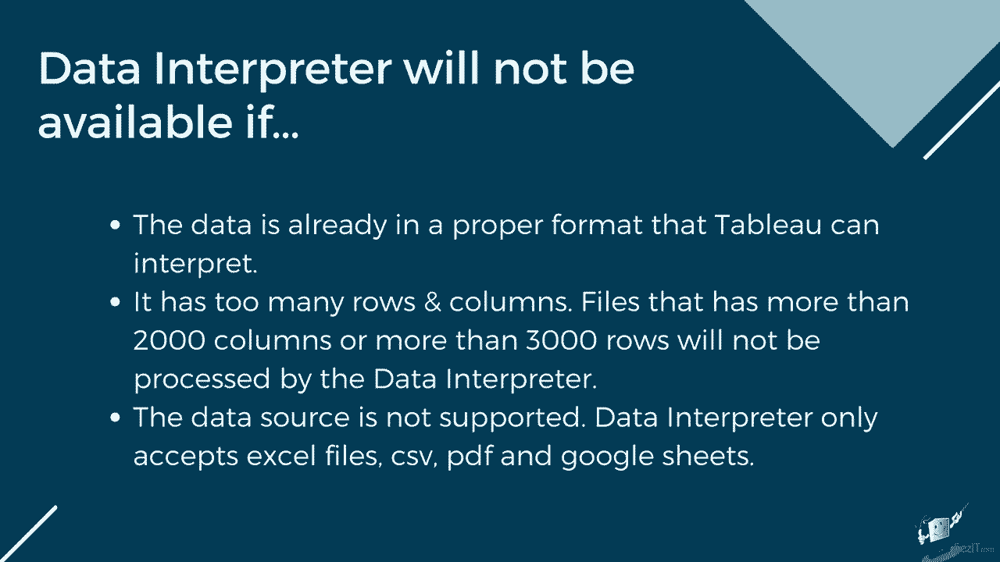
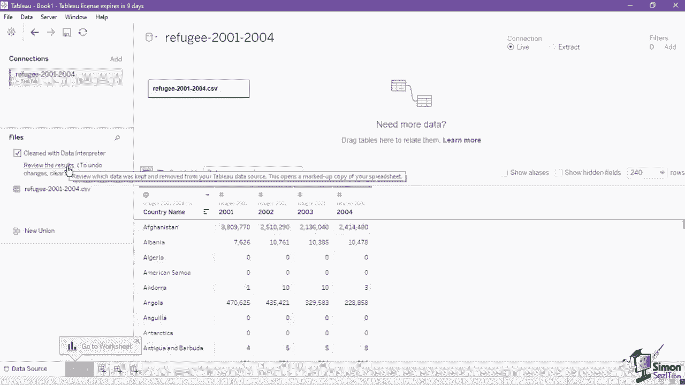

# 【双语字幕+资料下载】数据可视化神器 Tebleau！无需编程，使用拖拽和点击就做出超精美的图表。1小时新手教程，从安装到做图一气呵成~＜快速入门系列＞ - P7：7）Tableau 中的数据源 - ShowMeAI - BV1T341117q7

We utilized the data source page when we created a tableau data source connection。Let's look at the other features that it offers， which can help us modify data and prepare it for visualization。First， let's look at the connection section on the upper left。The database section lists the current files or databases that you have connected to Tableau under the specific data source。

This list the title of the data source and the type of data connection。The first data source that you add will be tagged with the color blue。 Notice that if we add a second data connection to it。The new connection will have a different colored tag。This is done in order to easily identify and differentiate each individual connection。You can also observe the color scheme applied on the data preview and metadata grid。 wherein the selected sheets or tables from different connections will have different colored tags。Adding a new data connection using the add button of the connection section like what we demonstrated earlier。

 will not replace the current data connection on the list。 Instead。 it will insert a second one which can be joined or related to the first connection that you have linked。 If you wanted to replace one of the connection。 Nagate to the connection you wanted to replace or edit。 then click its droprop down button。Select Edit connection in the menu。

To open the file B or database connection menu where you can select the new connection。Do remember that the list of connections listed here does not represent all of the data sources available in a workbook。 This is only for the sheet 1 data source， as reflected by the data source name on the canvas。 A data source can always contain one or more data connections。

 You can have a new data source connections separate from this one。 by clicking the cylinder icon in the upper left and selecting new data source on the list。

This will open a window which has the complete list of all data sources supported by Tableau。

If you wish to remove a created data source， make sure that the source is currently selected。 as indicated on the data source name on the canvasva。 then navigate to the data menu on the ribbon and select the closed data source。Aside from the data source name， we also have the connection type in the upper right of the canvas using the radio buttons。

 you can choose to either use or an extract connection to your data source。 By default。 Tableau sets the connection type to live。 A live connection means that it contains direct connection to the underlying data。 Live connections offer the convenience of real time updates。 which any changes in the data source automatically reflect in Tableau。

But live connections also rely on the database for all queries。 Thus。 it is not always optimized for fast performance。Your data queries will only be as fast as the database itself。The workbook speed can also be affected by your network speed， traffic and any custom SequL。Complex workbooks with live connections can also stress some traditional databases。Extracts。

 on the other hand， are a snapshot of data optimized for aggregation and loaded into system memory to be quickly recalled for visualization。 When you use the extract connection type， Tableau creates a TDE or tableableau data extract file。When you create an extract from a local file such as a CSB or an Excel workbook。Or an on premise database， you're speeding up the workbook through optimization。 As a result。

 Tableau doesn't need the database to build a visualization。 Instead。 Tableau's in memorymory data engine queries the extract directly。Extracts tend to be much faster than live connections。 especially in more complex visualizations with large data sets， filters and calculations。

Since an extract is embedded， you can use your data source even when offline。A drawback to this connection type is that the data needs to be refreshed to receive updates from the original data source。If your data structure also has too many rows and columns， extracts refresh can become slow。

Selecting the extract connection type in the canvas will show two new buttons to edit and refresh the current extract。 Clicking on Edit opens a new window where you can set how the extract data will be stored。 Def filters， aggregate data， and choose rows to include in the extract。After the connection types is the section for adding filters。On your data。

This will reduce the amount of data in the data source based on the filters you have indicated Data source filters can be useful for restricting the data users can see when you publish a workbook or a data source。 when you publish a data source to Tau server， the data source and any associated files or extracts are moved into the server。

As you publish a data source， you can define access permissions for downloading or modifying the data source。 and you can also choose the users and groups who can remotely issue queries through Tableaus server against that data source。 clicking the add button on the data source page will open a new window where you can add edit and remove the applied filters to the data source to add a new filter。 click the add button， then select a field to base the filter on Once you have selected a field。

 you can now indicate a filter value by selecting the available values from the list。 set a wild card， indicate a condition or filter by top records from a field or formula。Another neat feature on the data source page is the data interpreter。 The data interpreter helps you clean data by detecting titles， footnotes。

 empty cells and other extra columns slash rows to identify the actual fields and values in your dataset set。

It can even detect additional tables and subts so that you can work with a subset of your data independently of the other data。 For example， here we have a CSB file where the field names are not identified by tableau。 Let's turn on the data interpreter by ticking the data interpreter checkbox above the sheet list and observe how it changed the data Up upon doing so。 the F1 to F5 columns have now been replaced with the proper field names that were formerly on the second row。

 It also change the data type of the country name from a string into a geographic one to check all of the changes done by the data interpreter you can click on the review the results。 which will output an Excel file that lists the changes using the original copy of data with color coded cells。

The data interpreter feature will not always be available to all data sets。 It will not be shown in the data source page if the data is already in a proper format that Baau can interpret。 It has too many rows and columns， files that have more than 2000 columns or more than 3000 rows will not be processed by the data interpreter。

The data source is not supported。 Data interpreter only accepts Excel files， CSB。 P and Google Sheets。

If the modifications done by the data interpreter was not enough。 you can always apply basic data formatting using the functions in the data pane。 For example。 let's continue using the CSV file that we cleaned via data interpreter Since the columns are in a wide format。 we need to pivot the data in a way that it will indicate the year in one column and the numeric value on another to make it suitable for visualization。

To do so， select the fields that will be pivoted。 In this case。 we will select 2001 up to column 2004。 Click on 2001 and hold the shift key on your keyboard。 Then click the 2004 column to select the three columns。Then right click on your mouse and select pivott in the menu。

This will create two new columns using the selected data。 which will have the field names as pivot field names and pivot field values。Now。 you only need to rename them to rename a column， select one and click its drop down button。 select the Rename function， Then type in the new column name。

 You can also rename a field by simply double clicking its name and typing in a new field name。If you wish to bring back the original file names， click the drop down for the column and select Reset name。Aside from the rename function， you can also apply a sort。 hover over a specific fields name until the sort button appears on its right。

Clicking on the sort button once will sort the data in ascending order as indicated by the icon。Clicking the sort again will sort it to ascending， descending order。Click the sort button for the third time， will'll remove the sort。As we have discussed in an earlier lesson， Tableau automatically assigns data types to the data based on a collection of commonly used patterns。

These data types are seen on both the data pane and the metadata view in the form of icons to change the data type of a field。 click on the data type icon and select the new data type from the menu。Proper data types should always be observed as it will dictate which visualizations， calculations。 and functions can be applied to the field。You can also split a field into separate columns using the function on the data plane。

Click the drop down of the concatenated field and select the split function。By default。 Tableau splits it into two columns using space as the delimiter。If you want to specify a symbol as delimiter， you can use the custom split function in the fields drop down。 select the custom split function。 This will open a new window where you can indicate a specific separator or delimiter and the number of columns that will be split off from either the first last or throughout the column。

 Finally， we have the alias function。 An alias is an alternate name from members in a dimension so that their labels appear differently in the view。 to create an alias。 select the field and click on its drop down in the menu。 select aliases This will show a new window which lists all of the members or values available on the selected field to create the alias rename the alias under the value column。 This way， Tableau will use the alias name as the value visible in the charts label。

 But you can still see its original value on the data plane。😊。Do take note that aliases are only created for discrete dimensions。 since those types of data have limited values。 This function is not available for continuous fields and measure。The basic formatting functions that we have learned are all done inside Tableau。

None of them are applied to the original data source。The database section lists the current files or databases that you have connected to Tableau under the specific data source。This lists the title of the data source and the type of data connection。The first data source that you add will be tagged with the color blue。

 noticeice that if we add a second data connection to it。 the new connection will have a different colored tag。This is done in order to easily identify and differentiate each individual connection。You can also observe the color scheme applied on the data preview and metadata grid。

 wherein the selected sheets or tables from different connections will have different colored tags。Adding a new data connection using the add button of the connection section will not replace the current data connection on the list Instead it will insert a second one which can be joined or related to the first connection that you have linked if you wanted to replace one of the connections。

 navigategate to the connection you wanted to replace or edit， then click its droprop down button。 select Edit connection to open the file browse or database connection menu where you can select the new connection if you wish to remove a created data source。

 make sure that the source is currently selected as indicated on the data source name on the canvas then navigate to the data menu on the ribbon and select the closed data source。Aside from the data source name， we also have the connection type in the upper right of the canvas using the radio buttons。

 you can choose to either use or an extract connection to your data source by default。 Tau sets the connection type to live selecting the extract connection type in the canvas will show two new buttons to edit and refresh the current extract clicking on edit opens a new window where you can set how the extract data will be stored。

 Def filters， aggregate data and choose rows to include in the extract after the connection type is a section for adding filters on your data。 This will reduce the amount of data in the data source based on the filters you have indicated Data source filters can be useful for restricting the data users can see when you publish a workbook or a data source when you publish a data source to Tau server the data source and any associated files or extracts are moved into the server。

As you publish a data source， you can define access permissions for downloading or modifying the data source。 and you can also choose the users and groups who can remotely issue queries through Tableau's server against that data source clicking the add button on the data source page will open a new window where you can add edit and remove the applied filters to the data source to add a new filter。

 click the add button， then select a field to base the filter on Once you have selected a field you can now indicate a filter value by selecting the available values from the list。 set a wild card， indicate a condition or filter by top records from a field or formula。

 Another neat feature on the data source page is the data interpreter Let's turn on the data interpreter by ticking the data interpreter checkbox above the sheet list and observe how it changed the data upon doing so the F1 to F5 columns have now been replaced with the proper field names that were formerly。

On the second row， it also changed the data type of the country name from a string into a geographic one to check all of the changes done by the data interpreter。 you can click on the review the results， which will output an Excel file that lists the changes using the original copy of data with color coded cells。

