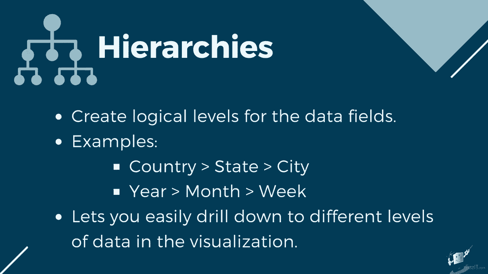
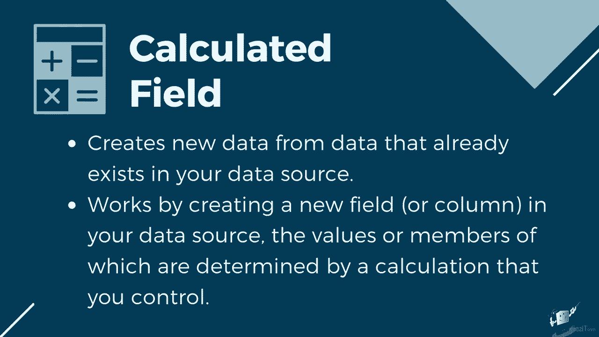
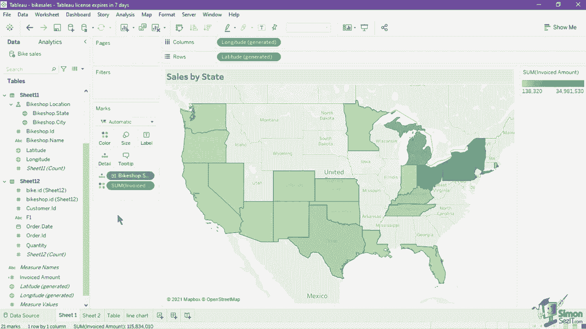
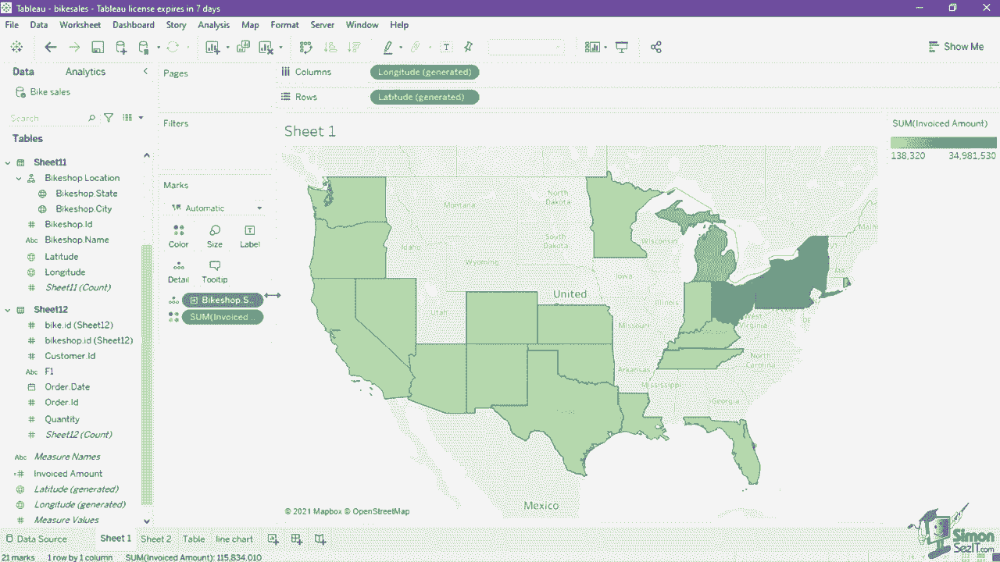

# 【双语字幕+资料下载】数据可视化神器 Tebleau！无需编程，使用拖拽和点击就做出超精美的图表。1小时新手教程，从安装到做图一气呵成~＜快速入门系列＞ - P8：8）Tableau的工作区介绍 - ShowMeAI - BV1T341117q7

The Tableau workspace will be our main interface when creating visualizations and analysis。As we discussed in the earlier lesson about the tableableau workspace。 it is composed of several cards， shelves and panes where we can drag and drop fields in order to form the charts。 First， let's look at the data pane。 which holds our data fields， sets and parameters。

 The top of the pane contains the data source name。You can use this view to switch between data sources if you have created multiple ones。 each data source will have a separate list of data fields on the data plane。 you can also right click on the data source name to show other functions such as extracting data。

 editing aliases， and filters and publishing the data source。To view the data without going back to the data source page。 you can click on the View data icon in the right side of the search box and filter should show the data window。The top right number on this window limits the number of rows in the view。

 You can edit the indicated value to increase or decrease the rows shown。 The maximum value for the row limit is 10000。Besidesside the row limit。 you can hide or show the aliases by using the check box of the show alias's function。 Since we are using three sheets， which are linked using data relationships。

 Three tabs are visible in the bottom of the window。Each tab represents each individual table or sheet。 which you can toggle around by clicking the tab for the data shown。 you can move the columns by dragging the column name to the right or left。You can also sort the data by clicking on the column name if you wish to copy or export a selection of rows or all of the data on the preview。 you can select the row or column and click on the copy or export all button found in the upper right。Now， let's look at the available fields。 You can group the fields based on their data source or by folder through the drop down button beside the view data icon。 grouping by data source will list the fields based on their respective sheets or tables while grouping by folder will list all of the fields available in the data source by default。

 You can create your own folder to group fields by right clicking on one field and navigating two folders。Create folder。In both group by views， the dimensions are listed first before measures。 wherein a gray line separates the two。

You can create hierarchies using the data pane Hierarchies create logical levels for the data fields。

For example， you can create a geographic hierarchy of country， state。 city or a date hierarchy of year month week by using a hierarchy。 you can easily drill down to different levels of data in the visualization。 Let's try creating a two levell hierarchy for this data set to create a hierarchy。

 drag one field on top of the other here， we are going to use the bikeshop do city and the bikeshop dot state drag the bike shop do city into the bike shop dot state。

This creates a hierarchy which you can name in the window that pops up。Let's name this new hierarchy as bike shop location。Upon typing the name。 it will show the hierarchy in the data pane。The fields that are listed first will be the higher level。 So our first level is set to state， which can then drill down into city。

You can drag the field up or down within the hierarchy to change their level。To delete the created hierarchy， right click on the hierarchy name and click remove Hierarchy。

Next， let's try creating a new calculated field。 Cal fields allow you to create new data from data that already exists in your data source。 When you create a calculated field， you are essentially creating a new field or column in your data source。

The values are members of which are determined by a calculation that you control。

For example， we do not have a field available in the dataset which states how much we have invoiced the customer upon a bike purchase。 but we do have the fields price， which is the price of the bike and quantity which is the number of bikes ordered by the customer to create a calculated field。

 click on the drop down of the data pane and select createre calculated field This opens a new window where you can indicate the calculated field name and its expression。 Let's type in invoiced amount as the name。 Then type in the calculation， price asterisk quantity。

 to multiply the two fields。Upon completing the calculation。 make sure that the message on the lower left indicates the calculation is valid。 Then hit apply or O K。 The new calculated field is now inserted onto the data panes list of measures。When a field name has been updated or removed in the original data source and it is needed for the chart。

 a red exclamation point will be seen parallel to the field in the data pane。To map the corrected field， click write and select replace reference。 This will open a new window。 which has a list of all the fields in the data source。 Select the correct field and hit O。 This will map the correct field to the shelves and properties that use it。 Now。

 let's try creating a chart from the calculated field and the hierarchy that we have created。In the data pane， select the hierarchy bike shop location。 then hold the control button on your keyboard and select the calculated field invoiced amount。 Once both of them have been selected， drag the fields into the canvas。

 This will automatically create a symbols map that indicates the amount of sales per bike shop per state in the US。As you can observe， Tableau automatically generated a latitude and longitude from the state and city fields of our data set and sets it as the rows and columns to mark the X and Y axis on the map。

You can also see on the Mars card as to how the hierarchy and the invoiced amount has affected the visualization。 The state is currently set as the detail to where the circles are located。 While the invoiced amount is set as a label on the map。Let's convert this to a heat map。 Navigate to the show me button and select the maps on the list。

Notice that this has changed how the fields were applied on the mark's card。The state is still on the details， but the invoiced amount is now set to the colors's card。This has converted the map from a symbol to a heat map。 since the invoiced amount now dictates the saturation of color per state。

If you wish to format the marks， for example， you wanted to change the gradient color the invoiced amount to a shade of green。 Click on the color card。 This opens a new window where you can set other properties to change the look of the mark。Here， we can change the palette of the color used as well as change the colors's opacity and add additional effects such as borders and halos。Each option available in the window will depend on the type of card。 So size。

 label and tool tip have their own unique settings or properties to customize。 We are going to learn more about the different mark cards as we create different charts later in the course。 Let's indicate a title to this chart by double clicking the default sheet one title above the map。 This opens the edit title window where we can type in the new one。 Se it to sales by state。

 from this window， we can also apply text formatting to the title。 We can change the font size。 make the text bold， italic or underlined as well as change the font color and its alignment。 You can also insert fields value to make the title dynamic using the drop down of the insert button。 Click apply an O to show the changes to the canvas。For additional formatting options。

 right click on the title and click on format title。 This will show a format title in caption pane where you can set the shading in border for both the titles and captions。 Aside from the title， you can also format most of the things visible in the visualization。Just click on the pill of the field or a certain point of the chart。

 Then right click and select format。 This opens the format pane where you can set font properties。 alignment， shading and borders to the whole sheet or for a specific field only。If you wish to hide some of the shells and panes in the workspace。 you can use the drop down in the upper right of each shelf and choose hide card。

 This is available on the filter， marks， pages or columns， rows and legend shelf。If you wish to unhide the card， navigate to the worksheet menu， show cards。 and select the cards that you wish to put back in the workspace。The pain for data and analytics cannot be hidden， but instead will be minimized if you click the arrow on the right。

Aside from removing it from the workspace， you can also change the placement of the cards in the interface to move a card。 Tra and drop the card into the new location。

Finally， let's look at the different elements that compose a view。 It is important to determine the names of each part of a view to easily format and differentiate them as you create and customize your own charts。 First， let's look at the elements of this table。 The model and order date。 values are called the headers。

Heads are created when you place a dimension or discrete field in the row shelf or the columns。 shelves。The headers show the member names of each field in the shelves。Since we are showing each member or values of the model and order date。 they are both classified as headers。 The field names。

 model and order dot date are called the field labels of the header。 You can hide the header by right clicking on its pill on the shelf and unchecking these show header in its menu for the field labels。 You can hide it by right clicking on the header or the field labels and selecting hide field labels for rows or columns in the menu。Next， we have the cells。 Cll are the basic components of any table you can create in tableableau。

 They are defined by the intersection of a row and a column。 The 26，60 value is inside one cell。 A set of cells across or down is called a pane。 The title is also one of the elements of a view。 By default， It is set as the sheet name， but you can always edit it to give more context about the view like what we have done on the map earlier。If you wish to explain the view further， you can add a caption。

 All views can have a caption that is either automatically generated or manually created。To show the automatically generated caption， right click on a blank space on the canvas and select the caption on the menu。 This will show the caption card below the view。 You can double click on the caption card to edit the formatting and text of the caption。Next， we have the axes。 axes are created when you place a measure or continuous field in the rows or column shelves。

In this line chart， we have a horizontal and vertical access because we have two fields that are both continuous measures。Hoovering over the marks or values show the tool tip。 they contain additional data details of the view When you select one or more points or marks。 tool tips also include options to filter marks， exclude or keep only。

Display marks that have the same values， create groups， create sets， or display the underlying data。The last element of a view is the legend In the map we created earlier。 A legend is automatically created to show the value of each color on the map。 which ranges from 1 hundred and38320 to 34 million sales in the state。

 The legend indicates how the view is encoded with relation to your data。 A from color。 it can also use symbols， size and shape as the legend。The tableableau workspace will be our main interface when creating visualizations and analysis。 First， let's look at the data pane， which holds our data fields， sets and parameters。

 The top of the pane contains the data source name。You can use this view to switch between data sources if you have created multiple ones。 Each data source will have a separate list of data fields on the data plane。 You can also right click on the data source name to show other functions such as extracting data。

 editing aliases and filters and publishing the data source。 Now。 let's try creating a chart from the calculated field and the hierarchy that we have created。In the data pane， select the hierarchy bike shop location。 then hold the control button on your keyboard and select the calculated field invoiced amount。

 Once both of them have been selected， drag the fields into the canvas。 This will automatically create a symbols map that indicates the amount of sales per bike shop per state in the US。As you can observe， Tableau automatically generated a latitude and longitude from the state and city fields of our data set and sets it as the rows and columns to mark the X and Y axis on the map。You can also see on the Mars card as to how the hierarchy and the invoiced amount has affected the visualization。

 The state is currently set as the detail to where the circles are located。 While the invoiced amount is set as a label on the map。Let's convert this to a heat map。 Navigate to the show me button and select the maps on the list。Notice that this has changed how the fields were applied on the mark's card。

The state is still on the details， but the invoiced amount is now set to the color's card。This has converted the map from assembled symbol to a heat map。 since the invoiced amount now dictates the saturation of color per state。If you wish to format the marks， for example， you wanted to change the gradient color of the invoiced amount to a shade of green。

 click on the color card。 This opens a new window where you can set other properties to change the look of the mark here。 we can change the palette of the color used， as well as change the colorss。 opacity and add additional effects such as borders and halos。Each option available in the window will depend on the type of card， so size。

 label and tool tip have their own unique settings or properties to customize。